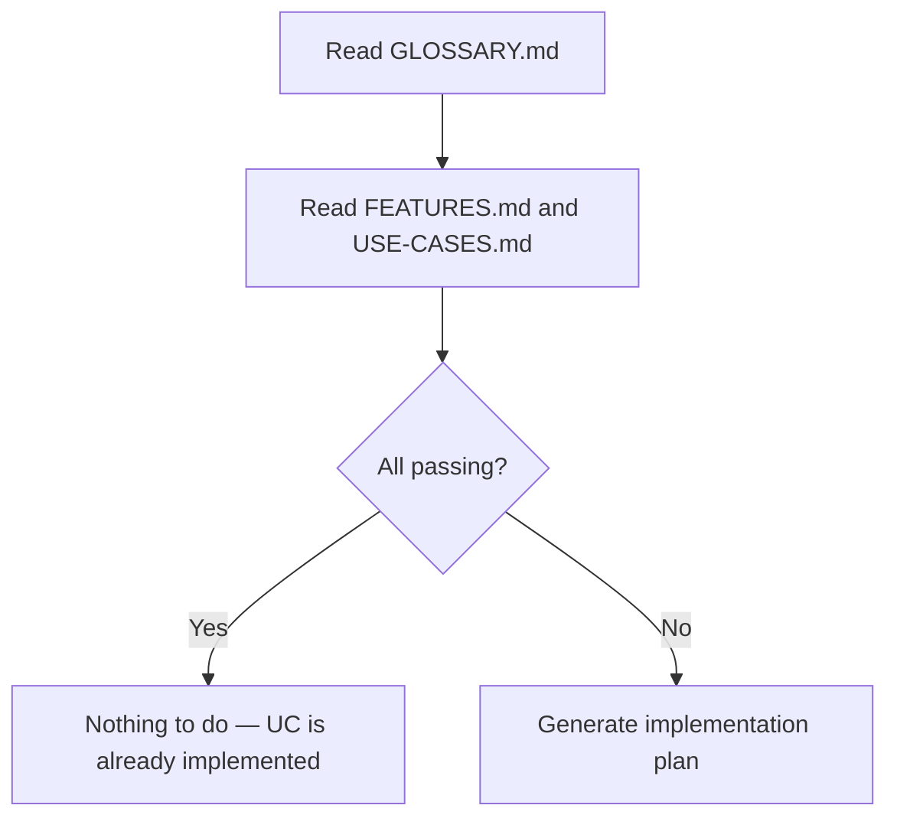

---
paths:
  - "**/*.md"
---

# Mermaid Diagram Node Labels

Always wrap Mermaid node labels in double quotes when they contain any character
beyond plain alphanumeric text and spaces. This includes em dashes, hyphens,
periods, slashes, `@` symbols, single quotes, question marks, parentheses,
and any other punctuation or Unicode character.

The safest default: **quote every node label** to avoid guessing which characters
will break the parser.

This applies to all node shapes: `[]`, `{}`, `()`, `(())`, `[[]]`, `[()]`, etc.

## Correct

## Incorrect

The unquoted em dash, periods, and special characters in `[]` and `{}`
cause Mermaid parser failures, resulting in diagrams that do not render.
