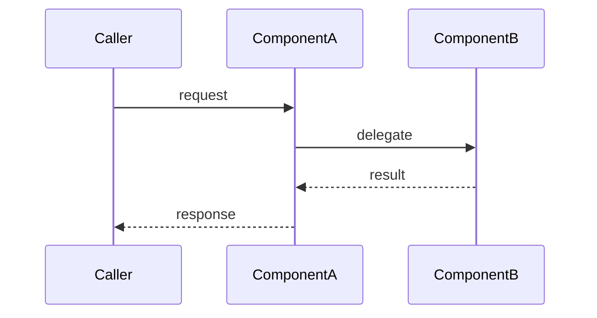
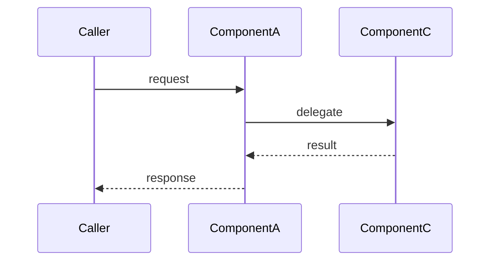
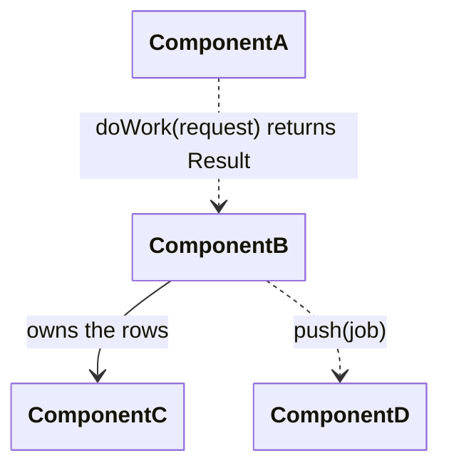
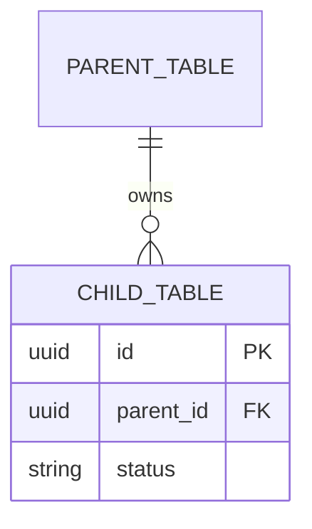

# Explore Command

`/m:explore` is the sizing step. It answers one question before anything is written: what does it take to build this change here? It reads the specs first, then the code, aligns with the user in an open interview, and writes an exploration document a person reads, corrects, and then hands to `/m:build`, `/m:spec`, `/m:change`, or `/m:fix` as the reference.

It is not `/m:research`. Research asks how others do it. This command asks what it costs us: which features and use cases exist, which change, what blocks the work, and what the change touches, counted in files, tests, specs, and tasks.

**Arguments:** $ARGUMENTS

The argument is the goal in the user's own words. No ID is required. It may name a research document or an earlier exploration.

**This command has no `AskUserQuestion`.** Every question is prose, per the `asking-questions` skill's **The Open Interview**. Read `${CLAUDE_PLUGIN_ROOT}/shared/skills/asking-questions/SKILL.md` before the first question.

**This command never generates an ID and never writes under `specs/`.** A new feature, use case, or scenario is named and marked `(new)`. The command that writes the spec generates its ID.

**Passing an existing exploration makes the run a follow-up.** When `$ARGUMENTS` is, or starts with, a path under `.molcajete/explorations/`, the command reads that document, checks each prerequisite against the code, asks what you decided, and rewrites the same file. There is no separate update command.

**Writing style:** every document you write and every message you print uses Simplified Technical English. Every one carries only what its reader needs. Read `${CLAUDE_PLUGIN_ROOT}/shared/skills/writing-style/SKILL.md` and `${CLAUDE_PLUGIN_ROOT}/shared/skills/output-economy/SKILL.md` before writing.

## Step 1: Load Skills

1. `${CLAUDE_PLUGIN_ROOT}/shared/skills/specs-first/SKILL.md` — the read order Step 4 runs, and its exit checklist.
2. `${CLAUDE_PLUGIN_ROOT}/shared/skills/resolution-gate/SKILL.md` — the analysis sweep (G1 to G3) that finds the open items, and the self-check (G5) over the written file.
3. `${CLAUDE_PLUGIN_ROOT}/build/skills/blocker-protocol/SKILL.md` — the size test that decides what is a prerequisite.
4. `${CLAUDE_PLUGIN_ROOT}/spec/skills/architecture/SKILL.md` — the vocabulary for components, events, entities, and settings.
5. `${CLAUDE_PLUGIN_ROOT}/plan/skills/plan-authoring/SKILL.md` — the Prerequisites wording, so this document and a later plan use the same words.
6. **Engineering principles.** Read `.claude/rules/principles.md` from the host project. If the host file is missing, read `${CLAUDE_PLUGIN_ROOT}/shared/skills/principles/SKILL.md` instead and emit a one-line warning: "No host principles file found at `.claude/rules/principles.md`. Using plugin defaults. Run `/m:setup` to generate the host file." Also read every other file under the host `.claude/rules/`.

## Step 2: Verify Prerequisites

`specs/PROJECT.md`, `specs/MODULES.md`, and `specs/TECH-STACK.md` must exist and be read in full now. If any is missing: "Project foundation not found. Run `/m:setup` first." Stop.

## Step 3: Read the Goal

`$ARGUMENTS` is the goal. When it carries `FEAT-XXXX` or `UC-XXXX` IDs, they seed the `specs-first` skill's by-ID mode. When it names a document — `research/*.md`, `.molcajete/research/*.md`, or any path — read that document in full now.

**Follow-up mode.** When `$ARGUMENTS` is, or starts with, a path under `.molcajete/explorations/`, this run is a follow-up. Read that document in full. The goal is its `goal` line plus any text after the path in the argument. Its `features` and `use_cases` frontmatter lists are the candidate IDs and seed by-ID mode. Every later step that names follow-up mode applies.

When `$ARGUMENTS` is empty, open the interview with one question: what do you want to explore? End the turn and wait for the answer.

## Step 4: Explore

Run the `specs-first` skill — by-description mode, or by-ID mode when Step 3 found IDs — through its exit checklist. Read the code the Code Map names and the code around it. Search the web at any point a library, protocol, or external API fact is uncertain. Dispatch an `Agent` only for a code read too large for one context. Read the spec index yourself.

**Follow-up mode.** Run by-ID mode over the frontmatter IDs. Then, for each prerequisite in the document, evaluate its `Done when` fact against the tree and record `done` or `not done`.

## Step 5: The Open Interview

The interview comes before the solution is drafted, because the answers shape it. Prepare three things first, in memory:

1. Sort every out-of-scope issue Step 4 found through the `blocker-protocol` skill's size test. A **significant** one is a prerequisite candidate of kind existing bug, surfaced bug, side effect, or technical limitation. A **small** one is part of the work and joins the change it serves. A prerequisite is a significant out-of-scope issue found before the work starts instead of during it. Step 7 adds the fifth kind, improvement.
2. Run the `resolution-gate` skill's G1 to G3 over the goal and the exit checklist to find the open items.
3. Rank every fork per this plugin's rule: what is right first, architecture second, effort last and counted. Never quote hours or days.

Round 1 opens with orientation, because the user has not seen the tree: what is built for this capability, how it works, what conflicts with the goal, and what else reads the code, from the exit checklist in product language, then the prerequisite candidates as a list. Then the questions: the open items, each fork with its options and its counted effort, each prerequisite candidate (agree it is a blocker, or fold it into the work), and each configuration choice from the `specs-first` S6 inventory. At most 5 questions per round.

**Follow-up mode.** Round 1 opens with the document's prerequisites, one line each: the name, `Required` or `Optional`, its recorded status, and what the `Done when` check found. Then the questions: for each optional prerequisite, done, will be done before the work, or not doing. Then any new goal text from the argument.

When the user asks a question back, answer it before you ask again. Run rounds until nothing is open. Close by restating the agreement as a short list. Then continue to Step 6 without waiting for a reply.

**Headless.** No user is present, so the interview cannot run. Decide every item from the codebase and record each as a decided default with the provenance "no user was present". List every question you would have asked in `.molcajete/escalations/resolution-explore-{timestamp}.md`, and name that file in the report.

## Step 6: Size the Change

Draft the solution from the agreement. Hold it in memory. Nothing is written yet.

1. Draft the change map and one numbered section per change, in the shape of the Step 8 template. Name each new feature, use case, or scenario and mark it `(new)`.
2. Write each agreed prerequisite candidate as a `### P{n}` of its kind, marked `Required`.
3. Draft the configuration changes from the `specs-first` S6 inventory and the agreed choices: the set each setting extends, its location, the value the change sets, the value recommended, and what an operator does to change it.

## Step 7: Review the Solution

Dispatch a **Design Reviewer sub-agent** via the `Agent` tool. It did not draft the solution, and it does not see the reasoning behind it. This is a maker-checker boundary, the same one `/m:execute` puts between its Implementer and its Reviewer.

**Receives:**

- the Step 6 draft — the change map and every numbered change section as drafted, with the components, files, interfaces, entities, events, and settings it names,
- the host principles file (`.claude/rules/principles.md`, or the plugin's `principles` skill when the host file is missing),
- the host `CLAUDE.md` and every other file under `.claude/rules/` — the project's local rules,
- `specs/MODULES.md`,
- each candidate feature's `ARCHITECTURE.md` in full,
- the current contents of every production file the draft touches.

It does **not** receive the interview notes, the `specs-first` checklist, or this command's reasoning.

**Verifies:**

1. **Placement.** Each new or changed component sits where the layering puts it: domain logic in the domain, a port at the boundary, an adapter behind a port. A component placed where it is easiest to write, not where it belongs, is a finding. Principle 2 and Principle 3 of the principles file are the test.
2. **Coupling and dependencies.** Every new dependency is justified, and no change adds a path around a port or a boundary.
3. **Reuse.** An existing module, adapter, or setting already serves the need, and the draft builds a second one. A near-duplicate is a finding.
4. **Quality of the touched code.** In the files the draft edits: a function that does more than one thing, a file that owns more than one concern, duplicated logic that a shared function would remove, a name that hides what the code does. Principle 5 is the test. Report only what the change would touch or sit beside. The reviewer is not auditing the codebase.
5. **Decisions.** No finding reverses an ADR in the architecture document. A draft that reverses one is a finding of kind placement, and the ADR is named.
6. **Local rules.** Nothing in the draft breaks a rule the host `CLAUDE.md` or a file under `.claude/rules/` states: a forbidden library, a required pattern, a naming rule, a file that must not be edited, a layout the project mandates. Each violation is a finding of kind rule, and the finding quotes the rule and names the file it comes from.

**Returns:** exactly one of `sound` or `findings{list}`. Each finding carries these fields:

| Field | Value |
|---|---|
| `kind` | rule, placement, coupling, reuse, quality, or infrastructure |
| `where` | a component name or a `file:line` |
| `what` | the problem in one sentence |
| `why` | the principle or the ADR it rests on |
| `change` | the recommended change in one or two sentences |
| `impact` | high, medium, or low, with the consequence of not doing it in one sentence |
| `effort` | counts of files, tests, and specs. Never hours or days |

**The improvement rule.** Assign each finding an effort band from its counts, then place it. Read the table top to bottom and take the first row that fits.

| Effort band | Counts |
|---|---|
| very small | 1 file, no test change |
| small | at most 2 files, no spec |
| medium | at most 5 files, or 1 spec |
| high | more than 5 files, or more than 1 spec |
| massive | a new module, or a cross-feature rewrite |

| Finding | Where it goes |
|---|---|
| Kind is rule | Inside the work, always. The draft is redrawn until the rule holds, whatever the effort |
| Impact high and effort very small | Inside the work, always |
| Effort small, whatever the impact | Inside the work: the change section it serves, or `## Cleanups` when it alters no behavior |
| It changes a file a change section already edits | Inside the work |
| Kind is infrastructure — a dependency, a migration, build or deploy tooling, a shared module | Required prerequisite |
| Effort medium | Required prerequisite, assumed done before the work starts |
| Effort high or massive | Optional prerequisite. Every change section is written as if it is not done |

**Every finding is applied, and every finding reaches the document.** Correct the draft now. A finding placed inside the work is written into the change section it serves. A placement, coupling, or reuse finding changes that section's design. A quality finding that alters no behavior goes under `## Cleanups` with its principle named. A finding placed as a prerequisite becomes a `### P{n}` of kind improvement, marked `Required` or `Optional`. No finding is left as a note, a remark, or an item for later. The rule places each finding without a question. The Step 9 report names every finding and its place, and the user moves one with a follow-up run.

A finding that contradicts an answer from Step 5 does not reopen the interview. Apply the rule, and name the contradiction in the report.

## Step 8: Write the Exploration Document

Run `mkdir -p .molcajete/explorations`. Run `date -u +%Y%m%dT%H%M%S` and copy the output — never compose a timestamp. The slug is kebab-case, at most 40 characters. Write the file without asking:

`.molcajete/explorations/<timestamp>-<slug>.md`

**Follow-up mode.** The path is the one the argument named. Never write a second file for the same exploration. Increment `revision`, set `updated` from the clock, and write a `Status` line on every prerequisite: `done`, `not done`, or `declined`. Then rewrite the change sections under the decided assumptions. A prerequisite marked `done`, or one the user will do before the work, is assumed present. One marked `declined` or `not done` is assumed absent.

The document is a walkthrough for a human: one numbered section per change, and inside it everything the reader needs — the behavior, the screen, the flow, the interfaces, the data, the configuration. Context travels with the change, so the reader never jumps between global sections to assemble one change. A reader who stops after the Summary and the Change map still holds the big picture.

Every diagram below is a skeleton that renders as it stands. Replace the skeleton names with real ones, and delete the `%%` comment lines. Never ship a diagram that still says `ComponentA`. Diagrams use Mermaid only: `sequenceDiagram`, `classDiagram`, and `erDiagram`. The UI sketch is the one non-Mermaid drawing.

Every block opens with one short sentence, and its facts live in item tables. A table never exceeds three columns, and a before state stacks above an after state, never beside it.

````markdown
---
goal: <the goal in one line, in the user's words>
created: <timestamp>
updated: <timestamp of the last follow-up. Omit the key on the first run.>
revision: 1
references: [research/x.md]    # documents the user named. Omit the key when none.
---

# Exploration: <Title>

## Prerequisites

<One paragraph: how many prerequisites there are, how many are required and how many optional, and that each one lands on its own branch off `master` before the main work starts. Work that belongs to the change is not a prerequisite. When there are none, write: "None. The main work starts from `master`.">

### P1 — <name>

**Required** — or — **Optional**. The change sections below assume this is not done.

<What it is and where it lives, with `file:line`. Its kind: an existing bug, a bug the feature will surface, a side effect, a technical limitation, or an improvement the design review found.>

<Why it blocks the main work — or, for an improvement, what it makes better and which principle it rests on. What happens if it is not fixed first.>

<Effort as counts: N files, N tests, N specs. Branch: `fix/<slug>` off `master`.>

Done when: <a fact in the tree — a file, a symbol, a test, or a spec element that exists once this landed>.

Status: <done | not done | declined — present only after a follow-up>.

(Alternative command: /m:fix UC-XXXX "...")

```
/m:build "..."
```

### P2 — <next prerequisite>

<Repeat the shape.>

## Summary

<Two to four sentences. Say what problem exists and what the change does about it. Do not list files.>

## Change map

<One row per change. A change is a behavior the system will perform differently, plus everything that serves it.>

| Change | Kind | Touches |
|---|---|---|
| <name the change> | added / changed / fixed / removed | <the touched surfaces: flow, interface, data, config> |

<Under the map, one line names the surfaces the whole change never touches: "No data layer or configuration changes." When nothing a caller can observe changes, say so here: "No behavior changes. This change is internal." — and walk the internal changes the same way.>

## 1. <Change title, from the caller's point of view>

<One or two sentences: why this change exists.>

**Behavior**

<One table per spec element this change touches — a scenario, a requirement, a use case. Never one table for the whole section. The Before row quotes the element's current text in full from the spec file. The After row carries the proposed text in full. Omit Before for a new element. Omit After for a retired element, and say in Why what replaces it.>

|  |  |
|---|---|
| Spec | <name> (SC-XXXX) — or <name> (new) |
| Before | <the element's current text, in full> |
| After | <the proposed text, in full> |
| Why | <why the change is made> |

**UI**

<One sentence, then the screens the change moves, drawn as ASCII art in a plain fenced block — the Before layout above the After layout, at each width where the change is visible, plus the empty state and the refusal when the change creates one. Only a change a person sees on a screen gets this block. The UI sketch is the one non-Mermaid drawing, because Mermaid cannot draw a screen layout.>

```
Before
+----------------------+
| Screen               |
+----------------------+

After
+----------------------+
| Screen     [Button]  |
+----------------------+
```

**Flow**

<One sentence — what the flow will do differently. Then a Mermaid `sequenceDiagram` pair headed Before and After; show only the After diagram when the flow is new. Label participants with component names, never file names. Only a changed flow gets diagrams — omit this block otherwise.>

**<name the flow> — Before**



**<name the flow> — After**



**Interface changes**

<One sentence — what callers will get. Then one item table per changed interface. An interface is anything another component depends on: an API endpoint, an exported function or class, a service contract, an event, a message shape, or a configuration key.>

|  |  |
|---|---|
| Item | <name and signature> |
| Before | <what it does today — omit the row for a new item> |
| After | <what it will do — omit the row for a removed item> |
| Why | <why it is added, changed, or removed> |
| Depends on it | <the callers that must change> |

<When a connection between components changes, close the block with the relationship diagram — every arrow labeled with its mechanism — and one table per changed arrow. Keep the config line, or every box shows two empty stripes. Never put a colon inside a relation label, because the parse ends there.>



|  |  |
|---|---|
| Connection | <from> → <to> |
| Mechanism | <the method, message, property, or protocol on the arrow> |
| Kind | direct call / cross-process call / asynchronous message / database read / database write / HTTP request / event / file |
| Change | new / changed / removed |
| Why | <why this connection exists> |

**Data layer changes**

<One sentence — what the data will hold. Then a Mermaid `erDiagram` when a table or a relation changes shape, and one item table per column the diagram cannot explain: Table / Column / Before / After / Why rows.>



|  |  |
|---|---|
| Table | <table> |
| Column | <column> |
| Before | <type and meaning today — omit the row for a new column> |
| After | <type and meaning after the change> |
| Why | <why> |

**Configuration**

<One sentence naming the existing configuration set this change extends, then one item table per changed setting. The Recommended row carries the value to run with and the reason. The To change it row carries the steps an operator takes: the file or store to edit, the variable to set, the service to restart or redeploy, the migration to run.>

|  |  |
|---|---|
| Setting | <key> |
| Location | <file, store, or environment> |
| Before | <current value — omit the row for a new setting> |
| After | <the value this change sets> |
| Recommended | <the value to run with, and why> |
| To change it | <the steps an operator takes to change the value> |
| Why | <why the setting is added, changed, or removed> |

## 2. <Next change title>

<Repeat the section shape. Omit any block with nothing to show, label included.>

## Cross-cutting

<Only when one surface change serves several sections — a shared table, a shared setting. Its diagram and tables live here once, and each section that needs it says so in one clause: "uses the new `export_job` table (see Cross-cutting)." Omit the section otherwise.>

## Cleanups

<Changes that alter no behavior — one line each: the file, the edit, the reason, and for a design review finding the principle it rests on. Omit the section when there are none.>

## Architecture

<State whether the design is sound. Cover: does it fit the existing layering, does it add coupling, are the new dependencies justified, is anything replaced but left half-wired. If the design is questionable, name the simpler or cleaner alternative in one or two sentences.>

<Close with one of these three words in bold, and one sentence of justification:>

**Sound** | **Sound with concerns** | **Questionable**
````

Six rules bind the document:

1. **Nothing is abbreviated.** The reader must see the before and after of every spec element, every interface, every table, and every setting without opening another file. The Behavior tables, the diagrams, and the prerequisite prose are exempt from the output budget, because completeness is the document's purpose.
2. **Every `Why` states the reason.** The interview settled every reason. Never write "reason not stated".
3. **`## Prerequisites` is always present.** Its negative is the fact sentence above, never the word "none" alone.
4. **A prerequisite here never becomes a plan's `**Prerequisites:**` line.** It lands on its own branch before the plan is written.
5. **Run the `resolution-gate` skill's G5 over the file before it is final.** A banned marker or a sentence that hands a choice to the reader means the interview left an item open. Reopen it.
6. **A follow-up rewrites the change sections under the decided assumptions.** A section that assumed an optional prerequisite absent, when the user marks it done, is redrawn with it present, and the reverse. Every diagram and every Before/After row is re-checked, not patched.

## Step 9: Report

Print:

```markdown
## Exploration written — `.molcajete/explorations/<timestamp>-<slug>.md`

<N> prerequisites (<N> required, <N> optional) · <N> changes · <N> settings

<The prerequisite names, one per line, when there are any.>

**Design review**

<One line per finding: its kind, where, what, and where it landed — the change section, Cleanups, or the prerequisite tag. When the reviewer returned `sound`, one line says so. A finding that contradicts an interview answer says so in the same line.>
```

**Follow-up mode.** The metadata line opens with `revision <n>`, and one line per prerequisite whose status changed follows the names.

Then the hand-off, as a ready prompt. Land each prerequisite first with the prompt in the document. Then:

````markdown
(Alternative commands: /m:spec, /m:change, or /m:fix with the same reference, for a larger plan executed with /m:execute)

```
/m:build "<goal> — see .molcajete/explorations/<timestamp>-<slug>.md"
```
````

Each of those commands reads the exploration first.
