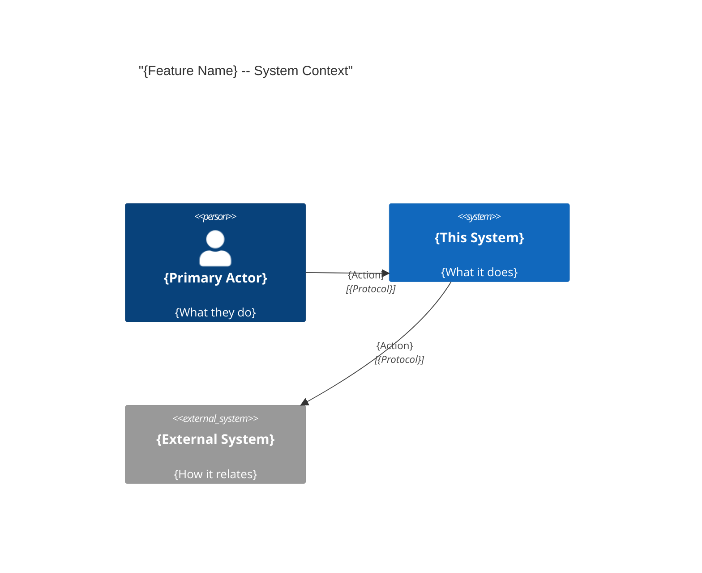
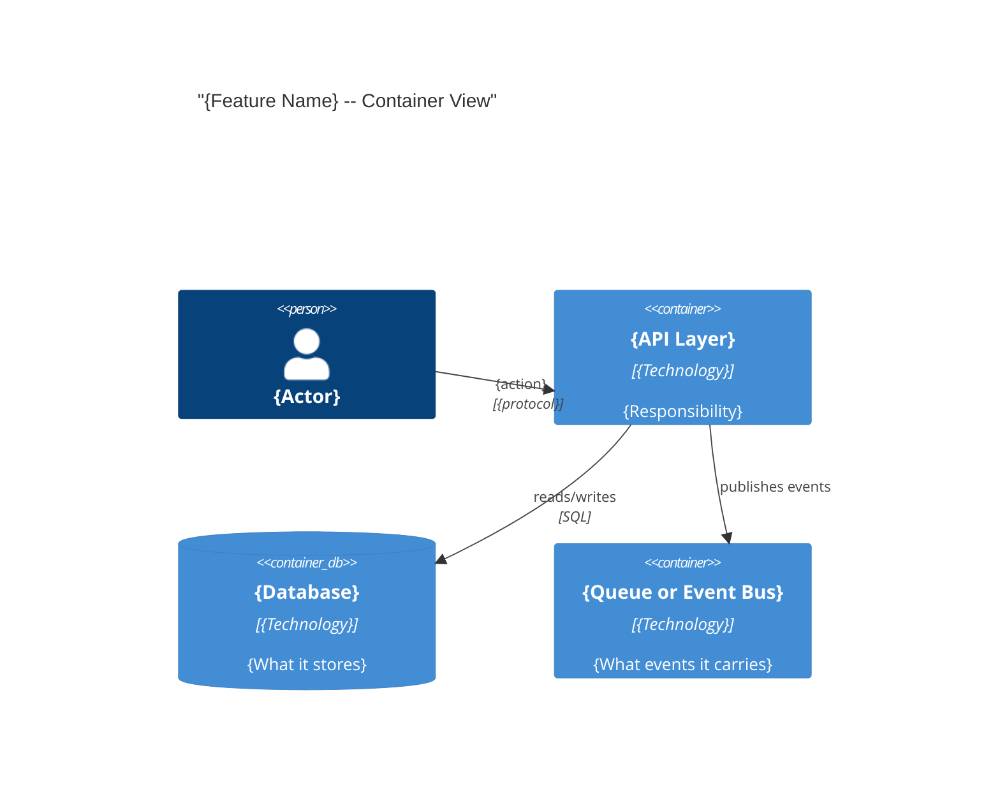
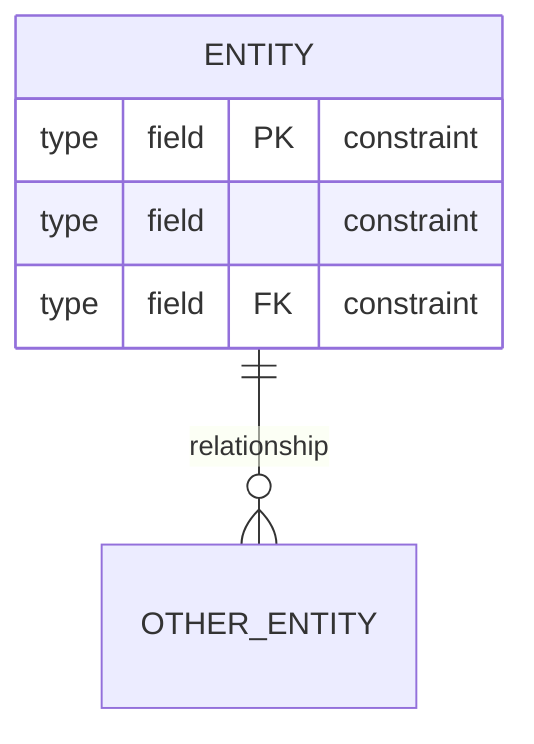

# Architecture: {Feature Name}

## System Context (C4 L1)

> Who uses this feature and what external systems does it touch?



## Container View (C4 L2)

> Which major components are involved and how do they communicate?



## Data Model

> Entity schemas with field constraints and invariants.



**Invariants:**
- {Entity}.{field} must always {rule}
- {Entity}.{status} transitions: {state} to {state} (no skipping)
- A {entity} with status = {status} must have no {related entity}

## Event Topology

> All events this feature emits or consumes.
> Agents implementing a publisher use this table to know what to emit and when.

| Event | Publisher | Payload | Condition | Consumers |
|-------|-----------|---------|-----------|-----------|
| `{domain}.{entity}.{verb}` | {Component} | `{field, field}` | {When it fires} | {Component} |

**Non-events (explicit):**
- {Scenario}: no event is published

## State Transitions

> For features where entities have a lifecycle.

```mermaid
stateDiagram-v2
    [*] --> "{state}" : "{trigger}"
    "{state}" --> "{state}" : "{trigger}"
    "{state}" --> [*] : "{terminal condition}"
```

## Architecture Decisions

> Non-obvious choices that future agents should not reverse.

**ADR-001:** {Decision title}
In the context of {situation}, facing {concern}, we decided {choice} to achieve {quality}, accepting {tradeoff}.
