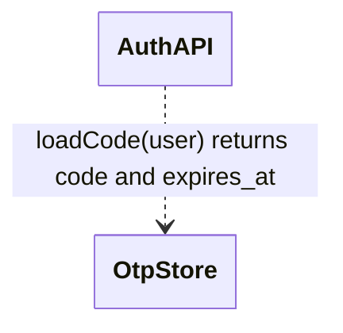

# Change Description

Every surface that describes a change set to a human renders this template. The goal is fixed: **the reader understands the big picture almost by scanning** — a little prose for the reason, then the spec changes, then the surface changes each spec change caused, then the flows. Reader attention decays fast on generated reports, so every line must earn its place, and everything else is omitted, not summarized.

The shape is **the walk**: one section per change, and inside it everything the reader needs — reason, spec, surface, flow — so context travels with the change and nothing forces a jump to another section.

## Layout rules

The output renders in two places — a Markdown reader and the TUI — and both must stay readable.

1. **A table never exceeds 3 columns.** A wide fact-set does not become a wide row. It rotates 90 degrees: one variable per row, its value beside it.
2. **Before and after stack vertically.** A `Before` row above an `After` row, never side-by-side columns. Stacked cells give each state the full line width.
3. **A list of variables and values is a table**, not labeled prose lines.
4. **A bold label stands alone on its line** and introduces the block below it. Never `**Label** — long description` on one line.
5. **An empty block is omitted entirely**, label included. Never write "none".
6. **Name before ID.** Write "the calibration scenario (SC-3Z2P)", never a bare `SC-3Z2P` on first use.

**Every bold-label block opens with one short sentence** that says the most relevant thing about the change in that block's context — what changed here, and what it means for this surface. The tables carry the facts; this sentence carries the point.

## Diagram rules

1. **Mermaid only.** The ASCII UI sketch is the single carve-out, because Mermaid cannot draw a screen layout.
2. **Two diagram types carry a change description: `sequenceDiagram` and `erDiagram`** (plus `classDiagram` when object relationships changed). A flowchart is banned here: it restates the code path and clarifies nothing.
3. **A flow is a Before/After pair of sequence diagrams**, headed `— Before` and `— After`, drawn only when the change altered the flow, each kept to roughly 10 messages. A new flow gets only the After diagram.
4. **A data change gets an `erDiagram` only when an entity or a relationship changed shape.** Draw the after-state and mark the new element. A `classDiagram` follows the same restraint: only when the relationships between objects changed, never for a signature tweak.
5. **A changed connection between components gets a labeled-arrow `classDiagram`.** Every arrow carries its mechanism — the method, the message, the property, or the protocol — because an unlabeled arrow says two components touch, which teaches nothing. Never put a colon inside a relation label; the parse ends there. A dashed `..>` means calls or sends to; a solid `-->` means owns or holds.
6. Hygiene: quote a label that carries spaces where the diagram type allows it, no `style`/`classDef` directives, participants named as `ARCHITECTURE.md` names them. The single permitted config line is the `hideEmptyMembersBox` init directive on a relationship `classDiagram`.

## The atoms

### Atom 1 — Lead

One to three sentences in product language: the reason and the outcome. No file paths, no class names.

### Atom 2 — Change map

The scan surface. One table, one row per change unit:

```markdown
| Change | Kind | Touches |
|---|---|---|
| Calibrated scores keep their value above 100 (UC-3Z2L) | changed | spec, interface |
| One-time codes expire after 10 minutes (UC-2Kp4) | added | spec, data, config, flow |
```

`Kind` takes one of `added`, `changed`, `fixed`, `retired`. `Touches` names the moved surfaces in a few words. The map is the table of contents: a reader who stops after the Lead and the map still holds the big picture.

### Atom 3 — Spec delta

Under a bare `**Specs**` label: the block's one-sentence lead, the element name and ID on its own line, then a stacked 2-column table.

```markdown
**Specs**

The calibration scenario now asserts the true calibrated value instead of the old cap.

Calibrate a raw score (SC-3Z2P) — changed

|  |  |
|---|---|
| Before | "a raw score of 140 calibrates to 100" |
| After | "a raw score of 140 calibrates to 128" |
| Why | the old ceiling misread the calibration requirement (FR-3Z2Z); order must survive above 100 |
```

An added element omits the `Before` row. A retired element omits the `After` row, and its `Why` row says what replaced it. One table per changed element; a unit that changes three scenarios carries three small tables.

### Atom 4 — Surface item

Under one of four bare labels — `**Interface changes**`, `**Data layer changes**`, `**Events**`, `**Configuration**` — the block's one-sentence lead, then one small key-value table per changed item. The first rows name the item with the `architecture` skill's vocabulary; then `Before`, `After`, `Why`:

```markdown
**Interface changes**

The clamp is gone from calibration; every reader of the score now receives values above 100.

|  |  |
|---|---|
| Method | `ScoreService.calibrate(raw)` |
| Before | returns at most 100 |
| After | returns up to the calibrated ceiling of 128 |
| Why | the calibration scenario (SC-3Z2P) asserts 128 |
| Depends on it | the leaderboard page and the season report |
```

The rotation is the same for every surface. A data item's first rows are `Entity` and `Element`; an event item's are `Event`, `Publisher`, `Payload`, `Condition`, `Consumers`; a configuration item's are `Setting` and `Location`. Several changed items are several small tables, never one wide one. A data item adds an `erDiagram` under its tables when diagram rule 4 fires.

**An interface item names its dependents.** The `Depends on it` row lists who reads the changed member — a caller that must change is the most useful fact an interface item can carry. Omit the row only when nothing outside the change depends on the member.

**Connections.** When the change adds, removes, or redirects a connection between components, the interface block closes with one labeled-arrow `classDiagram` per diagram rule 5, followed by one key-value table per changed arrow. An unchanged arrow may appear in the diagram for context, but only a changed arrow gets a table.

````markdown


|  |  |
|---|---|
| Connection | `AuthAPI` → `OtpStore` |
| Mechanism | `loadCode(user)` |
| Kind | direct call |
| Change | changed |
| Why | the verify step now needs the stored deadline |
````

`Kind` takes one of: direct call, cross-process call, asynchronous message, database read, database write, HTTP request, event, file. `Change` takes `new`, `changed`, or `removed`.

### Atom 5 — Flow pair

Under a bare `**Flow**` label: the block's one-sentence lead, then the Before/After `sequenceDiagram` pair per diagram rule 3. Present only when the change altered a flow.

### Atom 6 — Unmapped tail

Under the heading `## Not in the spec`: the cleanups and refactors that serve no spec change, one line each — the file, the edit, the reason.

### Atom 7 — Architecture verdict

The closing judgment on the design, under the heading `## Architecture`. One or two sentences that answer: does the change fit the existing layering, does it add coupling, are the new dependencies justified, is anything replaced but left half-wired. When the design is questionable, name the simpler or cleaner alternative in one sentence. Close with one of three bold words and one sentence of justification: **Sound**, **Sound with concerns**, or **Questionable**. On a review surface (`/m:review`, `/m:preflight`) the command's own severity-based verdict replaces this atom — one document never carries two verdicts.

## The walk assembly

One `##` section per change unit, in user-visible-impact order, biggest first. A unit is normally a use case; scenario deltas nest inside their use case's unit, and a feature-level requirement change is its own unit.

```markdown
# {Title}

{Lead}

## Change map

{the map table}

## 1. {Change title, in product language}

{One or two sentences: why this change exists.}

**Specs**

{lead sentence, then spec-delta table(s)}

**Flow**

{lead sentence, then the Before/After pair — only when this unit changed a flow}

**Interface changes**

{lead sentence, then item table(s) with their Depends on it rows, then the
connection diagram and per-arrow tables when a connection changed}

**Data layer changes**

{lead sentence, then item table(s), plus an erDiagram when an entity changed shape}

## 2. {Next change title}

...

## Cross-cutting

{Only when one surface change serves several units — a shared migration, a shared
interface. Its item table lives here once, and each unit that needs it says so in
one clause: "uses the shared retry setting (see Cross-cutting)."}

## Not in the spec

{the unmapped tail}

## Architecture

{one or two sentences on the design, then **Sound** / **Sound with concerns** / **Questionable**}
```

Two rules keep the walk honest. A label appears only when its block has content — a unit that moved no data has no `**Data layer changes**` label. And a flow shared by two units is drawn under the first and referenced by the second in one clause.

## The three depths

A consumer renders one of three depths. Each depth is a strict prefix plus a selection — the atoms never change shape between depths.

| Depth | Carries | Rendered by |
|---|---|---|
| `full` | Every atom: lead, map, all units, cross-cutting, tail, verdict | the `/m:build` change report, via the `change-report` skill |
| `orientation` | Lead, map, and the flow pairs of every unit that changed a flow | `/m:review`, as the document's opening |
| `glance` | Lead and map only | `/m:preflight`, as the familiarize walk |

A worked rendering of the full depth — two units, every atom exercised once — lives in `research/universal-change-template.md`, section 5.1. Read it when the shape of a filled section is unclear.
