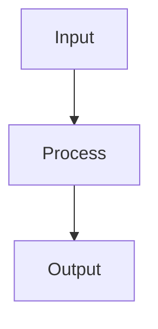
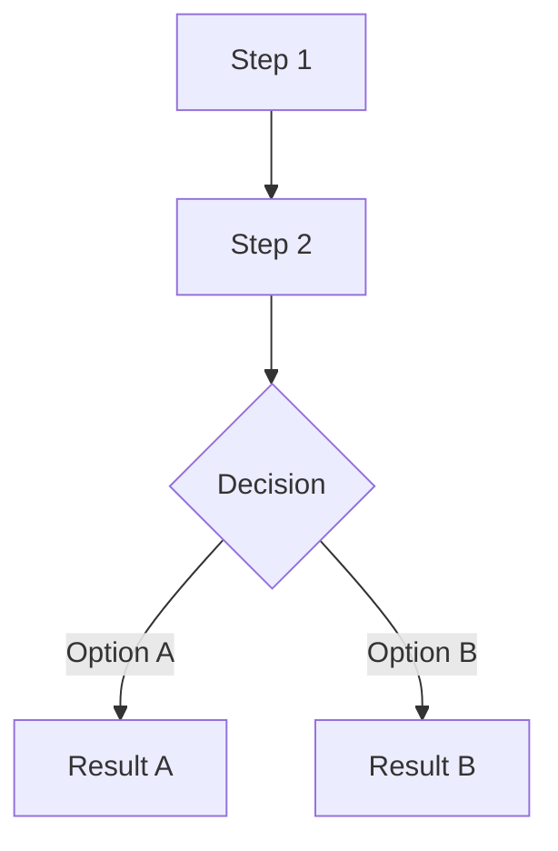
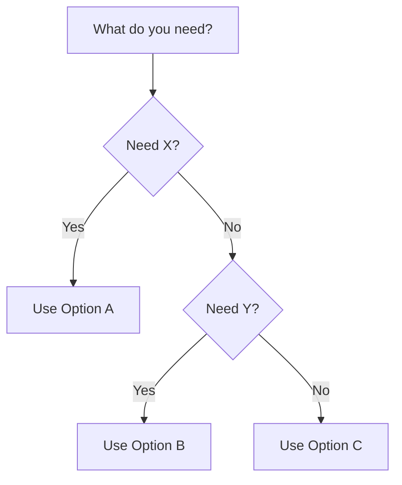

# Research Methods

Standards for conducting research and presenting findings in clear, friendly, easy-to-digest documents that take someone from zero knowledge to solid understanding.

## Step 1: Classify the Request

Before doing anything, determine the depth of research needed. This is the router — get this right and everything else follows.

### Quick Question

**Signals:** Single concept, definition, syntax lookup, "what is X", "how do I do Y" (narrow scope)

**Examples:**
- "What is a CLOB?"
- "How do I amend a git commit?"
- "What's the difference between PUT and PATCH?"

**Action:** Answer inline using the appropriate template (How-To or Reference). Do your own web searches if needed. No agents. No save prompt. Just answer well.

### Explain

**Signals:** Broader topic but focused, "explain X to me", "how does X work", "help me understand X", "give me an intro to X", "I need to get up to speed on X", explicit `/m:explain` command

**Examples:**
- "Explain how OAuth works"
- "How does database indexing work?"
- "Help me understand WebSockets"
- Any `/m:explain` invocation

**Action:** Run the Explain flow (Steps 2e-4e below). Launch 2 parallel agents (web + local), synthesize into a 3-5 minute read using the Introduction template, then offer to save.

### Deep Research

**Signals:** Broad topic, multiple angles, implementation guidance needed, "research X for our project", "deep dive into X", explicit `/m:research` command, or any request that clearly needs thorough investigation across docs, community, libraries, and local codebase.

**Examples:**
- "Research sharding strategies for our Postgres setup"
- "I need to understand on-chain settlement end to end"
- "Deep dive into event sourcing with our stack"
- Any `/m:research` invocation

**Action:** Run the full orchestration flow (Steps 2-6 below). Parallel agents, tech stack detection, synthesis, save prompt.

### When in Doubt

If the request is ambiguous, use AskUserQuestion:
- **Question:** "How deep should I go on this?"
- **Header:** "Research Depth"
- **Options:**
  1. "Quick answer — just explain it briefly"
  2. "Explain it — a solid 3-5 minute introduction"
  3. "Deep research — full investigation with multiple sources"
- **multiSelect:** false

---

## Core Philosophy

The goal of every research output — regardless of depth — is **learning**. The reader should finish understanding the topic well enough to make decisions, have conversations about it, or start implementing. Write as if explaining to a smart colleague who happens to know nothing about this specific topic.

### Writing Principles

1. **Plain language first** — Use everyday words. When a technical term is unavoidable, define it immediately in simple language.
2. **Build from the ground up** — Start with what the reader already knows. Introduce one concept at a time. Each section should build on the previous one.
3. **Show, don't just tell** — Use examples, analogies, and diagrams. A concrete example is worth a paragraph of abstraction.
4. **Friendly tone** — Write like you're explaining over coffee, not writing a textbook. Be direct but warm.
5. **Scannable structure** — Use headers, bullets, tables, and bold text so readers can jump to what they need.
6. **Mermaid for all diagrams** — Every visual (architecture, flow, sequence, relationships) uses Mermaid syntax.
7. **Always cite sources** — Every claim should be traceable. Sources are not optional.

---

## Templates

Choose the template based on what the user needs:

| Template | When to Use | Read Time | Example Requests |
|----------|------------|-----------|------------------|
| **Introduction** | Get oriented on a topic quickly | 3-5 min | "Explain OAuth", "Help me understand WebSockets" |
| **Learning Guide** | Understand a topic deeply from scratch | 10-20 min | "Research sharding in Postgres", "Deep dive into event sourcing" |
| **How-To** | Practical steps to accomplish something | 5-10 min | "How do I set up Redis caching?", "How to deploy with Docker Compose" |
| **Reference** | Quick lookup, comparison, or cheat sheet | 2-3 min | "Compare ORMs for Node", "What are the options for state management?" |

If unclear, default to **Introduction** for explain requests, **Learning Guide** for deep research.

### Template 1: Introduction

A 3-5 minute read that gets someone oriented on a topic. Same friendly tone as the Learning Guide but shorter and tighter — the essentials only. Think of it as the article you'd want to read before deciding whether to go deeper.

**Target length:** 600-1200 words.

```markdown
# [Topic]: What It Is and Why It Matters

_[2-3 sentence summary: what this is, why you should care, and what you'll understand by the end]_

---

## What Is [Topic]?

[Explain the core concept in plain language. Use an everyday analogy. 2-3 paragraphs max.]

### Key Terms

| Term | What it means |
|------|--------------|
| **[Term 1]** | [Plain-language definition, 1-2 sentences] |
| **[Term 2]** | [Plain-language definition] |
| **[Term 3]** | [Plain-language definition] |

## How It Works

[The mechanism in a nutshell. One Mermaid diagram + 2-3 paragraphs explaining the flow.]



## When to Use It

[Practical guidance: when this is the right choice, when it's not, and what the alternatives are. Keep it honest — "you probably don't need this if..."]

## Quick Example

```[language]
// A minimal, working example that shows the concept in action
// Comments on every non-obvious line
```

## Key Takeaways

1. [Most important thing]
2. [Second most important]
3. [Third]

## Go Deeper

- [URL] — [Best resource to continue learning]
- [URL] — [Second resource]
- [URL] — [Third resource]
```

#### Introduction Rules

- **600-1200 words** — respect the reader's time. If it takes more than 5 minutes to read, cut.
- One analogy to ground the concept
- One Mermaid diagram max
- One code example max
- Key Terms table for any jargon
- "Go Deeper" section replaces Sources — these are curated next-step links, not just citations
- Skip the Parts/numbered structure — this is short enough to be flat
- Be opinionated in "When to Use It" — don't just list pros/cons, give a recommendation

### Template 2: Learning Guide

The flagship template. Takes the reader from zero knowledge to solid understanding. Friendly, progressive, example-rich.

```markdown
# [Topic Title]

**[One sentence describing what this document covers and who it's for]**

_[2-3 sentence summary: what this is, why it matters, and what you'll know by the end]_

---

**What you'll learn:**
- [Concept 1 — the basics]
- [Concept 2 — how it works]
- [Concept 3 — how to use it]
- [Concept 4 — trade-offs and decisions]

---

## Part 1: The Basics

### 1.1 [Core concept in plain language]

[Explain the fundamental idea as if the reader has never heard of it. Use an analogy from everyday life if possible.]

#### A Simple Example

[Walk through a concrete, relatable example. Make it specific — names, numbers, scenarios the reader can picture.]

#### Key Terms

| Term | What it means |
|------|--------------|
| **[Term 1]** | [Plain-language definition, 1-2 sentences] |
| **[Term 2]** | [Plain-language definition] |
| **[Term 3]** | [Plain-language definition] |

### 1.2 [Why this matters / the problem it solves]

[Explain the motivation. What pain does this address? What was life like before?]

## Part 2: How It Works

### 2.1 [The mechanism / architecture / process]

[Explain how the thing actually works under the hood. Use a diagram:]



### 2.2 [Component by component]

[Break down each piece. For each component:]

**[Component Name]** — [one-line description].

[2-3 sentences explaining what it does and why it exists. Include a code snippet or example if it helps.]

## Part 3: Approaches and Options

### 3.1 [Option/Approach A]

[What it is, when to use it, pros and cons]

### 3.2 [Option/Approach B]

[What it is, when to use it, pros and cons]

### Comparison

| | Approach A | Approach B | Approach C |
|---|---|---|---|
| **Best for** | ... | ... | ... |
| **Trade-off** | ... | ... | ... |
| **Complexity** | ... | ... | ... |

## Part 4: How To Do It

### Step 1: [First action]

[Clear instruction with code example]

```[language]
// code example with comments explaining each line
```

### Step 2: [Next action]

[Continue step by step]

## Part 5: Things to Watch Out For

- **[Gotcha 1]** — [What happens and how to avoid it]
- **[Gotcha 2]** — [What happens and how to avoid it]
- **[Edge case]** — [When this breaks and what to do]

## Part 6: Key Takeaways

1. [Most important thing to remember]
2. [Second most important]
3. [Third]

## Sources

- [URL] — [What information came from this source]
- [URL] — [Description]
```

#### Learning Guide Rules

- Start every topic with what the reader already knows, then bridge to the new concept
- Define every technical term the first time it appears — inline or in a terms table
- Use at least one Mermaid diagram for any topic involving architecture, flow, or relationships
- Use comparison tables when presenting multiple options
- Keep paragraphs short (3-5 sentences max)
- Use bold for key terms and emphasis
- Number parts sequentially so readers can reference them ("as Part 1 explained...")
- End each part with a bridge sentence to the next

### Template 2: How-To

Practical, step-by-step guide for accomplishing a specific task.

```markdown
# How To: [Task]

**[What you'll accomplish by the end of this guide]**

## Prerequisites

- [What you need before starting]
- [Required tools/knowledge]

## Key Terms

| Term | What it means |
|------|--------------|
| **[Term]** | [Definition] |

## Steps

### Step 1: [Action]

[Why this step matters]

```[language]
// what to do
```

[What to expect after this step]

### Step 2: [Action]

[Continue...]

## Verify It Works

[How to confirm everything is set up correctly]

```[language]
// verification command or test
```

## Common Issues

| Problem | Cause | Fix |
|---------|-------|-----|
| [Error/symptom] | [Why it happens] | [What to do] |

## Sources

- [URL] — [Description]
```

#### How-To Rules

- Lead with what the reader will accomplish
- List prerequisites upfront — don't let them get stuck mid-guide
- One action per step
- Show expected output after each step when possible
- Include a "Verify It Works" section
- Add a troubleshooting table for common issues

### Template 3: Reference

Quick-lookup format for comparisons, options, or specifications.

```markdown
# [Topic] Reference

**[One sentence: what this reference covers]**

## Overview

[2-3 sentences of context — just enough to orient the reader]

## Options at a Glance

| Name | What it does | Best for | License | Popularity |
|------|-------------|----------|---------|------------|
| [A] | [Description] | [Use case] | [License] | [Stars/downloads] |
| [B] | [Description] | [Use case] | [License] | [Stars/downloads] |

## [Option A]: Details

[2-3 paragraphs covering: what it is, strengths, weaknesses, when to pick it]

```[language]
// minimal example
```

## [Option B]: Details

[Same structure]

## Decision Guide



## Sources

- [URL] — [Description]
```

#### Reference Rules

- Lead with the comparison table — let readers scan first
- Keep descriptions short and factual
- Include a decision flowchart (Mermaid) when there are 3+ options
- Minimal code examples — just enough to show the API/syntax

---

## Explain Orchestration (Steps 2e-4e)

These steps run for **Explain** requests (classified in Step 1) or when invoked via `/m:explain`.

### Step 2e: Parse Input

Analyze the request to classify the input type:

- **URL** — starts with `http://` or `https://` — explain the content at this URL
- **Local path** — starts with `/`, `./`, or matches a file/directory pattern — explain patterns in these files
- **General query** — everything else

If the input is empty or ambiguous, use AskUserQuestion to ask what topic to explain.

### Step 3e: Execute Research

Launch **2 agents in a single message** using the Task tool with `subagent_type: general-purpose`.

#### Agent 1: Web Research Agent

**Prompt template:**
```
Research query: {query}

You are a web research agent. Find the best explanations and official documentation for this topic. Focus on:
- Official docs that explain the concept clearly
- Well-written introductory articles or guides
- Key diagrams or visual explanations

Use WebSearch to discover sources, then WebFetch to read the 2-3 most relevant pages.

Return:
- A clear explanation of what this is and how it works
- Key terminology with plain-language definitions
- The best analogies or examples you found
- 3-5 source URLs ranked by quality (best first)
```

#### Agent 2: Local Context Agent

**Prompt template:**
```
Research query: {query}

You are a local codebase research agent. Search the current project to see if this topic is already in use or relevant. Use Glob, Grep, and Read.

Focus on:
- Is this technology/pattern already used in the project?
- Any existing configuration, dependencies, or code related to this topic
- Project conventions that would affect how this topic applies here

Return:
- Whether and how this topic relates to the current project
- Any relevant files or dependencies found
- Brief context only — keep it short
```

### Step 4e: Synthesize and Save

After both agents return, assemble the findings into a document using the **Introduction** template.

- Apply the same Writing Principles (plain language, friendly tone, analogies, Mermaid diagrams)
- If the local agent found relevant project context, weave it in naturally (e.g., "In your project, you're already using X, which relates to this because...")
- Stay within 600-1200 words

After presenting the document, use AskUserQuestion to offer saving:

- **Question:** "Save this as `research/{suggested-slug}.md`?"
- **Header:** "Save"
- **Options:**
  1. "Save to research/{suggested-slug}.md"
  2. "Copy to clipboard"
- **multiSelect:** false

Follow the same save flow as deep research (Step 6).

---

## Deep Research Orchestration (Steps 2-6)

These steps run only for **Deep Research** requests (classified in Step 1) or when invoked via `/m:research`.

### Step 2: Detect Tech Stack

Scan the project root for these files to determine `DETECTED_STACK`. Multiple matches are additive (e.g., `package.json` + `tsconfig.json` + `next.config.js` = "TypeScript + Next.js").

| File | Stack |
|------|-------|
| `go.mod` | Go |
| `Cargo.toml` | Rust |
| `pyproject.toml` / `setup.py` | Python |
| `package.json` + `tsconfig.json` | TypeScript/Node |
| `package.json` (no tsconfig) | JavaScript/Node |
| `next.config.*` | Next.js (React) |
| `vite.config.*` | Vite (React/Vue/Svelte) |
| `Makefile` only | C/C++ or mixed |
| none found | Language-agnostic |

Also read `README.md` if present for additional project context.

Store the result as `DETECTED_STACK` — pass it to every agent and use it during synthesis.

### Step 3: Parse Input

Analyze the research request to classify the input type:

- **URL** — starts with `http://` or `https://` — research the content at this URL in depth
- **Local path** — starts with `/`, `./`, or matches a file/directory pattern — research patterns in these files
- **General query** — everything else (search terms, questions, topic descriptions)

If the input is empty or ambiguous, use AskUserQuestion to ask:
- What topic or question to research
- Any specific focus areas or constraints

### Step 4: Execute Research

Launch **all 4 agents in a single message** using the Task tool with `subagent_type: general-purpose`. Each agent receives the research query AND `DETECTED_STACK`.

#### Agent 1: Web Docs Agent

**Prompt template:**
```
Research query: {query}
Detected tech stack: {DETECTED_STACK}

You are a documentation researcher. Search for official documentation, API references, and guides related to this query. Focus on:
- Official docs from framework/library creators
- API references and specifications
- Getting started guides and tutorials from official sources
- Version-specific documentation matching the detected stack

Use WebSearch to discover sources, then WebFetch to read the most relevant pages in detail.

Tag each finding with its source tier:
- [Tier 1] Official documentation, specs, official repos
- [Tier 2] Well-known educators, official community resources
- [Tier 3] Stack Overflow, developer blogs, tutorials

Return structured findings with:
- Key facts and concepts discovered
- Code examples found (note the language/framework)
- Source URLs with tier labels
- Any version-specific notes
```

#### Agent 2: Community Agent

**Prompt template:**
```
Research query: {query}
Detected tech stack: {DETECTED_STACK}

You are a community research agent. Search for real-world usage patterns, discussions, and practical experience related to this query. Focus on:
- GitHub issues and discussions about common problems and solutions
- Stack Overflow questions and accepted answers
- Developer blog posts with real-world implementation experience
- Conference talks or published case studies

Use WebSearch to find community sources. Use WebFetch to read the most relevant ones in detail.

Tag each finding with its source tier:
- [Tier 2] Well-known contributors, verified expert blogs
- [Tier 3] Stack Overflow, GitHub issues, developer blogs
- [Tier 4] Unverified tutorials, content farms (note why included)

Return structured findings with:
- Real-world patterns and gotchas discovered
- Common problems and their solutions
- Community consensus on best practices
- Source URLs with tier labels
```

#### Agent 3: Library Discovery Agent

**Prompt template:**
```
Research query: {query}
Detected tech stack: {DETECTED_STACK}

You are a library and tool discovery agent. Search the appropriate package registry based on the detected stack:
- TypeScript/JavaScript/Node/Next.js/Vite -> npm (npmjs.com)
- Go -> pkg.go.dev
- Python -> PyPI (pypi.org)
- Rust -> crates.io

Search for libraries, tools, and packages related to this query. For each relevant library found, return:
- **Name**: Package name
- **Description**: What it does (1-2 sentences)
- **Popularity**: Stars, weekly downloads, or other metrics
- **License**: MIT, Apache-2.0, etc.
- **When to use**: Best use case for this library
- **Maintenance**: Last publish date, active/abandoned

Use WebSearch to discover libraries, then WebFetch their registry pages or GitHub READMEs for details.

Return a structured comparison table and a recommendation for which library best fits the query and detected stack.
```

#### Agent 4: Local Codebase Agent

**Prompt template:**
```
Research query: {query}
Detected tech stack: {DETECTED_STACK}

You are a local codebase research agent. Search the current project to understand existing patterns, dependencies, and conventions related to this query. Use these tools:

1. **Glob** — find files by name pattern (e.g., config files, test files, specific modules)
2. **Grep** — search file contents for relevant patterns, imports, function names
3. **Read** — read specific files to understand implementation details

Focus on:
- Existing dependencies in package.json / go.mod / Cargo.toml / pyproject.toml that relate to the query
- Current implementation patterns for similar functionality
- Project conventions (file structure, naming, error handling patterns)
- Test patterns used in the project
- Configuration and environment setup

Return structured findings with:
- Relevant files and what they contain
- Existing patterns that should be followed
- Dependencies already in use that relate to the query
- Conventions the project follows
```

### Step 5: Synthesize

After all 4 agents return their findings, assemble a long-form research document using the **Learning Guide** template as the base structure, extended with deep-research sections.

Read the templates reference for full examples:
```
Read: references/templates.md
```

#### Deep Research Document Structure

The document uses the Learning Guide template but adds these sections for deep research:

```markdown
---
date: {today's date}
query: {original research input}
stack: {DETECTED_STACK}
---

# {Topic Title}

**{One sentence: what this document covers}**

_{2-3 sentence summary: what this is, why it matters, what you'll know by the end}_

---

**What you'll learn:**
- {Concept 1 — the basics}
- {Concept 2 — how it works}
- {Concept 3 — the options}
- {Concept 4 — how to implement it}

---

## Part 1: Understanding the Basics

### 1.1 {Core concept in plain language}
{Explain as if the reader has never heard of this. Use an everyday analogy.}

#### Key Terms
{Table: Term | What it means — plain language, 1-2 sentences each}

### 1.2 {Why this matters / the problem it solves}
{Motivation, context, what was life like before}

## Part 2: How It Works

### 2.1 {The mechanism / architecture}
{Mermaid diagram showing the flow/architecture}

### 2.2 {Component by component}
{Break down each piece with bold names and clear explanations}

## Part 3: Options and Approaches

### Tech Stack Context
{DETECTED_STACK and how it affects the recommendations}

### {Option A}
{What, when to use, pros/cons}

### {Option B}
{Same structure}

### Comparison
{Table comparing all options side by side}

### Library / Tool Comparison
{Table from Agent 3: name | what it does | popularity | license | when to use}

## Part 4: How To Do It

### Step 1: {Action}
{Clear instruction with code in the detected language}

### Step 2: {Next action}
{Continue step by step, combining Agent 1 docs + Agent 4 local patterns}

## Part 5: Scenarios and Edge Cases
{Table or subsections: basic case, edge cases, production considerations}

## Part 6: Things to Watch Out For
{Gotchas, pitfalls, common mistakes — be honest}

## Part 7: Key Takeaways
{Numbered list of the most important points}

## Knowledge Gaps
{What this research didn't cover, where to look next}

## Sources

### Tier 1 — Official Documentation
- {URL} — {What info came from here}

### Tier 2 — Authoritative Secondary
- {URL} — {Description}

### Tier 3 — Community
- {URL} — {Description}

### Tier 4 — Unverified
- {URL} — {Description and why included}
```

### Step 6: Save

After presenting the research, use AskUserQuestion to ask what to do with the results. Suggest a filename based on the research topic (lowercase, hyphens, `.md` extension).

- **Question:** "Save research as `research/{suggested-slug}.md`?"
- **Header:** "Save"
- **Options:**
  1. "Save to research/{suggested-slug}.md" — Save to the project's `research/` directory
  2. "Copy to clipboard" — Copy the full document to the clipboard using `pbcopy`
- **multiSelect:** false

The user can also type a custom option (e.g., a different path or filename).

**After the user responds:**
- **Save**: Create the `research/` directory in the project root if it doesn't exist. Write the document to the chosen path. Confirm the file was saved.
- **Copy to clipboard**: Read `${CLAUDE_PLUGIN_ROOT}/skills/clipboard/SKILL.md`, then follow its rules to copy the content. Confirm it was copied.
- **Custom input**: Follow the user's instructions (different path, different name, etc.).

---

## Source Evaluation

### Source Tiers

| Tier | Type | Examples | Trust Level |
|------|------|----------|-------------|
| **Tier 1** | Official docs, specs, official repos | react.dev, docs.python.org | Highest — use as definitive |
| **Tier 2** | Known educators, official community | MDN, freeCodeCamp, core contributor blogs | High — good for learning |
| **Tier 3** | Community sources | Stack Overflow, GitHub issues, dev blogs | Medium — verify first |
| **Tier 4** | Unverified | Content farms, undated tutorials | Low — use with caution |

### Cross-Referencing

- Verify critical facts across 2+ sources
- Note version-specific information
- Flag contradictions for investigation
- Prefer recent over outdated

### Error Handling

**Insufficient Information:**
```
I found limited information about [topic]. Based on available sources:
[Present what was found]

This might indicate a recent/unreleased feature, deprecated functionality, or different terminology.
Would you like me to search with alternative terms?
```

**Contradictory Sources:**
```
I found conflicting information:
- Source A: [X]
- Source B: [Y]

This appears to be due to [version/context/timing].
The most current information suggests: [recommendation]
```

---

## Formatting Standards

### Markdown Structure

- H1 (`#`) — Title only
- H2 (`##`) — Major sections / Parts
- H3 (`###`) — Subsections
- Keep hierarchy shallow (max 3 levels)

### Code Blocks

- Always specify language
- Include comments explaining non-obvious lines
- Use the project's detected language/framework when applicable

### Diagrams

All diagrams use Mermaid. Common types:
- `flowchart TD` — architecture, decision trees, processes
- `sequenceDiagram` — request/response flows, interactions
- `erDiagram` — data models, relationships
- `graph LR` — simple relationships

### Source Attribution

```markdown
## Sources
- [URL] — [Brief description of what info came from this source]
```

- List in order of importance/relevance
- Include official docs first
- Keep descriptions concise (5-10 words)

---

## Rules

- Use AskUserQuestion for ALL user interaction (clarification, depth selection, save). Never ask questions as plain text.
- For explain requests, launch 2 agents (web + local) in a single message.
- For deep research, launch ALL 4 agents in a single message for maximum parallelism.
- Pass `DETECTED_STACK` to every agent prompt (deep research only).
- Tag every finding with its source tier ([Tier 1] through [Tier 4]).
- Include code examples in the detected language — never use a different language unless the query is about a different language.
- Include at least one Mermaid diagram when the topic involves architecture or data flow.
- Always include a Knowledge Gaps section in deep research — be honest about what wasn't covered.
- Never stage files or create commits — the user manages git.

## Related Files

- `references/templates.md` — Detailed template examples with full samples
- `references/search-strategies.md` — Advanced search techniques per domain
- `references/source-evaluation.md` — Criteria for assessing source quality
