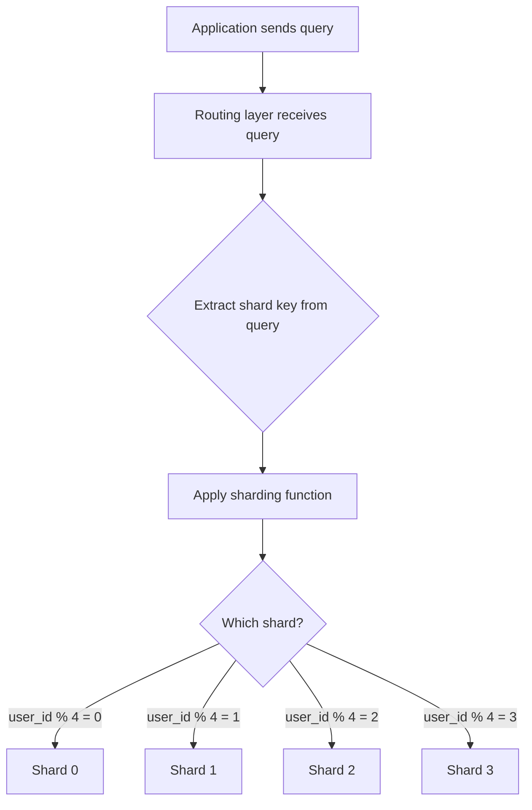
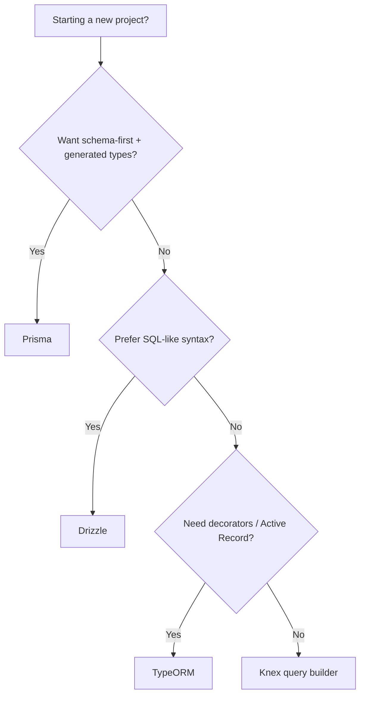

# Response Templates

Complete template examples for Learning Guide, How-To, and Reference responses.

## Template 1: Learning Guide

The primary research template. Takes someone from zero knowledge to solid understanding with friendly, progressive explanations.

### When to Use

- "Research X for me"
- "How does X work?"
- "Explain X to me"
- "I want to learn about X"
- Any broad or exploratory question
- Deep dives, architecture decisions, technology evaluation

### Structure

```markdown
# [Topic Title]

**[One sentence: what this covers and who it's for]**

_[2-3 sentence summary: what, why, and what you'll know by the end]_

---

**What you'll learn:**
- [Concept 1]
- [Concept 2]
- [Concept 3]

---

## Part 1: The Basics
### 1.1 [Core concept]
### 1.2 [Why it matters]

## Part 2: How It Works
### 2.1 [Mechanism / architecture]
### 2.2 [Component by component]

## Part 3: Approaches and Options
### Comparison table

## Part 4: How To Do It
### Step-by-step with code

## Part 5: Things to Watch Out For
## Part 6: Key Takeaways
## Sources
```

### Complete Example: Database Sharding

```markdown
# Database Sharding with PostgreSQL

**A practical guide to splitting your database across multiple servers when one isn't enough**

_Sharding is a way to distribute your data across multiple database servers so that no single server becomes a bottleneck. This guide explains what sharding is, when you actually need it, and how to implement it with PostgreSQL. By the end, you'll understand the trade-offs well enough to decide whether sharding is right for your project._

---

**What you'll learn:**
- What sharding is and how it differs from replication
- When you actually need it (and when you don't)
- The main sharding strategies and their trade-offs
- How to implement sharding with PostgreSQL tools

---

## Part 1: The Basics

### 1.1 What Is Sharding?

Imagine you run a library with one giant card catalog. When the library is small, one catalog works fine. But as the library grows to millions of books, that single catalog becomes a bottleneck — too many people crowding around it, too slow to look things up.

Sharding is the solution: instead of one giant catalog, you split it into several smaller ones. Maybe catalog A-F is in room 1, G-M in room 2, and so on. Each catalog is smaller, faster, and can serve visitors independently.

In database terms, **sharding** means splitting your data across multiple database servers (called **shards**), where each shard holds a subset of the total data. Instead of one PostgreSQL server handling everything, you might have four servers, each responsible for a quarter of your users.

#### Key Terms

| Term | What it means |
|------|--------------|
| **Shard** | One piece of the split database. Each shard is a full database server holding a subset of the data. |
| **Shard key** | The column you use to decide which shard a row belongs to. For example, `user_id` — all of user 42's data goes to the same shard. |
| **Replication** | Making copies of the same data on multiple servers (for redundancy). Not the same as sharding, which splits different data across servers. |
| **Horizontal scaling** | Adding more servers to handle more load. Sharding is a form of horizontal scaling. |
| **Vertical scaling** | Making one server bigger (more CPU, RAM, disk). The alternative to sharding — simpler but has limits. |

### 1.2 Why Not Just Get a Bigger Server?

Before reaching for sharding, most teams scale vertically — upgrading their single database server with more RAM, faster SSDs, more CPU cores. This works surprisingly far. A well-tuned PostgreSQL instance on modern hardware can handle tens of thousands of transactions per second and terabytes of data.

The problem is that vertical scaling has a ceiling. At some point, you can't buy a bigger machine. Or the cost becomes absurd. Or you need your database in multiple geographic regions. That's when sharding enters the picture.

**The honest truth:** most applications never need sharding. If you have fewer than ~100 million rows in your largest table and your queries are well-indexed, a single PostgreSQL server is probably fine. Sharding adds significant complexity, and that complexity has a cost.

## Part 2: How It Works

### 2.1 The Sharding Process

When a query comes in, the system needs to figure out which shard holds the relevant data. Here's the flow:



The routing layer sits between your application and the database shards. It reads the shard key from the query (e.g., `WHERE user_id = 42`), applies a function to determine the shard (e.g., `42 % 4 = 2`), and sends the query to shard 2.

### 2.2 Sharding Strategies

**Hash-based sharding** — apply a hash function to the shard key.

Take the shard key value, hash it, and use modulo to pick a shard. This distributes data evenly but makes range queries difficult. If you want "all users created this month," you'd have to ask every shard.

**Range-based sharding** — split by value ranges.

Users 1-1,000,000 go to shard 0, users 1,000,001-2,000,000 go to shard 1, and so on. Simple to understand, but can create hot spots if recent data is accessed more often (the latest shard gets hammered).

**Directory-based sharding** — use a lookup table.

A separate service maps each shard key to its shard. Most flexible but adds a single point of failure (the directory itself).

### Comparison

| | Hash-based | Range-based | Directory-based |
|---|---|---|---|
| **Best for** | Even distribution | Range queries, time-series | Complex routing rules |
| **Trade-off** | Range queries hit all shards | Potential hot spots | Directory is a bottleneck |
| **Complexity** | Low | Low | Medium |
| **Rebalancing** | Hard (rehash everything) | Easy (split ranges) | Easy (update directory) |

## Part 3: How To Do It with PostgreSQL

### Step 1: Decide if you need it

Ask yourself:
- Is my largest table over 100M rows?
- Is my single server maxing out CPU or I/O?
- Do I need data in multiple regions?

If you answered no to all three, you probably don't need sharding yet. Consider read replicas, better indexing, or query optimization first.

### Step 2: Choose your approach

PostgreSQL offers two main paths:

1. **Citus extension** — adds distributed tables to PostgreSQL. You keep writing normal SQL and Citus handles the routing.
2. **Foreign Data Wrappers (FDW)** — PostgreSQL's built-in way to query remote servers. More manual but no extensions needed.

### Step 3: Set up with Citus (recommended)

```sql
-- On the coordinator node
CREATE EXTENSION citus;

-- Add worker nodes (your shards)
SELECT citus_add_node('shard-0.example.com', 5432);
SELECT citus_add_node('shard-1.example.com', 5432);

-- Distribute a table by its shard key
SELECT create_distributed_table('orders', 'user_id');

-- Now queries automatically route to the right shard
SELECT * FROM orders WHERE user_id = 42;
-- This only hits the shard that holds user 42's data
```

## Part 4: Things to Watch Out For

- **Cross-shard queries are expensive** — A query without the shard key in its WHERE clause hits every shard. Design your schema so the most common queries include the shard key.
- **Joins across shards are slow** — If `orders` and `products` live on different shards, joining them requires moving data between servers. Co-locate related tables on the same shard.
- **Transactions don't span shards easily** — A transaction that touches multiple shards requires distributed coordination (two-phase commit), which is slower and more failure-prone.
- **Schema changes are harder** — An `ALTER TABLE` needs to run on every shard. Tools like Citus handle this, but it's still slower than a single-server migration.

## Part 5: Key Takeaways

1. Sharding splits data across multiple servers — each server holds a subset
2. Most applications don't need it. Exhaust vertical scaling and read replicas first.
3. Choose your shard key carefully — it determines query efficiency and data distribution
4. Citus makes PostgreSQL sharding practical without rewriting your application
5. The main cost is complexity: cross-shard queries, distributed transactions, and schema management all get harder

## Sources

- https://www.citusdata.com/blog/2017/08/09/principles-of-sharding-for-relational-databases/ — Principles of sharding, when to shard
- https://www.postgresql.org/docs/current/ddl-partitioning.html — PostgreSQL native partitioning docs
- https://docs.citusdata.com/en/stable/get_started/concepts.html — Citus distributed tables concepts
- https://instagram-engineering.com/sharding-ids-at-instagram-1cf5a71e5a5c — Instagram's sharding approach (real-world case study)
```

### Style Notes for Learning Guide

- **Opening**: Always start with a one-liner and a 2-3 sentence summary that answers "what, why, what will I know"
- **Part 1**: Explain the concept as if talking to someone who's never heard of it. Use an everyday analogy.
- **Key Terms table**: Define terms right where they're first introduced, not in a glossary at the end
- **Diagrams**: At least one Mermaid diagram for any topic with flow, architecture, or relationships
- **Comparison tables**: Always when presenting 2+ options
- **Paragraphs**: Keep them short (3-5 sentences max). White space is your friend.
- **Code**: Comments on every non-obvious line. Show the simplest working example.
- **Gotchas**: Be honest about trade-offs and pitfalls. Don't sell — educate.
- **Tone**: Friendly and direct. "The honest truth: most apps never need this" > "It should be noted that this may not be necessary in all scenarios"

---

## Template 2: How-To

Practical, step-by-step guide for accomplishing a specific task.

### When to Use

- "How do I set up X?"
- "Walk me through configuring Y"
- "Steps to deploy Z"
- Single task with a clear outcome

### Structure

```markdown
# How To: [Task]

**[What you'll have when you're done]**

## Prerequisites

- [Tool/knowledge needed]
- [Version requirements]

## Key Terms

| Term | What it means |
|------|--------------|
| **[Term]** | [Definition] |

## Steps

### Step 1: [Action verb + what]

[Why this step. What it does.]

```[language]
// code
```

**Expected result:** [What you should see]

### Step 2: [Next action]

[Continue...]

## Verify It Works

```[language]
// verification command
```

You should see: [expected output]

## Common Issues

| Problem | Cause | Fix |
|---------|-------|-----|
| [Error] | [Why] | [Solution] |

## Sources

- [URL] — [Description]
```

### Complete Example: Redis Caching

```markdown
# How To: Add Redis Caching to a Node.js API

**By the end of this guide, your API will cache database queries in Redis, reducing response times from ~200ms to ~5ms for repeated requests.**

## Prerequisites

- Node.js 18+ installed
- A running PostgreSQL database with data to cache
- Docker installed (for running Redis locally)

## Key Terms

| Term | What it means |
|------|--------------|
| **Cache** | A fast temporary store. Instead of querying the database every time, you check the cache first. |
| **TTL** | Time To Live — how long a cached value stays valid before it expires and gets refreshed from the database. |
| **Cache invalidation** | Removing or updating cached data when the source data changes. The hardest part of caching. |

## Steps

### Step 1: Start Redis

Run Redis locally with Docker:

```bash
docker run -d --name redis -p 6379:6379 redis:7-alpine
```

**Expected result:** A Redis container running on port 6379. Verify with `docker ps`.

### Step 2: Install the Redis client

```bash
npm install ioredis
```

### Step 3: Create a cache utility

```typescript
// src/cache.ts
import Redis from 'ioredis';

const redis = new Redis({
  host: 'localhost',
  port: 6379,
});

export async function cached<T>(
  key: string,
  ttlSeconds: number,
  fetcher: () => Promise<T>
): Promise<T> {
  // Check cache first
  const hit = await redis.get(key);
  if (hit) return JSON.parse(hit);

  // Cache miss — fetch from source
  const data = await fetcher();
  await redis.set(key, JSON.stringify(data), 'EX', ttlSeconds);
  return data;
}
```

### Step 4: Use it in your route

```typescript
// Before (hits DB every time)
app.get('/users/:id', async (req, res) => {
  const user = await db.query('SELECT * FROM users WHERE id = $1', [req.params.id]);
  res.json(user);
});

// After (checks cache first, DB only on miss)
app.get('/users/:id', async (req, res) => {
  const user = await cached(
    `user:${req.params.id}`,  // cache key
    300,                       // 5 minutes TTL
    () => db.query('SELECT * FROM users WHERE id = $1', [req.params.id])
  );
  res.json(user);
});
```

## Verify It Works

```bash
# First request — cache miss, hits DB (~200ms)
curl -w "\nTime: %{time_total}s\n" http://localhost:3000/users/1

# Second request — cache hit (~5ms)
curl -w "\nTime: %{time_total}s\n" http://localhost:3000/users/1
```

You should see a significant time drop on the second request.

## Common Issues

| Problem | Cause | Fix |
|---------|-------|-----|
| `ECONNREFUSED` on port 6379 | Redis isn't running | Run `docker start redis` |
| Stale data after update | Cache not invalidated | Delete the key after writes: `redis.del('user:42')` |
| Memory growing unbounded | No TTL or too long | Always set a TTL. Start with 5 minutes, adjust based on data freshness needs. |

## Sources

- https://redis.io/docs/getting-started/ — Redis quickstart guide
- https://github.com/redis/ioredis — ioredis client documentation
```

---

## Template 3: Reference

Quick-lookup format for comparisons, options, or specifications.

### When to Use

- "Compare X vs Y"
- "What are my options for Z?"
- "List the available approaches for W"
- Quick lookup, not deep learning

### Structure

```markdown
# [Topic] Reference

**[One sentence: what this covers]**

## Overview

[2-3 sentences of context]

## Options at a Glance

| Name | What it does | Best for | License | Popularity |
|------|-------------|----------|---------|------------|
| [A] | ... | ... | ... | ... |
| [B] | ... | ... | ... | ... |

## [Option A]

[2-3 paragraphs + minimal code example]

## [Option B]

[Same structure]

## Decision Guide


## Sources
```

### Complete Example: Node.js ORM Reference

```markdown
# Node.js ORM Reference

**A comparison of the major ORMs and query builders for Node.js/TypeScript projects**

## Overview

An ORM (Object-Relational Mapper) lets you interact with your database using JavaScript/TypeScript objects instead of raw SQL. Some developers prefer the type safety and abstraction; others find ORMs add complexity. This reference covers the leading options as of 2024.

## Options at a Glance

| Name | What it does | Best for | License | Weekly Downloads |
|------|-------------|----------|---------|-----------------|
| **Prisma** | Type-safe ORM with schema-first design | New projects wanting strong types | Apache-2.0 | ~2.5M |
| **Drizzle** | Lightweight, SQL-like TypeScript ORM | Teams that think in SQL | Apache-2.0 | ~500K |
| **TypeORM** | Decorator-based ORM (Active Record / Data Mapper) | Projects using decorators heavily | MIT | ~1.5M |
| **Knex** | SQL query builder (not a full ORM) | Teams wanting SQL control without raw strings | MIT | ~1.8M |

## Prisma

Schema-first approach: you define your data model in a `.prisma` file, and Prisma generates a fully typed client. Migrations are handled automatically. Great developer experience, but the generated client can be large and cold starts are slower.

```typescript
const user = await prisma.user.findUnique({
  where: { id: 42 },
  include: { posts: true },
});
```

## Drizzle

SQL-like syntax that feels natural if you think in SQL. Very lightweight, no code generation step, excellent TypeScript inference. Newer project but growing fast.

```typescript
const user = await db.select().from(users).where(eq(users.id, 42));
```

## Decision Guide



## Sources

- https://www.prisma.io/docs — Prisma official documentation
- https://orm.drizzle.team/docs/overview — Drizzle documentation
- https://typeorm.io/ — TypeORM documentation
- https://knexjs.org/guide/ — Knex.js documentation
```

---

## Template Selection Guide

| Query Type | Template | Key Indicators |
|------------|----------|---------------|
| Understand a concept | Learning Guide | "what is", "how does X work", "explain", "research" |
| Learn a technology | Learning Guide | "deep dive", "I want to learn about" |
| Architecture decision | Learning Guide | "how should we build", "what approach" |
| Do a specific task | How-To | "how do I", "set up", "configure", "deploy" |
| Quick steps | How-To | "walk me through", "steps to" |
| Compare options | Reference | "compare", "vs", "what are my options" |
| Quick lookup | Reference | "list", "what are the available", "cheat sheet" |

**When in doubt, use Learning Guide.** It's better to over-explain than to leave someone confused.

## Deep Research Document

For the `/m:research` command, the Learning Guide template is extended with additional sections:

```markdown
---
date: YYYY-MM-DD
query: <original research input>
stack: <detected tech stack>
---
```

Additional sections to include:
- **Tech Stack Context** — how the detected stack affects recommendations
- **Library / Tool Comparison** — table from library discovery agent
- **Scenarios** — basic case, edge cases, production considerations
- **Knowledge Gaps** — what wasn't covered, where to look next
- **Tiered Sources** — organized by Tier 1 (Authoritative) through Tier 4 (Unverified)
