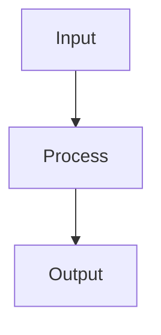

# Introduction Template

A 3-5 minute read that gets someone oriented on a topic. Same friendly tone as the Learning Guide but shorter and tighter -- the essentials only. Think of it as the article you'd want to read before deciding whether to go deeper.

**Target length:** 600-1200 words.

## Structure

```markdown
# [Topic]: What It Is and Why It Matters

_[2-3 sentence summary: what this is, why you should care, and what you'll understand by the end]_

---

## What Is [Topic]?

[Explain the core concept in plain language. Use an everyday analogy. 2-3 paragraphs max.]

### Key Terms

| Term | What it means |
|------|--------------|
| **[Term 1]** | [Plain-language definition, 1-2 sentences] |
| **[Term 2]** | [Plain-language definition] |
| **[Term 3]** | [Plain-language definition] |

## How It Works

[The mechanism in a nutshell. One Mermaid diagram + 2-3 paragraphs explaining the flow.]



## When to Use It

[Practical guidance: when this is the right choice, when it's not, and what the alternatives are. Keep it honest -- "you probably don't need this if..."]

## Quick Example

```[language]
// A minimal, working example that shows the concept in action
// Comments on every non-obvious line
```

## Key Takeaways

1. [Most important thing]
2. [Second most important]
3. [Third]

## Go Deeper

- [URL] -- [Best resource to continue learning]
- [URL] -- [Second resource]
- [URL] -- [Third resource]
```

## Rules

- **600-1200 words** -- respect the reader's time. If it takes more than 5 minutes to read, cut.
- One analogy to ground the concept
- One Mermaid diagram max
- One code example max
- Key Terms table for any jargon
- "Go Deeper" section replaces Sources -- these are curated next-step links, not just citations
- Skip the Parts/numbered structure -- this is short enough to be flat
- Be opinionated in "When to Use It" -- don't just list pros/cons, give a recommendation
