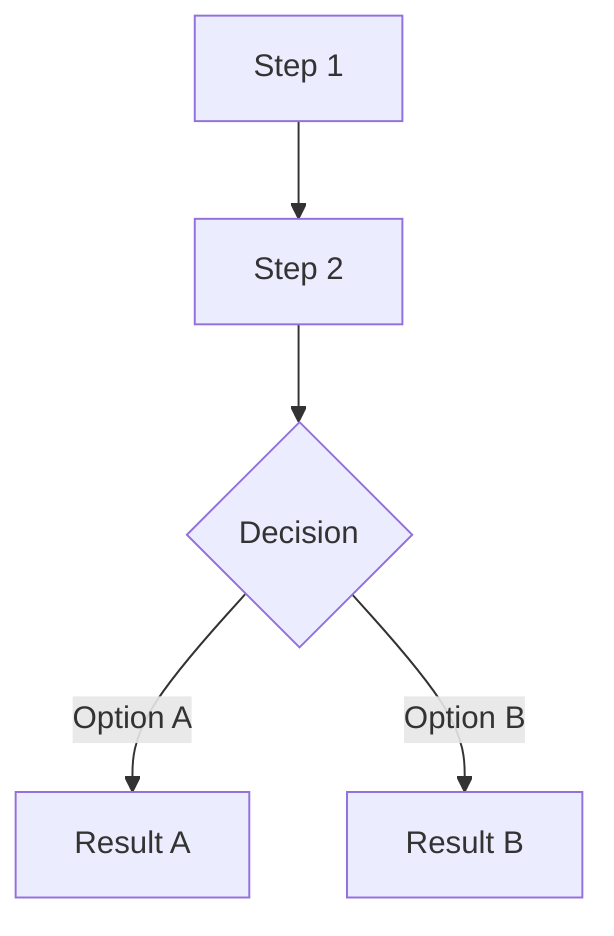
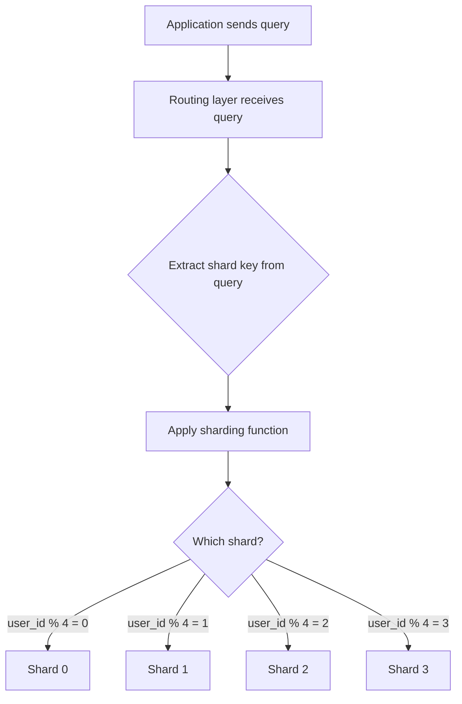

# Learning Guide Template

The flagship template. Takes the reader from zero knowledge to solid understanding. Friendly, progressive, example-rich.

## Structure

```markdown
# [Topic Title]

**[One sentence describing what this document covers and who it's for]**

_[2-3 sentence summary: what this is, why it matters, and what you'll know by the end]_

---

**What you'll learn:**
- [Concept 1 -- the basics]
- [Concept 2 -- how it works]
- [Concept 3 -- how to use it]
- [Concept 4 -- trade-offs and decisions]

---

## Part 1: The Basics

### 1.1 [Core concept in plain language]

[Explain the fundamental idea as if the reader has never heard of it. Use an analogy from everyday life if possible.]

#### A Simple Example

[Walk through a concrete, relatable example. Make it specific -- names, numbers, scenarios the reader can picture.]

#### Key Terms

| Term | What it means |
|------|--------------|
| **[Term 1]** | [Plain-language definition, 1-2 sentences] |
| **[Term 2]** | [Plain-language definition] |
| **[Term 3]** | [Plain-language definition] |

### 1.2 [Why this matters / the problem it solves]

[Explain the motivation. What pain does this address? What was life like before?]

## Part 2: How It Works

### 2.1 [The mechanism / architecture / process]

[Explain how the thing actually works under the hood. Use a diagram:]



### 2.2 [Component by component]

[Break down each piece. For each component:]

**[Component Name]** -- [one-line description].

[2-3 sentences explaining what it does and why it exists. Include a code snippet or example if it helps.]

## Part 3: Approaches and Options

### 3.1 [Option/Approach A]

[What it is, when to use it, pros and cons]

### 3.2 [Option/Approach B]

[What it is, when to use it, pros and cons]

### Comparison

| | Approach A | Approach B | Approach C |
|---|---|---|---|
| **Best for** | ... | ... | ... |
| **Trade-off** | ... | ... | ... |
| **Complexity** | ... | ... | ... |

## Part 4: How To Do It

### Step 1: [First action]

[Clear instruction with code example]

```[language]
// code example with comments explaining each line
```

### Step 2: [Next action]

[Continue step by step]

## Part 5: Things to Watch Out For

- **[Gotcha 1]** -- [What happens and how to avoid it]
- **[Gotcha 2]** -- [What happens and how to avoid it]
- **[Edge case]** -- [When this breaks and what to do]

## Part 6: Key Takeaways

1. [Most important thing to remember]
2. [Second most important]
3. [Third]

## Sources

- [URL] -- [What information came from this source]
- [URL] -- [Description]
```

## Rules

- Start every topic with what the reader already knows, then bridge to the new concept
- Define every technical term the first time it appears -- inline or in a terms table
- Use at least one Mermaid diagram for any topic involving architecture, flow, or relationships
- Use comparison tables when presenting multiple options
- Keep paragraphs short (3-5 sentences max)
- Use bold for key terms and emphasis
- Number parts sequentially so readers can reference them ("as Part 1 explained...")
- End each part with a bridge sentence to the next

## Example: Database Sharding

```markdown
# Database Sharding with PostgreSQL

**A practical guide to splitting your database across multiple servers when one isn't enough**

_Sharding is a way to distribute your data across multiple database servers so that no single server becomes a bottleneck. This guide explains what sharding is, when you actually need it, and how to implement it with PostgreSQL. By the end, you'll understand the trade-offs well enough to decide whether sharding is right for your project._

---

**What you'll learn:**
- What sharding is and how it differs from replication
- When you actually need it (and when you don't)
- The main sharding strategies and their trade-offs
- How to implement sharding with PostgreSQL tools

---

## Part 1: The Basics

### 1.1 What Is Sharding?

Imagine you run a library with one giant card catalog. When the library is small, one catalog works fine. But as the library grows to millions of books, that single catalog becomes a bottleneck -- too many people crowding around it, too slow to look things up.

Sharding is the solution: instead of one giant catalog, you split it into several smaller ones. Maybe catalog A-F is in room 1, G-M in room 2, and so on. Each catalog is smaller, faster, and can serve visitors independently.

In database terms, **sharding** means splitting your data across multiple database servers (called **shards**), where each shard holds a subset of the total data. Instead of one PostgreSQL server handling everything, you might have four servers, each responsible for a quarter of your users.

#### Key Terms

| Term | What it means |
|------|--------------|
| **Shard** | One piece of the split database. Each shard is a full database server holding a subset of the data. |
| **Shard key** | The column you use to decide which shard a row belongs to. For example, `user_id` -- all of user 42's data goes to the same shard. |
| **Replication** | Making copies of the same data on multiple servers (for redundancy). Not the same as sharding, which splits different data across servers. |
| **Horizontal scaling** | Adding more servers to handle more load. Sharding is a form of horizontal scaling. |
| **Vertical scaling** | Making one server bigger (more CPU, RAM, disk). The alternative to sharding -- simpler but has limits. |

### 1.2 Why Not Just Get a Bigger Server?

Before reaching for sharding, most teams scale vertically -- upgrading their single database server with more RAM, faster SSDs, more CPU cores. This works surprisingly far. A well-tuned PostgreSQL instance on modern hardware can handle tens of thousands of transactions per second and terabytes of data.

The problem is that vertical scaling has a ceiling. At some point, you can't buy a bigger machine. Or the cost becomes absurd. Or you need your database in multiple geographic regions. That's when sharding enters the picture.

**The honest truth:** most applications never need sharding. If you have fewer than ~100 million rows in your largest table and your queries are well-indexed, a single PostgreSQL server is probably fine. Sharding adds significant complexity, and that complexity has a cost.

## Part 2: How It Works

### 2.1 The Sharding Process

When a query comes in, the system needs to figure out which shard holds the relevant data. Here's the flow:



The routing layer sits between your application and the database shards. It reads the shard key from the query (e.g., `WHERE user_id = 42`), applies a function to determine the shard (e.g., `42 % 4 = 2`), and sends the query to shard 2.

### 2.2 Sharding Strategies

**Hash-based sharding** -- apply a hash function to the shard key.

Take the shard key value, hash it, and use modulo to pick a shard. This distributes data evenly but makes range queries difficult. If you want "all users created this month," you'd have to ask every shard.

**Range-based sharding** -- split by value ranges.

Users 1-1,000,000 go to shard 0, users 1,000,001-2,000,000 go to shard 1, and so on. Simple to understand, but can create hot spots if recent data is accessed more often (the latest shard gets hammered).

**Directory-based sharding** -- use a lookup table.

A separate service maps each shard key to its shard. Most flexible but adds a single point of failure (the directory itself).

### Comparison

| | Hash-based | Range-based | Directory-based |
|---|---|---|---|
| **Best for** | Even distribution | Range queries, time-series | Complex routing rules |
| **Trade-off** | Range queries hit all shards | Potential hot spots | Directory is a bottleneck |
| **Complexity** | Low | Low | Medium |
| **Rebalancing** | Hard (rehash everything) | Easy (split ranges) | Easy (update directory) |

## Part 3: How To Do It with PostgreSQL

### Step 1: Decide if you need it

Ask yourself:
- Is my largest table over 100M rows?
- Is my single server maxing out CPU or I/O?
- Do I need data in multiple regions?

If you answered no to all three, you probably don't need sharding yet. Consider read replicas, better indexing, or query optimization first.

### Step 2: Choose your approach

PostgreSQL offers two main paths:

1. **Citus extension** -- adds distributed tables to PostgreSQL. You keep writing normal SQL and Citus handles the routing.
2. **Foreign Data Wrappers (FDW)** -- PostgreSQL's built-in way to query remote servers. More manual but no extensions needed.

### Step 3: Set up with Citus (recommended)

```sql
-- On the coordinator node
CREATE EXTENSION citus;

-- Add worker nodes (your shards)
SELECT citus_add_node('shard-0.example.com', 5432);
SELECT citus_add_node('shard-1.example.com', 5432);

-- Distribute a table by its shard key
SELECT create_distributed_table('orders', 'user_id');

-- Now queries automatically route to the right shard
SELECT * FROM orders WHERE user_id = 42;
-- This only hits the shard that holds user 42's data
```

## Part 4: Things to Watch Out For

- **Cross-shard queries are expensive** -- A query without the shard key in its WHERE clause hits every shard. Design your schema so the most common queries include the shard key.
- **Joins across shards are slow** -- If `orders` and `products` live on different shards, joining them requires moving data between servers. Co-locate related tables on the same shard.
- **Transactions don't span shards easily** -- A transaction that touches multiple shards requires distributed coordination (two-phase commit), which is slower and more failure-prone.
- **Schema changes are harder** -- An `ALTER TABLE` needs to run on every shard. Tools like Citus handle this, but it's still slower than a single-server migration.

## Part 5: Key Takeaways

1. Sharding splits data across multiple servers -- each server holds a subset
2. Most applications don't need it. Exhaust vertical scaling and read replicas first.
3. Choose your shard key carefully -- it determines query efficiency and data distribution
4. Citus makes PostgreSQL sharding practical without rewriting your application
5. The main cost is complexity: cross-shard queries, distributed transactions, and schema management all get harder

## Sources

- https://www.citusdata.com/blog/2017/08/09/principles-of-sharding-for-relational-databases/ -- Principles of sharding, when to shard
- https://www.postgresql.org/docs/current/ddl-partitioning.html -- PostgreSQL native partitioning docs
- https://docs.citusdata.com/en/stable/get_started/concepts.html -- Citus distributed tables concepts
- https://instagram-engineering.com/sharding-ids-at-instagram-1cf5a71e5a5c -- Instagram's sharding approach (real-world case study)
```

### Style Notes

- **Opening**: Always start with a one-liner and a 2-3 sentence summary that answers "what, why, what will I know"
- **Part 1**: Explain the concept as if talking to someone who's never heard of it. Use an everyday analogy.
- **Key Terms table**: Define terms right where they're first introduced, not in a glossary at the end
- **Diagrams**: At least one Mermaid diagram for any topic with flow, architecture, or relationships
- **Comparison tables**: Always when presenting 2+ options
- **Paragraphs**: Keep them short (3-5 sentences max). White space is your friend.
- **Code**: Comments on every non-obvious line. Show the simplest working example.
- **Gotchas**: Be honest about trade-offs and pitfalls. Don't sell -- educate.
- **Tone**: Friendly and direct. "The honest truth: most apps never need this" > "It should be noted that this may not be necessary in all scenarios"
