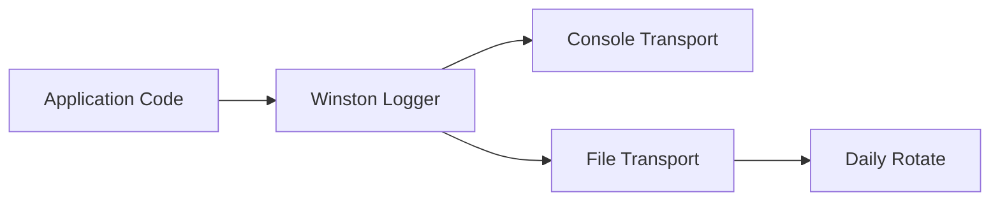
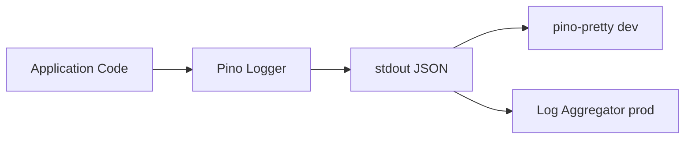

# Refactor Impact Template

Tactical analysis of what changes when you modify existing code. Lists every affected file, shows before/after flows, and suggests an order of operations.

## Structure

```markdown
# Impact Analysis: {Change Description}

**Total files affected:** {count}
**Estimated complexity:** {Low / Medium / High}
**New packages:** {list, or "None"}
**Packages to remove:** {list, or "None"}

---

## What's Changing

{2-3 paragraphs explaining the change in plain language. What's the current behavior, what's the desired behavior, and why.}

## Current Flow

```mermaid
{Mermaid diagram showing the current behavior/architecture relevant to this change}
```

## New Flow

```mermaid
{Mermaid diagram showing the desired behavior/architecture after the change}
```

## Affected Files

### {Module/Directory 1}

| File | What it does | Why it's affected | What changes | Complexity |
|------|-------------|-------------------|--------------|------------|
| `path/to/file` | {purpose} | {why} | {what needs to change} | Low/Med/High |

### {Module/Directory 2}

| File | What it does | Why it's affected | What changes | Complexity |
|------|-------------|-------------------|--------------|------------|
| `path/to/file` | {purpose} | {why} | {what needs to change} | Low/Med/High |

{Continue for all modules}

## New Files Needed

| File | Purpose |
|------|---------|
| `path/to/new-file` | {why this file is needed} |

{Omit this section if no new files are needed.}

## Configuration Changes

| Config | Current | New |
|--------|---------|-----|
| {env var / config key} | {current value/setup} | {new value/setup} |

{Omit this section if no config changes are needed.}

## Suggested Order of Changes

1. **Phase 1:** {description}
2. **Phase 2:** {description}
3. **Phase 3:** {description}

## Risks

| Risk | Impact | Mitigation |
|------|--------|------------|
| {risk} | {what could go wrong} | {how to prevent/handle it} |
```

## Rules

- List EVERY affected file -- missing a file means something breaks or stays stale
- Use Mermaid for current and new flows -- omit if the change has no meaningful flow difference
- Group affected files by module/directory with a table per group
- Omit sections that don't apply (New Files, Configuration Changes)
- Be tactical and precise -- this is an action document, not a learning document
- Suggested Order of Changes should be implementable phases, not just a list

## Example: Switching from Winston to Pino

```markdown
# Impact Analysis: Replace Winston Logger with Pino

**Total files affected:** 12
**Estimated complexity:** Medium
**New packages:** pino, pino-pretty
**Packages to remove:** winston, winston-daily-rotate-file

---

## What's Changing

The project currently uses Winston for all server-side logging. Winston works but is slower than Pino under load, and the team wants structured JSON logging by default. The change replaces Winston with Pino across the entire backend.

The core logger interface stays the same (info, warn, error, debug), so most call sites only need an import change. The configuration and transport setup are completely different.

## Current Flow



## New Flow



## Affected Files

### src/lib

| File | What it does | Why it's affected | What changes | Complexity |
|------|-------------|-------------------|--------------|------------|
| `src/lib/logger.ts` | Creates and exports the logger instance | Core file being replaced | Rewrite: Winston config to Pino config | High |
| `src/lib/request-context.ts` | Attaches logger to request context | Imports from logger.ts | Update import, use Pino child logger | Low |

### src/api

| File | What it does | Why it's affected | What changes | Complexity |
|------|-------------|-------------------|--------------|------------|
| `src/api/middleware/logging.ts` | HTTP request/response logging middleware | Uses Winston format API | Rewrite to use Pino serializers | Medium |
| `src/api/routes/users.ts` | User CRUD routes | Imports logger | Update import path | Low |
| `src/api/routes/orders.ts` | Order CRUD routes | Imports logger | Update import path | Low |
| `src/api/routes/health.ts` | Health check endpoint | Imports logger | Update import path | Low |

### src/workers

| File | What it does | Why it's affected | What changes | Complexity |
|------|-------------|-------------------|--------------|------------|
| `src/workers/email.ts` | Email sending worker | Imports logger | Update import path | Low |
| `src/workers/cleanup.ts` | Data cleanup cron job | Imports logger | Update import path | Low |

### config

| File | What it does | Why it's affected | What changes | Complexity |
|------|-------------|-------------------|--------------|------------|
| `config/default.json` | Default configuration | Winston log levels and transports | Replace with Pino config shape | Medium |
| `package.json` | Dependencies | Winston packages listed | Remove winston, add pino | Low |

### tests

| File | What it does | Why it's affected | What changes | Complexity |
|------|-------------|-------------------|--------------|------------|
| `tests/lib/logger.test.ts` | Logger unit tests | Tests Winston-specific behavior | Rewrite for Pino API | High |
| `tests/api/logging.test.ts` | Middleware integration tests | Asserts on Winston log format | Update assertions for JSON output | Medium |

## Configuration Changes

| Config | Current | New |
|--------|---------|-----|
| `logging.level` | `"info"` (Winston levels) | `"info"` (Pino levels -- same names, different numeric values) |
| `logging.transports` | `["console", "dailyRotateFile"]` | Remove -- Pino uses stdout only; routing is external |
| `LOG_DIR` env var | Used by Winston file transport | Remove -- no longer needed |

## Suggested Order of Changes

1. **Phase 1:** Install Pino, rewrite `src/lib/logger.ts`, update `config/default.json`
2. **Phase 2:** Update all import sites (routes, workers, request-context) -- mechanical changes
3. **Phase 3:** Rewrite logging middleware to use Pino serializers
4. **Phase 4:** Update tests, remove Winston packages from package.json

## Risks

| Risk | Impact | Mitigation |
|------|--------|------------|
| Log format change breaks log aggregator parsing | Production logs stop being indexed | Update log aggregator config in parallel with Phase 1 |
| Pino child logger API differs from Winston | Request-scoped logging breaks | Test request-context changes in Phase 1, not Phase 2 |
| pino-pretty not installed in production | Dev-only dependency leaks or crashes | Add to devDependencies only, gate behind NODE_ENV check |
```

### Style Notes

- **Opening stats**: Always lead with total files, complexity, and package changes
- **Flows**: Use Mermaid for current and new flows -- skip if the change has no meaningful flow difference
- **Affected Files**: Group by module/directory. Every file gets a row. Do not summarize or skip.
- **Phases**: Suggested Order should be implementable -- each phase should be independently testable if possible
- **Risks**: Be honest about what could go wrong. Include mitigation for each.
- **Tone**: Tactical and precise. This is an action document, not a learning document.
