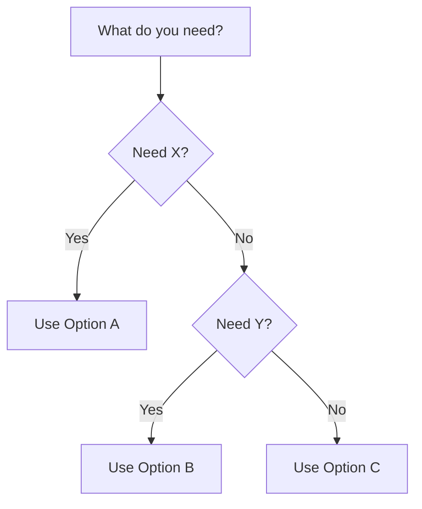
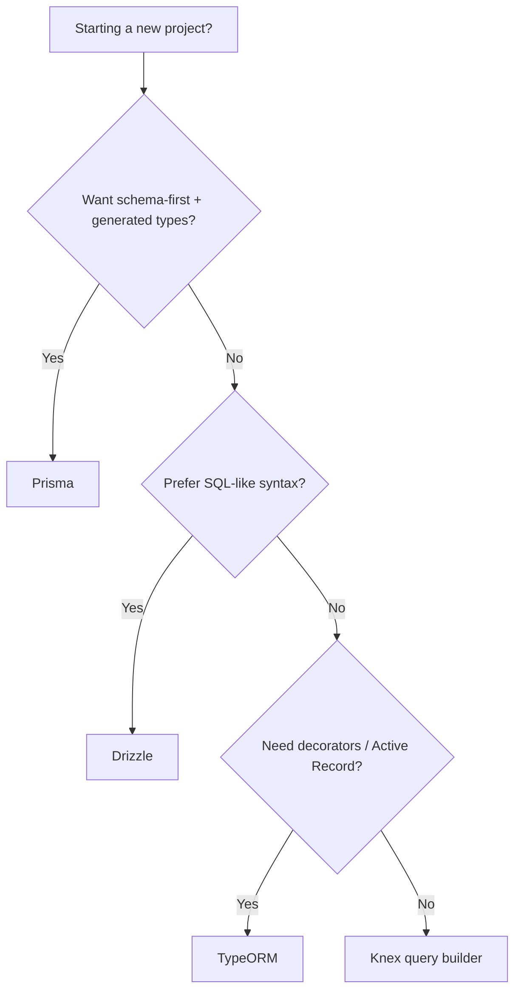

# Reference Template

Quick-lookup format for comparisons, options, or specifications.

## Structure

```markdown
# [Topic] Reference

**[One sentence: what this reference covers]**

## Overview

[2-3 sentences of context -- just enough to orient the reader]

## Options at a Glance

| Name | What it does | Best for | License | Popularity |
|------|-------------|----------|---------|------------|
| [A] | [Description] | [Use case] | [License] | [Stars/downloads] |
| [B] | [Description] | [Use case] | [License] | [Stars/downloads] |

## [Option A]: Details

[2-3 paragraphs covering: what it is, strengths, weaknesses, when to pick it]

```[language]
// minimal example
```

## [Option B]: Details

[Same structure]

## Decision Guide



## Sources

- [URL] -- [Description]
```

## Rules

- Lead with the comparison table -- let readers scan first
- Keep descriptions short and factual
- Include a decision flowchart (Mermaid) when there are 3+ options
- Minimal code examples -- just enough to show the API/syntax

## Example: Node.js ORM Reference

```markdown
# Node.js ORM Reference

**A comparison of the major ORMs and query builders for Node.js/TypeScript projects**

## Overview

An ORM (Object-Relational Mapper) lets you interact with your database using JavaScript/TypeScript objects instead of raw SQL. Some developers prefer the type safety and abstraction; others find ORMs add complexity. This reference covers the leading options as of 2024.

## Options at a Glance

| Name | What it does | Best for | License | Weekly Downloads |
|------|-------------|----------|---------|-----------------|
| **Prisma** | Type-safe ORM with schema-first design | New projects wanting strong types | Apache-2.0 | ~2.5M |
| **Drizzle** | Lightweight, SQL-like TypeScript ORM | Teams that think in SQL | Apache-2.0 | ~500K |
| **TypeORM** | Decorator-based ORM (Active Record / Data Mapper) | Projects using decorators heavily | MIT | ~1.5M |
| **Knex** | SQL query builder (not a full ORM) | Teams wanting SQL control without raw strings | MIT | ~1.8M |

## Prisma

Schema-first approach: you define your data model in a `.prisma` file, and Prisma generates a fully typed client. Migrations are handled automatically. Great developer experience, but the generated client can be large and cold starts are slower.

```typescript
const user = await prisma.user.findUnique({
  where: { id: 42 },
  include: { posts: true },
});
```

## Drizzle

SQL-like syntax that feels natural if you think in SQL. Very lightweight, no code generation step, excellent TypeScript inference. Newer project but growing fast.

```typescript
const user = await db.select().from(users).where(eq(users.id, 42));
```

## Decision Guide



## Sources

- https://www.prisma.io/docs -- Prisma official documentation
- https://orm.drizzle.team/docs/overview -- Drizzle documentation
- https://typeorm.io/ -- TypeORM documentation
- https://knexjs.org/guide/ -- Knex.js documentation
```
