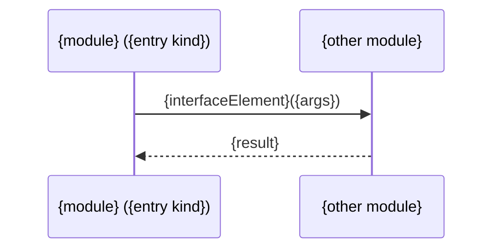

# Change Request — {short title}

{One or two sentences: what this change does and why. No more.}

## 1. Features and Modules

| Feature | Module | What changes |
|---|---|---|
| {feature name} ([{FEAT-XXXX}]({link}#{FEAT-XXXX})) | `{module}` | {one clause} |

## Module: {module}

### 2. The Specs

#### New — {item name} ([{SC-XXXX-NN}]({link}#{SC-XXXX-NN}))

{The item shown whole, exactly as it will land — including its `<a id="{SC-XXXX-NN}"></a>` anchor line. When the item has a graphical interface, its `**UI:**` block or `## UI` section lands too, exactly as below.}

   **UI:**
   ```
   +----------------------------------+
   | {Screen title}                   |
   |----------------------------------|
   | {Key UI elements at this step}   |
   |                                  |
   | [ {Action button} ]              |
   +----------------------------------+
   ```

    <!-- the file lives at specs/changes/{change-id}/assets/; the apply step moves it to the feature's assets/ -->

##### Additional Notes

- None

##### Examples

- None

#### Changed — {item name} ([{SC-XXXX-NN}]({link}#{SC-XXXX-NN}))

**Before**

{The item as it reads on the base branch.}

**After**

{The item as it will read. Anchor unchanged.}

##### Additional Notes

- None

##### Examples

- `E-001` — {exact values: inputs, expected outputs, dates, amounts}

#### Removed — {item name} ([{SC-XXXX-NN}]({link}#{SC-XXXX-NN}))

{What it used to do, stated so the loss is a decision and not an accident.}

#### Retired — {scenario name} ([{SC-XXXX-NN}]({link}#{SC-XXXX-NN}))

{`/m:change` only. What the scenario asserted. The planner may delete its tests and code through a task's `retires` list.}

### 3. The Interface

{The INTERFACE.md diff — new elements, changed signatures, removed elements — as before/after table rows.}

```mermaid
classDiagram
    class {module} {
        +{element}({param}: {Type}) {ReturnType}
    }
```

##### Additional Notes

- None

##### Examples

- None

### 4. The Data Layer

{Every table the change touches, and every table the feature reads. Changes marked; unchanged tables kept for context.}

```mermaid
erDiagram
    {table} {
        {type} {column} PK "{responsibility}"
    }
```

### 5. The Flows



## 6. Module Relationships

{One diagram of the touched modules and their allowed interactions. Any charter amendment appears here as a diff, with its why.}

```mermaid
graph LR
    {module} -->|{interface element}| {other-module}
```
