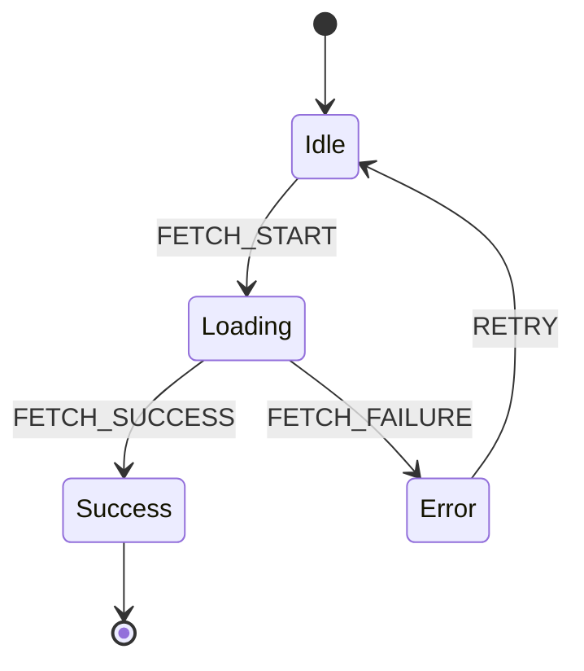
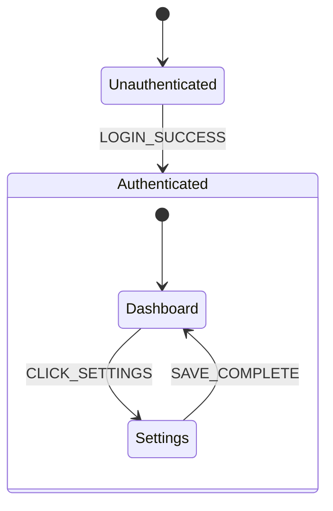
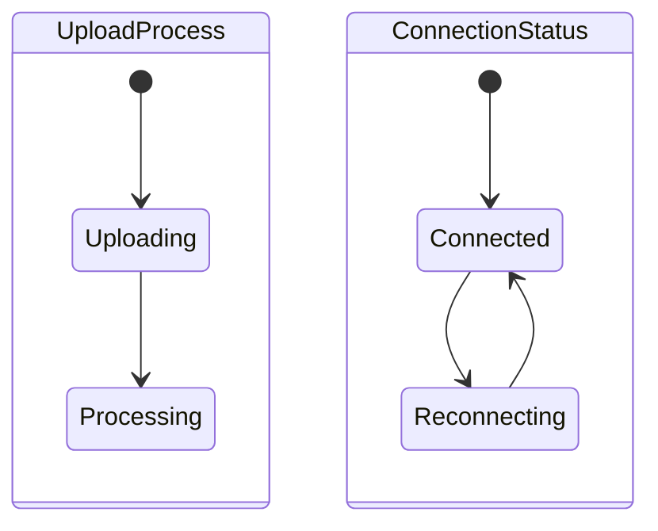

# State Modeling & Mermaid Diagramming

This skill provides guidelines for analyzing code to extract state machines and visualizing them using Mermaid.js.

## Core Philosophy

**"The Map is the Territory Verification"**

The goal of generating state machine diagrams from existing code is NOT just documentation—it is **verification**. By forcing a comprehensive map of all possible states and transitions, we uncover:
- Unhandled states
- Impossible transitions
- Orphaned logic
- Implicit state dependencies

Therefore, **LAZINESS IS FORBIDDEN**. You must map EVERY path, even the unhappy ones.

## Deep Analysis Protocol

To extract a state machine from code, look for:

1.  **Explicit State**:
    - `enum` definitions
    - `status` or `step` string unions
    - `isLoading`, `isError`, `isSuccess` boolean combinations (which often form implicit states)
    - Database columns like `status`, `stage`, `lifecycle`

2.  **Implicit State**:
    - Presence/absence of data (e.g., `user` vs `null` implies `Unauthenticated` vs `Authenticated`)
    - URL routes/paths
    - Empty vs Populated lists

3.  **Transitions (The "Arrows")**:
    - Functions that change state (setters, reducers)
    - API responses that update data
    - User events (clicks, form submissions)
    - Timeouts/Intervals

## Mermaid State Diagram Patterns

Use `stateDiagram-v2` for all diagrams.

### Basic Structure

### Hierarchical States (Nested)

Use when a main state has sub-states (e.g., an Authenticated user can be in different sub-workflows).

### Parallel States (Concurrency)

Use when two independent things happen at once (e.g., uploading a file while a timer runs).

## "No Lazy Mapping" Rules

When asked to diagram a system:

1.  **Map ALL Return Values**: If a function returns `Success | Failure | Pending`, you MUST draw 3 arrows.
2.  **Map ALL Error States**: Do not just say `--> Error`. If there are `NetworkError`, `ValidationError`, and `AuthError`, map them if they lead to different states (or distinct transitions).
3.  **Label Every Arrow**: An arrow without a label is ambiguous. Label it with the **Event** (trigger) or **Condition** that caused the move.
4.  **Identify End States**: Clearly show where the flow terminates `--> [*]`.

## Visualization Support

For every diagram you generate, you MUST append a link to the Mermaid Live Editor.

**URL Format:**
`https://mermaid.live/edit#base64:<BASE64_STRING>`

*Note: Since you (the agent) cannot easily generate Base64 strings, you should instead provide a direct link to the editor with a "Click to visualize" instruction if possible, or simple say:*

> **Visualize this diagram:** Copy the code block above and paste it into [Mermaid Live Editor](https://mermaid.live).

*(Self-correction: The agent can't reliably encoding base64 without a tool. The standard text instruction is sufficient and preferred.)*
