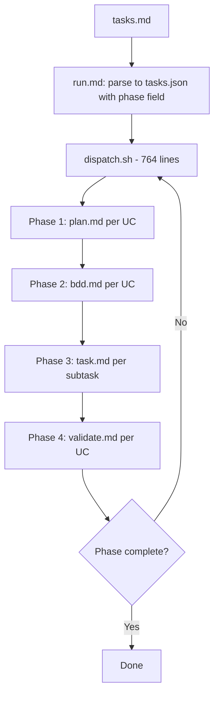
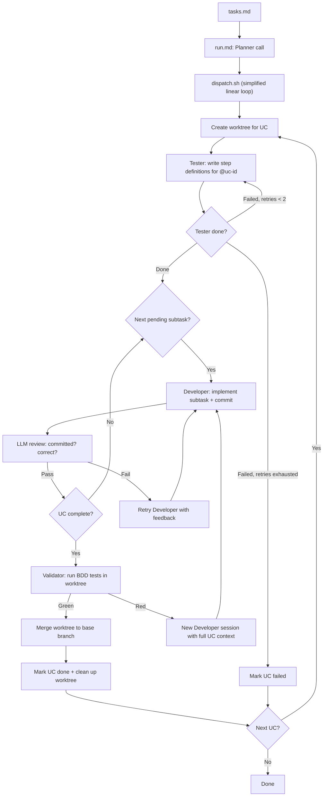

# Impact Analysis: Simplified Dispatch Pipeline (v3-2)

**Total files affected:** 21
**Estimated complexity:** High
**New packages:** None
**Packages to remove:** None

---

## What's Changing

The current v3 `/m:run` pipeline spreads each use case across four distinct AI calls (plan, bdd, task, validate), managed by a 764-line dispatch.sh with a UC-level phase state machine. This compounds failure probability with every phase and loses context between calls. The dispatcher cannot verify that work was done because intermediate phases produce no testable output.

The v3-2 redesign replaces this with three agents per UC, all working inside a single worktree:

1. **Tester** — writes BDD step definition bodies once per UC (fills the TODO stubs from `/m:stories` with real assertions), before any subtask begins
2. **Developer** — implements production code one subtask at a time, with a lightweight LLM review after each subtask
3. **Validator** — runs the BDD test suite after all subtasks are done; only on green does it merge the worktree to the base branch

The merge is the Validator's responsibility, not the Developer's. The base branch never receives untested code. The dispatcher is simplified to a linear orchestration loop with no phase state machine.

Additionally, the `/m:tasks` command must stop generating UC-000 "Shared Prerequisites" sections. Infrastructure tasks belong to the first UC that needs them, ensuring every UC in tasks.json has a corresponding feature file the dispatcher can validate against.

## Current Flow

## New Flow

## Not Affected (interactive workflow stays as-is)

All interactive commands, agents, and skills remain untouched. We are adding headless tools, not replacing the interactive workflow.

- **Commands:** `dev.md`, `fix.md`, `review.md`, `feature.md`, `spec.md`, `stories.md`, `debug.md`, `doc.md`, `commit.md`, `amend.md`, `copy.md`, `prompt.md`, `rebase.md`, `explain.md`, `research.md`, `refactor.md`, `test.md`, `bdd.md`
- **Agents:** `developer.md`, `tester.md`, `reviewer.md`, `committer.md`, `spec-writer.md`, `bdd-analyst.md`, `researcher.md`, `bdd-setup.md`
- **Skills:** `dev-workflow`, `copywriting`, `clipboard`, `git-committing`, `code-documentation`, `research-methods`

## Affected Files

### New files

| File | Purpose | Complexity |
|------|---------|------------|
| `molcajete/commands/run/build.md` | Headless Developer command. Implements one subtask inside UC worktree: reads task brief + feature file, writes production code, runs unit tests, commits. Developer agent only. | Medium |
| `molcajete/commands/run/test.md` | Headless Tester command. Writes step definition bodies for a UC: reads requirements, spec, feature files; fills TODO stubs with real assertions; commits. Tester agent only. | Medium |

### Run infrastructure (rewrite)

| File | What it does | What changes | Complexity |
|------|-------------|--------------|------------|
| `molcajete/commands/run.md` | Planner + launcher | Rewrite: drop phase field, add UC-level `done`/`feature_file`/`tag`; one Planner call, then launch dispatch.sh | Medium |
| `molcajete/scripts/dispatch.sh` | Core dispatcher (764 lines on v3) | Complete rewrite to simplified linear loop: per UC creates worktree, calls Tester once (with retry), calls Developer per subtask with LLM review, runs Validator (BDD tests), merges to base only after tests pass | High |
| `molcajete/scripts/status.sh` | Build status reporter | Remove phase counters; show UC `done` boolean + subtask status | Low |
| `molcajete/scripts/merge.sh` | Worktree merge utility | Keep as utility for post-validation merge; simplify (one merge per UC, not per subtask) | Low |
| `molcajete/scripts/Taskfile.yml` | Go Task runner config | Likely no changes; dispatch.sh interface stays the same | Low |

### Delete (v3 artifacts -- only exist on v3 branch, not master)

| File | Why |
|------|-----|
| `molcajete/commands/run/plan.md` | v3 Phase 1 -- replaced by inline Planner in run.md |
| `molcajete/commands/run/bdd.md` | v3 Phase 2 -- replaced by run/test.md |
| `molcajete/commands/run/task.md` | v3 Phase 3 -- replaced by run/build.md |
| `molcajete/commands/run/validate.md` | v3 Phase 4 -- replaced by inline Validator in dispatch.sh |
| `molcajete/commands/dev-run.md` | v3 monolithic headless -- replaced by run/build.md + run/test.md |

Note: starting from master means these don't exist, so no deletions needed.

### UC-000 ban (one command change)

| File | What changes | Complexity |
|------|--------------|------------|
| `molcajete/commands/tasks.md` | Remove UC-000 "Shared Prerequisites" pattern from Step 6 (lines 157-189) and Step 8 mention (line 200). Replace with: "absorb infrastructure into first UC" | Medium |

### Skills (additive only -- existing content untouched)

| File | What changes | Complexity |
|------|--------------|------------|
| `agent-coordination/SKILL.md` | ADD new chain entry in Common Chains table: `/m:run` uses `Tester -> Developer(xN) -> Validator`. Existing chains for `/m:dev`, `/m:fix`, etc. stay as-is. | Low |
| `project-management/SKILL.md` | ADD one rule: "No UC-000 sections. Infrastructure belongs to the first UC that needs it." Existing content untouched. | Low |
| `project-management/references/tasks-template.md` | Remove UC-000 example if present. | Low |

### Plugin registration

| File | What changes | Complexity |
|------|--------------|------------|
| `molcajete/.claude-plugin/plugin.json` | Add `run/build.md` and `run/test.md` (non-user-facing, used by dispatch). Remove `dev-run.md` if registered on master. | Low |

### Documentation

| File | What changes | Complexity |
|------|--------------|------------|
| `README.md` | Add/update "Coordinated Builds" section for v3-2 three-agent architecture | Medium |
| `prd/tech-stack.md` | Add v3-2 dispatcher description | Low |
| `prd/roadmap.md` | Update coordinated build entry | Low |

### Historical (do NOT modify or delete)

| File | Status |
|------|--------|
| `prd/specs/20260223-1600-bdd_scenario_generator/tasks.md` | Contains real UC-0KTg-000. Historical artifact. Will fail Planner validation post-v3-2 (requires re-planning). |
| `prd/specs/20260223-1600-bdd_scenario_generator/plans/changelog-UC-0KTg-000.md` | Changelog for completed UC-000 work. Historical record. |

## Three Agents in the Dispatch Loop

| Agent | Command | When | Scope | What it does |
|-------|---------|------|-------|-------------|
| **Tester** | `run/test.md` | Once per UC, before subtasks | `bdd/steps/` only | Writes step definition bodies from feature file stubs. Red phase -- tests should fail because no production code exists yet. |
| **Developer** | `run/build.md` | Once per subtask | Production code + unit tests | Implements production code for one subtask. Does NOT write step definitions, run BDD tests, or merge. |
| **Validator** | Inline Bash in dispatch.sh | Once per UC, after all subtasks | Read-only (runs tests) | Runs BDD tests inside worktree. On green: merges worktree to base. On red: starts new Developer session with full UC context for fix. |

## Suggested Order of Changes

1. **Branch setup** -- Create v3-2 branch from master. Copy research + spec docs from v3.
2. **New commands** -- Create `run/build.md` (Developer) and `run/test.md` (Tester). Lean headless commands, ~80-100 lines each.
3. **Dispatch rewrite** -- Rewrite `dispatch.sh` as simplified linear loop: per UC creates worktree, calls Tester once (with retry), calls Developer per subtask with LLM review, runs Validator, merges on green.
4. **Planner update** -- Rewrite `run.md` with v3-2 tasks.json schema. Update `status.sh`.
5. **UC-000 ban** -- Update `tasks.md` command. Add ban to `project-management/SKILL.md`. Clean tasks-template if needed.
6. **Additive skill updates** -- Add `/m:run` chain to `agent-coordination/SKILL.md`. Register new commands in `plugin.json`.
7. **Documentation** -- Update README, `tech-stack.md`, `roadmap.md`.

## Related Documents

| Document | Location |
|----------|----------|
| Research | [v3-2-redesign.md](../../../research/v3-2-redesign.md) |
| Requirements | [requirements.md](./requirements.md) |
| Spec | [spec.md](./spec.md) |
| Tasks | [tasks.md](./tasks.md) |

---

## Risks

| Risk | Impact | Mitigation |
|------|--------|------------|
| dispatch.sh rewrite breaks existing specs | Specs with completed tasks.json cannot be re-run | Test with both fresh and partially-completed tasks.json |
| UC-000 removal affects existing specs with cross-UC deps | Dependency resolution may fail for specs that need shared infrastructure | Verify absorption logic with real specs (bdd_scenario_generator) |
| `--json-schema` flag behavior undocumented on error | Dispatch loop may hang if schema validation fails silently | Test error cases explicitly; add `--max-turns` as fallback |
| Subtask LLM review adds cost per subtask | Budget per spec run increases | Keep review cheap ($0.10-0.50) with `--max-turns 5` and `--max-budget-usd 0.50` |
| Starting from master loses v3 improvements (merge lock, worktree reuse) | Some v3 fixes may be needed in v3-2 | Cherry-pick specific improvements if needed, not the entire branch |
