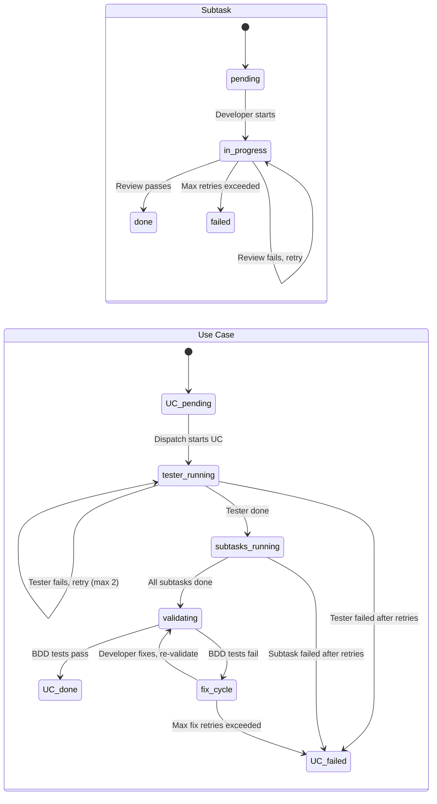
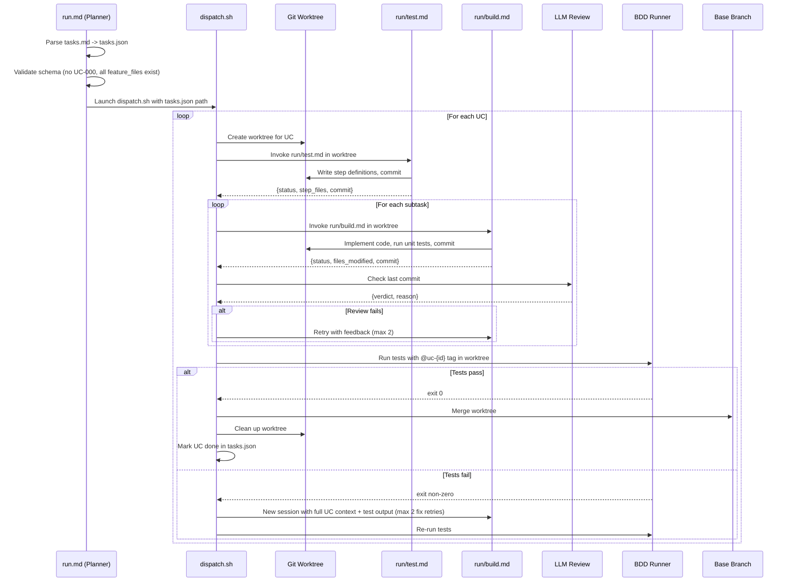
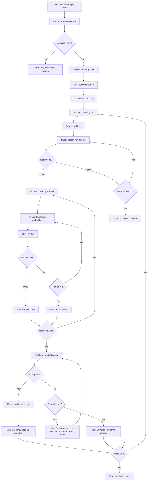
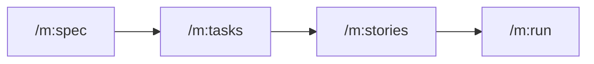

# Specification: Simplified Dispatch Pipeline (v3-2)

**Spec ID:** 20260316-1650-simplified_dispatch_pipeline
**Status:** Draft
**Created:** 2026-03-16
**Last Updated:** 2026-03-16

---

## 1. Overview

### 1.1 Feature Description

The current v3 `/m:run` pipeline spreads each use case across four distinct AI calls (plan, bdd, task, validate) managed by a 764-line `dispatch.sh` with a UC-level phase state machine. Each phase transition loses context, compounds failure probability, and produces untestable intermediate output. The dispatcher cannot independently verify that work was done because it trusts agent self-reports rather than test results.

The v3-2 redesign replaces this with a three-agent model operating inside a single worktree per UC. A **Tester** writes BDD step definition bodies before any production code exists (red phase). A **Developer** implements subtasks one at a time with a lightweight LLM review after each commit. A **Validator** runs the BDD test suite after all subtasks complete; only on green does it merge the worktree to the base branch. The dispatcher is simplified to a linear orchestration loop with no phase state machine.

Additionally, the `/m:tasks` command must stop producing UC-000 "Shared Prerequisites" sections. Infrastructure tasks are absorbed by the first UC that needs them, ensuring every UC in `tasks.json` has a corresponding BDD feature file the dispatcher can validate against.

For detailed requirements, see [requirements.md](./requirements.md).

### 1.2 Strategic Alignment

| Aspect | Alignment |
|--------|-----------|
| Mission | Core to Molcajete's value proposition: reliable agentic workflows that produce trustworthy output |
| Roadmap | "Coordinated Builds" is a Now priority; v3-2 replaces the broken v3 implementation |
| Success Metrics | Dispatch script size, AI calls per subtask, UC completion rate with passing tests |

### 1.3 User Value

| User Type | Value Delivered |
|-----------|-----------------|
| Plugin user (developer) | `/m:run` produces working code with passing BDD tests instead of stalling or producing unverified output |
| Plugin maintainer | Dispatcher is a simple linear loop instead of a 764-line phase state machine; three well-scoped agents instead of four overlapping phases |

### 1.4 Success Criteria

| Criterion | Target | Measurement |
|-----------|--------|-------------|
| Dispatch simplicity | Linear orchestration loop, no phase state machine | Code review |
| AI calls per subtask | 2 max (Developer + review) | Count calls in dispatch loop |
| UC validation | BDD tests pass for every completed UC | Test exit code = 0 |
| No untestable UCs | Every UC in tasks.json has a `feature_file` | Schema validation at Planner step |
| Spec completion rate | Higher than v3 (which produced 0% trusted output) | End-to-end test with a real spec |

---

## 2. Requirements Summary

### 2.1 Functional Requirements

| ID | Requirement | Priority |
|----|-------------|----------|
| FR-0Rz0-001 | Planner generates `tasks.json` with simplified schema: UC-level `done`, `feature_file`, `tag`; subtask-level `status`, `retries`, `commit`, `error` | Critical |
| FR-0Rz0-002 | Planner matches each UC to its BDD feature file by `@uc-{id}` tag | Critical |
| FR-0Rz0-003 | Planner rejects `tasks.md` files containing UC-000 sections | High |
| FR-0Rz0-004 | `tasks.json` uses flat subtask status (`pending`, `in_progress`, `done`, `failed`), no phase field | Critical |
| FR-0Rz0-005 | Dispatcher creates one worktree per UC | Critical |
| FR-0Rz0-006 | Dispatcher orchestrates three agents per UC: Tester (once) -> Developer (per subtask) -> Validator (once) | Critical |
| FR-0Rz0-007 | Dispatcher updates `tasks.json` after each subtask and UC validation | Critical |
| FR-0Rz0-008 | Dispatcher cleans up worktree after merge; preserves on failure | Medium |
| FR-0Rz0-009 | Rate limit handling with exponential backoff (30s base, max 2 retries) | Medium |
| FR-0Rz0-010 | `dispatch.sh` is a simplified linear orchestration loop with no phase state machine | High |
| FR-0Rz0-011 | Tester invoked once per UC before any subtask begins | Critical |
| FR-0Rz0-012 | Tester reads requirements, spec, tasks.md, and feature files tagged `@uc-{id}` | Critical |
| FR-0Rz0-013 | Tester fills TODO stubs in step definitions with real assertions | Critical |
| FR-0Rz0-014 | Tester commits step definitions inside UC worktree | High |
| FR-0Rz0-015 | Tester returns structured JSON: `{status, step_files, scenarios_count, commit}` | High |
| FR-0Rz0-016 | Tester uses `--max-turns 30` and `--max-budget-usd 3.00` | High |
| FR-0Rz0-038 | Tester retried up to 2 times on failure before marking UC as failed | High |
| FR-0Rz0-039 | If `tasks.json` already exists, Planner detects it and offers to resume (skip done UCs, restart failed ones) | High |
| FR-0Rz0-040 | Planner validates that `bdd/steps/` exists and contains step files before launching dispatch | High |
| FR-0Rz0-017 | Developer invoked once per subtask after Tester completes | Critical |
| FR-0Rz0-018 | Developer reads task brief, feature file, and existing step definitions | Critical |
| FR-0Rz0-019 | Developer implements production code and runs unit tests | Critical |
| FR-0Rz0-020 | Developer commits in worktree; does NOT merge, run BDD tests, or write step definitions | Critical |
| FR-0Rz0-021 | Developer returns structured JSON: `{status, files_modified, commit, error}` | Critical |
| FR-0Rz0-022 | Developer uses `--name "$TASK_ID"` and `--resume` for retry cycles | High |
| FR-0Rz0-023 | Developer uses `--max-turns 30` and `--max-budget-usd 3.00` | High |
| FR-0Rz0-024 | Lightweight LLM review after each Developer commit (max 5 turns, $0.50) | High |
| FR-0Rz0-025 | Developer retried with review feedback on failure (max 2 retries) | High |
| FR-0Rz0-026 | Validator runs BDD tests with `--tags=@uc-{id}` after all subtasks done | Critical |
| FR-0Rz0-027 | Validator uses test exit code as done signal | Critical |
| FR-0Rz0-028 | Validator merges worktree only after BDD tests pass | Critical |
| FR-0Rz0-029 | On BDD failure, new Developer session started with full UC context and test output (max 2 retries); base branch untouched | High |
| FR-0Rz0-038 | Tester retried up to 2 times on failure before marking UC as failed | High |
| FR-0Rz0-039 | If `tasks.json` already exists, Planner detects it and offers to resume | High |
| FR-0Rz0-040 | Planner validates that `bdd/steps/` exists and contains step files before dispatch | High |
| FR-0Rz0-030 | `/m:tasks` removes UC-000 extraction logic; replaces with "absorb into first UC" rule | Critical |
| FR-0Rz0-031 | Cross-UC dependencies resolved by reordering, not shared prerequisites | High |
| FR-0Rz0-032 | project-management skill bans UC-000 pattern | High |
| FR-0Rz0-033 | `status.sh` shows UC `done` boolean and subtask status; no phase counters | Medium |
| FR-0Rz0-034 | `agent-coordination/SKILL.md` documents Tester -> Developer x N -> Validator chain | Medium |
| FR-0Rz0-035 | README Coordinated Builds section rewritten for v3-2 | Medium |
| FR-0Rz0-036 | `plugin.json` updated: add `run/build.md` and `run/test.md` | Medium |
| FR-0Rz0-037 | `tech-stack.md` updated for v3-2 dispatcher model | Low |

### 2.2 Non-Functional Requirements

| ID | Requirement | Target |
|----|-------------|--------|
| NFR-0Rz0-001 | Developer call timeout | 897 seconds per subtask (existing MOLCAJETE_TASK_TIMEOUT) |
| NFR-0Rz0-002 | LLM review latency | Under 30 seconds; max 5 turns |
| NFR-0Rz0-003 | Total cost per subtask | Under $4.00 (Developer $3.00 + review $0.50 + buffer) |
| NFR-0Rz0-004 | dispatch.sh maintainability | Simplified linear loop; no nested state machines |
| NFR-0Rz0-005 | BDD gate latency | Under 60 seconds for a typical UC test suite |

### 2.3 Constraints

| Constraint | Description |
|------------|-------------|
| CLI interface | Must use `claude -p` with `--output-format json`, `--json-schema`, `--name`, `--resume` flags |
| BDD runner detection | Runner determined by target project's `bdd/CLAUDE.md` (behave, cucumber-js, godog) |
| No parallel UCs | MVP dispatches UCs sequentially; parallel UC dispatch is a future optimization |
| No Agent SDK | Keep raw `claude -p` for simplicity; SDK migration is out of scope |
| Master branch start | v3-2 starts from master, not from v3 branch; v3 phase commands don't exist on master |

### 2.4 Out of Scope

| Feature | Rationale |
|---------|-----------|
| Agent Teams integration | Too experimental and expensive (3-5x cost) |
| Claude Agent SDK migration | Added complexity with no proven benefit for shell orchestration |
| Parallel UC dispatch | Sequential is simpler and sufficient for MVP |
| Changes to `/m:dev` or `/m:fix` | Interactive workflow stays as-is; only headless pipeline changes |
| Full code review in LLM review step | MVP review checks correctness only; structured findings are future work |

---

## 3. Data Models

The dispatch pipeline uses `tasks.json` as its primary data structure. This file is generated by the Planner from `tasks.md` and updated by the dispatcher throughout execution.

### 3.1 tasks.json Schema

```json
{
  "spec_folder": "prd/specs/20260316-1650-simplified_dispatch_pipeline",
  "base_branch": "main",
  "created_at": "2026-03-16T17:00:00Z",
  "use_cases": [
    {
      "id": "UC-0Rz0-001",
      "title": "Simplified Planner",
      "tag": "uc-0Rz0-001",
      "feature_file": "bdd/features/planner/simplified_planner.feature",
      "done": false,
      "worktree": null,
      "tester": {
        "status": "pending",
        "retries": 0,
        "commit": null,
        "step_files": [],
        "scenarios_count": 0,
        "error": null
      },
      "subtasks": [
        {
          "id": "1.1",
          "title": "Parse tasks.md into tasks.json",
          "status": "pending",
          "retries": 0,
          "commit": null,
          "review": null,
          "error": null
        }
      ]
    }
  ]
}
```

### 3.2 Field Descriptions

#### Use Case Fields

| Field | Type | Description |
|-------|------|-------------|
| `id` | string | Use case ID in `UC-{tag}-NNN` format |
| `title` | string | Human-readable use case title |
| `tag` | string | BDD tag for filtering tests: `uc-{tag}-{nnn}` (prefix `uc-` is lowercase; Base-62 tag preserves case) |
| `feature_file` | string | Relative path to the BDD feature file for this UC |
| `done` | boolean | `true` only after Validator confirms BDD tests pass and worktree is merged |
| `worktree` | string or null | Path to the UC's git worktree; null before creation and after cleanup |
| `tester` | object | Tester agent status (see below) |
| `subtasks` | array | Ordered list of subtask objects |

#### Tester Fields

| Field | Type | Description |
|-------|------|-------------|
| `status` | enum | `pending`, `in_progress`, `done`, `failed` |
| `retries` | int | Number of retry attempts (max 2) |
| `commit` | string or null | Git commit SHA of Tester's step definition commit |
| `step_files` | array of string | Relative paths to step definition files written by Tester |
| `scenarios_count` | int | Number of BDD scenarios the Tester processed |
| `error` | string or null | Error message from last failure, if any |

#### Subtask Fields

| Field | Type | Description |
|-------|------|-------------|
| `id` | string | Subtask ID in `N.M` dot notation |
| `title` | string | Human-readable subtask title from tasks.md |
| `status` | enum | `pending`, `in_progress`, `done`, `failed` |
| `retries` | int | Number of retry attempts (max 2) |
| `commit` | string or null | Git commit SHA of Developer's work |
| `review` | enum or null | `pass`, `fail`, or null if not yet reviewed |
| `error` | string or null | Error message from last failure, if any |

### 3.3 Schema Validation

The Planner validates the generated `tasks.json` against these invariants before dispatch begins:

| Rule | Error Message |
|------|---------------|
| Every UC has a non-empty `feature_file` | `"UC {id} has no feature_file — every UC must map to a BDD feature"` |
| Every `feature_file` path exists on disk | `"Feature file {path} not found for UC {id}"` |
| No UC has id matching `*-000` | `"UC-000 not allowed — absorb infrastructure into first UC"` |
| At least one UC exists | `"tasks.json has no use cases"` |
| Every subtask has a unique `id` within its UC | `"Duplicate subtask id {id} in UC {uc_id}"` |
| All `status` fields are `pending` at creation | `"Subtask {id} has non-pending initial status"` |
| `bdd/steps/` exists and contains step files | `"Step files required — run /m:stories first"` |

### 3.4 State Transitions



---

## 4. CLI Contracts

The dispatch pipeline interacts with the Claude CLI (`claude -p`) for three agent types. Each agent is a Markdown command file invoked via `claude -p` with specific flags.

### 4.1 Tester Agent (`run/test.md`)

**Invocation:**

```bash
claude -p \
  --model claude-opus-4-6 \
  --allowedTools "Read,Write,Edit,Glob,Grep,Bash,Agent" \
  --max-turns 30 \
  --max-budget-usd 3.00 \
  --output-format json \
  --json-schema "$TESTER_SCHEMA" \
  --dangerously-skip-permissions \
  "/m:run:test $SPEC_FOLDER $UC_ID"
```

**Input context (via prompt):**

| Input | Source | Purpose |
|-------|--------|---------|
| `requirements.md` | Spec folder | UC acceptance criteria |
| `spec.md` | Spec folder | Technical context |
| `tasks.md` | Spec folder | Subtask descriptions |
| `*.feature` | `bdd/features/` filtered by `@uc-{id}` | Gherkin scenarios |
| `*_steps.*` | `bdd/steps/` | Step stubs with TODO bodies |

**Output JSON schema:**

```json
{
  "type": "object",
  "properties": {
    "status": { "type": "string", "enum": ["done", "failed"] },
    "step_files": {
      "type": "array",
      "items": { "type": "string" }
    },
    "scenarios_count": { "type": "integer" },
    "commit": { "type": ["string", "null"] },
    "error": { "type": ["string", "null"] }
  },
  "required": ["status", "step_files", "scenarios_count", "commit"]
}
```

**Behavioral contract:**
- Reads feature files tagged `@uc-{id}` and step stubs from `bdd/steps/`
- Fills TODO bodies with real assertions (database checks, API response validation, state assertions)
- Does NOT write production code or run BDD tests
- Commits step definitions inside the UC worktree
- This is the red phase: tests should fail because no production code exists yet

### 4.2 Developer Agent (`run/build.md`)

**Invocation:**

```bash
claude -p \
  --model claude-opus-4-6 \
  --allowedTools "Read,Write,Edit,Glob,Grep,Bash,Agent" \
  --max-turns 30 \
  --max-budget-usd 3.00 \
  --output-format json \
  --json-schema "$DEVELOPER_SCHEMA" \
  --name "$TASK_ID" \
  --dangerously-skip-permissions \
  "/m:run:build $SPEC_FOLDER $UC_ID $SUBTASK_ID"
```

**Retry invocation (with resume):**

```bash
claude -p \
  --resume "$SESSION_ID" \
  --max-turns 30 \
  --max-budget-usd 3.00 \
  --output-format json \
  --json-schema "$DEVELOPER_SCHEMA" \
  --dangerously-skip-permissions \
  "Review feedback: $REVIEW_FEEDBACK. Fix the issues and recommit."
```

**Input context (via prompt):**

| Input | Source | Purpose |
|-------|--------|---------|
| Task brief | Extracted from `tasks.md` for the specific subtask | What to implement |
| `*.feature` | `bdd/features/` filtered by `@uc-{id}` | Acceptance criteria context |
| Step definitions | `bdd/steps/` (written by Tester) | Test expectations to satisfy |
| Previous subtask commits | Git log in worktree | Context from earlier subtasks |

**Output JSON schema:**

```json
{
  "type": "object",
  "properties": {
    "status": { "type": "string", "enum": ["done", "failed"] },
    "files_modified": {
      "type": "array",
      "items": { "type": "string" }
    },
    "commit": { "type": ["string", "null"] },
    "error": { "type": ["string", "null"] }
  },
  "required": ["status", "files_modified", "commit"]
}
```

**Behavioral contract:**
- Implements production code for exactly one subtask
- Runs unit tests relevant to the subtask
- Commits all changes inside the UC worktree
- Does NOT write step definitions, run BDD tests, or merge to base branch
- Returns commit SHA for tracking

### 4.3 LLM Review (inline in dispatch.sh)

**Invocation:**

```bash
claude -p \
  --model claude-sonnet-4-6 \
  --max-turns 5 \
  --max-budget-usd 0.50 \
  --output-format json \
  --json-schema "$REVIEW_SCHEMA" \
  --dangerously-skip-permissions \
  "Review the last commit in $(pwd). Check: (1) files were committed, (2) changes match task '$SUBTASK_TITLE', (3) no obvious errors. Return pass or fail with reason."
```

**Output JSON schema:**

```json
{
  "type": "object",
  "properties": {
    "verdict": { "type": "string", "enum": ["pass", "fail"] },
    "reason": { "type": "string" }
  },
  "required": ["verdict", "reason"]
}
```

**Behavioral contract:**
- Lightweight correctness check, not a full code review
- Uses cheaper model (Sonnet) to keep costs low
- Checks: work was committed, files look relevant to the task, no obvious errors
- Returns structured verdict that dispatch loop uses to decide retry

### 4.4 Validator (inline Bash in dispatch.sh)

**Invocation:**

```bash
cd "$WORKTREE_PATH"
# BDD runner command determined by target project's bdd/CLAUDE.md
# Examples:
#   behave --tags=@uc-0Rz0-001 --no-capture bdd/features/
#   npx cucumber-js --tags @uc-0Rz0-001
#   godog --tags=@uc-0Rz0-001 bdd/features/
$BDD_COMMAND --tags="@$UC_TAG"
UC_EXIT_CODE=$?
```

**Behavioral contract:**
- Runs BDD tests inside the UC worktree, filtered by UC tag
- Test exit code is the sole determinant of UC success
- On exit code 0: merge worktree to base branch, mark UC done
- On non-zero: start a new Developer session with full UC context (all subtask briefs, test failure output, full diff) for fix attempt (max 2 retries)
- Base branch never receives code that failed BDD validation

### 4.5 Dispatch Sequence



---

## 5. Command Specifications

This section defines the Markdown command files that the dispatch pipeline uses. Each command is a `.md` file with YAML frontmatter.

### 5.1 Components

| Command | Type | Location | Purpose |
|---------|------|----------|---------|
| `run.md` | User-facing command | `molcajete/commands/run.md` | Planner: parses tasks.md -> tasks.json, validates, launches dispatch |
| `run/build.md` | Headless command | `molcajete/commands/run/build.md` | Developer agent: implements one subtask inside UC worktree |
| `run/test.md` | Headless command | `molcajete/commands/run/test.md` | Tester agent: writes step definition bodies for one UC |
| `dispatch.sh` | Shell script | `molcajete/scripts/dispatch.sh` | Core dispatch loop: worktree management, agent orchestration, validation |
| `status.sh` | Shell script | `molcajete/scripts/status.sh` | Status reporter: reads tasks.json and displays progress |
| `merge.sh` | Shell script | `molcajete/scripts/merge.sh` | Worktree merge utility: merges validated UC worktree to base branch |

### 5.2 Command Frontmatter

#### run.md (Planner)

```yaml
---
description: "Run a spec end-to-end: plan, build, test, validate"
model: claude-opus-4-6
allowed-tools:
  - Read
  - Write
  - Glob
  - Grep
  - Bash
  - Agent
  - AskUserQuestion
argument-hint: "<spec-folder>"
---
```

#### run/build.md (Developer)

```yaml
---
description: "[headless] Implement one subtask inside UC worktree"
model: claude-opus-4-6
allowed-tools:
  - Read
  - Write
  - Edit
  - Glob
  - Grep
  - Bash
  - Agent
---
```

#### run/test.md (Tester)

```yaml
---
description: "[headless] Write BDD step definition bodies for one UC"
model: claude-opus-4-6
allowed-tools:
  - Read
  - Write
  - Edit
  - Glob
  - Grep
  - Bash
  - Agent
---
```

### 5.3 Dispatch Flow



---

## 6. Integration Points

### 6.1 External Systems

| System | Purpose | Integration Method |
|--------|---------|-------------------|
| `claude -p` CLI | Agent invocation for Tester, Developer, and Review | Shell subprocess with `--output-format json`, `--json-schema` |
| BDD test runner | UC validation gate | Shell subprocess; runner detected from `bdd/CLAUDE.md` |
| Git | Worktree creation, commit tracking, merge | Shell commands via `git worktree add/remove`, `git merge` |
| Go Task (`task`) | Top-level orchestration | `Taskfile.yml` launches `dispatch.sh` and `status.sh` |

### 6.2 Internal Dependencies

| Component | Dependency | Purpose |
|-----------|-----------|---------|
| `dispatch.sh` | `run/build.md` | Developer agent command file |
| `dispatch.sh` | `run/test.md` | Tester agent command file |
| `dispatch.sh` | `merge.sh` | Post-validation worktree merge |
| `dispatch.sh` | `jq` | JSON parsing and mutation of `tasks.json` |
| `run.md` | `tasks.md` | Input for Planner to generate `tasks.json` |
| `run.md` | `bdd/features/` | Planner validates feature file existence per UC |
| Tester | `bdd/steps/*` | Step stub files with TODO bodies from `/m:stories` |
| Validator | `bdd/CLAUDE.md` | Determines which BDD runner to use |

### 6.3 Configuration

| Setting | Value | Purpose |
|---------|-------|---------|
| `MOLCAJETE_TASK_TIMEOUT` | 897 seconds | Maximum wall-clock time per Developer call |
| `--max-turns` (Tester) | 30 | Safety bound on Tester conversation length |
| `--max-turns` (Developer) | 30 | Safety bound on Developer conversation length |
| `--max-turns` (Review) | 5 | Keep review fast and cheap |
| `--max-budget-usd` (Tester) | 3.00 | Cost cap per Tester invocation |
| `--max-budget-usd` (Developer) | 3.00 | Cost cap per Developer invocation |
| `--max-budget-usd` (Review) | 0.50 | Cost cap per review invocation |
| Backoff base (rate limit) | 30 seconds | Exponential backoff on 429 responses |
| Max retries (subtask) | 2 | Developer retry limit per subtask |
| Max retries (BDD fix) | 2 | Developer fix retry limit after BDD failure |

### 6.4 Prerequisite Commands

The dispatch pipeline requires outputs from earlier commands in the Molcajete lifecycle:



| Prerequisite | Output | Required By |
|-------------|--------|-------------|
| `/m:spec` | `spec.md` | `/m:tasks` (generates tasks from spec) |
| `/m:tasks` | `tasks.md` | `/m:run` Planner (parses into tasks.json) |
| `/m:stories` | `bdd/features/*.feature`, `bdd/steps/*_steps.*` | `/m:run` Tester (fills step stubs), Validator (runs tests) |

---

## 7. Acceptance Criteria

### UC-0Rz0-001: Simplified Planner

- [ ] Planner reads `tasks.md` and produces `tasks.json` with the schema defined in Section 3.1
- [ ] Every UC in `tasks.json` has a non-null `feature_file` that exists on disk
- [ ] Every UC has a `tag` field matching the lowercase BDD tag format (`uc-{tag}-{nnn}`)
- [ ] `tasks.json` contains no UC with id matching `*-000`
- [ ] All subtask `status` fields are initialized to `pending`
- [ ] Planner rejects `tasks.md` containing UC-000 with a clear error message
- [ ] Planner validates that `bdd/steps/` exists and contains step files before launching dispatch
- [ ] If `tasks.json` already exists, Planner detects it and offers to resume (skip done UCs, restart failed ones)
- [ ] Planner displays a summary table of UCs and subtask counts before dispatch

### UC-0Rz0-002: Three-Agent Dispatch Loop

- [ ] Dispatcher creates one git worktree per UC before agent invocation
- [ ] Tester is invoked exactly once per UC, before any subtask begins
- [ ] Tester writes step definition bodies (fills TODO stubs) and commits inside worktree
- [ ] Developer is invoked once per subtask, in dependency order
- [ ] Developer commits production code inside worktree; does NOT merge or write step definitions
- [ ] LLM review runs after each Developer commit; subtask retried on review failure (max 2)
- [ ] BDD tests run inside worktree after all subtasks complete, filtered by `@uc-{id}` tag
- [ ] Base branch receives code only after BDD tests pass (merge is Validator's responsibility)
- [ ] On BDD failure, a new Developer session is started with full UC context and test output for fix (max 2 retries)
- [ ] Tester is retried up to 2 times on failure before marking UC as failed
- [ ] Worktree cleaned up after successful merge; preserved on failure for inspection
- [ ] `tasks.json` updated after each subtask completion and each UC validation
- [ ] Rate limits handled with exponential backoff (30s base, max 2 retries)

### UC-0Rz0-003: Task Planning Without UC-000

- [ ] `/m:tasks` generates `tasks.md` with no `UC-{tag}-000` section
- [ ] Infrastructure tasks (command skeleton, shared migrations, argument router) appear as subtasks of the first UC
- [ ] Cross-UC dependencies point backward only (UC-002 depends on UC-001, never forward)
- [ ] Every UC in the generated `tasks.md` corresponds to testable user-facing behavior

### UC-0Rz0-004: Status Reporting and Documentation

- [ ] `status.sh` reads `tasks.json` and displays UC-level `done` status and subtask-level status
- [ ] `status.sh` does not reference phases or phase counters
- [ ] `agent-coordination/SKILL.md` documents the Tester -> Developer x N -> Validator chain for `/m:run`
- [ ] README Coordinated Builds section describes v3-2 architecture
- [ ] `plugin.json` registers `run/build.md` and `run/test.md`
- [ ] `tech-stack.md` describes the three-agent dispatch model

### Edge Cases

| Scenario | Expected Behavior |
|----------|-------------------|
| `tasks.md` contains UC-000 | Planner rejects with error: "UC-000 not allowed — absorb infrastructure into first UC" |
| Feature file missing for a UC | Planner validation fails; UC not dispatched |
| Developer times out (>897s) | Subtask marked `failed`; retried up to 2 times |
| BDD tests fail after all subtasks done | New Developer session started with full UC context and test output; max 2 fix retries before UC marked failed |
| Rate limit (429) during agent call | Exponential backoff (30s, 60s); max 2 retries |
| All subtasks done but UC has no feature file | Should never happen (Planner validation prevents this) |
| Worktree merge conflict | Merge fails; UC marked failed; worktree preserved for manual resolution |
| `jq` not installed | `dispatch.sh` exits with error: "jq required but not found" |
| Tester fails to write step definitions | Retried up to 2 times; UC marked failed after retries exhausted; subtasks never start; worktree preserved |
| `bdd/steps/` missing or empty | Planner rejects with error: "Step files required — run /m:stories first" |
| `tasks.json` already exists from prior run | Planner offers to resume: skip done UCs, restart failed ones |
| LLM review returns malformed JSON | Treat as review failure; retry Developer |

### Performance Criteria

| Metric | Target |
|--------|--------|
| Dispatch overhead per subtask | Under 5 seconds (excluding agent call time) |
| `tasks.json` schema parsing | Under 1 second for 20+ subtasks |
| Status report generation | Under 2 seconds |
| Worktree creation | Under 5 seconds |
| Worktree merge | Under 10 seconds |

### Security Criteria

| Requirement | Implementation |
|-------------|----------------|
| Bounded agent execution | `--max-turns` and `--max-budget-usd` on every agent call |
| No remote push from agents | Developer commits locally only; user pushes after review |
| Permission skip compensation | `--dangerously-skip-permissions` compensated by turn/budget limits |
| Worktree isolation | Each UC operates in its own worktree; agents cannot affect base branch directly |

---

## 8. Verification

### Unit Tests

| Test | Validates |
|------|-----------|
| Planner parses minimal `tasks.md` into valid `tasks.json` | FR-0Rz0-001, FR-0Rz0-004 |
| Planner rejects `tasks.md` with UC-000 section | FR-0Rz0-003 |
| Planner maps UC tags to feature files via `@uc-{id}` | FR-0Rz0-002 |
| Planner fails when feature file path doesn't exist | Schema validation rule |
| `tasks.json` schema has correct initial state (all `pending`) | FR-0Rz0-004 |
| `jq` mutations correctly update subtask status | FR-0Rz0-007 |
| `jq` mutations correctly update UC `done` field | FR-0Rz0-007 |
| Status script reads `done` boolean, not phase counters | FR-0Rz0-033 |

### Integration Tests

| Test | Validates |
|------|-----------|
| Worktree created and destroyed cleanly for a single UC | FR-0Rz0-005, FR-0Rz0-008 |
| Tester output JSON matches expected schema | FR-0Rz0-015 |
| Developer output JSON matches expected schema | FR-0Rz0-021 |
| Review output JSON matches expected schema | FR-0Rz0-024 |
| Dispatch loop advances subtask from `pending` to `done` | FR-0Rz0-006, FR-0Rz0-007 |
| Failed review triggers Developer retry | FR-0Rz0-025 |
| BDD pass triggers worktree merge | FR-0Rz0-028 |
| BDD failure triggers new Developer session with full UC context | FR-0Rz0-029 |
| Tester failure triggers retry (max 2) before UC marked failed | FR-0Rz0-038 |
| Planner detects existing tasks.json and offers resume | FR-0Rz0-039 |
| Planner rejects when bdd/steps/ is missing | FR-0Rz0-040 |
| Rate limit triggers exponential backoff | FR-0Rz0-009 |

### E2E Tests

| Test | Validates |
|------|-----------|
| Full dispatch of a 1-UC, 2-subtask spec produces passing BDD tests and merged code | UC-0Rz0-001, UC-0Rz0-002 |
| Full dispatch of a 3-UC spec completes all UCs in order | UC-0Rz0-002 (sequential dispatch) |
| `/m:tasks` generates tasks.md without UC-000 for a real spec | UC-0Rz0-003 |
| `status.sh` displays correct progress during and after dispatch | UC-0Rz0-004 |
| Failed BDD test triggers fix cycle and eventual pass | FR-0Rz0-029 |

---

## 9. Implementation Checklist

### New Commands

- [ ] Create `molcajete/commands/run/build.md` — Developer agent command
- [ ] Create `molcajete/commands/run/test.md` — Tester agent command

### Run Infrastructure (Rewrite)

- [ ] Rewrite `molcajete/commands/run.md` — Planner with v3-2 tasks.json schema
- [ ] Rewrite `molcajete/scripts/dispatch.sh` — Simplified three-agent dispatch loop
- [ ] Update `molcajete/scripts/status.sh` — UC `done` boolean, no phase counters
- [ ] Update `molcajete/scripts/merge.sh` — Simplify for one merge per UC

### UC-000 Ban

- [ ] Update `molcajete/commands/tasks.md` — Remove UC-000 extraction logic, replace with "absorb into first UC" rule
- [ ] Update `molcajete/skills/project-management/SKILL.md` — Add UC-000 ban rule
- [ ] Update `molcajete/skills/project-management/references/tasks-template.md` — Remove UC-000 example if present

### Skills (Additive)

- [ ] Update `molcajete/skills/agent-coordination/SKILL.md` — Add Tester -> Developer x N -> Validator chain

### Plugin Registration

- [ ] Update `molcajete/.claude-plugin/plugin.json` — Register `run/build.md` and `run/test.md`

### Documentation

- [ ] Update `README.md` — Coordinated Builds section for v3-2
- [ ] Update `prd/tech-stack.md` — v3-2 dispatcher model description
- [ ] Update `prd/roadmap.md` — Coordinated build entry status

---

## Appendix

### Related Documents

| Document | Location |
|----------|----------|
| Requirements | [requirements.md](./requirements.md) |
| Impact Analysis | [impact.md](./impact.md) |
| Tasks | [tasks.md](./tasks.md) |
| Research | [v3-2-redesign.md](../../../research/v3-2-redesign.md) |

### Open Questions

| # | Question | Status | Answer |
|---|----------|--------|--------|
| 1 | Should the Planner reject `tasks.md` with UC-000, or silently absorb it into UC-001? | Closed | Reject with clear error message. Simpler implementation; pushes the fix to `/m:tasks` where it belongs. |
| 2 | What happens when a UC has no matching feature file in `bdd/features/`? | Closed | Planner validation rejects it. Every UC must have a feature file. |
| 3 | Should the Developer prompt include the full `spec.md` or just the task brief? | Closed | File reference, not pasted content. Developer reads files directly. |
| 4 | Is `--json-schema` reliable enough to replace text parsing, or do we need a fallback? | Open | Must be tested before building dispatch.sh. Test: call `claude -p --json-schema` with prompts that hit budget/turn limits to verify output format on error paths. If unreliable, add a text-parsing fallback. |

### Glossary

| Term | Definition |
|------|------------|
| Base branch | The branch from which UC worktrees are created and to which validated code is merged |
| BDD gate | The Validator step that runs BDD tests as a pass/fail gate before merge |
| Dispatch loop | The main loop in `dispatch.sh` that iterates over UCs and their subtasks |
| Fix cycle | When BDD tests fail, the Developer is resumed to fix issues before re-validation |
| Phase (v3) | Legacy concept from v3 architecture; each UC went through 4 phases. Eliminated in v3-2 |
| Red phase | The state after Tester writes step definitions but before Developer writes production code; tests should fail |
| Tester | Agent that writes BDD step definition bodies (fills TODO stubs with real assertions) |
| UC-000 | Legacy pattern for "Shared Prerequisites" use case; banned in v3-2 |
| Worktree | Git worktree providing isolated working directory for a UC's agents |
