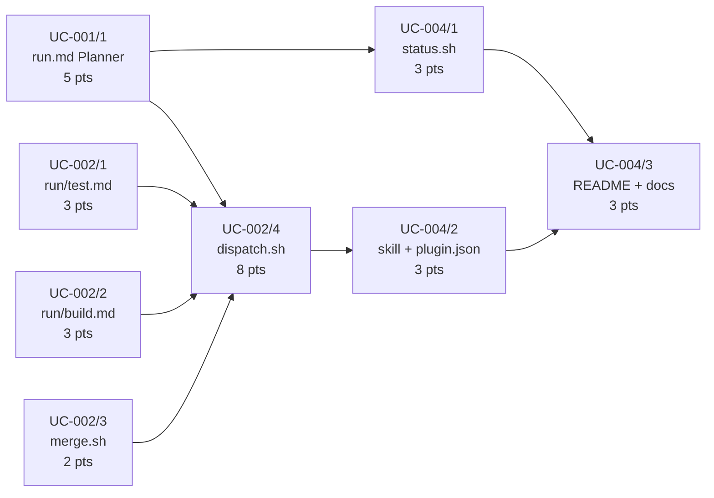

# Tasks: Simplified Dispatch Pipeline (v3-2)

**Spec:** [20260316-1650-simplified_dispatch_pipeline](./spec.md)
**Created:** 2026-03-16

---

## Overview

Replace the v3 four-phase UC dispatch pipeline with a three-agent model (Tester -> Developer x N -> Validator) operating inside a single git worktree per UC. The dispatcher is simplified from a 764-line phase state machine to a linear orchestration loop. The base branch never receives untested code — only UCs that pass BDD validation are merged. Additionally, the `/m:tasks` command stops generating UC-000 "Shared Prerequisites" sections; infrastructure is absorbed by the first UC that needs it.

**Strategic Alignment:** Core to Molcajete's value proposition — reliable agentic workflows that produce trustworthy, validated output. "Coordinated Builds" is a Now priority on the roadmap.

**Success Criteria:**

| Criterion | Target |
|-----------|--------|
| Dispatch simplicity | Linear orchestration loop, no phase state machine |
| AI calls per subtask | 2 max (Developer + review) |
| UC validation | BDD tests pass for every completed UC |
| No untestable UCs | Every UC in tasks.json has a feature_file |
| Spec completion rate | Higher than v3 (which produced 0% trusted output) |

**Estimated Total Effort:** 35 story points

**Key Risks:**

| Risk | Impact | Mitigation |
|------|--------|------------|
| dispatch.sh rewrite introduces new bugs | Specs fail to complete | Test with 1-UC and 3-UC specs before merging |
| `--json-schema` unreliable on error | Dispatch loop hangs on malformed output | Add `--max-turns` fallback; test error cases explicitly |
| UC-000 removal breaks specs with cross-UC deps | Dependency resolution fails | Verify absorption logic with real specs |

---

## [ ] UC-0Rz0-001. Simplified Planner (parse tasks.md into validated tasks.json)

Create the `run.md` command that serves as the entry point for `/m:run`. The Planner reads `tasks.md`, generates `tasks.json` with the v3-2 schema (UC-level `done`/`feature_file`, subtask-level `status`/`retries`/`commit`/`error`), validates all invariants, and launches `dispatch.sh`.

- [x] 1. Create run.md Planner command
  - Complexity: 5
  - Dependencies: None
  - Acceptance: `run.md` parses `tasks.md` into `tasks.json` matching the schema in spec Section 3.1, validates all invariants (feature_files exist on disk, unique subtask IDs, all statuses pending, at least one UC, `bdd/steps/` exists with step files), if `tasks.json` already exists offers to resume (skip done UCs, restart failed ones), displays a summary table of UCs and subtask counts, and launches `dispatch.sh`
  - Files: `molcajete/commands/run.md` (new)
  - Implements: FR-0Rz0-001, FR-0Rz0-002, FR-0Rz0-003, FR-0Rz0-004, FR-0Rz0-039, FR-0Rz0-040
  - Completed: 2026-03-16
  - Notes: Created run.md as a single focused prompt (no sub-agents per research). 9-step workflow: resolve spec folder, resume flow for existing tasks.json, parse tasks.md, match feature files via Grep, validate 7 invariants, write tasks.json, summary table, confirm launch, launch dispatch.sh (with graceful fallback if dispatch.sh not yet created). Fixed spec tag description inconsistency (Base-62 case preservation).

---

## [ ] UC-0Rz0-002. Three-Agent Dispatch Loop (worktree-per-UC orchestration)

Build the dispatch pipeline: two headless agent commands (Tester and Developer), a merge utility, and the core dispatch script that orchestrates them per UC inside isolated git worktrees.

- [x] 1. Create run/test.md Tester command
  - Complexity: 3
  - Dependencies: None
  - Acceptance: Headless command with correct YAML frontmatter (`claude-opus-4-6`, allowed tools, `[headless]` description); prompt reads requirements, spec, tasks.md, and feature files filtered by `@{UC_ID}` tag; replaces `NotImplementedError` stubs in `bdd/steps/` with real assertions; commits inside worktree; returns structured JSON `{status, step_files, scenarios_count, commit, error}`
  - Files: `molcajete/commands/run/test.md` (new)
  - Implements: FR-0Rz0-011, FR-0Rz0-012, FR-0Rz0-013, FR-0Rz0-014, FR-0Rz0-015, FR-0Rz0-016, FR-0Rz0-038
  - Completed: 2026-03-16
  - Notes: Created headless Tester command with 6-step workflow: parse arguments, load context (spec + requirements + gherkin skill), find feature files by @{UC_ID} + step definitions with NotImplementedError, replace stubs with real assertions, commit in worktree, return structured JSON. Red phase — tests should fail because no production code exists yet. Created `molcajete/commands/run/` subdirectory.

- [x] 2. Create run/build.md Developer command
  - Complexity: 3
  - Dependencies: None
  - Acceptance: Headless command with correct YAML frontmatter; prompt reads task brief, feature file (for context), and existing step definitions (written by Tester); implements production code for one subtask; runs unit tests; commits inside worktree; does NOT merge, run BDD tests, or write step definitions; returns structured JSON `{status, files_modified, commit, error}`; supports `--resume` for retry cycles
  - Files: `molcajete/commands/run/build.md` (new)
  - Implements: FR-0Rz0-017, FR-0Rz0-018, FR-0Rz0-019, FR-0Rz0-020, FR-0Rz0-021, FR-0Rz0-022, FR-0Rz0-023
  - Completed: 2026-03-16
  - Notes: Created headless Developer command with 6-step workflow: parse 3 arguments (spec folder, UC ID, subtask ID), load context (task brief from tasks.md, spec, feature files + step defs as read-only context, git log for prior subtask work), implement production code, run unit tests, commit (with bdd/ excluded via git reset), return structured JSON. Supports --resume for review feedback cycles.

- [x] 3. Create merge.sh worktree merge utility
  - Complexity: 2
  - Dependencies: None
  - Acceptance: `merge.sh` accepts worktree path and base branch as arguments; merges worktree to base branch; cleans up worktree on success; preserves worktree on merge failure for manual inspection; exits with appropriate status codes
  - Files: `molcajete/scripts/merge.sh` (new)
  - Implements: FR-0Rz0-008, FR-0Rz0-028
  - Completed: 2026-03-16
  - Notes: Created 50-line Bash script. Accepts worktree path + base branch, merges via git merge --no-edit, cleans up worktree and branch on success, aborts merge and preserves worktree on failure. No LLM assistance (v3 lesson). Exit 0/1 for success/failure. Created molcajete/scripts/ directory.

- [x] 4. Create dispatch.sh three-agent orchestration loop
  - Complexity: 8
  - Dependencies: UC-0Rz0-001/1, UC-0Rz0-002/1, UC-0Rz0-002/2, UC-0Rz0-002/3
  - Acceptance: Simplified linear orchestration loop (no phase state machine); creates one git worktree per UC; per UC: invokes Tester once (via `claude -p` with `run/test.md`, retried up to 2 times on failure), then Developer per subtask (with `--name` and `--resume`), then LLM review after each Developer commit (Sonnet, max 5 turns, $0.50), then Validator (runs BDD tests with `--tags=@{UC_ID}`), then merge on green (via `merge.sh`); updates `tasks.json` after every subtask and UC completion; handles rate limits with exponential backoff (30s base, max 2 retries); retry logic: Tester retried on failure (max 2), Developer retried on review fail (max 2), new Developer session with full UC context on BDD fail (max 2)
  - Files: `molcajete/scripts/dispatch.sh` (new)
  - Implements: FR-0Rz0-005, FR-0Rz0-006, FR-0Rz0-007, FR-0Rz0-008, FR-0Rz0-009, FR-0Rz0-010, FR-0Rz0-024, FR-0Rz0-025, FR-0Rz0-026, FR-0Rz0-027, FR-0Rz0-028, FR-0Rz0-029; NFR-0Rz0-001, NFR-0Rz0-002, NFR-0Rz0-003, NFR-0Rz0-004, NFR-0Rz0-005
  - Completed: 2026-03-16
  - Notes: Created 445-line dispatch script. Linear loop (no state machine): per UC creates worktree, invokes Tester (retry 2x), Developer per subtask with LLM Review (Sonnet, retry 2x), BDD Validator gate (fix cycle 2x), merge.sh on green. invoke_claude() wrapper handles rate limits with exponential backoff. BDD runner auto-detected from bdd/ files. tasks.json mutated via jq after every step. Completion report with per-UC status.

---

## [ ] UC-0Rz0-003. Task Planning Without UC-000 (ban infrastructure-only use cases)

Update the `/m:tasks` command and project-management skill to eliminate UC-000 "Shared Prerequisites" sections. Infrastructure tasks are absorbed by the first UC that needs them, ensuring every UC corresponds to testable user-facing behavior.

- [ ] 1. Update /m:tasks command to ban UC-000
  - Complexity: 3
  - Dependencies: None
  - Acceptance: Step 6 of `tasks.md` no longer extracts UC-000 sections; instead, infrastructure tasks are subtasks of the first UC; any Step 8 references to UC-000 are also removed; cross-UC dependencies resolved by reordering UCs, not by shared prerequisites
  - Files: `molcajete/commands/tasks.md` (edit)
  - Implements: FR-0Rz0-030, FR-0Rz0-031

- [ ] 2. Update project-management skill and tasks template
  - Complexity: 2
  - Dependencies: UC-0Rz0-003/1
  - Acceptance: `project-management/SKILL.md` includes rule: "No UC-000 sections — infrastructure belongs to the first UC that needs it"; `tasks-template.md` has no UC-000 example; both documents reflect "absorb into first UC" pattern
  - Files: `molcajete/skills/project-management/SKILL.md` (edit), `molcajete/skills/project-management/references/tasks-template.md` (edit)
  - Implements: FR-0Rz0-032

---

## [ ] UC-0Rz0-004. Status Reporting and Documentation (v3-2 architecture docs)

Create the status reporter, register new commands, document the three-agent architecture in skills and product docs. This UC depends on the dispatch pipeline being defined (UC-001 and UC-002) so documentation accurately reflects the implementation.

- [ ] 1. Create status.sh for v3-2 schema
  - Complexity: 3
  - Dependencies: UC-0Rz0-001/1
  - Acceptance: `status.sh` reads `tasks.json` and displays: UC-level `done` boolean, subtask-level `status`, retry counts, commit SHAs; no references to phases or phase counters; output is human-readable table format
  - Files: `molcajete/scripts/status.sh` (new)
  - Implements: FR-0Rz0-033

- [ ] 2. Create agent-coordination skill and update plugin.json
  - Complexity: 3
  - Dependencies: UC-0Rz0-002/4
  - Acceptance: `agent-coordination/SKILL.md` documents the three-agent chain for `/m:run` (Tester -> Developer x N -> Validator) with agent scope boundaries (what each agent does and does NOT do); `plugin.json` registers `run.md`, `run/build.md`, and `run/test.md` in the commands array and the new skill in the skills array
  - Files: `molcajete/skills/agent-coordination/SKILL.md` (new), `molcajete/.claude-plugin/plugin.json` (edit)
  - Implements: FR-0Rz0-034, FR-0Rz0-036

- [ ] 3. Update README and product docs
  - Complexity: 3
  - Dependencies: UC-0Rz0-004/1, UC-0Rz0-004/2
  - Acceptance: README "Coordinated Builds" section describes v3-2 architecture (worktree-per-UC, three agents, merge-after-validation); `prd/tech-stack.md` describes the three-agent dispatch model; `prd/roadmap.md` links to tasks.md for this feature
  - Files: `README.md` (edit), `prd/tech-stack.md` (edit), `prd/roadmap.md` (edit)
  - Implements: FR-0Rz0-035, FR-0Rz0-037

---

## Execution Strategy

### Recommended Approach

Start with UC-001 (Planner) and UC-003 (UC-000 ban) in parallel — they have no shared dependencies and touch different files. Simultaneously begin UC-002 tasks 1-3 (agent commands and merge utility), which are also independent.

Once UC-001/1 and UC-002/1-3 are complete, UC-002/4 (dispatch.sh) becomes unblocked — this is the critical path bottleneck at 8 points.

UC-004 (documentation) runs last since it documents the implemented architecture. However, UC-004/1 (status.sh) can start as soon as UC-001/1 defines the tasks.json schema.

### Critical Path

Critical path length: **UC-001/1 (5) -> UC-002/4 (8) -> UC-004/2 (3) -> UC-004/3 (3) = 19 points**

### Parallel Opportunities

- **Wave 1 (no dependencies):** UC-001/1, UC-002/1, UC-002/2, UC-002/3, UC-003/1 — all five tasks can run in parallel
- **Wave 2 (after Wave 1):** UC-002/4 (needs UC-001/1 + UC-002/1-3), UC-003/2 (needs UC-003/1), UC-004/1 (needs UC-001/1)
- **Wave 3 (after Wave 2):** UC-004/2 (needs UC-002/4), UC-004/3 (needs UC-004/1 + UC-004/2)

---

**Related Documents:**

| Document | Location |
|----------|----------|
| Research | [v3-2-redesign.md](../../../research/v3-2-redesign.md) |
| Requirements | [requirements.md](./requirements.md) |
| Spec | [spec.md](./spec.md) |
| Impact Analysis | [impact.md](./impact.md) |

**Notes:**

- Tasks are organized as vertical slices per use case
- Each use case maps to a UC from [requirements.md](./requirements.md)
- Complexity uses story points (1/2/3/5/8) — not time estimates
- UC-003 is fully independent and can proceed at any time without blocking or being blocked
- The `molcajete/scripts/` directory and `molcajete/commands/run/` subdirectory do not exist on master — they must be created as part of the first task that writes to them
- When a task is completed, mark its checkbox and add:
  - `Completed: {YYYY-MM-DD}`
  - `Notes: {brief implementation notes, decisions, files created/modified}`
