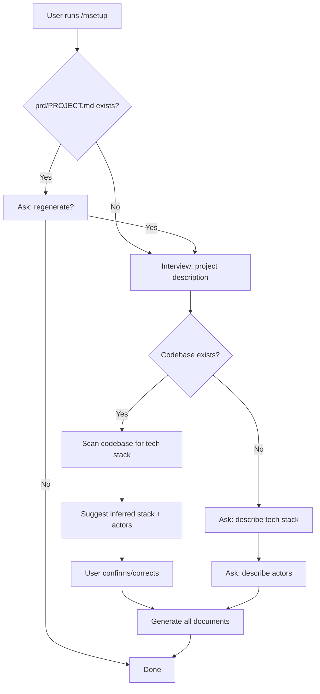
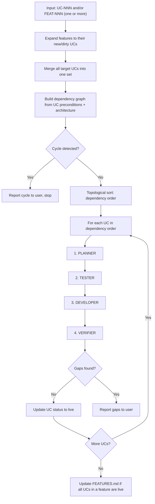
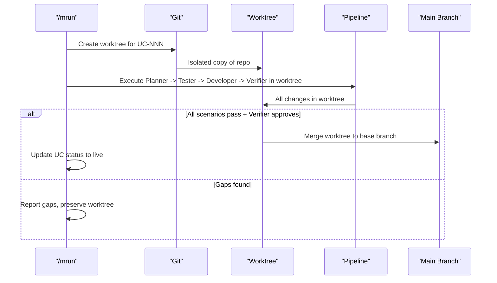
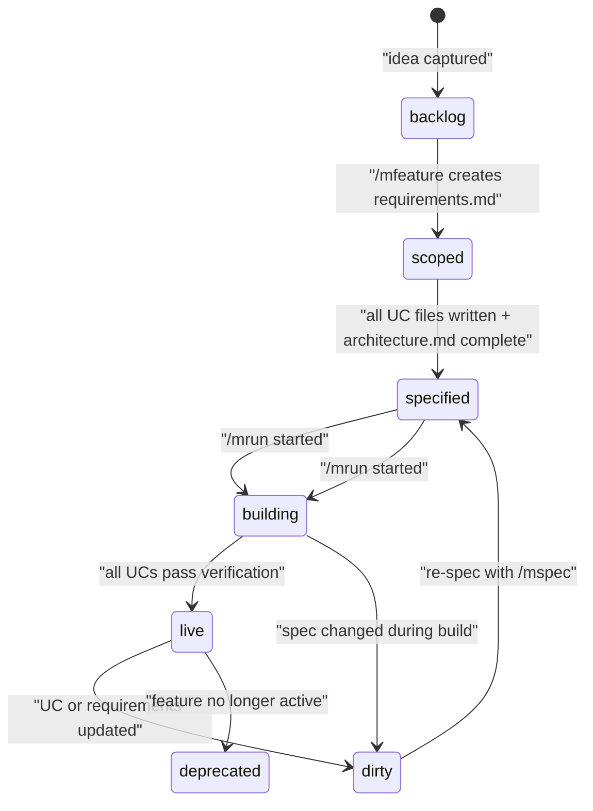
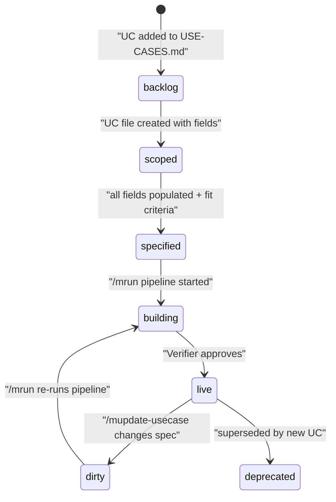

# Specification: V3 Use-Case-Centric Spec System

**Spec ID:** 20260317-0316-v3_spec_system
**Status:** Draft
**Created:** 2026-03-17
**Last Updated:** 2026-03-17

---

## 1. Overview

### 1.1 Feature Description

This specification defines the technical architecture for Molcajete v3 — a ground-up redesign of how the plugin organizes product knowledge, defines features, and drives unattended implementation. The system replaces v2's throwaway timestamped spec folders with permanent, knowledge-centric artifacts: a Feature Inventory, per-feature directories with EARS-syntax requirements and C4 architecture docs, per-use-case files with explicit side effects, and a four-agent run pipeline (Planner, Tester, Developer, Verifier) that generates plans at execution time rather than storing them on disk.

The plugin restructures into two independent subsystems — Plan (spec authoring) and Build (implementation and verification) — with shared commands and skills remaining at the plugin root. All commands adopt the `/mcommand` naming convention. Deprecated v2 commands and language-specific skills move to a `deprecated/` directory.

For detailed requirements, see [requirements.md](./requirements.md).

### 1.2 Strategic Alignment

| Aspect | Alignment |
|--------|-----------|
| Mission | Makes specs permanent, verifiable, and traceable — directly advancing output consistency |
| Roadmap | Primary NOW priority: v3 architecture |
| Success Metrics | First-run implementation accuracy; time-to-spec; traceability coverage (feature to Gherkin) |

### 1.3 User Value

| User Type | Value Delivered |
|-----------|-----------------|
| Individual developers | Specs accumulate knowledge; one FEATURES.md lookup to understand the system; EARS requirements agents implement correctly on first run |
| Team leads | Consistent feature inventory; full traceability; architecture conformance via Verifier agent |

### 1.4 Success Criteria

| Criterion | Target | Measurement |
|-----------|--------|-------------|
| Spec permanence | No throwaway folders | v3 commands never create timestamped spec folders |
| Traceability | FEATURES.md -> USE-CASES.md -> @UC-NNN chain complete | Every specified feature has a complete chain |
| First-run accuracy | Gherkin passes on first /mrun | For UCs with complete specs |
| Side effect coverage | Zero uncovered side effects | Verifier reports none missing |

---

## 2. Requirements Summary

### 2.1 Functional Requirements

| ID | Requirement | Priority |
|----|-------------|----------|
| FR-0S96-001 | `/msetup` generates PROJECT.md, TECH-STACK.md, ACTORS.md (inferring from code if available) | Critical |
| FR-0S96-002 | `/msetup` creates GLOSSARY.md, FEATURES.md, features/ directory | Critical |
| FR-0S96-005 | `/mfeature` extracts EARS structure from freeform input via creation interview | Critical |
| FR-0S96-010 | `/musecase` creates UC file with all fields including side effects | Critical |
| FR-0S96-015 | `/mspec` generates architecture.md with C4, ER, event topology | Critical |
| FR-0S96-023 | `/mstories` generates Gherkin with side effect coverage using gherkin skill | Critical |
| FR-0S96-027 | `/mrun {UC-NNN}` executes four-agent pipeline | Critical |
| FR-0S96-028 | `/mrun {FEAT-NNN}` iterates new/dirty UCs until all live | Critical |
| FR-0S96-056 | `/mrun {UC-NNN} {UC-NNN} ...` accepts multiple UCs; dispatcher resolves dependencies and orders execution | Critical |
| FR-0S96-057 | `/mrun {FEAT-NNN} {FEAT-NNN} ...` accepts multiple features; dispatcher resolves cross-feature dependencies and orders execution | Critical |
| FR-0S96-042 | Restructure into plan/ and build/ with root-level shared commands/skills | Critical |
| FR-0S96-043 | Rename commands to /mcommand format in manifest only | Critical |
| FR-0S96-044 | Move 12 deprecated commands to deprecated/commands/ | Critical |
| FR-0S96-046 | Move 10 language/stack skills to deprecated/skills/ | Critical |
| FR-0S96-055 | Suggest inferred actors during /msetup and confirm with user | Critical |

### 2.2 Non-Functional Requirements

| ID | Requirement | Target |
|----|-------------|--------|
| NFR-0S96-001 | Per-UC agent context | < 150 instructions per agent |
| NFR-0S96-002 | Subsystem independence | No shared skills directory; duplicate if needed |
| NFR-0S96-003 | Mermaid correctness | Double-quoted labels for special characters |
| NFR-0S96-004 | Zero runtime dependencies | Pure Markdown + YAML frontmatter |
| NFR-0S96-005 | Formatting consistency | Text checkboxes, no emojis, Mermaid-only, tables |

### 2.3 Constraints

| Constraint | Description |
|------------|-------------|
| Plugin system | Commands and skills are Markdown files with YAML frontmatter; plugin.json is the only manifest |
| No shared directory | Plan and Build subsystems are fully independent; shared items live at plugin root |
| Backward compatibility | v2 commands continue working in deprecated/ during migration; existing prd/specs/ untouched |
| Model preference | All commands use claude-opus-4-6 unless explicitly overridden |

### 2.4 Out of Scope

| Feature | Rationale |
|---------|-----------|
| v2 spec migration | Existing prd/specs/ remains as read-only historical artifacts |
| Automated FEATURES.md sync | Deferred — no mechanism for partial-failure recovery yet |
| Parallel branch FEAT-NNN collision | Knowledge gap; needs separate design |
| Remaining skill deprecation | Deferred to post-v3 evaluation |

---

## 3. Plugin Architecture

### 3.1 Target Directory Structure

```
molcajete/
├── plan/
│   ├── commands/
│   │   ├── setup.md              # /msetup — PROJECT.md + TECH-STACK.md + ACTORS.md
│   │   ├── feature.md            # /mfeature — requirements.md + USE-CASES.md + architecture.md scaffold
│   │   ├── usecase.md             # /musecase — UC-NNN-{slug}.md
│   │   ├── spec.md               # /mspec — architecture.md (C4, ER, events, ADRs)
│   │   ├── schema.md             # /mschema — prd/SCHEMA.md from codebase
│   │   ├── stories.md            # /mstories — Gherkin from UC file
│   │   ├── update-feature.md     # /mupdate-feature — edit requirements.md
│   │   ├── update-usecase.md    # /mupdate-usecase — edit UC file, set dirty
│   │   ├── reverse-feature.md    # /mreverse-feature — code to feature directory
│   │   ├── reverse-usecase.md   # /mreverse-usecase — code to UC file
│   │   └── reverse-glossary.md   # /mreverse-glossary — code to GLOSSARY.md
│   │
│   └── skills/
│       ├── feature-authoring/
│       │   ├── SKILL.md           # EARS syntax, Fit Criteria, FEATURES.md rules
│       │   └── templates/
│       │       ├── requirements-template.md
│       │       ├── use-cases-index-template.md
│       │       ├── architecture-scaffold-template.md
│       │       └── features-template.md
│       ├── usecase-authoring/
│       │   ├── SKILL.md           # UC file structure, side effects, frontmatter
│       │   └── templates/
│       │       └── usecase-template.md
│       ├── architecture/
│       │   ├── SKILL.md           # C4, ER with invariants, event topology, ADR rules
│       │   └── templates/
│       │       └── architecture-template.md
│       ├── gherkin/
│       │   ├── SKILL.md           # Scenario generation rules, tag conventions, step patterns
│       │   └── templates/
│       │       └── feature-file-template.md
│       ├── reverse-engineering/
│       │   ├── SKILL.md           # Code-to-spec extraction patterns
│       │   └── templates/
│       ├── setup/
│       │   ├── SKILL.md           # Interview flow, inference rules
│       │   └── templates/
│       │       ├── project-template.md
│       │       ├── tech-stack-template.md
│       │       ├── actors-template.md
│       │       ├── glossary-template.md
│       │       └── schema-template.md
│       └── schema/
│           ├── SKILL.md           # Schema extraction, Mermaid ER rules
│           └── templates/
│               └── schema-template.md
│
├── build/
│   ├── commands/
│   │   ├── run.md                 # /mrun — four-agent pipeline orchestrator
│   │   ├── dev.md                 # /mdev — standalone development workflow
│   │   ├── test.md                # /mtest — standalone test runner
│   │   └── debug.md               # /mdebug — standalone debugging workflow
│   │
│   └── skills/
│       ├── planner/
│       │   ├── SKILL.md           # Spec reading, plan generation rules
│       │   └── templates/
│       ├── tester/
│       │   ├── SKILL.md           # Step definition writing, BDD execution
│       │   └── templates/
│       ├── developer/
│       │   ├── SKILL.md           # Implementation patterns, vertical slicing
│       │   └── templates/
│       └── verifier/
│           ├── SKILL.md           # Verification checklist, compliance rules
│           └── templates/
│
├── commands/                      # Root-level shared commands (not in plan or build)
│   ├── commit.md                  # /mcommit
│   ├── review.md                  # /mreview
│   ├── doc.md                     # /mdoc
│   └── research.md                # /mresearch
│
├── skills/                        # Root-level shared skills
│   ├── clipboard/
│   │   └── SKILL.md
│   ├── git-committing/
│   │   └── SKILL.md
│   ├── code-documentation/
│   │   └── SKILL.md
│   ├── research-methods/
│   │   └── SKILL.md
│   └── {other retained skills}/
│
├── deprecated/
│   ├── commands/                  # v2 commands preserved for reference
│   │   ├── init.md
│   │   ├── tasks.md
│   │   ├── feature.md             # v2 version
│   │   ├── spec.md                # v2 version
│   │   ├── stories.md             # v2 version
│   │   ├── amend.md
│   │   ├── rebase.md
│   │   ├── copy.md
│   │   ├── prompt.md
│   │   ├── explain.md
│   │   ├── fix.md
│   │   └── refactor.md
│   └── skills/                    # Language/stack skills
│       ├── go-writing-code/
│       ├── go-testing/
│       ├── node-writing-code/
│       ├── node-testing/
│       ├── typescript-writing-code/
│       ├── typescript-testing/
│       ├── react-writing-code/
│       ├── react-testing/
│       ├── react-components/
│       └── tailwind-css/
│
├── scripts/
│   ├── dispatch.sh                # Four-agent pipeline coordinator
│   ├── merge.sh                   # Worktree merge utility
│   └── status.sh                  # Run status tracking
│
└── .claude-plugin/
    └── plugin.json                # Manifest with new structure + /mcommand naming
```

### 3.2 Target PRD Directory Structure

```
prd/
├── PROJECT.md                     # 1-2 paragraph project description
├── TECH-STACK.md                  # Languages, frameworks, infrastructure
├── ACTORS.md                      # System actors: roles, descriptions, constraints
├── GLOSSARY.md                    # Domain vocabulary (~30 terms)
├── FEATURES.md                    # Master feature inventory
├── SCHEMA.md                      # Database schema (Mermaid ER, from /mschema)
│
├── features/
│   └── FEAT-NNN-{slug}/
│       ├── requirements.md        # EARS syntax FRs, NFRs, non-goals, actors
│       ├── architecture.md        # C4 diagrams, ER + invariants, event topology, ADRs
│       ├── USE-CASES.md           # Index of UCs for this feature
│       └── use-cases/
│           ├── UC-001-{slug}.md   # One file per use case
│           └── UC-002-{slug}.md
│
└── specs/                         # v2 historical artifacts (read-only)
    ├── 20260223-1600-bdd_scenario_generator/
    ├── 20260316-1650-simplified_dispatch_pipeline/
    └── chores/
```

### 3.3 Plugin Manifest Specification

The `plugin.json` manifest is the sole registration point for all commands and skills. The v3 manifest must:

1. Reference commands from three locations: `plan/commands/`, `build/commands/`, and root `commands/`
2. Reference skills from three locations: `plan/skills/`, `build/skills/`, and root `skills/`
3. Use `/mcommand` naming for all commands (no colon)
4. Not reference anything in `deprecated/`

**Manifest structure:**

```json
{
  "name": "m",
  "version": "3.0.0",
  "description": "Use-case-centric spec system with four-agent implementation pipeline",
  "commands": [
    {
      "name": "msetup",
      "description": "Initialize project: PROJECT.md, TECH-STACK.md, ACTORS.md, GLOSSARY.md, FEATURES.md",
      "path": "plan/commands/setup.md"
    },
    {
      "name": "mfeature",
      "description": "Create a new feature with EARS requirements via creation interview",
      "path": "plan/commands/feature.md"
    },
    {
      "name": "musecase",
      "description": "Create a new use case within a feature via creation interview",
      "path": "plan/commands/usecase.md"
    },
    {
      "name": "mspec",
      "description": "Generate or update architecture.md with C4, ER, event topology",
      "path": "plan/commands/spec.md"
    },
    {
      "name": "mschema",
      "description": "Reverse-engineer database schema from codebase into SCHEMA.md",
      "path": "plan/commands/schema.md"
    },
    {
      "name": "mstories",
      "description": "Generate Gherkin scenarios from a use case file",
      "path": "plan/commands/stories.md"
    },
    {
      "name": "mupdate-feature",
      "description": "Update an existing feature's requirements or architecture",
      "path": "plan/commands/update-feature.md"
    },
    {
      "name": "mupdate-usecase",
      "description": "Update an existing use case file, increment version, set dirty",
      "path": "plan/commands/update-usecase.md"
    },
    {
      "name": "mreverse-feature",
      "description": "Reverse-engineer a feature from existing codebase",
      "path": "plan/commands/reverse-feature.md"
    },
    {
      "name": "mreverse-usecase",
      "description": "Reverse-engineer a use case from existing codebase",
      "path": "plan/commands/reverse-usecase.md"
    },
    {
      "name": "mreverse-glossary",
      "description": "Generate GLOSSARY.md from codebase using seed terms",
      "path": "plan/commands/reverse-glossary.md"
    },
    {
      "name": "mrun",
      "description": "Execute four-agent pipeline for a UC or all new/dirty UCs in a feature",
      "path": "build/commands/run.md"
    },
    {
      "name": "mdev",
      "description": "Implement a task from the task plan",
      "path": "build/commands/dev.md"
    },
    {
      "name": "mtest",
      "description": "Write, run, or analyze tests for code",
      "path": "build/commands/test.md"
    },
    {
      "name": "mdebug",
      "description": "Guided debugging workflow",
      "path": "build/commands/debug.md"
    },
    {
      "name": "mcommit",
      "description": "Create a well-formatted commit from staged changes",
      "path": "commands/commit.md"
    },
    {
      "name": "mreview",
      "description": "Code review on staged or recent changes",
      "path": "commands/review.md"
    },
    {
      "name": "mdoc",
      "description": "Generate documentation for code",
      "path": "commands/doc.md"
    },
    {
      "name": "mresearch",
      "description": "Deep research with parallel agents and long-form output",
      "path": "commands/research.md"
    }
  ],
  "skills": [
    { "path": "plan/skills/setup/SKILL.md" },
    { "path": "plan/skills/feature-authoring/SKILL.md" },
    { "path": "plan/skills/usecase-authoring/SKILL.md" },
    { "path": "plan/skills/architecture/SKILL.md" },
    { "path": "plan/skills/gherkin/SKILL.md" },
    { "path": "plan/skills/reverse-engineering/SKILL.md" },
    { "path": "plan/skills/schema/SKILL.md" },
    { "path": "build/skills/planner/SKILL.md" },
    { "path": "build/skills/tester/SKILL.md" },
    { "path": "build/skills/developer/SKILL.md" },
    { "path": "build/skills/verifier/SKILL.md" },
    { "path": "skills/clipboard/SKILL.md" },
    { "path": "skills/git-committing/SKILL.md" },
    { "path": "skills/code-documentation/SKILL.md" },
    { "path": "skills/research-methods/SKILL.md" }
  ]
}
```

**Command count:** 19 (11 plan + 4 build + 4 root)
**Skill count:** 15 (7 plan + 4 build + 4 root)

---

## 4. Document Templates

### 4.1 PROJECT.md Template

```markdown
# Project

> {One sentence: what this project is.}

{1-2 paragraphs describing the project's purpose, who it serves, and what problem
it solves. Keep it brief — this is context, not a business plan.}
```

### 4.2 TECH-STACK.md Template

```markdown
# Tech Stack

## Languages and Frameworks
- **Primary language:** {e.g., TypeScript}
- **Frontend:** {e.g., Next.js 15 with App Router}
- **Backend:** {e.g., Node.js with tRPC}
- **Styling:** {e.g., Tailwind CSS}

## Data
- **Database:** {e.g., PostgreSQL 16}
- **ORM:** {e.g., Prisma}
- **Cache:** {e.g., Redis}
- **Queue:** {e.g., BullMQ}

## Infrastructure
- **Hosting:** {e.g., Vercel (frontend) + Railway (backend)}
- **CI/CD:** {e.g., GitHub Actions}
- **Monitoring:** {e.g., Sentry + Grafana}

## Repository Structure
- **Type:** {monorepo | multi-repo}
- **Package manager:** {e.g., pnpm}
- **Key directories:** {brief layout of where source, tests, config live}

## Conventions
- {Any project-wide conventions: naming, error handling, testing approach}
```

### 4.3 ACTORS.md Template

```markdown
# Actors

> Roles that interact with this system. Referenced by use cases and requirements.

| Actor | Role | Description | Constraints |
|-------|------|-------------|-------------|
| {Actor name} | {human / system / external} | {What they do} | {Permissions, access levels, limitations} |
```

### 4.4 GLOSSARY.md Template

```markdown
# Glossary

> Canonical definitions for all terms used in specs.
> Every agent reads this before any other document.

## Terms

**{Term}** -- {Definition. One paragraph max. Reference related terms if needed.}
```

### 4.5 FEATURES.md Template

```markdown
# Feature Inventory

> The permanent catalog of all product features.
> Features are never removed -- they accumulate use cases over their lifetime.
> Update this file whenever a feature changes state or gains new use cases.

## Status Key
- `backlog` -- Intended but not yet scoped
- `scoped` -- requirements.md created; use cases listed but not detailed
- `specified` -- All use case files written; architecture.md complete
- `building` -- Active implementation in progress
- `live` -- In production, maintained
- `dirty` -- Spec updated but code has not caught up yet (needs /mrun)
- `deprecated` -- No longer active; retained for audit trail

## Features

| ID | Feature | Description | Status | Tag | Directory |
|----|---------|-------------|--------|-----|-----------|
```

### 4.6 requirements.md Template (per-feature)

```markdown
---
id: FEAT-NNN-slug
name: {Feature Name}
status: scoped | specified | building | live | dirty | deprecated
version: 1
---

# {Feature Name}

> {One sentence: what this feature does and who it serves.}

## Non-Goals

> What this feature explicitly does NOT do.
> This section appears second -- before actors, before requirements.

- Does not handle {X}
- Does not replace {Y}

## Actors

| Actor | Role | Notes |
|-------|------|-------|
| {Actor name} | {What they do in this feature} | {Constraints} |

## Functional Requirements

> Written in EARS syntax. Each requirement has a Fit Criterion.

**FR-001** `When {trigger}, the system shall {response}.`
Fit Criterion: Given {precondition}, {measurable outcome}.
Linked to: UC-NNN

## Non-Functional Requirements

**NFR-001** Performance: {EARS sentence with measurable threshold.}

## Acceptance

> The feature is complete when all of the following are true:
- [ ] All use cases have Gherkin scenarios passing
- [ ] All scenarios include side effect assertions
- [ ] Architecture.md diagrams reflect the built system
- [ ] FEATURES.md status is `live`
```

### 4.7 USE-CASES.md Template (per-feature)

```markdown
# Use Cases: {Feature Name}

> Index of all use cases for FEAT-NNN-slug.
> Full specifications are in `use-cases/UC-NNN-{slug}.md`.

| ID | Name | Description | Status | File |
|----|------|-------------|--------|------|
```

### 4.8 UC-NNN-{slug}.md Template

```markdown
---
id: UC-NNN
name: {Verb-noun goal name}
feature: FEAT-NNN-slug
status: backlog | scoped | specified | building | live | dirty | deprecated
version: 1
actor: {Primary actor role}
tag: @UC-NNN
---

# UC-NNN: {Use Case Name}

> {One sentence: what the actor achieves by completing this use case.}

## Preconditions

- {System/data state that must exist}
- {Actor state: authenticated, has permission, etc.}

## Trigger

{One sentence: what the actor does or what event occurs to begin this interaction.}

## Main Flow

1. {Actor} {action}
2. System {validates/processes/stores/returns} {what}
...

## Postconditions

- {Entity/state that now exists or has changed}

## Side Effects

- `{event.name}` event published with payload `{fields}`
- `{table}` table: {row created/updated/deleted}
- No {notification/email/webhook} sent

## Alternative Flows

**{N}a. {Condition that causes deviation}:**
1. System {response}
Result: {How this ends}
Side effects: {Any side effects specific to this alternative}

## Fit Criteria

- Given {precondition}, when {trigger}, then {measurable outcome}
- Response time: < {N}ms at {percentile} under {load}

## Gherkin Tag

`@FEAT-NNN @UC-NNN`
```

### 4.9 architecture.md Template (per-feature)

```markdown
---
id: FEAT-NNN-slug
name: {Feature Name}
---

# Architecture: {Feature Name}

## System Context (C4 L1)

> Who uses this feature and what external systems does it touch?

{Mermaid C4Context diagram}

## Container View (C4 L2)

> Which major components are involved and how do they communicate?

{Mermaid C4Container diagram}

## Data Model

> Entity schemas with field constraints and invariants.

{Mermaid erDiagram}

**Invariants:**
- {Entity}.{field} must always {rule}

## Event Topology

| Event | Publisher | Payload | Condition | Consumers |
|-------|-----------|---------|-----------|-----------|

**Non-events (explicit):**
- {scenario}: no event is published

## State Transitions

{Mermaid stateDiagram-v2}

## Architecture Decisions

**ADR-001:** {Decision title}
In the context of {situation}, facing {concern}, we decided {choice}
to achieve {quality}, accepting {tradeoff}.
```

### 4.10 SCHEMA.md Template

```markdown
# Database Schema

> Project-level database schema reverse-engineered from codebase via /mschema.
> Last generated: {YYYY-MM-DD}

## Entity Relationship Diagram

{Mermaid erDiagram with all tables, fields, types, constraints}

## Tables

### {table_name}

| Column | Type | Constraints | Description |
|--------|------|-------------|-------------|

**Invariants:**
- {rule}
```

---

## 5. Command Specifications

### 5.1 Command YAML Frontmatter Schema

Every command file uses this frontmatter structure:

```yaml
---
description: {One-line description shown in help}
model: claude-opus-4-6
allowed-tools:
  - Read
  - Write
  - Edit
  - Glob
  - Grep
  - Bash
  - Agent
  - AskUserQuestion
argument-hint: "{usage hint shown to user}"
---
```

### 5.2 Plan Commands

#### /msetup

| Field | Value |
|-------|-------|
| File | `plan/commands/setup.md` |
| Skills | plan/skills/setup |
| Input | None (interactive) |
| Output | `prd/PROJECT.md`, `prd/TECH-STACK.md`, `prd/ACTORS.md`, `prd/GLOSSARY.md`, `prd/FEATURES.md`, `prd/features/` |

**Behavior:**
1. Check if `prd/PROJECT.md` already exists. If yes, ask if user wants to regenerate.
2. Interview for project description (2-3 qualifying questions).
3. If codebase exists, scan for tech stack indicators (package.json, go.mod, Cargo.toml, Gemfile, etc.) and suggest inferred stack. Ask user to confirm.
4. If no codebase, ask user to describe tech stack.
5. If actors can be inferred from project description or codebase (e.g., user roles in auth middleware, admin panels), suggest them. Ask user to confirm.
6. If actors cannot be inferred, ask user to describe actors.
7. Generate all five documents using templates from setup skill.
8. Create `prd/features/` directory.



#### /mfeature

| Field | Value |
|-------|-------|
| File | `plan/commands/feature.md` |
| Skills | plan/skills/feature-authoring |
| Input | `{freeform text}` |
| Output | `prd/features/{slug}/requirements.md`, `USE-CASES.md`, `architecture.md` scaffold; `FEATURES.md` updated |

**Creation Interview Flow:**
1. Extract from user input: name, non-goals, actors, FRs, NFRs, acceptance criteria.
2. Convert FRs to EARS syntax. Add Fit Criterion to each.
3. Present each section for review: "For functional requirements, this is what I got: ... Does this look correct?"
4. If input didn't cover a section, ask: "Do you have any non-functional requirements?"
5. After all sections reviewed, assign `FEAT-NNN-slug` ID (next sequential number from FEATURES.md).
6. Write all files. Register in FEATURES.md with status `scoped`.

#### /musecase

| Field | Value |
|-------|-------|
| File | `plan/commands/usecase.md` |
| Skills | plan/skills/usecase-authoring |
| Input | `{FEAT-NNN} {freeform text}` |
| Output | `prd/features/{slug}/use-cases/UC-NNN-{slug}.md`; `USE-CASES.md` updated |

**Creation Interview Flow:**
1. Validate FEAT-NNN exists in FEATURES.md.
2. Extract from input: name, actor, preconditions, trigger, main flow, postconditions, side effects (including non-side-effects), alternative flows, fit criteria.
3. Present each section for review.
4. Assign UC-NNN ID (next sequential within feature's USE-CASES.md).
5. Write UC file with YAML frontmatter. Update USE-CASES.md.

#### /mspec

| Field | Value |
|-------|-------|
| File | `plan/commands/spec.md` |
| Skills | plan/skills/architecture |
| Input | `{FEAT-NNN}` |
| Output | `prd/features/{slug}/architecture.md` |

**Behavior:**
1. Read feature's `requirements.md` and all UC files in `use-cases/`.
2. Read `prd/TECH-STACK.md` for technology context.
3. Generate C4 System Context (L1) from actors and external system references.
4. Generate C4 Container View (L2) from component references in UC flows.
5. Generate ER diagram from data entities mentioned in UC side effects and postconditions.
6. Write invariants block from UC preconditions and fit criteria.
7. Generate Event Topology table from UC side effects (events published).
8. Generate state transition diagram if entities have lifecycle states.
9. Add ADR section for non-obvious architectural decisions.

#### /mschema

| Field | Value |
|-------|-------|
| File | `plan/commands/schema.md` |
| Skills | plan/skills/schema |
| Input | None |
| Output | `prd/SCHEMA.md` |

**Behavior:**
1. Scan codebase for migrations, ORM model files, schema definitions.
2. Extract tables, columns, types, constraints, relationships.
3. Generate Mermaid ER diagram covering all discovered tables.
4. Write invariants for each table.
5. Always reverse-engineers from code — no "create from scratch" mode.

#### /mstories

| Field | Value |
|-------|-------|
| File | `plan/commands/stories.md` |
| Skills | plan/skills/gherkin |
| Input | `{UC-NNN}` |
| Output | Gherkin feature file(s) |

**Mapping rules (from UC file to Gherkin):**

| UC Field | Gherkin Element |
|----------|-----------------|
| Preconditions | `Given` clauses |
| Trigger | `When` clause |
| Postconditions | `Then` clause |
| Side effects | `And` clauses after `Then` |
| Non-side-effects | `And no ...` clauses |
| Alternative flows | Separate scenarios with deviation as `When` |
| Fit criteria | Measurable `Then` assertions |
| FEAT-NNN + UC-NNN | `@FEAT-NNN @UC-NNN` tags on every scenario |

#### /mupdate-feature

| Field | Value |
|-------|-------|
| File | `plan/commands/update-feature.md` |
| Skills | plan/skills/feature-authoring |
| Input | `{FEAT-NNN} {description of change}` |
| Output | Updated `requirements.md` and/or `architecture.md` |

**Behavior:** Read current state, propose diff, apply after user review. No creation interview. Does not change feature lifecycle status.

#### /mupdate-usecase

| Field | Value |
|-------|-------|
| File | `plan/commands/update-usecase.md` |
| Skills | plan/skills/usecase-authoring |
| Input | `{UC-NNN} {description of change}` |
| Output | Updated UC file |

**Behavior:** Read current UC, propose diff, increment `version:` in frontmatter, set `status: dirty`, update USE-CASES.md status column. No creation interview.

#### /mreverse-feature, /mreverse-usecase, /mreverse-glossary

| Field | Value |
|-------|-------|
| File | `plan/commands/reverse-*.md` |
| Skills | plan/skills/reverse-engineering |
| Input | `{description}` or `{seed terms}` |
| Output | Feature directory, UC file, or GLOSSARY.md |

**Behavior:** Scan codebase using Explore agents, extract structure, generate spec documents using the same templates as creation commands. Generated specs should always be reviewed by user.

### 5.3 Build Commands

#### /mrun

| Field | Value |
|-------|-------|
| File | `build/commands/run.md` |
| Skills | build/skills/planner, build/skills/tester, build/skills/developer, build/skills/verifier |
| Input | One or more `{UC-NNN}` and/or `{FEAT-NNN}`, space-separated |
| Output | Implemented code, passing Gherkin, updated statuses |

**Input modes:**

| Mode | Example | Behavior |
|------|---------|----------|
| Single UC | `/mrun UC-001` | Run four-agent pipeline for one UC |
| Multiple UCs | `/mrun UC-001 UC-003 UC-002` | Dispatcher resolves dependencies, orders execution, runs pipeline for each |
| Single feature | `/mrun FEAT-001` | Expand to all new/dirty UCs in FEAT-001, resolve dependencies, run pipeline for each |
| Multiple features | `/mrun FEAT-001 FEAT-003` | Expand all new/dirty UCs across both features, resolve cross-feature dependencies, run pipeline for each |
| Mixed | `/mrun FEAT-001 UC-007` | Expand feature to UCs, merge with explicit UCs, resolve dependencies, run pipeline for each |

**Dependency resolution:** The dispatcher does NOT execute in the order the user provides. It reads all target UCs, builds a dependency graph from UC preconditions and architecture.md references (e.g., UC-002 depends on tables created by UC-001), topologically sorts them, and executes in dependency order. If a cycle is detected, the dispatcher reports it to the user and stops.

See Section 6 for the full four-agent pipeline specification.

---

## 6. Four-Agent Pipeline

### 6.1 Pipeline Overview



### 6.2 Agent 1: Planner

**Context loaded:**

| Document | Source |
|----------|--------|
| PROJECT.md | `prd/PROJECT.md` |
| TECH-STACK.md | `prd/TECH-STACK.md` |
| ACTORS.md | `prd/ACTORS.md` |
| GLOSSARY.md | `prd/GLOSSARY.md` |
| FEATURES.md | `prd/FEATURES.md` |
| requirements.md | `prd/features/{slug}/requirements.md` |
| architecture.md | `prd/features/{slug}/architecture.md` |
| UC file | `prd/features/{slug}/use-cases/UC-NNN-{slug}.md` |

**Skill:** `build/skills/planner/SKILL.md`

**Produces:** A cohesive implementation plan held in the agent's context window. Not written to disk. The plan covers:
- What code needs to be written or changed
- Database changes (from Side Effects + ER diagram in architecture.md)
- Events to publish (from Event Topology in architecture.md)
- How implementation conforms to architecture (C4 container boundaries)
- Dependencies on other UCs or external systems

**Output format:** Free-form implementation plan in the agent's context — no prescribed structure. The plan is whatever form is most useful for the Developer agent to consume.

### 6.3 Agent 2: Tester

**Context loaded:**
- Planner's implementation plan (passed in context)
- UC file
- Parent feature's `requirements.md`
- `gherkin` skill from plan (for scenario generation rules)

**Skill:** `build/skills/tester/SKILL.md`

**Produces:** Gherkin feature files with:
- `@FEAT-NNN @UC-NNN @{priority}` tags on every scenario
- One `@smoke` scenario for the happy path (main flow)
- One scenario per alternative flow
- `And` clauses for every declared side effect
- `And no ...` clauses for every explicit non-side-effect
- Step definitions with `TODO: implement step` placeholders

**Coverage rules:**

| UC Field | Required Coverage |
|----------|-------------------|
| Main flow | At least one scenario covering all steps |
| Each alternative flow | At least one scenario |
| Each side effect | At least one `And` clause |
| Each non-side-effect | At least one `And no ...` clause |
| Each FR linked to this UC | At least one scenario |
| Each NFR applicable to this UC | At least one measurable assertion |

### 6.4 Agent 3: Developer

**Context loaded:**
- Planner's implementation plan (passed in context)
- Tester's Gherkin scenarios (all currently failing — red phase)

**Skill:** `build/skills/developer/SKILL.md`

**Does:**
- Implements production code following the plan
- Fills in Tester's `TODO: implement step` placeholders in step definitions
- Writes unit tests alongside production code
- Runs Gherkin scenarios to verify progress
- Keeps working until all scenarios pass (green phase)
- No artificial task boundaries — works freely until done
- Commits on success

**Does NOT need:**
- The UC file directly (everything needed is encoded in plan + Gherkin)
- The architecture.md (Planner already incorporated it into the plan)

### 6.5 Agent 4: Verifier

**Context loaded (fresh — no carry-over from Developer):**

| Document | Purpose |
|----------|---------|
| UC file | Source of truth for what should be implemented |
| requirements.md | FR/NFR compliance checking |
| architecture.md | Data model, event topology, invariant conformance |
| Gherkin scenarios for @UC-NNN | Completeness of test coverage |
| Implemented code | What was actually built |

**Skill:** `build/skills/verifier/SKILL.md`

**Checks:**

| Check | What it validates |
|-------|-------------------|
| Feature completeness | Every field in UC file (main flow, postconditions, side effects, alternative flows) has corresponding implementation |
| FR compliance | No FR from parent feature's requirements.md is violated |
| NFR compliance | No NFR from parent feature's requirements.md is violated |
| Architecture conformance | Data model matches ER diagram; events match event topology; invariants are enforced in code |
| Non-goals respected | Nothing from Non-Goals section was accidentally implemented |
| Side effect coverage | Every side effect in UC file is both implemented in code AND covered by a Gherkin `And` clause |

**On gaps found:** Reports specific gaps to user with references to UC fields, FRs, or architecture elements. Does NOT attempt autonomous fixes (per FR-0S96-034).

### 6.6 Per-UC Worktree Isolation

Each UC in the pipeline runs in its own git worktree (carried over from v2):



---

## 7. State Machines

### 7.1 Feature Lifecycle



### 7.2 Use Case Lifecycle



### 7.3 Status Transition Rules

| From | To | Triggered By |
|------|----|-------------|
| (new) | backlog | Row added to USE-CASES.md |
| backlog | scoped | `/musecase` creates UC file |
| scoped | specified | All UC fields populated, fit criteria written |
| specified | building | `/mrun` starts pipeline |
| building | live | Verifier passes with no gaps |
| live | dirty | `/mupdate-usecase` modifies UC file |
| dirty | building | `/mrun` re-runs pipeline |
| any | deprecated | Manual status change |

---

## 8. ID Scheme

### 8.1 Feature IDs

Format: `FEAT-NNN-slug`

- `NNN` is a sequential 3-digit number (001, 002, ...), assigned by `/mfeature` from the next available number in FEATURES.md
- `slug` is lowercase, hyphens, derived from feature name (e.g., `authentication`, `commit-orchestration`)
- IDs are never reused, never deleted
- The full ID is the `id` field in the feature's `requirements.md` frontmatter

### 8.2 Use Case IDs

Format: `UC-NNN` (within a feature)

- `NNN` is a sequential 3-digit number (001, 002, ...), assigned by `/musecase` from the next available number in the feature's USE-CASES.md
- The full reference includes the feature: `FEAT-001-auth/UC-001`
- The `tag` field in UC frontmatter is `@UC-NNN` for Gherkin filtering
- The filename is `UC-NNN-{slug}.md`

### 8.3 Requirement IDs

Format: `FR-NNN`, `NFR-NNN` (within a feature's requirements.md)

- Sequential within the document
- No cross-feature collision concern — each feature has its own requirements.md

### 8.4 Gherkin Tag Hierarchy

```
@FEAT-NNN          # All scenarios for a feature
  @UC-NNN          # All scenarios for a use case
    @smoke         # Happy path
    @critical      # Alternative flows / error paths
    @deprecated    # Retained for audit, excluded from CI
```

---

## 9. Acceptance Criteria

### UC-0S96-001: Set Up Project Foundation

- [ ] `/msetup` generates PROJECT.md with 1-2 paragraph description
- [ ] Generates TECH-STACK.md with languages, frameworks, data, infrastructure
- [ ] Generates ACTORS.md with roles, descriptions, constraints
- [ ] Infers tech stack from codebase when present, confirms with user
- [ ] Infers actors from codebase/description when possible, confirms with user
- [ ] Creates GLOSSARY.md with starter terms
- [ ] Creates FEATURES.md with empty table and status key
- [ ] Creates prd/features/ directory
- [ ] Works on projects with no existing codebase (user describes everything)
- [ ] Skill templates exist: project-template.md, tech-stack-template.md, actors-template.md, glossary-template.md

### UC-0S96-002: Create Feature

- [ ] `/mfeature` accepts freeform text and extracts EARS-syntax requirements
- [ ] Creation interview presents each section for user review
- [ ] Generates requirements.md with Non-Goals as second section
- [ ] All FRs use EARS syntax with Fit Criteria
- [ ] Generates USE-CASES.md index (empty or with extracted UCs)
- [ ] Generates architecture.md scaffold
- [ ] Registers feature in FEATURES.md with FEAT-NNN-slug ID and status `scoped`
- [ ] Skill templates exist: requirements-template.md, use-cases-index-template.md, architecture-scaffold-template.md, features-template.md

### UC-0S96-003: Create Use Case

- [ ] `/musecase` accepts FEAT-NNN and freeform text
- [ ] Validates FEAT-NNN exists in FEATURES.md
- [ ] Creation interview presents each UC section for review
- [ ] Writes UC file with all fields: preconditions, trigger, main flow, postconditions, side effects (including non-side-effects), alternative flows, fit criteria
- [ ] UC file has YAML frontmatter with id, name, feature, status, version, actor, tag
- [ ] Updates USE-CASES.md with new row
- [ ] Skill template exists: usecase-template.md

### UC-0S96-004: Create or Update Architecture

- [ ] `/mspec` reads requirements.md and all UC files for the feature
- [ ] Generates C4 System Context (L1) Mermaid diagram
- [ ] Generates C4 Container View (L2) Mermaid diagram
- [ ] Generates ER diagram with field constraints
- [ ] Writes Invariants block below ER diagram
- [ ] Generates Event Topology table
- [ ] Includes Non-events section for explicit non-side-effects
- [ ] Generates state transition diagram for entities with lifecycle
- [ ] Includes ADR section
- [ ] All Mermaid node labels with special characters are double-quoted

### UC-0S96-005: Generate Database Schema

- [ ] `/mschema` scans codebase for migrations, ORM definitions, model files
- [ ] Generates prd/SCHEMA.md with Mermaid ER diagram
- [ ] Includes table, column, type, constraint, invariant detail
- [ ] Always reverse-engineers from code (no create-from-scratch mode)

### UC-0S96-006: Generate Gherkin Stories

- [ ] `/mstories` reads UC file and references gherkin skill
- [ ] Generates scenarios with @FEAT-NNN @UC-NNN tags
- [ ] Every main flow step has scenario coverage
- [ ] Every alternative flow has at least one scenario
- [ ] Every side effect produces an `And` clause
- [ ] Every non-side-effect produces an `And no ...` clause
- [ ] Step definitions include TODO placeholders

### UC-0S96-007: Run Four-Agent Pipeline

- [ ] `/mrun {UC-NNN}` executes Planner, Tester, Developer, Verifier in sequence
- [ ] `/mrun {UC-NNN} {UC-NNN} ...` accepts multiple UCs, resolves dependencies, executes in dependency order
- [ ] `/mrun {FEAT-NNN}` expands to new/dirty UCs, resolves dependencies, iterates until all live
- [ ] `/mrun {FEAT-NNN} {FEAT-NNN} ...` accepts multiple features, expands and resolves cross-feature dependencies
- [ ] `/mrun {FEAT-NNN} {UC-NNN}` accepts mixed input (features + UCs), expands and merges
- [ ] Dispatcher builds dependency graph from UC preconditions and architecture references
- [ ] Dispatcher reports dependency cycle to user and stops if one is detected
- [ ] Planner reads all relevant spec artifacts and produces in-context plan
- [ ] Planner plan is not written to disk
- [ ] Tester writes Gherkin with full side effect coverage (red phase)
- [ ] Developer implements until all scenarios pass (green phase)
- [ ] Verifier checks completeness, compliance, conformance, non-goals, side effects
- [ ] Verifier reports gaps to user (does not auto-fix)
- [ ] UC status updated to `live` on successful verification
- [ ] FEATURES.md status updated when all UCs in feature are `live`
- [ ] Each UC runs in its own git worktree
- [ ] Successful worktrees are merged to base branch

### UC-0S96-013: Restructure Plugin into Plan/Build

- [ ] `molcajete/plan/commands/` contains 11 plan command files
- [ ] `molcajete/plan/skills/` contains 7 plan skill directories
- [ ] `molcajete/build/commands/` contains 4 build command files
- [ ] `molcajete/build/skills/` contains 4 build skill directories
- [ ] `molcajete/commands/` contains 4 root-level shared commands (commit, review, doc, research)
- [ ] `molcajete/skills/` contains retained root-level skills
- [ ] `molcajete/deprecated/commands/` contains 12 deprecated command files
- [ ] `molcajete/deprecated/skills/` contains 10 deprecated skill directories
- [ ] No `molcajete/shared/` directory exists
- [ ] `plugin.json` references all active commands and skills at their new paths
- [ ] All commands use `/mcommand` naming in manifest

### Edge Cases

| Scenario | Expected Behavior |
|----------|-------------------|
| `/msetup` run twice | Ask user if they want to regenerate existing documents |
| `/mfeature` without `/msetup` first | Error: "Run /msetup first -- PROJECT.md and TECH-STACK.md are required" |
| `/musecase` with invalid FEAT-NNN | Error: "Feature {FEAT-NNN} not found in FEATURES.md" |
| `/mrun` on UC with empty fields | Error: "UC-NNN is missing required fields: {list}" |
| `/mrun FEAT-NNN` with no new/dirty UCs | Message: "All UCs in FEAT-NNN are already live. Nothing to do." |
| `/mrun UC-001 UC-002` with circular dependency | Error: "Dependency cycle detected between UC-001 and UC-002. Resolve manually." |
| `/mrun FEAT-001 FEAT-002` with cross-feature UC dependency | Dispatcher orders UCs from both features in correct dependency order |
| `/mspec` on feature with no UCs | Warning: "No use cases found -- generating architecture scaffold only" |
| `/mupdate-usecase` on a `live` UC | Set status to `dirty`, increment version. Warn: "This UC is live. Updating will require /mrun to re-implement." |
| Verifier finds gaps | Report gaps with specific references. Do NOT attempt fixes. |
| Git worktree merge conflict | Preserve worktree, report conflict to user for manual resolution |

### Performance Criteria

| Metric | Target |
|--------|--------|
| Agent context per UC | < 150 instructions loaded per agent |
| Feature lookup | One file read (FEATURES.md) |
| UC lookup | Two file reads (FEATURES.md + USE-CASES.md) |

### Security Criteria

| Requirement | Implementation |
|-------------|----------------|
| No secrets in spec docs | /mreverse-* commands must filter out API keys, passwords, tokens found in code |
| No secrets in Gherkin | Step definitions must use placeholder values, never real credentials |

---

## 10. Verification

### Unit Tests

| Test | Validates |
|------|-----------|
| FEATURES.md table parsing | Correctly reads/writes feature rows with all columns |
| USE-CASES.md index sync | New UC row added on /musecase; status updated on /mupdate-usecase |
| UC frontmatter parsing | Reads/writes id, name, feature, status, version, actor, tag fields |
| EARS syntax validation | Generated FRs follow When/While/If-Then patterns |
| Fit Criterion presence | Every FR has an accompanying Fit Criterion |
| Side effect field validation | UC files have Side Effects section; includes at least one entry |
| Gherkin tag generation | Scenarios have @FEAT-NNN @UC-NNN tags |
| Status transition rules | Only valid transitions are allowed (per state machine) |

### Integration Tests

| Test | Validates |
|------|-----------|
| /msetup end-to-end | Generates all 5 foundation documents from interview responses |
| /mfeature end-to-end | Creation interview produces correct requirements.md, USE-CASES.md, architecture.md scaffold |
| /musecase end-to-end | UC file created with all fields; USE-CASES.md updated |
| /mstories UC mapping | Gherkin scenarios correctly map from UC fields (preconditions, trigger, side effects) |
| /mrun single UC | Four agents execute in sequence; Gherkin passes; UC status changes to live |
| /mrun feature | Iterates new/dirty UCs; skips live UCs; stops when all live |
| Plugin manifest validation | All command paths resolve; all skill paths resolve; no deprecated references |

### E2E Tests

| Test | Validates |
|------|-----------|
| Full lifecycle: setup -> feature -> usecase -> spec -> stories -> run | Complete workflow from empty project to implemented UC |
| Update cycle: update-usecase -> run | Dirty UC is re-implemented and returns to live |
| Reverse-engineering: reverse-feature | Existing code generates valid feature directory with all documents |

---

## 11. Implementation Checklist

### Plugin Restructure (UC-0S96-013, UC-0S96-014, UC-0S96-015)

- [ ] Create `molcajete/plan/commands/` directory
- [ ] Create `molcajete/plan/skills/` directory with 7 skill subdirectories
- [ ] Create `molcajete/build/commands/` directory
- [ ] Create `molcajete/build/skills/` directory with 4 skill subdirectories
- [ ] Move 4 shared commands to root `molcajete/commands/` (commit, review, doc, research)
- [ ] Create `molcajete/deprecated/commands/` and move 12 v2 commands
- [ ] Create `molcajete/deprecated/skills/` and move 10 language/stack skills
- [ ] Update `plugin.json` with new paths and `/mcommand` naming
- [ ] Verify all active commands resolve from manifest
- [ ] Verify no deprecated items referenced in manifest

### Plan Skills (UC-0S96-001 through UC-0S96-006)

- [ ] Write `plan/skills/setup/SKILL.md` with interview flow and inference rules
- [ ] Write templates: project-template.md, tech-stack-template.md, actors-template.md, glossary-template.md
- [ ] Write `plan/skills/feature-authoring/SKILL.md` with EARS syntax and Fit Criteria rules
- [ ] Write templates: requirements-template.md, use-cases-index-template.md, architecture-scaffold-template.md, features-template.md
- [ ] Write `plan/skills/usecase-authoring/SKILL.md` with UC structure and side effects rules
- [ ] Write template: usecase-template.md
- [ ] Write `plan/skills/architecture/SKILL.md` with C4, ER, event topology rules
- [ ] Write template: architecture-template.md
- [ ] Write `plan/skills/gherkin/SKILL.md` with scenario generation and tag conventions
- [ ] Write template: feature-file-template.md
- [ ] Write `plan/skills/reverse-engineering/SKILL.md` with code-to-spec extraction patterns
- [ ] Write `plan/skills/schema/SKILL.md` with Mermaid ER and schema extraction rules
- [ ] Write template: schema-template.md

### Plan Commands (UC-0S96-001 through UC-0S96-012)

- [ ] Write `plan/commands/setup.md` (/msetup)
- [ ] Write `plan/commands/feature.md` (/mfeature)
- [ ] Write `plan/commands/usecase.md` (/musecase)
- [ ] Write `plan/commands/spec.md` (/mspec)
- [ ] Write `plan/commands/schema.md` (/mschema)
- [ ] Write `plan/commands/stories.md` (/mstories)
- [ ] Write `plan/commands/update-feature.md` (/mupdate-feature)
- [ ] Write `plan/commands/update-usecase.md` (/mupdate-usecase)
- [ ] Write `plan/commands/reverse-feature.md` (/mreverse-feature)
- [ ] Write `plan/commands/reverse-usecase.md` (/mreverse-usecase)
- [ ] Write `plan/commands/reverse-glossary.md` (/mreverse-glossary)

### Build Skills (UC-0S96-007)

- [ ] Write `build/skills/planner/SKILL.md` with spec reading and plan generation rules
- [ ] Write `build/skills/tester/SKILL.md` with step definition writing and BDD execution rules
- [ ] Write `build/skills/developer/SKILL.md` with implementation patterns and vertical slicing
- [ ] Write `build/skills/verifier/SKILL.md` with verification checklist and compliance rules

### Build Commands (UC-0S96-007)

- [ ] Write `build/commands/run.md` (/mrun with four-agent pipeline)
- [ ] Update `build/commands/dev.md` (/mdev — path update from v2)
- [ ] Update `build/commands/test.md` (/mtest — path update from v2)
- [ ] Update `build/commands/debug.md` (/mdebug — path update from v2)

### Orchestration Scripts

- [ ] Update `scripts/dispatch.sh` for four-agent pipeline (add Verifier stage)
- [ ] Update `scripts/status.sh` for new UC status tracking
- [ ] Keep `scripts/merge.sh` as-is (worktree merge logic unchanged)


---

## Appendix

### Related Documents

| Document | Location |
|----------|----------|
| Requirements | [requirements.md](./requirements.md) |
| Spec System Proposal | [research/spec-system-proposal.md](../../research/spec-system-proposal.md) |
| Best Practices Research | [research/prd-best-practices-for-llm-driven-development.md](../../research/prd-best-practices-for-llm-driven-development.md) |

### EARS Syntax Reference

| Pattern | Keyword | Template |
|---------|---------|----------|
| Ubiquitous | -- | `The system shall {response}` |
| Event-driven | When | `When {trigger}, the system shall {response}` |
| State-driven | While | `While {precondition}, the system shall {response}` |
| Unwanted behavior | If/Then | `If {trigger}, then the system shall {response}` |
| Complex | Combined | `While {precondition}, when {trigger}, the system shall {response}` |

### Gherkin Side Effect Mapping Reference

| Side effect type | Gherkin clause |
|------------------|----------------|
| Event published | `And an "{event.name}" event should have been published` |
| Database write | `And the {table} table should show {entity} with {behavioral description}` |
| Email sent | `And a {type} email should have been sent to {recipient}` |
| External API call | `And {external system} should have received a {type} request` |
| Explicit non-side-effect | `And no {notification/email/session} should have been {created/sent}` |
