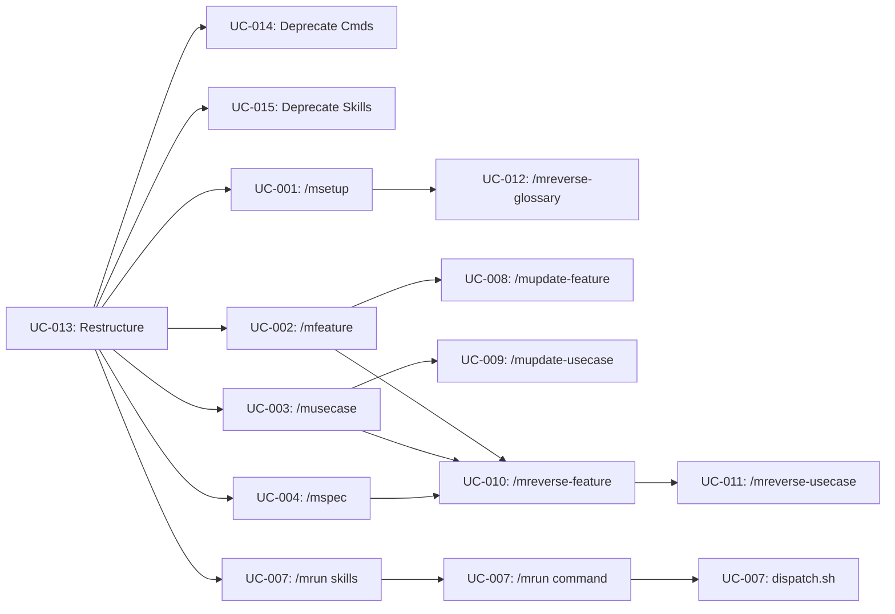

# Tasks: V3 Use-Case-Centric Spec System

**Spec:** [20260317-0316-v3_spec_system](./spec.md)
**Created:** 2026-03-17

---

## Overview

Implements Molcajete v3: restructures the plugin into Plan/Build subsystems, creates 10 document templates, writes 15 new commands and 11 new skills, updates the dispatch pipeline from three to four agents, and deprecates 12 commands and 10 skills. All output is Markdown files with YAML frontmatter — no compiled code, no database, no runtime dependencies.

**Strategic Alignment:** Primary NOW priority. Replaces throwaway v2 spec scaffolding with permanent, knowledge-centric artifacts that accumulate over the product's lifetime.

**Success Criteria:**

| Criterion | Target |
|-----------|--------|
| All 19 commands registered and invocable | `plugin.json` resolves every command path |
| All 15 skills loaded by their respective commands | Skill references in command prompts resolve |
| Four-agent pipeline runs end-to-end | /mrun executes Planner, Tester, Developer, Verifier for a UC |
| /mcommand naming | No colon-separated command names in manifest |

**Estimated Total Effort:** 116 story points

**Key Risks:**

| Risk | Impact | Mitigation |
|------|--------|------------|
| Restructure breaks existing v2 commands mid-migration | High | Deprecate commands only after new structure is verified; keep deprecated/ as fallback |
| Skill prompts too long for context ceiling | Medium | Test each skill in isolation; keep under 150 instructions |
| Four-agent pipeline coordination complexity | High | Build on existing dispatch.sh patterns; add Verifier as incremental stage |

---

## [x] UC-0S96-013. Restructure Plugin into Plan/Build

Creates the target directory structure, moves shared commands to root, and updates plugin.json with /mcommand naming. This is the foundation — every other UC depends on the directory layout existing.

- [x] 1. Create Plan/Build directory structure
  - Complexity: 2
  - Dependencies: None
  - Acceptance: `molcajete/plan/commands/`, `molcajete/plan/skills/`, `molcajete/build/commands/`, `molcajete/build/skills/` directories exist
  - Completed: 2026-03-17
  - Notes: Created plan/ and build/ trees with all skill subdirectories and templates/ dirs
  - [x] 1.1 Create plan/ directory tree (commands/, skills/ with 7 skill subdirectories each with templates/)
    - Complexity: 1
    - Dependencies: None
    - Acceptance: All 7 plan skill directories exist with empty templates/ subdirectories
    - Completed: 2026-03-17
    - Notes: Created plan/commands/, plan/skills/{setup,feature-authoring,usecase-authoring,architecture,gherkin,reverse-engineering,schema}/templates/
  - [x] 1.2 Create build/ directory tree (commands/, skills/ with 4 skill subdirectories each with templates/)
    - Complexity: 1
    - Dependencies: None
    - Acceptance: All 4 build skill directories exist with empty templates/ subdirectories
    - Completed: 2026-03-17
    - Notes: Created build/commands/run/, build/skills/{planner,tester,developer,verifier}/templates/

- [x] 2. Move shared commands to root and update manifest
  - Complexity: 3
  - Dependencies: UC-0S96-013/1
  - Acceptance: commit.md, review.md, doc.md, research.md in `molcajete/commands/`; plugin.json references new paths with /mcommand naming for all 19 commands
  - Completed: 2026-03-17
  - Notes: Moved 4 build commands to build/commands/, 2 run sub-agents to build/commands/run/, 12 deprecated to deprecated/commands/, 10 skills to deprecated/skills/. Wrote plugin.json v3.0.0 with 19 commands, 15 skills, /mcommand naming. Created placeholder .md files for plan commands and SKILL.md placeholders for plan/build skills.
  - [x] 2.1 Move commit, review, doc, research to `molcajete/commands/` (keep copies, remove from flat set)
    - Complexity: 1
    - Dependencies: UC-0S96-013/1
    - Acceptance: 4 command files at root commands/ path
    - Completed: 2026-03-17
    - Notes: Used git mv to move build commands to build/commands/, deprecated commands to deprecated/commands/, deprecated skills to deprecated/skills/. Root commands/ retains commit, review, doc, research.
  - [x] 2.2 Write new plugin.json with v3 structure (19 commands, 15 skills, /mcommand naming, correct paths for plan/, build/, root)
    - Complexity: 2
    - Dependencies: UC-0S96-013/2.1
    - Acceptance: Manifest parses cleanly; all paths point to existing or soon-to-exist files; no deprecated references
    - Completed: 2026-03-17
    - Notes: Wrote plugin.json v3.0.0 with object format for commands (name/description/path), flat paths for skills. 6 unlisted workflow skills (agent-coordination, copywriting, dev-workflow, prompting, software-principles, project-management) remain on disk at root skills/ but are not registered in manifest per FR-0S96-047.

---

## [x] UC-0S96-014. Deprecate Old Commands

Moves 12 v2 commands to `molcajete/deprecated/commands/`. Files are preserved for reference but not registered in the manifest.

- [x] 1. Move deprecated commands
  - Complexity: 2
  - Dependencies: UC-0S96-013/2.2
  - Acceptance: init, tasks, feature (v2), spec (v2), stories (v2), amend, rebase, copy, prompt, explain, fix, refactor are in `molcajete/deprecated/commands/`; none referenced in plugin.json
  - Completed: 2026-03-17
  - Notes: Moved 12 commands to deprecated/commands/ via git mv as part of UC-0S96-013/2.1. None referenced in v3 plugin.json.

---

## [x] UC-0S96-015. Deprecate Language/Stack Skills

Moves 10 language-specific skills to `molcajete/deprecated/skills/`.

- [x] 1. Move deprecated skills
  - Complexity: 2
  - Dependencies: UC-0S96-013/2.2
  - Acceptance: go-writing-code, go-testing, node-writing-code, node-testing, typescript-writing-code, typescript-testing, react-writing-code, react-testing, react-components, tailwind-css are in `molcajete/deprecated/skills/`; none referenced in plugin.json
  - Completed: 2026-03-17
  - Notes: Moved 10 language/stack skills to deprecated/skills/ via git mv as part of UC-0S96-013/2.1. None referenced in v3 plugin.json.

---

## [ ] UC-0S96-001. Set Up Project Foundation (/msetup)

Creates the setup skill with templates for PROJECT.md, TECH-STACK.md, ACTORS.md, GLOSSARY.md, and the /msetup command that interviews the user and generates all foundational documents.

- [x] 1. Write setup skill and templates
  - Complexity: 5
  - Dependencies: UC-0S96-013/1.1
  - Acceptance: `plan/skills/setup/SKILL.md` exists with interview flow rules, inference patterns, and references to all 5 templates
  - Completed: 2026-03-17
  - Notes: SKILL.md covers 3-stage interview (project, tech stack, actors), codebase detection tables, confirmation rules, document generation order. Added features-template.md since /msetup creates the initial FEATURES.md per FR-0S96-002.
  - [x] 1.1 Write plan/skills/setup/SKILL.md (interview flow, tech stack inference, actor inference rules)
    - Complexity: 3
    - Dependencies: UC-0S96-013/1.1
    - Acceptance: SKILL.md defines interview stages, codebase scanning rules for inference, confirmation flow
    - Completed: 2026-03-17
    - Notes: 3-stage interview flow, tech stack indicators table (14 file patterns), actor indicators table (6 patterns), confirmation rules, regeneration handling
  - [x] 1.2 Write templates: project-template.md, tech-stack-template.md, actors-template.md, glossary-template.md, features-template.md
    - Complexity: 2
    - Dependencies: UC-0S96-001/1.1
    - Acceptance: 5 template files in plan/skills/setup/templates/ matching spec Section 4.1-4.5
    - Completed: 2026-03-17
    - Notes: 5 templates created (added features-template.md with status key and empty table). All match spec Section 4 templates.

- [ ] 2. Write /msetup command
  - Complexity: 5
  - Dependencies: UC-0S96-001/1, UC-0S96-013/2.2
  - Acceptance: `plan/commands/setup.md` exists with YAML frontmatter; references setup skill; generates PROJECT.md, TECH-STACK.md, ACTORS.md, GLOSSARY.md, FEATURES.md, and prd/features/ directory
  - [ ] 2.1 Write plan/commands/setup.md (YAML frontmatter + prompt with interview stages, codebase detection, actor inference, document generation)
    - Complexity: 5
    - Dependencies: UC-0S96-001/1
    - Acceptance: Command interviews user for project description, tech stack, actors; infers from code when available and confirms; generates all 5 documents using templates; creates prd/features/

---

## [ ] UC-0S96-002. Create Feature (/mfeature)

Creates the feature-authoring skill with templates for requirements.md, USE-CASES.md, architecture.md scaffold, and FEATURES.md, plus the /mfeature command with creation interview pattern.

- [ ] 1. Write feature-authoring skill and templates
  - Complexity: 8
  - Dependencies: UC-0S96-013/1.1
  - Acceptance: `plan/skills/feature-authoring/SKILL.md` exists with EARS syntax rules, Fit Criteria rules, FEATURES.md management rules, and references to all 4 templates
  - [ ] 1.1 Write plan/skills/feature-authoring/SKILL.md (EARS syntax patterns, Fit Criteria rules, Non-Goals positioning, FEAT-NNN-slug assignment, FEATURES.md row management)
    - Complexity: 5
    - Dependencies: UC-0S96-013/1.1
    - Acceptance: SKILL.md covers all EARS patterns (When/While/If-Then/Complex), Fit Criterion format, Non-Goals as second section, feature lifecycle states
  - [ ] 1.2 Write templates: requirements-template.md, use-cases-index-template.md, architecture-scaffold-template.md, features-template.md
    - Complexity: 3
    - Dependencies: UC-0S96-002/1.1
    - Acceptance: 4 template files in plan/skills/feature-authoring/templates/ matching spec Section 4.5-4.7 and 4.9

- [ ] 2. Write /mfeature command
  - Complexity: 5
  - Dependencies: UC-0S96-002/1, UC-0S96-013/2.2
  - Acceptance: `plan/commands/feature.md` exists; references feature-authoring skill; implements creation interview pattern
  - [ ] 2.1 Write plan/commands/feature.md (YAML frontmatter + prompt with freeform input extraction, section-by-section review, EARS conversion, FEAT-NNN-slug assignment, file generation, FEATURES.md registration)
    - Complexity: 5
    - Dependencies: UC-0S96-002/1
    - Acceptance: Command accepts freeform text, extracts and presents name/non-goals/actors/FRs(EARS)/NFRs/acceptance, writes requirements.md + USE-CASES.md + architecture.md scaffold, registers in FEATURES.md with status `scoped`

---

## [ ] UC-0S96-003. Create Use Case (/musecase)

Creates the usecase-authoring skill with the UC file template and the /musecase command with creation interview.

- [ ] 1. Write usecase-authoring skill and template
  - Complexity: 5
  - Dependencies: UC-0S96-013/1.1
  - Acceptance: `plan/skills/usecase-authoring/SKILL.md` exists with UC field rules, side effects rules, YAML frontmatter schema, and reference to template
  - [ ] 1.1 Write plan/skills/usecase-authoring/SKILL.md (UC file structure, mandatory Side Effects field with non-side-effects, YAML frontmatter schema, UC-NNN assignment, USE-CASES.md row management, version/status rules)
    - Complexity: 3
    - Dependencies: UC-0S96-013/1.1
    - Acceptance: SKILL.md defines all UC fields, side effect rules including explicit non-side-effects, frontmatter fields, status transitions
  - [ ] 1.2 Write template: usecase-template.md
    - Complexity: 2
    - Dependencies: UC-0S96-003/1.1
    - Acceptance: Template in plan/skills/usecase-authoring/templates/ matching spec Section 4.8

- [ ] 2. Write /musecase command
  - Complexity: 5
  - Dependencies: UC-0S96-003/1, UC-0S96-013/2.2
  - Acceptance: `plan/commands/usecase.md` exists; references usecase-authoring skill; implements creation interview
  - [ ] 2.1 Write plan/commands/usecase.md (YAML frontmatter + prompt with FEAT-NNN validation, freeform extraction, section-by-section review for all UC fields, UC-NNN assignment, file generation, USE-CASES.md update)
    - Complexity: 5
    - Dependencies: UC-0S96-003/1
    - Acceptance: Command validates FEAT-NNN in FEATURES.md, extracts preconditions/trigger/main-flow/postconditions/side-effects/alternative-flows/fit-criteria, reviews each section, writes UC file with frontmatter, updates USE-CASES.md

---

## [ ] UC-0S96-004. Create or Update Architecture (/mspec)

Creates the architecture skill with template and the /mspec command that generates C4 diagrams, ER with invariants, event topology, state transitions, and ADRs.

- [ ] 1. Write architecture skill and template
  - Complexity: 5
  - Dependencies: UC-0S96-013/1.1
  - Acceptance: `plan/skills/architecture/SKILL.md` exists with C4, ER, event topology, state transition, and ADR rules
  - [ ] 1.1 Write plan/skills/architecture/SKILL.md (C4 L1/L2 diagram generation rules, ER diagram with invariants rules, event topology table format, state transition diagram rules, ADR format, Mermaid quoting rules)
    - Complexity: 3
    - Dependencies: UC-0S96-013/1.1
    - Acceptance: SKILL.md covers C4Context/C4Container Mermaid syntax, erDiagram syntax with constraints, event topology table columns, stateDiagram-v2 syntax, ADR sentence format
  - [ ] 1.2 Write template: architecture-template.md
    - Complexity: 2
    - Dependencies: UC-0S96-004/1.1
    - Acceptance: Template in plan/skills/architecture/templates/ matching spec Section 4.9

- [ ] 2. Write /mspec command
  - Complexity: 5
  - Dependencies: UC-0S96-004/1, UC-0S96-013/2.2
  - Acceptance: `plan/commands/spec.md` exists; references architecture skill; reads requirements.md + UC files to generate architecture.md
  - [ ] 2.1 Write plan/commands/spec.md (YAML frontmatter + prompt with FEAT-NNN lookup, requirements.md + UC file reading, C4 L1/L2 generation from actors/components, ER generation from side effects/postconditions, event topology from side effects, state transitions from lifecycle entities, ADR section)
    - Complexity: 5
    - Dependencies: UC-0S96-004/1
    - Acceptance: Command reads feature context and generates architecture.md with all sections; all Mermaid labels double-quoted

---

## [ ] UC-0S96-005. Generate Database Schema (/mschema)

Creates the schema skill with template and the /mschema command that reverse-engineers SCHEMA.md from codebase.

- [ ] 1. Write schema skill and template
  - Complexity: 3
  - Dependencies: UC-0S96-013/1.1
  - Acceptance: `plan/skills/schema/SKILL.md` exists with Mermaid ER extraction rules and schema-template.md in templates/
  - [ ] 1.1 Write plan/skills/schema/SKILL.md (codebase scanning patterns for migrations/ORM/models, Mermaid ER generation rules, invariant extraction rules)
    - Complexity: 2
    - Dependencies: UC-0S96-013/1.1
    - Acceptance: SKILL.md covers scanning patterns for common ORMs (Prisma, Drizzle, GORM, SQLAlchemy), migration file formats, Mermaid erDiagram syntax
  - [ ] 1.2 Write template: schema-template.md
    - Complexity: 1
    - Dependencies: UC-0S96-005/1.1
    - Acceptance: Template in plan/skills/schema/templates/ matching spec Section 4.10

- [ ] 2. Write /mschema command
  - Complexity: 3
  - Dependencies: UC-0S96-005/1, UC-0S96-013/2.2
  - Acceptance: `plan/commands/schema.md` exists; references schema skill; scans codebase and generates prd/SCHEMA.md with Mermaid ER
  - [ ] 2.1 Write plan/commands/schema.md (YAML frontmatter + prompt with codebase scanning via Explore agents, schema extraction, Mermaid ER generation, invariant writing)
    - Complexity: 3
    - Dependencies: UC-0S96-005/1
    - Acceptance: Command scans for migrations/ORM/models, generates SCHEMA.md with Mermaid ER diagrams and invariants; always reverse-engineers (no create-from-scratch mode)

---

## [ ] UC-0S96-006. Generate Gherkin Stories (/mstories)

Creates the plan-side gherkin skill with template and the /mstories command that maps UC fields to Gherkin scenarios.

- [ ] 1. Write gherkin skill and template
  - Complexity: 5
  - Dependencies: UC-0S96-013/1.1
  - Acceptance: `plan/skills/gherkin/SKILL.md` exists with UC-to-Gherkin mapping rules, tag conventions, side effect coverage rules
  - [ ] 1.1 Write plan/skills/gherkin/SKILL.md (UC field to Gherkin mapping: preconditions->Given, trigger->When, postconditions+side-effects->Then/And, non-side-effects->And-no, alternative-flows->failure-scenarios, tag convention @FEAT-NNN @UC-NNN, step definition placeholder rules)
    - Complexity: 3
    - Dependencies: UC-0S96-013/1.1
    - Acceptance: SKILL.md covers every mapping from spec Section 5.2 /mstories table, tag hierarchy from spec Section 8.4, coverage rules from spec Section 6.3
  - [ ] 1.2 Write template: feature-file-template.md
    - Complexity: 2
    - Dependencies: UC-0S96-006/1.1
    - Acceptance: Template in plan/skills/gherkin/templates/ with Gherkin feature file structure and tag placeholders

- [ ] 2. Write /mstories command
  - Complexity: 5
  - Dependencies: UC-0S96-006/1, UC-0S96-013/2.2
  - Acceptance: `plan/commands/stories.md` exists; references gherkin skill; reads UC file and generates tagged Gherkin with side effect coverage
  - [ ] 2.1 Write plan/commands/stories.md (YAML frontmatter + prompt with UC-NNN lookup, UC file field reading, Gherkin generation using gherkin skill, scenario tagging, step definition TODO placeholders, coverage validation)
    - Complexity: 5
    - Dependencies: UC-0S96-006/1
    - Acceptance: Command reads UC file, generates scenarios covering main flow, every alternative flow, every side effect (And clause), every non-side-effect (And no clause), tagged with @FEAT-NNN @UC-NNN

---

## [ ] UC-0S96-007. Run Four-Agent Pipeline (/mrun)

Creates 4 build skills (planner, tester, developer, verifier), the /mrun command, and updates dispatch.sh for the four-agent pipeline with dependency-aware multi-UC/multi-feature support.

- [ ] 1. Write planner skill
  - Complexity: 5
  - Dependencies: UC-0S96-013/1.2
  - Acceptance: `build/skills/planner/SKILL.md` exists with spec-reading rules, plan generation patterns, architecture conformance rules
  - [ ] 1.1 Write build/skills/planner/SKILL.md (what to read: PROJECT.md, TECH-STACK.md, ACTORS.md, GLOSSARY.md, FEATURES.md, requirements.md, architecture.md, UC file; how to produce an implementation plan covering code changes, DB changes from ER, events from topology, architecture conformance from C4; plan stays in context, not on disk)
    - Complexity: 5
    - Dependencies: UC-0S96-013/1.2
    - Acceptance: SKILL.md defines complete reading list, plan generation approach, architecture conformance checking

- [ ] 2. Write tester skill
  - Complexity: 5
  - Dependencies: UC-0S96-013/1.2
  - Acceptance: `build/skills/tester/SKILL.md` exists with Gherkin writing rules, coverage requirements, step definition placeholder rules
  - [ ] 2.1 Write build/skills/tester/SKILL.md (receives plan + UC file; writes Gherkin covering all main flow steps, alternative flows, side effects as And clauses, non-side-effects as And-no clauses; writes step definitions with TODO placeholders; applies @FEAT-NNN @UC-NNN @priority tags; coverage rules per spec Section 6.3)
    - Complexity: 5
    - Dependencies: UC-0S96-013/1.2
    - Acceptance: SKILL.md defines coverage table, tag convention, step placeholder format, relationship to plan

- [ ] 3. Write developer skill
  - Complexity: 5
  - Dependencies: UC-0S96-013/1.2
  - Acceptance: `build/skills/developer/SKILL.md` exists with implementation patterns, vertical slicing rules, step definition fill-in rules
  - [ ] 3.1 Write build/skills/developer/SKILL.md (receives plan + failing Gherkin; implements production code, fills step definition TODOs, writes unit tests; no artificial task boundaries; keeps working until all scenarios pass; commits on success)
    - Complexity: 5
    - Dependencies: UC-0S96-013/1.2
    - Acceptance: SKILL.md defines implementation flow, step definition completion, unit test expectations, commit behavior

- [ ] 4. Write verifier skill
  - Complexity: 5
  - Dependencies: UC-0S96-013/1.2
  - Acceptance: `build/skills/verifier/SKILL.md` exists with verification checklist covering all 6 check categories
  - [ ] 4.1 Write build/skills/verifier/SKILL.md (fresh context with UC file, requirements.md, architecture.md, Gherkin @UC-NNN; checks: feature completeness, FR compliance, NFR compliance, architecture conformance, non-goals respected, side effect coverage; reports gaps to user, never auto-fixes)
    - Complexity: 5
    - Dependencies: UC-0S96-013/1.2
    - Acceptance: SKILL.md defines all 6 verification checks from spec Section 6.5, gap reporting format, explicit no-auto-fix rule

- [ ] 5. Write /mrun command
  - Complexity: 8
  - Dependencies: UC-0S96-007/1, UC-0S96-007/2, UC-0S96-007/3, UC-0S96-007/4, UC-0S96-013/2.2
  - Acceptance: `build/commands/run.md` exists; accepts UC-NNN, FEAT-NNN, or mixed input; dispatches four-agent pipeline per UC in dependency order
  - [ ] 5.1 Write build/commands/run.md (YAML frontmatter + prompt with: input parsing for UC-NNN/FEAT-NNN/mixed, feature expansion to new/dirty UCs, dependency graph construction from UC preconditions + architecture refs, topological sort, cycle detection, per-UC worktree creation, four-agent dispatch sequence, status updates on success, FEATURES.md update when all UCs live)
    - Complexity: 8
    - Dependencies: UC-0S96-007/1, UC-0S96-007/2, UC-0S96-007/3, UC-0S96-007/4
    - Acceptance: Command handles all 5 input modes (single UC, multi-UC, single feature, multi-feature, mixed); resolves dependencies; detects cycles; runs Planner->Tester->Developer->Verifier per UC; updates statuses

- [ ] 6. Update dispatch.sh for four-agent pipeline
  - Complexity: 5
  - Dependencies: UC-0S96-007/5
  - Acceptance: `scripts/dispatch.sh` supports Planner, Tester, Developer, Verifier stages; handles dependency ordering; supports multi-UC/multi-feature input
  - [ ] 6.1 Update dispatch.sh (add Verifier stage after Developer; add dependency graph parsing and topological sort; add feature expansion to UCs; add cycle detection; preserve existing worktree isolation and merge logic)
    - Complexity: 5
    - Dependencies: UC-0S96-007/5
    - Acceptance: dispatch.sh orchestrates 4 agents per UC, handles dependency ordering, preserves worktree isolation

---

## [ ] UC-0S96-008. Update Feature (/mupdate-feature)

Creates the /mupdate-feature command that reads current requirements.md/architecture.md, proposes changes, and applies after review.

- [ ] 1. Write /mupdate-feature command
  - Complexity: 3
  - Dependencies: UC-0S96-002/1, UC-0S96-013/2.2
  - Acceptance: `plan/commands/update-feature.md` exists; references feature-authoring skill; reads current state, proposes diff, applies after review; no creation interview
  - [ ] 1.1 Write plan/commands/update-feature.md (YAML frontmatter + prompt with FEAT-NNN lookup, read current requirements.md + architecture.md, compare with user's change description, propose specific edits, apply after user review; does not change lifecycle status)
    - Complexity: 3
    - Dependencies: UC-0S96-002/1
    - Acceptance: Command proposes targeted changes without full interview; feature status unchanged

---

## [ ] UC-0S96-009. Update Use Case (/mupdate-usecase)

Creates the /mupdate-usecase command that edits a UC file, increments version, and sets status to dirty.

- [ ] 1. Write /mupdate-usecase command
  - Complexity: 3
  - Dependencies: UC-0S96-003/1, UC-0S96-013/2.2
  - Acceptance: `plan/commands/update-usecase.md` exists; references usecase-authoring skill; increments version, sets dirty, updates USE-CASES.md
  - [ ] 1.1 Write plan/commands/update-usecase.md (YAML frontmatter + prompt with UC-NNN lookup, read current UC file, compare with change description, propose edits, increment version in frontmatter, set status to dirty, update USE-CASES.md status column; no creation interview)
    - Complexity: 3
    - Dependencies: UC-0S96-003/1
    - Acceptance: Command edits UC, version increments, status goes dirty, USE-CASES.md updated

---

## [ ] UC-0S96-010. Reverse-Engineer Feature from Code (/mreverse-feature)

Creates the reverse-engineering skill and the /mreverse-feature command.

- [ ] 1. Write reverse-engineering skill
  - Complexity: 5
  - Dependencies: UC-0S96-013/1.1
  - Acceptance: `plan/skills/reverse-engineering/SKILL.md` exists with code scanning patterns, spec extraction rules, and security filtering rules (no secrets in output)
  - [ ] 1.1 Write plan/skills/reverse-engineering/SKILL.md (codebase scanning with Explore agents, extracting feature boundaries from code structure, mapping code paths to UC fields, generating EARS requirements from code behavior, security filtering for API keys/passwords/tokens)
    - Complexity: 5
    - Dependencies: UC-0S96-013/1.1
    - Acceptance: SKILL.md covers scanning approach, extraction patterns, security filtering, output quality expectations

- [ ] 2. Write /mreverse-feature command
  - Complexity: 5
  - Dependencies: UC-0S96-010/1, UC-0S96-002/1, UC-0S96-003/1, UC-0S96-004/1, UC-0S96-013/2.2
  - Acceptance: `plan/commands/reverse-feature.md` exists; references reverse-engineering + feature-authoring + usecase-authoring + architecture skills; generates full feature directory from code
  - [ ] 2.1 Write plan/commands/reverse-feature.md (YAML frontmatter + prompt with description-based codebase scanning, feature boundary detection, requirements.md generation with EARS syntax, USE-CASES.md generation, individual UC file generation, architecture.md generation, FEATURES.md registration)
    - Complexity: 5
    - Dependencies: UC-0S96-010/1, UC-0S96-002/1, UC-0S96-003/1, UC-0S96-004/1
    - Acceptance: Command scans code, generates feature directory with all documents using existing templates, registers in FEATURES.md

---

## [ ] UC-0S96-011. Reverse-Engineer Use Case from Code (/mreverse-usecase)

Creates the /mreverse-usecase command that generates a single UC file from code analysis.

- [ ] 1. Write /mreverse-usecase command
  - Complexity: 3
  - Dependencies: UC-0S96-010/1, UC-0S96-003/1, UC-0S96-013/2.2
  - Acceptance: `plan/commands/reverse-usecase.md` exists; references reverse-engineering + usecase-authoring skills; generates UC file from code
  - [ ] 1.1 Write plan/commands/reverse-usecase.md (YAML frontmatter + prompt with description-based code scanning, interaction extraction, UC field population from code paths, side effect discovery, USE-CASES.md update)
    - Complexity: 3
    - Dependencies: UC-0S96-010/1, UC-0S96-003/1
    - Acceptance: Command generates UC file with all fields populated from code; updates USE-CASES.md

---

## [ ] UC-0S96-012. Reverse-Engineer Glossary from Code (/mreverse-glossary)

Creates the /mreverse-glossary command that generates GLOSSARY.md from seed terms.

- [ ] 1. Write /mreverse-glossary command
  - Complexity: 3
  - Dependencies: UC-0S96-010/1, UC-0S96-001/1, UC-0S96-013/2.2
  - Acceptance: `plan/commands/reverse-glossary.md` exists; references reverse-engineering + setup skills; generates GLOSSARY.md from code
  - [ ] 1.1 Write plan/commands/reverse-glossary.md (YAML frontmatter + prompt with seed term input, codebase scanning for term usage in code/comments/docs, definition extraction, GLOSSARY.md generation using glossary template)
    - Complexity: 3
    - Dependencies: UC-0S96-010/1, UC-0S96-001/1
    - Acceptance: Command takes seed terms, scans codebase, generates GLOSSARY.md with definitions derived from code usage

---

## [ ] UC-0S96-007b. Update Build Utility Commands

Moves /mdev, /mtest, /mdebug to `build/commands/` with path updates and /mcommand naming.

- [ ] 1. Move and update build utility commands
  - Complexity: 3
  - Dependencies: UC-0S96-013/2.2
  - Acceptance: dev.md, test.md, debug.md in `build/commands/`; registered as /mdev, /mtest, /mdebug in manifest
  - [ ] 1.1 Move dev.md to build/commands/dev.md (update any internal skill references if needed)
    - Complexity: 1
    - Dependencies: UC-0S96-013/1.2
    - Acceptance: dev.md at build/commands/ path
  - [ ] 1.2 Move test.md to build/commands/test.md
    - Complexity: 1
    - Dependencies: UC-0S96-013/1.2
    - Acceptance: test.md at build/commands/ path
  - [ ] 1.3 Move debug.md to build/commands/debug.md
    - Complexity: 1
    - Dependencies: UC-0S96-013/1.2
    - Acceptance: debug.md at build/commands/ path

---

## [ ] UC-0S96-007c. Update Orchestration Scripts

Updates status.sh for v3 UC status tracking. merge.sh stays as-is.

- [ ] 1. Update status.sh for v3 status tracking
  - Complexity: 2
  - Dependencies: UC-0S96-007/5
  - Acceptance: status.sh tracks UC status from USE-CASES.md (backlog/scoped/specified/building/live/dirty)

---

## Execution Strategy

### Recommended Approach

Start with the infrastructure UCs (013, 014, 015, 016) to establish the directory layout. Then build the Plan subsystem commands in lifecycle order (001 -> 002 -> 003 -> 004 -> 005 -> 006) since each command's skill builds on patterns established by earlier ones. Build the Run pipeline (007) in parallel with the later Plan commands since it depends only on build/ directory structure. Finish with update (008, 009) and reverse-engineering (010, 011, 012) commands last — they reuse skills from earlier UCs.

### Critical Path

### Parallel Opportunities

- UC-014 (deprecate commands) and UC-015 (deprecate skills) can run in parallel after UC-013
- UC-001 (setup), UC-002 (feature), UC-003 (usecase), UC-004 (architecture) skills can all be written in parallel — they only depend on UC-013 directory structure
- UC-005 (schema) and UC-006 (stories) can run in parallel with each other
- UC-007 build skills (planner, tester, developer, verifier) can all be written in parallel
- UC-008 and UC-009 (update commands) can run in parallel
- UC-011 (reverse UC) and UC-012 (reverse glossary) can run in parallel after UC-010 skill is done
- UC-007b (build utilities) can run any time after UC-013

---

**Notes:**

- Tasks are organized as vertical slices through all layers (skill + templates + command per UC)
- Each UC section maps to a use case from requirements.md
- Infrastructure work (directory structure, manifest) is owned by UC-013 which comes first
- Complexity uses story points (1/2/3/5/8) — not time estimates
- When a task is completed, mark its checkbox and add:
  - `Completed: {YYYY-MM-DD}`
  - `Notes: {brief implementation notes, decisions, files created/modified}`
