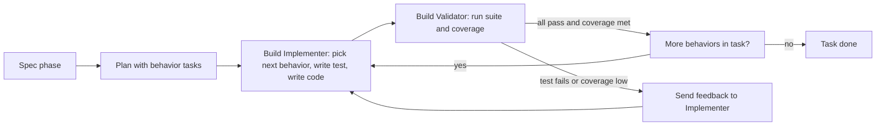

# Plugin Testing Strategy Redesign

## Introduction

The Molcajete plugin currently treats BDD as the default done signal. A task is complete when its Gherkin scenario passes. This is hard to bootstrap, locks the build loop to a single paradigm, and conflicts with how AI coding agents behave under context pollution.

This document maps the changes needed to remove BDD from the default flow and replace it with a test-first build loop. Two rules shape the design:

1. **The plan does not grow.** Plan tasks stay at the behavior level. The build agent breaks each task into test-and-code units internally; the planner never enumerates them. A plan with twenty tasks today should still be a plan with twenty tasks after this change.
2. **Refactor is reactive, not a forced step.** The build agent writes the test, then writes the code in its final form to pass the test. It does not write a throwaway "minimum" and then refactor. Refactoring happens reactively — either when validation fails and the fix requires restructuring, or when a later task does not fit the shape of code written for an earlier task.

BDD is not deleted from the plugin. It moves to an optional command set. The default workflow has no BDD in it.

## The Big Picture

### Current Workflow


### New Workflow



The build loop is owned by two agents working in series, both inside the same task:

- **Implementer** — picks the next behavior inside the task, writes its test, then writes the code in the best form it can produce to make the test pass. Test and production code are written together as one unit of work.
- **Validator** — runs the test suite and the coverage check. Reports back. If anything failed, it sends the failure details to the Implementer; the Implementer fixes the issue, possibly restructuring code as part of the fix. If everything passes and the task still has behaviors to cover, the loop continues. If the task's behaviors are exhausted and coverage is met, the task is done.

### What Changes

1. **Done signal** — BDD scenario gate replaced by a coverage gate at 80% plus all tests passing.
2. **Build agents** — A single implementation agent replaced by two: an Implementer that writes test plus code, and a Validator that runs the suite. They loop until the task is done.
3. **Plan tasks** — Tasks still describe behaviors. They do not gain Red/Green/Refactor sub-tasks. The build agent decomposes the task's behaviors at build time, not the planner.
4. **Refactor** — Not a forced phase. Code is written in its final form on the first pass. Restructuring happens reactively, either when the Validator surfaces a problem or when a later task needs to reshape earlier-task code to fit.

## Glossary

| Term | Definition |
|------|-----------|
| **Implementer** | The build subagent that writes one behavior's test and the code to pass it, in a single pass, in final form |
| **Validator** | The build subagent that runs the test suite and coverage check; returns ok or returns the failure details |
| **Behavior** | One observable thing a task is required to do; the build agent decides how many behaviors a task contains |
| **Build loop** | Inside one task: Implementer adds a behavior, Validator confirms, repeat until task complete |
| **Coverage gate** | The Validator check that the full suite passes and coverage meets the project threshold |
| **Reactive refactor** | Restructuring that happens because the Validator surfaced a problem, not because a separate phase mandates it |
| **Component testing** | Testing through the public API with all internal layers active; only the outermost edge is mocked |
| **Outer edge** | The boundary between your code and infrastructure you do not own: network, database server, external APIs, time, randomness |
| **Five Exit Doors** | Goldberg's assertion targets for component tests: Response, State change, External calls, Messages enqueued, Observability |
| **Coverage-recovery plan** | A plan emitted by `m:reverse-plan` whose tasks add unit and integration tests to existing code until the project reaches the coverage threshold; uses `intent: cover` |

## Concepts

### Principle: The Plan Stays Flat

The planner names behaviors. It does not enumerate the test-and-code work for each behavior. Whether a task contains one behavior or four, the planner writes one task. The build agent decomposes the task's behaviors at build time using the task description, the architecture doc, and the existing code.

This protects the plan from explosion. It also protects the planner from making decisions it cannot make well — the planner has spec context but not the implementation context needed to know how many behaviors a task really contains. The build agent has both.

What the planner produces per task: a clear description of the behavior or behaviors to deliver, the files expected to change, the references to spec material. What the planner does not produce: Red/Green/Refactor markers, test file paths, assertion lists.

### Principle: Test Plus Code In One Pass

The classic Red-Green-Refactor cycle has three explicit moves: write a failing test, write the minimum throwaway code to pass it, then refactor. The justification for the throwaway middle step is that humans need a green safety net before they can safely refactor.

For an agentic flow this is less useful. The Implementer can write the production code in its final form on the first pass. There is no human-style time saving in writing a hardcoded return first. The Implementer's job is therefore: write the test, then write the production code in the best form it can produce, then stop. Two artifacts, one pass.

This does not abandon TDD discipline. The test is still written first. The test still names the behavior before the implementation exists. The Three Laws of TDD still hold — production code only exists to make a test pass. What is dropped is the requirement that the production code be written in two stages.

### Principle: Refactor Is Reactive

Restructuring is never a scheduled phase. It happens for one of two reasons, both reactive:

1. **Validator feedback.** If the Validator returns ok, the Implementer moves to the next behavior. If it returns a failure, the Implementer fixes it. The fix might be a small assertion change, a missing branch, or it might require restructuring code that was written badly.
2. **Accommodating a later task.** When the Implementer starts task two, it may find that code written for task one does not fit the new behavior — the shape is wrong, an abstraction is missing, or the earlier code needs to make room. Restructuring task one's code as part of completing task two is expected and correct. The Implementer should plan ahead when the future shape is visible during task one, but the future is not always visible, and that is okay. Discovering the right structure while building the second task is a legitimate trigger for refactor, not a planning failure.

Three consequences for the build command:

- There is no phase that mandates "now refactor." If the Validator passes on the first try and the next task fits cleanly, no restructuring happens, and that is correct.
- When restructuring does happen, the test suite is already in scope and the Validator will run again. So restructuring stays safe — broken refactors surface immediately.
- Cross-task restructuring is in-scope for the Implementer working on the later task. It does not require reopening the earlier task or amending the plan.

### Principle: Phase Isolation Across Roles, Not Across Phases

The agentic TDD research (alexop.dev, Microsoft Azure) found that context pollution between the test-writing and code-writing context windows is the main reason single-agent TDD compliance drops to roughly 20%. Their fix was three subagents. Our fix is two subagents with different responsibilities:

- The **Implementer** owns the work of producing code. It writes the test and the code together; the test is its own intermediate artifact, not a separate context. The "did I write the test first" discipline is enforced by file-creation order, not by a separate agent.
- The **Validator** owns the work of judging correctness. It does not see the Implementer's reasoning. It runs the suite, reads the result, and reports back.

The separation matters because the Validator is the only signal the orchestrator trusts. If the Implementer says "tests pass," that is not enough — the Validator confirms it independently by running the suite. This is the maker-checker pattern from multi-agent orchestration, applied to a two-role loop.

### Principle: Component Testing with Outer-Edge Mocking

For any code that crosses a boundary — a handler, a service, a resolver, a mutation — the right test is a component test. The full internal stack runs for real. Only what is outside the service boundary is replaced.

Run real:
- Handler or resolver logic
- Service and domain layer
- Repository or data-access layer
- Request parsing, response serialization
- Authorization and validation

Mock at the outer edge:
- The network transport (outgoing HTTP to other services)
- The database server (the client calls, not the application's database layer)
- External APIs, email providers, payment processors
- Time and randomness

This is Goldberg's component testing pattern. It is identical in shape to Apollo Server's `executeOperation` for GraphQL and `@SpringBootTest` for REST in Spring. The principle is stack-agnostic: run everything you own, mock only the infrastructure you do not own.

**Five Exit Doors** for component test assertions:
1. Response shape and status code
2. State change persisted to the data store
3. Outgoing external calls made correctly
4. Messages enqueued or events emitted
5. Observability: errors logged, metrics emitted

Not every test needs all five; the Implementer selects the exits that are meaningful for the behavior under test.

### Principle: Tech Stack Detection Drives Mocking Guidance

Molcajete is technology-agnostic. When it tells the Implementer how to mock, it must phrase the guidance in terms the project's stack understands. The Implementer cannot pick the right mocking tool, or even identify what counts as "outside the service boundary," without knowing the stack.

Molcajete already has the answer. The `m:setup` command produces `prd/TECH-STACK.md` from the `TECH-STACK-template.md` template and keeps it current. That file is the authoritative source of stack truth for the project. The Implementer does not re-detect, sniff `package.json`, or maintain a parallel `stackProfile` cache — it reads `prd/tech-stack.md`.

**What the Implementer reads from `prd/tech-stack.md`:**

| Section | What it tells the Implementer |
|---|---|
| `Modules.{name}.Testing` | The test framework to use (Vitest, Jest, pytest, etc.) and the assertion/test-double library that comes with it |
| `Modules.{name}.Framework` and `Modules.{name}.Key libraries` | What internal layers to run for real (the HTTP framework, GraphQL server, ORM, validator) — anything listed here is "yours" and must not be mocked |
| `Applications` | Each application defines a service boundary; component tests exercise it through its public entry point (HTTP port, GraphQL endpoint, CLI command) |
| `Services` | Owned infrastructure (postgres, redis, etc.) — mock at the client edge or use a real instance via testcontainers; never mock the application's repository or data-access layer |
| `External Services` | Third-party APIs (OpenRouter, Stripe, Google Places, WebPush) — always mocked at the outer edge; this is what `msw`, `nock`, or the framework-native equivalent intercepts |
| `Repository Structure` | If `monorepo`, the Implementer scopes its reading to the `Module` whose `Directory` contains the file under test |

**How this maps to outer-edge mocking:**

- Anything in `Modules.{name}.Key libraries` → run for real
- Anything in `Services` → mock at the network/driver boundary (or run via testcontainers)
- Anything in `External Services` → mock at the network boundary, always
- Time and randomness → mock via the testing framework named in `Modules.{name}.Testing`

**For the testing skill:** the skill does not invent its own detection logic. It directs the Implementer to open `prd/tech-stack.md`, locate the `Module` whose directory contains the target file, and use its `Testing`, `Framework`, and `Key libraries` rows to select the test runner and the mocking tool. The skill provides the principle (mock the outer edge, run the inner stack); `prd/tech-stack.md` supplies the names.

If `prd/tech-stack.md` is missing or incomplete for the target module, the Implementer halts and reports — it does not guess. The fix is to re-run `m:setup`, not to introduce a parallel detection path.

## Options and Approaches

### What Changes, What Stays, What Moves

| Component | Current state | New state |
|---|---|---|
| `plan.md` command | Verifies Gherkin exists, maps each task to a scenario | Drops Gherkin verification; tasks describe behaviors; no scenario field; size unchanged |
| `build.md` command | Single implementation agent; Gherkin context; scenario tag activation; step definitions | Two-agent loop: Implementer writes test plus code, Validator runs suite and coverage; loops until task done |
| `reverse-plan.md` command | Generates wire-BDD plan for existing code | Repurpose — generates a coverage-recovery plan: behavior tasks that add unit and integration tests to existing code until the project reaches the coverage threshold; no BDD, no step definitions |
| `reverse-feature.md` command | Reverse-engineers spec and generates Gherkin | Keep — pure spec extraction (FR); already no Gherkin after this change |
| `reverse-usecase.md` command | Reverse-engineers UC and generates Gherkin | Keep — extracts use cases with flat plain-text scenarios; no Gherkin output |
| `reverse-scenario.md` command | Reverse-engineers Gherkin from code | Repurpose — extracts a behavioral scenario from code as a plain-text scenario entry inside its use case; no Gherkin output |
| `reverse-spec.md` command | Reverse-engineers specs and generates Gherkin | Keep — broadest spec extraction (FR + UC + plain scenarios); no Gherkin output |
| `scenario.md` command | Generates Gherkin feature files | Remove — Gherkin generation is gone; use-case scenarios are authored inline via `m:usecase` |
| `update-scenario.md` command | Updates a Gherkin scenario | Remove — Gherkin-only; non-Gherkin scenario edits flow through `m:update-usecase` |
| `update-usecase.md` command | Updates UC and propagates to Gherkin | Remove Gherkin propagation; keep UC update |
| `spec.md` command | Runs feature plus usecase plus scenario | Remove scenario step; spec ends at use-case authoring (scenarios live inside the use case) |
| `gherkin` skill | Master BDD skill | Remove entirely — no command needs it after this change; replaced by the new `testing` skill |
| `planning` skill | BDD-aligned tasks, scenario mapping, BDD gate | Remove BDD sections; add coverage gate; tasks remain flat |
| `implementing` skill | Wire-BDD intent, step definitions, scenario activation | Remove BDD sections; add Implementer guidance; reference testing skill |
| Plan `scenario` field | SC-XXXX or null; drives BDD gate | Remove |
| Plan `intent` field | `implement` or `wire-bdd` | Replace `wire-bdd` with `cover` (coverage-recovery tasks emitted by `reverse-plan`); keep `implement` |
| Plan sub-tasks | Used for context budget splitting | Unchanged — still optional, still used for budget splits; never used for RGR phases |
| Setup command | Detects BDD framework and language | Drop BDD detection; ensures `prd/tech-stack.md` is produced/refreshed (already part of `m:setup`); writes `testing.threshold` to `.molcajete/settings.json` |
| `settings.json` `bdd` key | BDD framework, language, featuresDir | Remove — BDD is gone from the plugin; stack info lives in `prd/tech-stack.md`; only `testing.threshold` is stored in settings |

### New Components Required

| Component | Type | Purpose |
|---|---|---|
| `testing` skill | New shared skill | Technology-agnostic testing principles; outer-edge mocking; Five Exit Doors; directs Implementer to read `prd/tech-stack.md` for stack-specific naming; Implementer and Validator role definitions |
| `intent: cover` task type | Plan schema enum value | Coverage-recovery task emitted by `reverse-plan`; build loop treats it identically to `implement` but the Implementer's behaviors are "add tests for X" rather than "implement behavior X" |
| Validator subagent definition | Build command section | Spec for a separate agent invocation that runs the suite and reports back; the maker-checker check |
| Coverage gate doc in skill | Documentation | What the verify hook must check, what each return value means to the loop |

## How To Do It — File-by-File Changes

### A. Plan Command (`plan/commands/plan.md`)

**Remove:**
- The "Verify Gherkin exists" step
- The `gherkin` skill from the load list
- All `scenario` field generation
- All `intent: wire-bdd` branches
- The "BDD gate" bullet in each task's Verification section in `plan.md`

**Rewrite:**
- Task descriptions: each task names a behavior or a small cluster of related behaviors; no test file paths, no assertion lists
- `intent` field: only value is `implement`
- Verification section in `plan.md` output: replace BDD gate bullet with "Coverage gate: full test suite passes and coverage meets project threshold, executed by the project's verify hook"
- Skill load list: add `testing` skill

**Important constraint:**
- The plan does not grow. A task with three behaviors is still one task. The planner names the behaviors in the description; it does not split them into sub-tasks for Red/Green/Refactor work.

### B. Build Command (`build/commands/build.md`)

This is the largest change. The build command becomes a two-agent loop.

**Remove:**
- Gherkin feature file loading from the context step
- Step definitions index loading
- The "Activate scenario tags" step entirely
- The Phase B "step definitions" work in the implementation step
- The "Gherkin and BDD Context" section
- The `gherkin` skill from the load list

**Rewrite the implementation step as a loop:**

Setup once per task:
- Load `testing` skill, `prd/tech-stack.md` (scoped to the module containing the task's files), and `.molcajete/settings.json testing.threshold`
- Load the task description and architecture doc
- Identify the behaviors the task must deliver — for `intent: implement` these are production behaviors; for `intent: cover` these are uncovered test paths. The Implementer subagent decomposes them on first invocation; the orchestrator does not enumerate them.

Loop until task done:

1. **Implementer subagent.** Context: task description, architecture doc, the relevant `Module` section of `prd/tech-stack.md`, current code state, list of behaviors already covered (initially empty), Validator feedback if any from prior iteration.
   - Pick the next uncovered behavior
   - Write the test for that behavior (file location follows project conventions)
   - Write the production code to pass the test, in its final form
   - Return: list of files changed, the behavior just covered, a brief note on what was done

2. **Validator subagent.** Context: list of files changed by the Implementer, the project's test command and coverage command (from settings or convention).
   - Run the full test suite
   - Run the coverage check
   - Return one of three outcomes:
     - `pass`: all tests green, coverage at or above threshold — if behaviors remain, loop back to Implementer; if not, task is done
     - `tests_failed`: which tests failed, their assertion messages — loop back to Implementer with this feedback
     - `coverage_low`: which files or branches are uncovered — loop back to Implementer with this feedback

3. **Loop control.** The orchestrator (build command itself) is the only thing that decides whether to loop or finish. The Implementer cannot mark a task done; only the Validator's `pass` plus the absence of remaining behaviors finishes the task.

**Add to the command:**
- Maximum iteration count with a configurable default (suggest 10) before pausing for human review
- Logging of each Implementer + Validator round to `.molcajete/plans/{plan}/runs/{task}.log` for debugging
- Behavior list tracking: as the Implementer covers behaviors, the orchestrator records them so subsequent Implementer invocations see what is already done

### C. Planning Skill (`plan/skills/planning/SKILL.md`)

**Remove:**
- "BDD-Aligned Tasks" section
- `scenario` field documentation in the task schema
- BDD gate in "Done Signals"
- `wire-bdd` intent documentation
- Gherkin file verification
- TEST-ISSUES discovery for reverse plans

**Rewrite:**
- Task schema: drop `scenario` field, drop `wire-bdd` from intent enum
- Done signals: "A task is done when (1) all behaviors named in the task description are covered, (2) the full test suite passes, (3) coverage meets the project threshold; the build command enforces these via the Implementer-Validator loop"
- Sub-tasks: keep their existing purpose — context budget splitting only. They are not used for Red/Green/Refactor phases.

**Add:**
- Brief note: "Task decomposition into test-and-code units is the build agent's responsibility, not the planner's"

### D. Implementing Skill (`build/skills/implementing/SKILL.md`)

**Remove:**
- "Scenario Activation" section
- `wire-bdd` intent procedures
- Step definition references
- BDD conventions references
- "PRD and BDD Layout" section

**Rewrite:**
- Implementation procedures: a single procedure for the Implementer subagent — "for each behavior, write the test then write the production code to pass it in final form"
- Add a procedure for the Validator subagent — "run the project test command, run the coverage check, return structured outcome"

**Add:**
- Outer-edge mocking guidance that reads `prd/tech-stack.md` for the target module
- Five Exit Doors reference for choosing what to assert
- Reactive refactor note: code restructuring is permitted only as part of a fix in response to Validator feedback
- A procedure for `intent: cover` tasks: the Implementer adds tests for uncovered paths and only touches production code when an untestable seam needs a reactive refactor

### E. Plan Schema

**Remove from task object:**
- `scenario` field

**Change in task object:**
- `intent` enum: drop `wire-bdd`; add `cover` (coverage-recovery tasks emitted by `m:reverse-plan`); keep `implement`

**No additions needed beyond the enum change.** The sub_tasks array remains as-is for its existing purpose (context budget splitting). It is explicitly not used to encode Red/Green/Refactor phases.

### F. Testing Skill (new: `shared/skills/testing/SKILL.md`)

Contents:

- **Role definitions**: Implementer and Validator, including what context each receives and what each returns
- **Test type selection**: unit for leaf logic; component for anything crossing a boundary; smoke optional at use-case edge
- **Outer-edge mocking**: mock only what is outside the service boundary; run everything inside it for real
- **Five Exit Doors**: response, state, external calls, messages, observability
- **Reading `prd/tech-stack.md`**: how to locate the right `Module` section, map its `Testing`, `Framework`, `Key libraries`, `Services`, and `External Services` rows to runtime decisions (what to run real, what to mock at the outer edge), and refuse to proceed if the section is missing or templated
- **Coverage gate**: what 80% means, how to read a coverage gap report, what to do about uncovered branches
- **Reactive refactor**: when restructuring is appropriate, when it is not
- **Test naming convention**: "when X then Y" structure, describe blocks mirror behavior hierarchy

### G. Setup Command Enhancement (`setup/commands/setup.md`)

The `m:setup` command already produces `prd/tech-stack.md` from the template — that file is the authoritative source of stack truth and the Implementer reads it directly. No parallel stack-profile cache is needed.

Changes:

- **Drop** BDD detection (framework, language, featuresDir) entirely.
- **Drop** the `bdd` key from `.molcajete/settings.json`.
- **Add** a `testing` key with the coverage threshold:

  ```
  testing:
    threshold: 80
  ```

- **Verify** that `prd/tech-stack.md` contains a `Modules.{name}.Testing` row for every module the build will touch. If a module's `Testing` row is missing or templated (still says `{e.g., ...}`), `m:setup` prompts the user to fill it in. The build refuses to start with an incomplete `tech-stack.md`.

For monorepos: `prd/tech-stack.md` already supports per-`Module` rows; the Implementer scopes its read to the `Module` whose `Directory` contains the file under test.

### H. Reverse Commands — Repurposed for Spec and Coverage Extraction

All reverse commands stay in the default plugin. None move to a BDD set. Each is rewritten to produce plain specifications (no Gherkin) or a coverage-recovery plan.

| Command | File | New behavior |
|---|---|---|
| `m:reverse-feature` | `spec/commands/reverse-feature.md` | Extracts a feature spec (FR) from existing code; no Gherkin output |
| `m:reverse-usecase` | `spec/commands/reverse-usecase.md` | Extracts a use case with its flat plain-text scenario list; cascades to any scenarios it finds, written inline in the use-case file |
| `m:reverse-scenario` | `spec/commands/reverse-scenario.md` | Extracts a single behavioral scenario from a code path and writes it as a plain-text scenario entry inside its parent use case; no Gherkin file, no `.feature` output |
| `m:reverse-spec` | `spec/commands/reverse-spec.md` | Broadest extraction: FR + UC + plain scenarios across multiple features; no Gherkin |
| `m:reverse-plan` | `plan/commands/reverse-plan.md` | Generates a **coverage-recovery plan**: scans existing code, identifies modules whose coverage is below the project threshold, emits behavior tasks with `intent: cover` whose Implementer responsibility is to add unit and integration tests until the module reaches the threshold |

**`m:reverse-plan` task shape (new):**

- `intent: cover`
- `description`: names the module or file under test and the uncovered branches or behaviors to target (the Implementer decomposes further at build time)
- `files`: the production files whose coverage must rise (test files are not enumerated by the planner)
- No `scenario` field

**Build loop handles `intent: cover` identically to `intent: implement`** — same Implementer + Validator pair. The only difference is that the Implementer's behaviors are framed as "add a test that exercises path X" rather than "implement behavior Y." Production code is touched only when reactive refactor is needed (e.g., to make an untestable seam testable); otherwise the Implementer only writes tests.

**Commands removed outright (no replacement, no optional set):**

| Command | File | Reason |
|---|---|---|
| `m:scenario` | `spec/commands/scenario.md` | Generated Gherkin feature files; use-case scenarios now live inline inside the use case, authored via `m:usecase` |
| `m:update-scenario` | `spec/commands/update-scenario.md` | Updated a Gherkin scenario; non-Gherkin scenario edits flow through `m:update-usecase` |

**Commands kept but trimmed:**

| Command | Change |
|---|---|
| `m:spec` | Remove the scenario-generation (Gherkin) step; spec ends at use-case authoring with inline scenarios |
| `m:update-usecase` | Remove Gherkin propagation; UC update only (scenarios edited in place inside the use case) |

### I. Gherkin Skill (`shared/skills/gherkin/`)

**Remove entirely.** Delete the directory and all references. No command in the default plugin needs it after this change, and there is no optional BDD command set to preserve it for.

BDD knowledge from the gherkin skill is not preserved verbatim. Anything still useful — the discipline of naming a behavior before implementing it, the "given / when / then" mental model for framing a test — is folded into the new `testing` skill as plain-language testing principles, not as Gherkin syntax.

### J. Plugin Manifest (`molcajete/.claude-plugin/plugin.json`)

**Remove from default commands list:**
- `scenario`
- `update-scenario`

**Keep in default commands list (now repurposed):**
- `reverse-plan` — coverage-recovery planner
- `reverse-scenario` — plain-scenario extractor

**Remove from default skills list:**
- `gherkin`

**Add to default skills list:**
- `testing`

## Gotchas and Edge Cases

| Problem | Cause | Mitigation |
|---------|-------|------------|
| Implementer rubber-stamps its own work | The same context that writes the code also judges it | Validator is a separate subagent invocation with no visibility into Implementer reasoning; trust only Validator's outcome |
| Implementer writes the code first and the test to match | Single context with both files open at once | Implementer procedure mandates file creation order: test file before production file; orchestrator can verify by checking commit or file mtimes between invocations |
| Loop runs forever on a hard behavior | Validator returns failure, Implementer retries, fails again | Maximum iteration count per task (default 10); on exhaustion, pause for human review with full log |
| Coverage at 80% but tests are vacuous | Lines executed without real assertions | Coverage is a floor, not a quality measure; pair with a review pass that scans for test files lacking assertions |
| Implementer keeps adding behaviors the task does not need | Loose task descriptions; agent infers extra scope | Task descriptions name the behaviors explicitly; Implementer's behavior list is bounded by what the task names, not by what the agent decides |
| `prd/tech-stack.md` is incomplete for the target module | Template placeholders left in, or a new module was added without re-running setup | Implementer halts and reports the missing fields; user re-runs `m:setup` to fill in `Testing`, `Framework`, `Services`, `External Services` for the affected module |
| Existing plans with `scenario` fields break | Plan schema changed; older plans carry old fields | Build command reads `scenario` defensively; logs a migration note but ignores the field |
| Existing projects have a `bdd` key and no `testing` key in `settings.json` | Project initialized before this redesign | `m:setup` migration step drops the `bdd` key and adds `testing.threshold`; build command refuses to start until the migration runs |
| `reverse-plan` emits a task whose target file has no production-code seam to test | Code under test calls an external API directly with no injection point | Implementer flags it; reactive refactor introduces a seam as part of the coverage task; the plan is not amended |
| Reverse commands still emit Gherkin after the rewrite | Gherkin output was embedded across prompts in the spec extractors | Audit each reverse command's output section; remove every mention of "feature file", "step definition", `.feature`, and `Scenario:` keyword scaffolding |
| Validator can't tell which tests are "new" for the current behavior | The full suite passes but no new assertions were added | Validator returns the set of newly added test file paths it observed; orchestrator checks at least one new test was added per Implementer iteration |

## Key Takeaways

1. **The plan does not grow.** Behaviors are named in task descriptions; the build agent decomposes them at build time. The planner produces the same number of tasks it always did.

2. **Two agents, not three.** Implementer writes test plus code together in final form. Validator runs the suite and judges. The loop continues inside the task until all behaviors are covered and coverage is met.

3. **Refactor is reactive.** Code is written in its final form on the first pass. Restructuring happens for one of two reasons: the Validator surfaces a problem and the fix requires it, or a later task does not fit the shape of earlier-task code and needs to reshape it. No forced Refactor phase.

4. **Test-first discipline survives without three phases.** The Implementer writes the test before the production code as a matter of procedure; the artifact order is enforced by file creation. The throwaway-minimum step is dropped because it adds no value when an agent can write good code on the first pass.

5. **The Validator is the only signal the orchestrator trusts.** Maker-checker pattern: the Implementer's claim "tests pass" is not enough; the Validator independently runs the suite.

6. **Component testing with outer-edge mocking is the default for boundary-crossing code.** Run the full internal stack; mock only network, database server, external APIs, time, randomness. Use the Five Exit Doors to decide what to assert.

7. **`prd/tech-stack.md` is the single source of stack truth.** The Implementer reads the relevant `Module` section to choose the test runner, decide what to run real, and decide what to mock at the outer edge. No parallel `stackProfile` cache; no re-detection.

8. **BDD is removed, not relocated.** The `gherkin` skill, `m:scenario`, and `m:update-scenario` are deleted. The remaining BDD-shaped commands (`m:reverse-scenario`, scenario fields inside use cases) are repurposed to produce plain-text scenarios authored directly inside use cases.

9. **All reverse commands stay and become pure spec/coverage extractors.** `reverse-feature`, `reverse-usecase`, `reverse-scenario`, `reverse-spec` extract specifications (FR, UC, plain scenarios) from existing code with no Gherkin output. `reverse-plan` is repurposed as a coverage-recovery planner: it emits `intent: cover` tasks whose Implementer adds unit and integration tests until the project reaches the coverage threshold.

10. **The plan schema stays close to compatible.** Sub-tasks remain for context budget splitting only. The `scenario` field is removed; `intent` swaps `wire-bdd` for `cover`. No new fields are added.

## Sources

### Tier 1 (Official)

- [AI Agent Orchestration Patterns — Azure Architecture Center](https://learn.microsoft.com/en-us/azure/architecture/ai-ml/guide/ai-agent-design-patterns) — Maker-checker loops; sequential orchestration; trust only the checker
- [Designing Multi-Agent Intelligence — Microsoft Developer Blog](https://developer.microsoft.com/blog/designing-multi-agent-intelligence) — Supervisor + worker; state machine with formal phase transitions
- [JavaScript and Node.js Testing Best Practices — Yoni Goldberg](https://github.com/goldbergyoni/javascript-testing-best-practices) — Component testing; Five Exit Doors; outer-edge mocking
- [Integration Testing — Apollo Server Docs](https://www.apollographql.com/docs/apollo-server/testing/testing) — executeOperation pattern; what to run real vs mock for GraphQL
- [Testing Approaches — GraphQL.js Docs](https://www.graphql-js.org/docs/testing-approaches/) — Three-layer model; integration via graphql() function

### Tier 2 (Authoritative)

- [Red/Green TDD — Agentic Engineering Patterns — Simon Willison](https://simonwillison.net/guides/agentic-engineering-patterns/red-green-tdd/) — Test-first discipline for agentic flows
- [Forcing Claude Code to TDD: An Agentic Red-Green-Refactor Loop — alexop.dev](https://alexop.dev/posts/custom-tdd-workflow-claude-code-vue/) — Subagent isolation for context pollution; the source pattern this design adapts
- [tdd: Red, Green, Refactor for Agentic Coding — AI Hero Skills](https://www.aihero.dev/skills-tdd) — One behavior at a time; tests verify external behavior through public interfaces
- [The Testing Trophy and Testing Classifications — Kent C. Dodds](https://kentcdodds.com/blog/the-testing-trophy-and-testing-classifications) — Mock at the network boundary, not at the function level
- [Integration Testing for GraphQL APIs — WunderGraph](https://wundergraph.com/blog/integration_testing_for_graphql_apis_type_safe_locally_and_in_ci) — Full-stack execution with credential boundary mocking

### Tier 3 (Community)

- [Deep Dive into REST API Integration Testing in Spring Boot](https://codefarm0.medium.com/deep-dive-into-rest-api-integration-testing-in-spring-boot-d7ac3051cc07) — Full-stack execution with infrastructure boundary substitution
