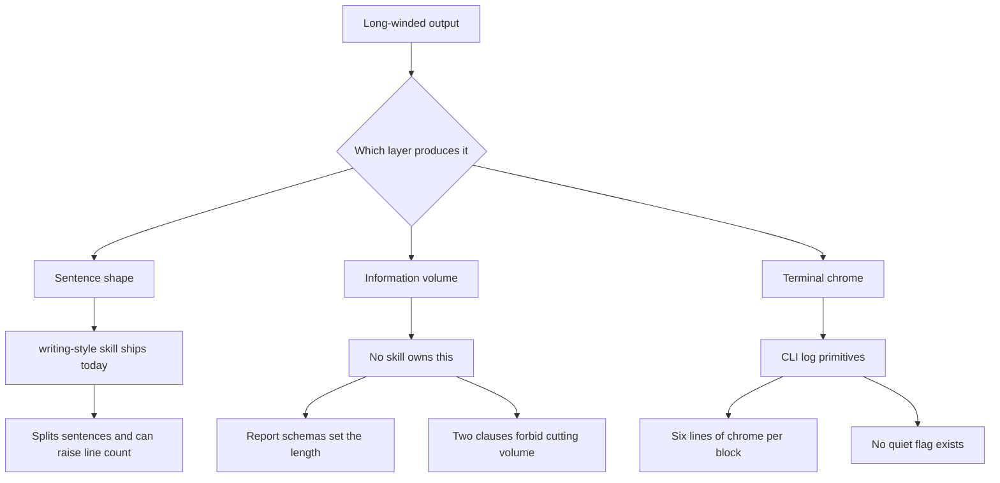

# Reducing Long-Windedness in Molcajete

## Introduction

**No part of Molcajete owns output economy.** That is the finding. Volume was never assigned to a skill, a command, or a template. In three places Molcajete explicitly disowns it, in bold, inside files that load on every command. And every report shape in the plugin was specified without a budget.

The `writing-style` skill was never going to fix this, because volume was never its job. ASD-STE100 governs sentence shape. A grep of the full Issue 9 text for `redundan`, `repetit`, `concise`, `brevity`, `verbos`, `wordy`, and `superfluous` returns zero hits in any rule. Two of its rules add words.

That is a fact about the standard, not an excuse. Writing "This does not reduce how much you write" was Molcajete's own choice. So was specifying twelve report shapes with no ceiling. The gap is a design omission, and it is fixable here.

This guide names the root causes and gives the ordered change list.

## Status

Applied on 2026-08-07, plugin only:

- `shared/skills/output-economy/` — new skill governing volume across files, screen output, question briefs, and command output. Registered in `plugin.json` and loaded by all 12 commands.
- The three disowning clauses are gone (`principles:231`, `writing-style:59`, `setup.md:212`).
- `principles` 1.4, 5.3, and 5.4 rewritten as density heuristics; Principle 7 now carries both halves.
- Floors removed from the report shapes, the research guide template, the README template, and the question brief.

The CLI changes in section 8 are not applied.

## The Big Picture



Three independent layers produce the length. The `writing-style` skill covers the leftmost one. The middle layer is where the words actually are. The rightmost layer is pure CLI chrome and has no governing rule at all.

## Glossary

| Term | Definition | Example |
|---|---|---|
| Conciseness | Expressing given content in fewer words | "Do a check of X" becomes "check X" |
| Minimalism | Carrying only content the reader's task needs | Deleting an orientation preamble nobody reads |
| Completeness | Carrying every fact the reader's task needs | Never dropping a scope qualifier |
| Derived brevity | Shortness that falls out of task-orientation, never targeted directly | Carroll's central claim |
| Resident set | Lines of instruction loaded per command invocation | `/m:plan` loads about 2,033 lines |
| Report schema | The mandated item list a command must print | `build.md` Step 11 mandates 8 items |
| Recall filter | A brevity instruction that suppresses true findings | A review misses a real bug |
| Output style | The only plugin surface that edits the system prompt | `output-styles/concise.md` |

## Concepts

### The standard that resolves the constraint

The stated goal is to be as precise as possible without using more words than necessary, and to never leave an explanation incomplete. That is a published Tier-1 definition, near verbatim.

**ISO/IEC/IEEE 26514:2022, clause 3.1.34:**

> minimalism: principle that information for users includes critical information and the least amount of other information needed to be complete

Its parent, **IEC/IEEE 82079-1:2019 clause 5.3**, requires seven co-equal information-quality principles: Completeness, **Minimalism**, Correctness, **Conciseness**, Consistency, Comprehensibility, and Accessibility. Completeness and Minimalism are adjacent, simultaneously binding clauses. The standard does not treat them as a trade-off. Completeness is the constraint. Minimality is the objective under it.

26514 splits Conciseness (7.5) and Minimalism (7.6) into separate clauses. They are different things. Molcajete needs both.

### Why ASD-STE100 cannot shorten anything

Verified verbatim from the official Issue 9 PDF.

| Rule | Text | Volume effect |
|---|---|---|
| 5.1 / 6.3 | "Use a maximum of 20 words in each sentence" / 25 for descriptive text | Caps the sentence, not the document |
| 6.6 | "Make sure that no paragraph has more than six sentences" | **Splits**, never deletes |
| 4.2 | "Do not omit words or use contractions to make your sentences shorter" | **Adds words** |
| 3.7 | Use an approved verb, not a noun | Its own example turns `Check the laptop battery` into `Do a check of the laptop battery` |
| 6.1 | "Give information gradually" | Progressive disclosure, already in the standard |

From the General Introduction:

> **Can STE be used alone? No.** It is intended to be used with other applicable specifications for technical publications, style guides, and official directives.

Adding a volume layer is not a deviation from STE. It is what STE instructs.

### The two lines that disabled volume control

`plugin/molcajete/shared/skills/principles/SKILL.md:231`

> **This does not reduce how much you write.** Rules 1.4 and 5.4 still stand in full — comments stay verbose and generous.

`plugin/molcajete/shared/skills/writing-style/SKILL.md:59`

> **Comment volume does not change.** ... Both still apply in full.

`plugin/molcajete/setup/commands/setup.md:212` propagates the same clause into the host project's always-loaded `CLAUDE.md`:

> This shortens sentences; it never reduces how much you write.

These are scoped to code comments, which is defensible. The damage is positional. A bold "verbose" signal sits in the resident context of `/m:plan`, `/m:spec`, and `/m:build` — commands that write documents, not comments. Anthropic states the cost directly:

> Appending the system prompt has diminishing returns for adherence. Generally, the more instructions you provide using this method, the less strictly Claude will follow them, **particularly if any contradict.**

A contradiction degrades adherence across the whole stack, not only the contradicting pair.

### Brevity is a derived property, not a target

Carroll and van der Meij, *Ten Misconceptions about Minimalism* (IEEE Transactions on Professional Communication 39(2), 1996). Misconception 1 is "Minimalism means brevity." Their rebuttal:

> Brevity is a key element of minimalism, but only because it can facilitate task-oriented activity ... **not as a self-sufficient end in itself. Wantonly slashing text and leaving other design characteristics unchanged will not lead to a minimalist design.**

> brevity ... **has never been the totality of the approach** ... it is identified as **a derivative property**.

A rule that says "be shorter" will fail. A rule that says "delete anything that does not serve the reader's task" will work. Their misconception 2 covers the completeness constraint: "just the right amount of information, not too much or too little."

### Length is designed into the report schemas

No `## Step N: Report` section in any command carries a length budget.

| Command | Mandated report items | Budget |
|---|---|---|
| `/m:build` Step 11 | 8, one being a 7-field per-task loop | none |
| `/m:setup` Step 14 | 6 | none |
| `/m:plan` Step 6 | 4 | none |
| `/m:spec` Step 11 | 3 | none |

`build.md:324-326` goes further and forbids the report from shrinking:

> emit this exact table with **one row for every artifact in the plan's scope** ... **including rows intentionally left unchanged**

That is a schema problem. No amount of "be concise" will fix it.

The correct pattern already exists in four of fifty-two files: `asking-questions/SKILL.md:46` ("Under 250 words. At most 4 options."), `review.md:74` ("3-5 bullets"), `review.md:95` ("2-4 hotspots ... one sentence each"), and `code-documentation/SKILL.md:25` ("2-4 sentences").

### The verbose model is pinned to the verbose commands

Anthropic, *Prompting Claude Opus 5*:

> Claude Opus 5's default user-facing responses run longer than prior Opus models' ... **To control response length, prompt for it explicitly.**

> Separate from conversational verbosity, **files that Claude Opus 5 writes to disk** (reports, Markdown documents, summaries) **are often longer** than on prior models.

The plugin pins `claude-opus-5` for `/m:spec`, `/m:change`, `/m:fix`, `/m:cover`, `/m:plan`, `/m:review`, and `/m:preflight` — exactly the long-winded set. Sonnet 5 "calibrates response length to the complexity of the task rather than defaulting to a fixed verbosity", so the Sonnet-pinned commands are a smaller problem.

### The CLI never loads the skill at all

`molcajete/claude/.claude-plugin/plugin.json` registers 6 skills. `writing-style` is not one of them. Neither is `principles`. Both are vendored to disk and hashed in `.sync-manifest.json`, but `--plugin-dir` surfaces skills through the manifest. There is no `--append-system-prompt` anywhere in `src/`.

So `principles/SKILL.md:240` — "Every command loads it before it writes" — is **false for the CLI**. It is inherited phrasing from the plugin repo. Every headless `claude -p` subprocess the CLI spawns runs without either skill.

The CLI's own terminal output has no volume control either: 126 print call sites, no `--quiet`, no log level, and `src/lib/block.ts:38-64` spends 6 to 7 lines of box-drawing chrome per block across 9 nested sites.

## Options and Approaches

| Lever | Reach | Evidence strength | Effort | Verdict |
|---|---|---|---|---|
| Delete the conflicting clause | Global | Highest. Anthropic cut 80% of Claude Code's system prompt with no eval loss | Minutes | **Do first** |
| Budget every report schema | Per command | High. Schemas control shape and length well | Hours | **Do** |
| Output style (`output-styles/concise.md`) | System prompt, all `/m:*` | High. The only surface that edits the system prompt; the harness re-injects reminders | Hours | **Do**, but it misses subagents |
| New `minimalism` skill | All commands | High. Tier-1 standard chain plus Carroll | Half day | **Do** |
| `<tone_preference>` end reminder | Per file | High. Vendor-recommended for this exact constraint | Minutes | Do |
| Register skills in the CLI manifest | Every subprocess | Certain. Currently unreachable | Minutes | **Do** |
| CLI `--quiet` and collapsed block chrome | Terminal | Certain. Mechanical | Hours | Do |
| Schema `description` fields | Subprocess JSON | Medium. Anthropic ignores `maxLength`, so `description` is the only lever | Minutes | Do |
| Deduplicate the corpus | Global | Medium. Semantic merging works; reordering measured slightly negative | Day | Do carefully |
| Vale in CI | Repo prose | Medium. Zero dependencies, one config file, official Action | Hours | Optional |
| Explicit precedence statement | — | **Weakest of six remedies.** This is where Molcajete is now | — | **Remove** |
| `max_tokens` or `effort` | — | Guillotine, not editor. Effort controls thinking, not response length | — | **No** |
| Word-count caps | — | 6.06% adherence against 35.59% for sentence counts | — | **No** |

## How To Do It

Ordered by leverage. Every path is verified against the repo.

### 1. Delete the anti-brevity clauses

- `plugin/molcajete/shared/skills/principles/SKILL.md:231` — delete the "This does not reduce how much you write" paragraph.
- `plugin/molcajete/shared/skills/writing-style/SKILL.md:59` — rewrite the "Comment volume does not change" bullet.
- `plugin/molcajete/setup/commands/setup.md:212` — delete the same clause from the host `CLAUDE.md` block.

Delete. Do not arbitrate. Explicit precedence is remedy 5 of 6 by evidence strength, and it costs tokens.

### 2. Rewrite principles 1.4 and 5.4 at the right altitude

Targets: `principles/SKILL.md:92-109` (rule 1.4), `:178-186` (rule 5.2), `:199-210` (rule 5.4).

Remove the two count rules that scale with code size:

- `:201` — "if a function has three blocks of work, it has at least three inline comments"
- `:205` — "Almost every line of non-trivial code earns a comment"

Anthropic's own published before-and-after for this exact rewrite:

> **Then:** "default to writing no comments. Never write multi-paragraph docstrings or multi-line comment blocks"
>
> **Now:** "Write code that reads like the surrounding code: match its comment density, naming, and idiom."

Then delete the mirrored arbitration in `writing-style/SKILL.md`. With 1.4 and 5.4 at the right altitude, there is nothing left to arbitrate.

### 3. Add a minimalism skill beside writing-style

New file: `plugin/molcajete/shared/skills/minimalism/SKILL.md`. Register it in both manifests.

Content:

- Cite IEC/IEEE 82079-1:2019 clause 5.3 and ISO/IEC/IEEE 26514:2022 clause 3.1.34. This gives the skill authority equal to STE.
- Write **task-orientation** rules, not "be shorter" rules. Carroll predicts the latter fails.
- Set the priority order for a unit that runs too long: first delete words that carry no information, then **move** content to the layer where it belongs, then split. Only the first step reduces total volume. The other two reduce local volume, which is what makes a document feel long-winded.
- Add the mechanizable rules absent from `writing-style` today: hidden verbs and nominalizations (`-ment`, `-tion`, `-sion`, `-ance`; "make an application for" becomes "apply for"), `there is` and `there are`, the wordy-phrase substitution table, excess modifiers, and doublets.
- **Preserve `writing-style/SKILL.md:83` verbatim** — "If a sentence fails a check, split it. Do not delete the fact it carries." That line independently arrives at ISO 26514's definition. Keep it.

While in the file: `writing-style/SKILL.md:31-43` merges procedural and descriptive rules into one table. STE separates them (Section 5 against Section 6) with different budgets, 20 words against 25. Split the table and add the rule numbers.

### 4. Put a budget on every report step

Use **sentences, bullets, and sections. Never word counts.** Measured adherence is 6.06% for word counts and 35.59% for sentence counts. Make each budget task-conditional, not global. Copy the shape already used in `asking-questions/SKILL.md:46`.

| File | Lines | Change |
|---|---|---|
| `build/commands/build.md` | 338-355 | 8 items with a 7-field per-task loop. The biggest single driver. Cut fields, or move per-task detail behind an explicit request. |
| `build/commands/build.md` | 324-336 | Drop "including rows intentionally left unchanged". |
| `build/commands/build.md` | 227-234, 262-271 | Two evidence dumps precede the report. Collapse them. |
| `spec/commands/spec.md` | 134-146 | Add a budget |
| `spec/commands/cover.md` | 99-112 | Add a budget |
| `plan/commands/plan.md` | 77-88 | Add a budget |
| `spec/skills/spec-revision/SKILL.md` | 123-134 | Add a budget |
| `review/commands/preflight.md` | 79-90 | Add a budget |
| `shared/commands/doc.md` | 91-96 | Add a budget |

Leave `review.md:74` and `review.md:95` alone. They already carry budgets.

### 5. Stop emitting artifacts twice

The two-move brief rule prints the whole artifact, then writes it to disk. Four sites:

- `research/commands/research.md:52` — "present it in full first". Present the takeaways and the path instead, then offer the full text on request.
- `spec/commands/spec.md:71-75` — "print its full content as Markdown, section by section".
- `setup/commands/setup.md:154-159` — "print the full composed foundation".
- `plan/skills/plan-authoring/SKILL.md:225-229` — "write the full direction as Markdown, in sections".

### 6. Ship an output style

New file: `plugin/molcajete/output-styles/concise.md`, registered in `plugin.json`.

```yaml
name: concise
description: Dense, complete output for Molcajete commands
keep-coding-instructions: true
force-for-plugin: true
```

This is the only plugin surface that reaches the system prompt, and Claude Code re-injects adherence reminders for it automatically.

**Caveat: it does not reach subagents.** Anthropic states that "a subagent runs its own system prompt, so styles don't change how subagents respond." Molcajete commands dispatch heavily to subagents, so those need the constraint in their own dispatch prompts.

Note that `/output-style` was deprecated in Claude Code v2.1.73 and removed in v2.1.91. Use `/config` or the `outputStyle` setting.

### 7. Add the end-of-file tone reminder to the Opus-pinned commands

Vendor-recommended for exactly this constraint:

> In a long system prompt, pair the instruction with a short reminder near the end of the prompt: `<tone_preference>Keep outputs reasonably concise.</tone_preference>`

Apply to `spec.md`, `change.md`, `fix.md`, `cover.md`, `plan.md`, `review.md`, and `preflight.md`.

### 8. Wire the CLI

| File | Lines | Change |
|---|---|---|
| `molcajete/claude/.claude-plugin/plugin.json` | 17-24 | **Register `writing-style` and `principles`.** Both ship and neither is reachable. |
| `molcajete/src/lib/block.ts` | 38-64 | Collapse the 6-line frame to one line. Nine sites, nested per slice. The single biggest terminal win. |
| `molcajete/src/commands/build/sessions.ts` | 67/74, 144/148, 250/253, 327/330, 375/378, 448/455, 506/510 | Every block header is followed by a `log()` that restates it. Delete one side. |
| `molcajete/src/commands/lib/hooks.ts` | 129 | `log("Running hook: X")` fires for about 15 no-op hooks per slice. Gate it. |
| `molcajete/src/commands/lib/claude.ts` | 87-96, with `format.ts:186-192` | Elapsed, Real, and Cost print twice per session. |
| `molcajete/src/lib/utils.ts`, `block.ts`, `cli.ts` | 22-46 | **Add `--quiet`.** A two-file change makes all 126 call sites suppressible. Nothing today produces less than the default. |
| `molcajete/src/lib/config.ts` | 48-89 | Add `description` to every prose field: `summary`, `key_decisions[]`, `code_review[]`, `completeness[]`. All are bare today. Anthropic ignores `maxLength`, so `description` is the only schema lever. Convert anything enumerable to `enum`. |
| `molcajete/src/commands/setup/index.ts` | 81-89 | The one unconstrained path: no `--json-schema`, and `stdio: "inherit"`. Add a schema. |
| `molcajete/claude/setup/commands/setup.md` | 105-125, 186-192 | Two mandated stdout dumps land verbatim on the terminal. |

Leave `claude/build/commands/validate.md:58` ("Surface everything in one pass") alone. See the gotchas table.

### 9. Deduplicate by semantic merge

- Writing-style boilerplate: 12 identical copies, one per command.
- Asking-questions boilerplate: 16 identical copies.
- Resident set per invocation: about 1,781 lines for `/m:build`, about 2,033 for `/m:plan`, and roughly 400 to 500 directives.

Every individual file passes Anthropic's 500-line skill limit. The problem is composition. IFScale measures degradation onset at 150 to 250 instructions, and the failure mode is **silent omission, not visible error**. The omission-to-modification ratio reaches 34.88 to 1 at high density. That is exactly the "the model ignores half my skill" symptom.

Merge semantically. Pure restructuring measured **negative** for Sonnet, at minus 1.2 points.

### 10. Fix the plugin's own prose

138 sentences exceed the mandated 25-word cap, across 29 of 52 files. Genuine offenders of 33 to 47 words sit in `setup.md` and `spec-revision`. Anthropic states the cost:

> Match your prompt style to the desired output ... **removing markdown from your prompt can reduce the volume of markdown in the output.**

The prompts currently model the verbosity they forbid.

The corpus holds only 31 hedge words across about 64,700 words, so filler linters would find nothing. The measurable defects are sentence length and passive voice, at 241 candidates.

### 11. Delete over-verification scaffolding

Free tokens on Opus 5, vendor-stated:

> If your prompt contains explicit verification instructions ... **remove them**: instructions like these cause over-verification on Claude Opus 5, and removing them reduces wasted tokens with no loss in quality.

Audit the `/m:build` review loop and `/m:preflight`.

### 12. Optional: adopt Vale in CI

`plugin/` has no `package.json`, no `node_modules`, and no workflows. Vale needs one config file. The binary lives in the Action runner, so no npm dependency enters the repo.

**No ASD-STE100 Vale package exists.** This was verified against the Vale Package Explorer, the registry source `vale-cli/packages/library.json`, and a GitHub-wide search. Avoid `github.com/stuffbucket/vale`; it is unrelated to Vale, has two stars, and its own README concedes it is not certified. Build the sentence-length rule directly with `extends: occurrence` and `scope: sentence`.

Note the org rename: `errata-ai` is now `vale-cli`.

### 13. Optional: drop dead weight from the published tarball

`claude/build/scripts/molcajete.mjs` (1,599 lines, orphaned), `claude/spec/skills/**` (about 1,325 lines, unregistered), and `demo-output-format.sh` (774 lines). Roughly 3,700 lines ship to every user for zero effect.

## Gotchas and Edge Cases

| Problem | Cause | Mitigation |
|---|---|---|
| Reviews start missing real bugs | A brevity instruction acts as a **recall filter**. Anthropic: "Precision typically rises, but measured recall can fall even though the model's underlying bug-finding ability has improved." | Exempt `/m:review` findings and the build completeness sweep. Generate exhaustively, then filter in a second pass. Anthropic: "ask it to report everything and filter in a separate pass instead." Keep `validate.md:58`. |
| Word caps get ignored | Word-count adherence is 6.06%; sentence-count adherence is 35.59%. Models over-generate, worst on short targets. | Budget in sentences, bullets, and sections. |
| Caps added, little changes | Anthropic's own internal measurement puts numeric anchors at about 1.2% improvement over a well-written qualitative section. | The qualitative framing does the work. Numbers are a marginal add-on. |
| "Don't be verbose" backfires | Four vendors document negation failing. Anthropic on verbosity specifically: "Positive examples ... tend to be more effective than negative examples." | Convert to allow-lists. Google's pattern replaces "Do not list W" with "Only discuss X, Y, and Z". |
| A precedence rule does not settle the conflict | Claude Code memory docs: "if two rules contradict each other, Claude **may pick one arbitrarily**." Measured obedience under explicit emphasis is about 64% for GPT-4o. | Delete the conflicting rule. Do not declare a winner. |
| The output style has no effect on subagents | "a subagent runs its own system prompt, so styles don't change how subagents respond." | Put the constraint in each dispatch prompt too. |
| A custom output style breaks coding behavior | Custom styles strip Claude Code's built-in software-engineering instructions by default. | Set `keep-coding-instructions: true`. |
| Vale runs and CI stays green | Only `error`-level alerts exit non-zero. `Microsoft.Wordiness` and sentence-length rules ship as `suggestion`. `MinAlertLevel` controls display, not the gate. | Promote explicitly. Land at `suggestion`, then promote `Wordiness` first because it is auto-fixable. |
| Reorganizing files changes nothing | Pure restructuring measured minus 1.2 points for Sonnet. The fix that worked was semantic merging and conflict elimination. | Merge meaning, not layout. |
| Tightening toward STE's dictionary adds words | Rule 3.7's own example produces "Do a check of the laptop battery", a nominalization that plainlanguage.gov bans. | `writing-style/SKILL.md:49` already declines the dictionary. Keep that decision. |
| `max_tokens` produces truncation | It is a guillotine. Google: "it just causes the LLM to stop predicting more tokens once the limit is reached." | Never use it for style. `effort` controls thinking, not response length. |

## Key Takeaways

1. **Output economy is nobody's job in Molcajete.** No skill, command, or template owns how much gets written, and three files explicitly disown it. ASD-STE100 has no volume rule and its own introduction says it must be paired with a style guide — but the omission is Molcajete's to fix, not the standard's to explain.
2. **Two lines in the repo forbid the fix.** `principles/SKILL.md:231` and `writing-style/SKILL.md:59` say "This does not reduce how much you write" in bold, inside the resident context of every command. Delete them. Do not arbitrate around them.
3. **Length is designed into the report schemas.** No `## Step N: Report` in any command carries a budget, and `build.md:324` forbids the status table from shrinking. That is a schema defect, not a tone defect.
4. **Brevity is a derived property.** Carroll: "Wantonly slashing text ... will not lead to a minimalist design." Write task-orientation rules and let shortness fall out.
5. **The constraint is a published standard.** ISO/IEC/IEEE 26514:2022 clause 3.1.34 defines minimalism as "critical information and the least amount of other information needed to be complete." Cite it and the new skill gets authority equal to STE.
6. **Budget in sentences and bullets, never words.** Adherence is 35.59% against 6.06%. Expect the qualitative framing to do nearly all the work.
7. **The CLI never loads `writing-style` or `principles`.** Both are vendored and unregistered in `claude/.claude-plugin/plugin.json`. Every headless subprocess runs without them. The fix is two lines of JSON.

## Sources

### Tier 1 (Official)

- [ASD-STE100 Issue 9, January 2025](https://www.asd-ste100.org/assets/files/ASD-STE100_ISSUE9.pdf) — full PDF extracted; all rule text verified verbatim
- [Prompting Claude Opus 5](https://platform.claude.com/docs/en/build-with-claude/prompt-engineering/prompting-claude-opus-5) — default verbosity, written-deliverable length, agentic narration, `<tone_preference>`, over-verification removal
- [Prompting Claude Sonnet 5](https://platform.claude.com/docs/en/build-with-claude/prompt-engineering/prompting-claude-sonnet-5) — task-calibrated length, positive over negative examples, recall as a filter
- [Claude prompting best practices](https://platform.claude.com/docs/en/build-with-claude/prompt-engineering/claude-prompting-best-practices) — tell Claude what to do, match prompt style to output
- [Claude Code output styles](https://code.claude.com/docs/en/output-styles) — system-prompt modification, `keep-coding-instructions`, `force-for-plugin`, subagent exclusion
- [Claude Code memory](https://code.claude.com/docs/en/memory) — "may pick one arbitrarily", 200-line CLAUDE.md target
- [Agent Skills best practices](https://platform.claude.com/docs/en/agents-and-tools/agent-skills/best-practices) — 500-line body, one-level nesting, context as a public good
- [Steering Claude Code](https://claude.com/blog/steering-claude-code-skills-hooks-rules-subagents-and-more) — diminishing returns on appended instructions
- [The new rules of context engineering for Claude 5](https://claude.com/blog/the-new-rules-of-context-engineering-for-claude-5-generation-models) — 80% system-prompt removal, "Repeat yourself" becomes "remove redundancy"
- [Anthropic structured outputs](https://platform.claude.com/docs/en/build-with-claude/structured-outputs) — `maxLength` unsupported
- ISO/IEC/IEEE 26514:2022 clauses 3.1.34, 7.5, 7.6 — minimalism definition; preview verified, body paywalled
- IEC/IEEE 82079-1:2019 clause 5.3 — seven co-equal quality principles; structure verified, body paywalled
- [Federal Plain Language Guidelines, Rev. 1](https://www.plainlanguage.gov/) — hidden verbs, wordy phrases, noun strings
- [Strunk, The Elements of Style, Rule 13](https://www.gutenberg.org/ebooks/37134) — "make every word tell"

### Tier 2 (Authoritative)

- [Carroll and van der Meij, Ten Misconceptions about Minimalism](https://ris.utwente.nl/ws/files/249663536/Caroll1996ten.pdf) — IEEE TPC 39(2), 1996; PDF extracted, all ten verified
- van der Meij and Carroll, Principles and Heuristics for Designing Minimalist Instruction, *Technical Communication* 42(2), 1995
- [IFScale](https://arxiv.org/abs/2507.11538) — instruction-density degradation, silent-omission failure mode
- [LIFEBench](https://arxiv.org/abs/2505.16234) — NeurIPS 2025, length-instruction following
- [TALE](https://arxiv.org/abs/2412.18547) — ACL Findings 2025, token budgets
- [The Benefits of a Concise Chain of Thought](https://arxiv.org/abs/2401.05618) — 48.7% reduction, 27.69% math penalty
- [Context Rot](https://www.trychroma.com/research/context-rot) — Chroma, 18 models
- [Microsoft Writing Style Guide](https://learn.microsoft.com/en-us/style-guide/welcome/) — "avoid weak phrasing like there is, there are"
- [Google developer documentation style guide](https://developers.google.com/style) — filler words, timeless documentation
- [NN/g Progressive Disclosure](https://www.nngroup.com/articles/progressive-disclosure/) and [Inverted Pyramid](https://www.nngroup.com/articles/inverted-pyramid/)

### Tier 3 (Community)

- [Diataxis](https://diataxis.fr/) — completeness at the set level, brevity at the document level
- [oXygen DITA Style Guide: Minimalism](https://www.oxygenxml.com/dita/styleguide/Authoring_Concepts/c_Minimalism.html)
- [Vale](https://vale.sh/hub/) — package hub verified; no ASD-STE100 package exists
- Williams, *Style: Lessons in Clarity and Grace* — seven concision principles

### Tier 4 (Unverified)

- [Can LLMs Track Their Output Length?](https://arxiv.org/abs/2601.01768) — unreviewed preprint; source of the 6.06% and 35.59% figures. Verify before treating as load-bearing.
- [Instruction Stacking Collapse](https://arxiv.org/html/2608.02639) — unreviewed preprint; semantic merging beats reordering
- Claude Code v2.1.88 reconstructed source, present in this workspace — source of the 1.2% numeric-anchor figure. Version-specific and reverse-engineered. A strong signal, not a citation.

## Corrections Found During Research

- `principles/SKILL.md:240` claims "Every command loads it before it writes" about `writing-style`. True in `plugin/`, false in the CLI.
- `plugin/molcajete/~/.pnpm/` exists as a stray directory, evidently from a mis-quoted pnpm invocation.
