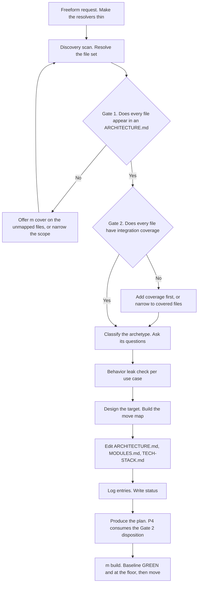

# Refactor Lifecycle

## Introduction

Molcajete has five spec-phase commands and every one of them assumes behavior is the subject.
`/m:spec` and `/m:cover` create specs. `/m:change` alters behavior on purpose. `/m:fix` corrects
behavior that drifted. A refactor changes no behavior at all, so none of the five fit it.

The result is that the most common kind of large change has no place in the lifecycle. A user who
wants thin GraphQL resolvers, or who wants the order book extracted into its own service behind a
message bus, leaves Molcajete to do it. No spec update. No plan. No test-backed safety net. The
spec tree then describes code that no longer exists in the shape it records.

The gap is not only at the spec layer. `/m:build` knows two task kinds, and a behavior-preserving
task is neither of them. An implement task expects its test to start RED. A coverage task expects
GREEN and then adds assertions. A refactor task starts GREEN and must **not change its test at
all** — the unchanged test is the proof. Hand today's `/m:build` a refactor plan and it scaffolds a
RED test for shipping behavior and halts.

This guide gives the design for a `/m:refactor` command. It covers four things. First, what a
refactor actually edits in the spec tree, which is not the use case layer. Second, the test-coverage
precondition that gates the whole command, and why the gate cannot wait for plan time. Third, a
typification of refactor kinds, because one strategy cannot cover both "extract these helpers" and
"move this module behind a queue". Fourth, how the spec tree relocates when a module boundary moves,
which is the hard part.

## The Big Picture

A refactor enters through the same door as `/m:cover` — freeform prose, not an ID — and leaves
through the same door as `/m:change` — specs edited, then a plan, in one invocation. Between those
doors sit two prerequisite gates, and both run before any design work.

Gate 2 is the subject of this document's longest section. It is the precondition, and putting it in
the wrong place is the mistake that looks harmless and is not.

## Glossary

| Term | Meaning |
|---|---|
| Archetype | The kind of refactor the user asked for. Five of them. Determines which questions get asked |
| Strategy | The mechanical plan an archetype maps to. Three of them: S1, S2a, S2b |
| Driving port | How the outside reaches the code. An HTTP route, a GraphQL field, a queue consumer. Listed per module in `specs/MODULES.md` under `Driving Ports` |
| Move map | Per unit of code, `from file:symbol` to `to file:symbol`. The refactor task's core declaration |
| Behavior leak | A restructuring that changes an observable outcome despite being framed as a refactor. Makes the change part `/m:change` |
| Module-instance | One module's copy of a use case. Same `UC-XXXX` ID, module-scoped content |
| Relocation | Moving a use case's spec files from one module folder to another. Same IDs, new path |
| Retire | The step that deletes the old code, the old test, and the old spec instance |
| Static probe | The grep-only, run-nothing coverage check available at plan time. Returns covered or uncovered, never a percentage |
| Measured floor | The real four-dimension coverage check, available only at build time because it runs the collector |

## Concepts

### 1. A refactor rewrites ARCHITECTURE.md, not the use case layer

This is the finding that reframes the whole design, and it is easy to get backwards.

A use case *is* behavior. Its scenarios carry Given, Steps, Outcomes, and Side Effects. A refactor
preserves behavior by definition. Therefore a true refactor produces **no use case edit at all**.

What it rewrites is the other half of the spec tree:

| Artifact | Does a refactor touch it |
|---|---|
| `UC-XXXX-{slug}.md` scenarios | No, unless behavior leaks |
| `REQUIREMENTS.md` functional requirements | No. Non-functional requirements sometimes |
| `ARCHITECTURE.md` | Yes, heavily. Component Inventory, Code Map, Container View, Event Topology, Integration Points, Architecture Decisions |
| `specs/MODULES.md` | Yes when a module is added, split, or merged |
| `specs/TECH-STACK.md` | Yes on a transport or technology change |
| `CHANGELOG.md` | Yes. Needs a new `command:refactor` token |
| `specs/FEATURES.md` | No. It has no module column, and features are never removed |

One consequence is worth stating plainly, because the alternative is tempting. `ARCHITECTURE.md`
must be edited **in place**. It cannot be copied into `specs/plans/<plan-id>/` and edited there.
`ARCHITECTURE.md` is the spec-to-code bridge that `/m:plan`, `/m:build`, and `/m:review` all read to
locate implementation. Two copies means drift, and the copy under `plans/` becomes the lie.

The in-place edit describes a target that does not ship yet. That looks like a problem and is not:
`/m:change` has the same property and solves it with `status: dirty`, which means "this artifact has
unfinished work". The refactor inherits that marker for free.

### 2. Coverage is the precondition, and it gates before anything else

The rule: **code is not refactored or replaced until it meets the coverage floor.**

The literature is old, settled, and one-sided. Fowler opens *Refactoring* Chapter 4 with it:

> "If you want to refactor, the essential precondition is having solid tests."

Feathers defines the failure mode:

> "Teams take serious chances when they try to make large changes without tests. It is like doing
> aerial gymnastics without a net."

The AI-specific version is now published too. GitHub, on modernizing legacy code:

> "Write tests first: Before changing a single line of code, ensure you have tests that validate the
> current behavior ... These tests act as a safety net."

#### Why it binds every strategy, for two different reasons

The precondition is not one rule applied uniformly. It earns its place twice, differently:

- **S1 and S2a** — the existing test *is* the safety net. It runs green before the move and green
  after, unchanged. Without it there is no proof that anything was preserved. The test is the
  instrument.
- **S2b** — the old test is the **specification** for the new test at the new port. The new test
  cannot be derived from anything else, because the assertions it must make are exactly the ones the
  old test made. Without the old test there is nothing to translate.

The second case matters more, not less, which is the opposite of the intuition. In S2b the old code
is **deleted** at the end. An uncovered S2b is not a risky refactor; it is a rewrite from memory
with the original thrown away.

#### What counts as coverage

Integration tests under `{module.Tests}` only. This is already settled in two places and the
refactor gate must not soften either:

- `principles/SKILL.md:30` — pre-existing host-project unit tests are ignored for coverage math.
- `plan-authoring/SKILL.md`, in P4 — "a `src/foo.test.ts` beside `src/foo.ts` is not coverage. A
  test outside `{module.Tests}` is not coverage. When you cannot name the asserting file and the
  asserted symbol, the file is uncovered."

The floor is 80% on touched files (`principles/SKILL.md:138`), configurable through
`.molcajete/settings.json testing.thresholds`.

**Which files.** The move map's `from` side — every file whose code moves. The `to` side is excluded
because it does not exist yet, which is the same exclusion P4 already makes for files a plan creates.

#### The gate has two halves, because a static probe cannot measure a percentage

This is the part that is easy to get wrong, and getting it wrong leaves a hole that only opens after
the code has already moved.

| | When | What it can check | On failure |
|---|---|---|---|
| Static probe | Plan time. Runs no commands, greps only | Binary. Is any exported symbol of this file asserted by a test under `{module.Tests}` | Add coverage tasks, or narrow the scope |
| Measured floor | Build time. The refactor task's baseline step, before any edit | Actual four-dimension coverage against `testing.thresholds` | Halt. Name each file and its shortfall |

A file that *has* a test but sits at 40% passes the static probe. If the measured check waited for
the existing coverage gate at `8.7`, that file would only fail **after** its code had moved — the
worst possible moment, because the halt now leaves a half-finished restructuring behind.

So the measured half runs at the refactor task's **baseline**, before the first edit. The failure
message is the honest one: the safety net is too thin to refactor behind.

#### "Handle separately" is never offered

`plan-authoring` P4 offers two dispositions for uncovered files: add coverage to this plan, or handle
it separately with a `**Prerequisites:**` line. The second is a free pass — `/m:build` cannot verify
prerequisite work, so it asks the user and records that it did not check.

For a refactor that free pass is the exact disaster Fowler's precondition names. So the two options
change:

- **Add coverage first** — characterization tasks at the lowest `T-NNN`, then the refactor tasks.
- **Narrow to covered files** — the uncovered files leave the scope, and the report names them.

Both outcomes keep the build safe. There are still exactly two, so P4's own law holds
(`plan-authoring/SKILL.md:302` — "Two options. Never add a third. A third option is how a build stops
halfway.").

The coverage tasks must be worded as **characterization** tests: they record what the code does now,
not what it should do. Feathers is explicit that the point is to "document your system's actual
behavior, not ... the behavior you wish your system had". A surprising current behavior gets pinned,
never quietly fixed — fixing it is `/m:fix`, and it is a different change with a different log entry.

#### The seam escape valve already exists

Feathers puts dependency-breaking *before* tests, not after. His Legacy Code Change Algorithm reads:
identify change points, find test points, **break dependencies**, write tests, make changes and
refactor. Sometimes the assertion is not reachable until a dependency moves.

`plan-authoring` P4 already permits this: "When the code has no seam the integration test can drive,
say so in the prose and include the mechanical seam work in that task — a coverage task may move a
dependency behind a port, and it still adds no new behavior."

Nothing new is needed. The refactoring skill points at the existing rule.

#### The gate must run early, and P4 runs too late

`plan-authoring` P4 says the probe "runs here and never earlier". That is correct for `/m:plan`,
and for a stated reason: a normal plan does not know which files it touches until P3 decomposes it.
The probe cannot run before the file set exists.

**A refactor knows its file set at the discovery scan.** That asymmetry is the whole point. If the
refactor's probe waited for P4, then by the time the user learns a file is uncovered they have
already answered the archetype question round, sat through the behavior leak check, and approved an
architecture design — and the spec edits are already written to `ARCHITECTURE.md`. Narrowing the
scope at that point means unwinding written files.

So `/m:refactor` runs the probe as part of its **prerequisite gate**, immediately after the
spec'd gate and before any design work. By the time P4 runs, the uncovered set is either empty or
the scope was already narrowed, and P4 consumes the disposition it was handed without re-asking.

The rule in P4 stays intact and gains a scope: it exists because a normal plan does not know its
file set until decomposition, and a caller that already knows its file set may run the probe earlier
and hand P4 the result.

One caution carries over from `resolve-before-write.md`. Böckeler warns that the hope of using AI to
add tests to a codebase that has none "will remain a pipe dream". The honest reading is that
"Narrow to covered files" is a first-class outcome, not a defeat. A refactor scoped to the covered
half of a module is a real, useful, safe refactor.

### 3. The driving port decides the strategy

Five archetypes, three strategies. The discriminator is **does the driving port change**, because
that decides whether the existing test can still drive the code — and by concept 2, the test is the
whole safety net.

| Strategy | Archetypes | Does the spec tree move | Test | Tasks |
|---|---|---|---|---|
| **S1 Restructure** | internal restructure, seam introduction, technology swap | No. `ARCHITECTURE.md` rows replaced | Untouched, byte-identical | 1 |
| **S2a Relocate, port preserved** | module split or merge, in-process call or route moves | Yes | Moves verbatim. Path and imports only | 1 |
| **S2b Relocate, port changed** | service extraction with a new transport | Yes | New test written at the new port | 3 |

Two results fall out of this that are not obvious.

**S2a is one task, not three.** Because the test moves verbatim at stand-up, no old test is left
behind. The old code is therefore orphaned, and deleting it in the same task is safe. Only a port
change needs the stand-up, cutover, retire sequence. This matters because the alternative — decomposing
every relocation into three tasks — turns a routine module split into a three-task ceremony.

**S2b is never purely a refactor.** Extracting the order book behind a message bus makes a
synchronous call asynchronous, so a scenario that read "the trader submits an order and sees it in
the book" is now eventually consistent. That outcome changed, so that scenario needs a real spec
edit. And the old module *gains* a new use case: "submit an order to the order-book service". That is
new behavior with a **new** `UC-XXXX` and new `SC-XXXX`, built by RED-first implement tasks. An S2b
plan is unavoidably `mixed`: coverage, then restructure, then implement, then retire.

Hence the **behavior leak check**: for each use case in scope, does the target shape change any
scenario's Steps, Outcomes, or Side Effects. The command does not refuse when the answer is yes. It
says so plainly — "this is not purely behavior-preserving; these three scenarios change" — and
applies `/m:change`-style edits in the same invocation.

### 4. The spec tree moves, artifact by artifact

Three verified schema facts make relocation far cheaper than it looks:

1. **Multi-module `FEAT-XXXX` is already legal.** `usecase-authoring` states "one `FEAT-XXXX` across
   module folders, module-scoped `REQUIREMENTS.md` in each". Creating
   `specs/features/{new}/FEAT-XXXX-{slug}/` with the *same* feature ID is an existing pattern.
2. **Use case frontmatter carries no `module` field.** The module is encoded **only** by the
   directory path. So a relocation changes the path and nothing else in the frontmatter.
3. **The transient two-instance state is already legal.** Mid-migration, `UC-0KTg` living in both the
   old and the new module *is* the Module-Scoped Use Cases pattern. **A module migration is a
   temporary multi-module use case that collapses back to single-module.**

Fact 3 is the one that turns this from a new mechanism into a use of an existing one. And because
identifiers are permanent, the use case keeps its `UC-XXXX` and every scenario keeps its `SC-XXXX`
across the move. Only the path changes, so the Code Map, the tests, and the changelog stay traceable
through it.

For `UC-XXXX` moving from module `old` to module `new`:

| Artifact | Stand up | Retire |
|---|---|---|
| `specs/MODULES.md` | Add the `new` row. ID, Module, Description, Directory, Tests, Driving Ports | The `old` row stays. The module still exists |
| `specs/FEATURES.md` | No change | No change |
| `new/FEAT-XXXX-{slug}/REQUIREMENTS.md` | Create. Module-scoped, carrying only the moved use case's requirements. **Same `FEAT-XXXX`** | — |
| `new/.../USE-CASES.md` | Create with the use case row | — |
| `new/.../UC-XXXX-{new-slug}.md` | Create. **Same `UC-XXXX`, same `SC-XXXX`** for carried-over behavior | — |
| `new/.../UC-XXXX-{new-slug}/CHANGELOG.md` | **Relocate verbatim**, then append the `command:refactor` entry | — |
| `new/.../ARCHITECTURE.md` | Create with the new layout's tables | — |
| `{new.Tests}/{feat}/{uc}.{ext}` | Moved verbatim in S2a, written at the new port in S2b | — |
| `old/.../UC-XXXX-{old-slug}.md` | Untouched. Still `implemented` | Delete |
| `old/.../UC-XXXX-{old-slug}/CHANGELOG.md` | Untouched | Delete, **only after** verifying every timestamp exists in the new file |
| `old/.../USE-CASES.md` | Untouched | Remove the use case row |
| `old/.../REQUIREMENTS.md` | Untouched | Retire the moved requirements. Keep the rest. Delete the folder if none remain |
| `old/.../ARCHITECTURE.md` | Untouched | Remove Component Inventory and Code Map rows for deleted files |
| `{old.Tests}/{feat}/{uc}.{ext}` | Untouched, GREEN | S2b only. Confirm RED after the code is deleted, then delete |

The changelog row is the one that needs a rule change. `uc-log` permits exactly three mutations and
forbids everything else, including deleting an entry (`uc-log/SKILL.md:23`). A relocation needs a
**fourth**: relocate the file verbatim, then apply mutation 1 at the new path. It is safe because it
loses nothing — the existing Self-Check simply runs across the two paths instead of across one edit,
and every timestamp in the old file must be present in the new one before the old file may be
deleted. **No entry is ever lost. The file relocates.**

Deleting the old use case instance is correct, not a compromise. The spec tree mirrors code layout.
A use case instance in a module that holds none of its code is worse than no instance at all, because
its Code Map points at files that no longer exist and `/m:review` maps diffs to the wrong module.

### 5. Under one generic task kind, the prose is load-bearing

`/m:build` derives a task's kind from its prose. `plan-authoring/SKILL.md:164` is explicit: "State
plainly in the prose which kind a task is ... there is no `objective` field to set." Adding
`refactor` follows that model — one new value in `8.1`'s enum, not a new field.

The cost is that with no label to dispatch on, the gates only fire if the prose declares them. So a
refactor task's prose carries four **required** declarations, and `/m:build` refuses the task when
any is missing:

1. **Move map** — per unit, `from file:symbol` to `to file:symbol`.
2. **Test disposition** — one sentence from a closed set: `unchanged`, `moves from A to B`, or
   `new test at a new port`. The third is not a refactor task; it is an implement task.
3. **Deletions** — every production file, spec file, and test file this task deletes, or `none`.
4. **Behavior statement** — "This preserves behavior; no scenario outcome changes." If that sentence
   cannot be written truthfully, the task is not a refactor task.

`Covers` needs no schema change. On a refactor task it lists the scenarios the task must **keep
green** — same field, different verb — and `/m:build` derives its baseline test set from it.

### 6. The retire chain inverts every existing gate

Retire is the genuinely novel lifecycle, and every step of it is backwards from the existing kinds:

1. **Baseline: the old test must be GREEN.** This proves it is live. If it is already RED, the
   deletion has no safety net and the task halts.
2. Delete the production code and the old spec instance's files.
3. **Re-run the old test: it must be RED.** Still GREEN means something else satisfies it, so the
   deletion is incomplete or hit the wrong code. Halt.
4. Delete the old test file.
5. **Run the unscoped suite.** Every other task kind runs a scoped command. Deletion's blast radius
   is unbounded, so this is the one kind that cannot.
6. **Grep for surviving references** to the deleted symbols and paths. Must be zero.
7. Emit the changelog timestamp-preservation check from concept 4, before the old file is deleted.

Step 3 is not a formality. It is the only mechanical evidence that the deleted code was the code the
test was exercising.

### 7. What Molcajete already has that this reuses

The design adds less than it appears to, because most of the machinery exists:

| Need | Existing mechanism |
|---|---|
| Freeform scope inference from prose | `/m:cover`'s argument shape and its Step 6 file-set confirmation |
| Specs edited then a plan, in one invocation | `spec-revision`, shared by `/m:fix` and `/m:change` |
| The coverage probe | `plan-authoring` P4, steps 1 to 6. Extract as a named procedure so it can be called earlier |
| Coverage tasks that pin existing behavior | P4's "Add coverage to this plan" path, and Task Objectives' coverage kind |
| Seam work inside a coverage task | Already permitted by P4 |
| Same identifier across module folders | Module-Scoped Use Cases in `usecase-authoring` |
| A target spec that does not ship yet | `status: dirty` from `status-rollup` |
| Batched, capped, relevance-filtered questions | `resolution-gate`'s procedure. The refactor question bank feeds it |
| One brief then one short ask | `asking-questions` |
| Replace, never annotate; replace text, never identifiers | `spec-revision`'s Applying Spec Edits |

The genuinely new pieces are: the archetype taxonomy, the behavior leak check, the fourth changelog
mutation, the relocation rules, the `refactor` task kind with its prose contract, and the retire
chain.

## Options and Approaches

Five decisions, each with the alternative that was rejected and why.

**Where the changed architecture spec lives.** Chosen: **in place, use cases marked `dirty`**.
Rejected: a copy under `specs/plans/<plan-id>/`, and a new `specs/refactors/<id>.md` design artifact.
The first forks the Code Map that three commands read. The second adds an artifact class for content
that already fits `ARCHITECTURE.md` plus task prose.

**Build task kind.** Chosen: **one generic `refactor` kind**, with the flavor read from prose.
Rejected: two named kinds, `restructure` and `retire`. Two names would let `8.9` check each invariant
by dispatch, which is safer — but the prose-derived model is what `plan-authoring` and `build.md`
already use, and adding a field would be the inconsistent choice. The cost is paid by making the
four prose declarations mandatory and refusing the task when one is missing.

**Plan span.** Chosen: **one plan, retire included**. Rejected: retire as a second plan run after the
new path proves out in production. The second is genuinely safer for a risky extraction, and it stays
available — the user can narrow the scope — but as a default it leaves a dual code path and a plan
that has to be remembered.

**Test handling when the port is unchanged.** Chosen: **move it verbatim**. Rejected: duplicate it
and keep both suites green until retire. Verbatim movement is the strongest preservation proof, an
empty assertion diff, and it collapses S2a to a single task. The duplicate keeps the RED-on-delete
evidence, which the verbatim move gives up — acceptable, because an empty assertion diff is stronger
evidence than a deliberate RED.

**Cross-repository targets.** Chosen: **refuse, and emit a handoff brief**. Rejected: treating the
target repository as a module whose `Directory` sits outside the repository root. Molcajete's world
is one `specs/` tree at one repository root. A plan whose tasks edit files outside the working tree
is not executable by `/m:build`, and the target repository needs its own `/m:setup`. Extracting to a
same-repository module first, then moving the repository, is also strictly safer.

## How To Do It

The order runs backward from build, because a plan `/m:build` cannot execute is worthless.

### 1. Foundation skill edits

`uc-log` — add `refactor` to the `command` closed set; add mutation 4, relocate the file verbatim;
add a "Relocating a CHANGELOG" subsection with the copy, verify, delete order.

`status-rollup` — add `/m:refactor` to the writers table. S1 moves a use case from `implemented` to
`dirty`. A relocation's new instance starts `pending`, and the old instance keeps its status until it
is deleted.

`usecase-authoring` — a "Relocating a Module-Instance" section after Module-Scoped Use Cases, with an
explicit carve-out from that section's "never copy identical content across module-instances" rule:
during a relocation, carrying name, slug, actor, and trigger across unchanged is correct when the new
module's perspective does not differ.

`feature-authoring` — how to create a second module-instance of an existing `FEAT-XXXX`, and the fact
that `FEATURES.md` is not touched.

`architecture` — an exception to the additive Population Rules (`architecture/SKILL.md:184`): a
refactor **replaces** Component Inventory and Code Map rows for moved files and **removes** rows for
deleted files. Every other section stays additive.

`resolution-gate` — a `/m:refactor` row in the per-command category table: C1, C4, C6, C7, C9, C10,
C12.

### 2. Plan authoring

Extract P4's six probe steps under their own heading, **The Coverage Probe**, so a caller that
already knows its file set can run it earlier. Add the third Task Objective with the four-part prose
contract. Add `refactor` to the Mode set and to P1's derivation. Give `Covers` its keep-green
reading. Add the refactor path through P4's gate: consume a disposition the caller already resolved,
and when asking, offer only the two safe options. Add the relocation case to the Test File
Convention.

### 3. Build

Add `refactor` to `8.1`'s kind enum and read the four declarations. Validate them at `8.2` and refuse
the task when one is missing. Replace the scaffold at `8.4` and `8.5` with the two baseline checks —
GREEN, and at the measured floor over the move map's `from` files, both before any edit. Enforce the
declared test disposition at `8.6`, then the deletions and the retire chain. Make mutation mandatory.
Add the evidence rows at `8.9`. Point `8.10` at the preservation-focused reviewer contract.

Sub-steps under Step 8 must be **renumbered**, not decimal-inserted. `plugin/CLAUDE.md` forbids
`8.6.5`.

### 4. Testing skill

A "Behavior-Preserving Tasks" section, a reviewer contract variant that returns `preserved` or
`changed{list}`, and one sentence disambiguating it from the existing Reactive Refactor rule — that
rule governs *incidental* reshaping inside an implement task, while a refactor task is reshaping as
the deliverable.

### 5. The refactoring skill and the command

A new `refactoring` skill owning the front half — freeform input, discovery scan with generated-file
detection, the two prerequisite gates, archetype classification, the behavior leak check — and
delegating the back half to `spec-revision`'s Applying Spec Edits, Logging and Status, Producing the
Plan, and Reporting. A `references/strategies.md` holding the strategy table, the migration table,
and the question bank. Then the command itself, which is thin once the skills exist.

Generated-file detection is not optional. The resolver example that motivated this work is generated
code, so the real target is the generator template or the codegen configuration, and the generated
file is read-only. Grep for `DO NOT EDIT` and `Code generated by` during the scan, then confirm.

### 6. Register and sync

Add the command and skill to `plugin/molcajete/.claude-plugin/plugin.json`, update `README.md` and
`CLAUDE.md`, and run `pnpm run sync:skills` in `molcajete/`. Six mirrored skills change: `uc-log`,
`status-rollup`, `testing`, `architecture`, `usecase-authoring`, `feature-authoring`.
`resolution-gate`, `plan-authoring`, and `spec-revision` are not mirrored.

## Gotchas and Edge Cases

| Problem | Cause | Mitigation |
|---|---|---|
| A file passes the coverage gate and fails at `8.7` after its code moved | The static probe returns covered or uncovered, never a percentage | Measure the floor at the refactor task's baseline, before the first edit |
| The user is told to narrow the scope after the specs were already written | The probe ran at P4, which is after the design and the spec edits | Run the probe as a prerequisite gate. A refactor knows its file set at the discovery scan |
| A co-located unit test looks like the safety net | It is not coverage under `principles/SKILL.md:30` | Classify only against `{module.Tests}`. Name the asserting file and the asserted symbol, or it is uncovered |
| A coverage task silently fixes a surprising behavior | It was written as a specification instead of a characterization | Word every coverage task as "record what the code does now". A fix is `/m:fix` |
| The coverage task cannot be written at all | The code has no seam the integration test can drive | Feathers puts dependency-breaking before tests. P4 already allows mechanical seam work inside a coverage task |
| The agent cannot supply the coverage the gate demands | Böckeler's caution about adding tests to a codebase that has none | Keep "Narrow to covered files" a first-class outcome, not a defeat |
| A simple module split becomes a three-task ceremony | Applying the S2b decomposition to S2a | The verbatim test move leaves no old test, so S2a is one task |
| The refactor quietly changes behavior | An async transport makes an outcome eventually consistent | The behavior leak check runs per use case. A leak is not a refusal; it is a `/m:change` edit in the same invocation |
| Changelog history is destroyed by a relocation | `uc-log` permits three mutations and the old file gets deleted | Mutation 4 relocates verbatim. Verify every old timestamp exists in the new file before deleting |
| Identifiers get regenerated during a move | The new module looks like a new use case | Identifiers are permanent. Same `UC-XXXX`, same `SC-XXXX`. Only the path changes |
| A stale use case instance survives in the old module | Deletion feels destructive | The spec tree mirrors code layout. An instance with no code points its Code Map at files that do not exist |
| The gates fire in the wrong order | The coverage probe needs each file's owning module and use case to derive a canonical test path | Run the spec'd gate first. It is what supplies that mapping |
| A refactor task's gates never fire | One generic kind, and the prose omitted a declaration | Refuse the task at `8.2` when any of the four declarations is missing |
| The refactor edits generated code | The scan treated a generated file as a normal source file | Grep for `DO NOT EDIT` and `Code generated by`. The generator is the target |
| A retire task passes while breaking an unrelated module | Every other kind runs a scoped test command | Retire runs the unscoped suite and a reference grep |
| `/m:review` flags a refactor as a defect | Large code movement with no test change looks wrong to the rubric | Known follow-up. `change-review` needs a pass after this ships |
| The step numbers drift | Inserting sub-steps under Step 8 | `plugin/CLAUDE.md` forbids `8.6.5`. Renumber and fix cross-references |
| The word coverage now means four things | `/m:cover` extracts specs, `Covers` lists scenarios, coverage is a percentage, and the gate is a precondition | Write "test coverage" or "spec extraction". Never bare "coverage" in new prose |

## Key Takeaways

1. **A refactor rewrites `ARCHITECTURE.md`, not the use case layer.** Use cases are behavior, and a
   refactor preserves behavior. Edit the architecture in place and mark the use cases `dirty`.
2. **Test coverage is the precondition, and it gates first.** Fowler's rule is not advice. The gate
   runs before any design work, because a refactor knows its file set at the discovery scan and P4
   would only learn it after the specs were written.
3. **The gate needs both halves.** A static probe returns covered or uncovered. Only the build can
   measure a percentage, so the floor is checked at the refactor task's baseline, before the first
   edit.
4. **"Handle separately" is never offered.** The two outcomes are add coverage first, or narrow to
   covered files. Both keep the build safe, and there are still only two.
5. **The driving port decides the strategy.** It decides whether the existing test can still drive
   the code, which decides everything else — including that S2a is one task and S2b is three.
6. **A module migration is a temporary multi-module use case.** The transient two-instance state is
   already legal. Same identifiers, new path, and the changelog relocates without losing an entry.
7. **Under one generic task kind, the prose is the contract.** Four declarations, all required, and
   the task is refused without them.

## Sources

The Tier 2 and Tier 3 entries below are carried over from `research/resolve-before-write.md`, which
verified them. They were **not** re-fetched for this document. Book quotations should be checked
against a copy before they are treated as exact.

### Tier 1 (Official)

- [Feathers — Working Effectively with Legacy Code, sample PDF](https://ptgmedia.pearsoncmg.com/images/9780131177055/samplepages/0131177052.pdf) — Preface and Chapter 4: the legacy-code definition, seam, enabling point
- [Feathers — 2003 paper](https://accorsi.net/docs/WorkingEffectivelyWithLegacyCode.pdf) — the chicken-and-egg problem, and characterization tests as an invariant
- [Fowler — Refactoring](https://martinfowler.com/books/refactoring.html) — Chapter 4 opens with the tests precondition. Chapter 4 is titled Building Tests
- [Fowler — Strangler Fig Application](https://martinfowler.com/bliki/StranglerFigApplication.html) — the incremental-replacement pattern behind the S2b stand-up, cutover, retire sequence

### Tier 2 (Authoritative)

- [Fowler — Fragments, 2026-05-27](https://martinfowler.com/fragments/2026-05-27.html) — "First get everything under the control of decent characterization tests"
- [GitHub Blog — Modernizing legacy code with Copilot](https://github.blog/ai-and-ml/github-copilot/modernizing-legacy-code-with-github-copilot-tips-and-examples/) — "Write tests first: Before changing a single line of code"
- [Google Engineering Practices — Small CLs](https://google.github.io/eng-practices/review/developer/small-cls.html) — refactoring changelists need tests; add them if they do not exist
- [Böckeler — AI and onboarding a codebase](https://martinfowler.com/articles/exploring-gen-ai/09-ai-help-onboarding-codebase.html) — the caution that the agent may not be able to supply the tests it is gated by

### Tier 3 (Community)

- [Feathers — Characterization testing](https://michaelfeathers.silvrback.com/characterization-testing) — "document your system's actual behavior, not ... the behavior you wish your system had"
- [Savoia quoting Feathers, Artima](https://www.artima.com/weblogs/viewpost.jsp?thread=198296) — the five-step Legacy Code Change Algorithm
- [Understand Legacy Code — Can AI refactor legacy code](https://understandlegacycode.com/blog/can-ai-refactor-legacy-code/) — write tests before letting AI refactor

### Internal

- `plugin/research/resolve-before-write.md` — the resolution gate and the original `/m:plan` coverage gate this design extends
- `plugin/molcajete/plan/skills/plan-authoring/SKILL.md` — P4, Task Objectives, Test File Convention
- `plugin/molcajete/shared/skills/principles/SKILL.md` — Principle 1 on integration tests, Principle 4 on the floor
- `plugin/molcajete/shared/skills/uc-log/SKILL.md` — the three permitted mutations this design extends to four
- `plugin/molcajete/spec/skills/usecase-authoring/SKILL.md` — Module-Scoped Use Cases, the pattern relocation reuses
- `plugin/molcajete/build/commands/build.md` — the Step 8 task lifecycle
