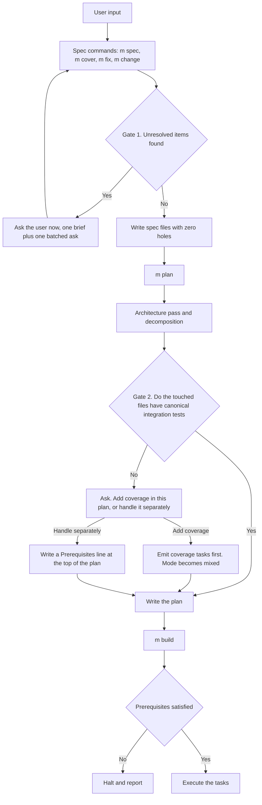

# Resolve Before Write

## Introduction

Molcajete writes specs and plans that another agent executes with no back-channel. When a
command finds a problem it cannot answer, it has two choices. It can stop and ask the user.
It can write the problem into the document and continue.

Today Molcajete does both, and the second path is wider than it looks. A missing spec
section has a button labelled "No, skip this section". A test-feasibility risk is forbidden
from becoming a question and dies in a chat report. Every plan task must carry a paragraph
that states what the task deliberately does not do. `/m:plan` never checks whether the files
it plans to change have any tests at all.

This guide does two things. First, it lists every place where an unresolved item reaches a
generated document, with file and line. Second, it gives the design for two new gates: a
resolution gate before any spec or plan is written, and a coverage gate inside `/m:plan`
that offers exactly two outcomes and never a third.

## The Big Picture

Molcajete has a linear lifecycle. Specs feed plans. Plans feed builds. Each stage hands a
document to the next stage. A hole in an early document becomes a guess in a later one.

The two new gates sit at the two hand-off points. Gate 1 runs before a spec command writes
any file. Gate 2 runs inside `/m:plan`, after decomposition and before the plan file exists.



Gate 1 changes a rule that today is inconsistent across commands. Gate 2 adds a step that
does not exist today in any form.

## Glossary

| Term | Definition | Example |
|------|-----------|---------|
| Unresolved item | A decision the command could not make, written into a document instead of asked | An empty `## Non-Goals` section after the user pressed "No, skip this section" |
| Deferral | A decision moved to a later command or a later person, recorded in prose | "migrate — delete after the canonical test is green" |
| Testability concern | A risk that a scenario cannot be driven end to end | A third-party API with no sandbox |
| Coverage task | A plan task that adds tests to code that already ships and writes no production code | `plan-authoring/SKILL.md:140-153` |
| Canonical integration test | The one test file a UC owns, at `{module.Tests}/{feature-dir}/{uc-dir}.{ext}` | `tests/FEAT-0A1b-signup/UC-0KTg-register.test.ts` |
| Characterization test | A test that records what code does now, not what it should do | Michael Feathers, 2004 |
| Plan prerequisite | A condition outside the plan that must hold before `/m:build` may start | "Add canonical coverage for `src/auth/session.ts`" |
| TBx | The family of markers TBD, TBS and TBR used in requirements standards | "retention period TBD" |
| Taxonomy scan | A sweep over fixed categories that forces the agent to enumerate gaps | Spec Kit scans 11 categories before it asks |

## Concepts

### 1. Four ways a problem reaches a Molcajete document today

The sweep found four distinct leak classes. They need different fixes, so keep them apart.

**Class A — the skip button.** Two skills offer the user a first-class option to leave a
spec section empty.

`plugin/molcajete/spec/skills/feature-authoring/SKILL.md:297-301`

```
- **Section missing from the input:**
  - Brief: say which section is missing, what belongs in it, and what happens if it stays empty.
  - Question: "I didn't find any {section}. Do you have any?"
  - Header: the section name (12 characters maximum)
  - Options: "Yes, I'll add them" / "No, skip this section"
```

`plugin/molcajete/spec/skills/usecase-authoring/SKILL.md:365-371` is the same shape, and its
second option reads `"Skip for now"`. Nothing in the plugin ever revisits a "for now". Seven
feature sections and every UC section can go missing this way. The file is written, and no
marker records that a section was skipped.

**Class B — the forbidden question.** A whole category of problem is banned from becoming a
question and banned from becoming a file. It exists only as chat text.

`plugin/molcajete/spec/skills/reverse-engineering/SKILL.md:83-85`

```
### No Interruptions, No Sidecar Files

Do not use AskUserQuestion for testability concerns. Do not write a sidecar file. Surface
remaining concerns in the command's final report as a "Testability Notes" block, with the
count and category per UC.
```

`usecase-authoring/SKILL.md:257-259` repeats it: "These are flagged silently in the final
report — they do NOT interrupt the workflow and do NOT change the spec." `spec.md:142` and
`cover.md:107` both call the notes "advisory output, not a recorded table".

There is a resolved-state slot for these concerns, at `ARCHITECTURE.md` under `## Testing
Decisions` (`feature-authoring/SKILL.md:349-359`). No command writes it. The lookup table is
read-only and permanently empty.

**Class C — the mandated deferral field.** The plan format requires every task to carry an
out-of-scope and limitation paragraph.

`plugin/molcajete/plan/skills/plan-authoring/SKILL.md:117-118`

```
5. **Decisions and trade-offs** — key choices, what the task deliberately does *not* do, and
   the limitation each choice carries.
```

The worked example at `:307-308` shows the result: "We are deliberately not deduping names
or handling mid-name edits yet". The single plan gate at `:221-236` reviews the
decomposition. It does not ask the user to accept the deferrals.

**Class D — the inferred unknown.** `/m:setup` bans four ambiguous facts from being asked
about and writes its guesses to permanent spec files.

`plugin/molcajete/setup/commands/setup.md:143`

```
Do NOT ask about actors, domains, modules, or test runners — infer those.
```

`setup/skills/setup/SKILL.md:38` completes the pattern: "Populate the row when the inference
is unambiguous; leave blank otherwise." The report at `setup.md:230` then asks the user to
"verify them before running `/m:build`" — after the files exist.

Templates supply the landing zones. `REQUIREMENTS-template.md:15-23` gives Non-Goals. The
`ARCHITECTURE-template.md:115-120` ADR line ends with `accepting {tradeoff}`.
`TECH-STACK-template.md:14` instructs the agent to write the literal string `not available`.

### 2. What the requirements standards say about a hole

The standards are blunt, and the wording is worth copying.

**IEEE 830-1998 §4.3.3.1** is free and the crispest available:

> "Any SRS that uses the phrase 'to be determined' (TBD) is not a complete SRS. The TBD is,
> however, occasionally necessary and should be accompanied by a) A description of the
> conditions causing the TBD ... b) A description of what must be done to eliminate the TBD,
> who is responsible for its elimination, and by when it must be eliminated."

**ISO/IEC/IEEE 29148:2018 §5.2.6** puts the prohibition at set level, not at the level of a
single requirement:

> "In addition, the set does not contain any To Be Defined (TBD), To Be Specified (TBS), or
> To Be Resolved (TBR) clauses."

Its NOTE 2 is the load-bearing sentence:

> "It is common to need to include TBx designations during the evolution of the requirements
> definition ... However, the set of requirements cannot be considered complete until all the
> TBx designated requirements have been resolved."

Read that against Molcajete. A UC file is not a draft. `/m:plan` reads it and `/m:build`
executes it. It is a baselined set at the moment it is written. Under 29148 a hole in it is
a defect, not a work-in-progress state.

**NASA/SP-2016-6105 Rev2** adds the one distinction worth keeping:

> "The use of 'To Be Determined' (TBD) values should be minimized. It is better to use a best
> estimate for a value and mark it 'To Be Resolved' (TBR) with the rationale along with what
> should be done to eliminate the TBR, who is responsible for its elimination, and by when it
> should be eliminated."

TBD is a hole. TBR is a decided default with an owner. If Molcajete ever needs an escape
hatch, TBR is its correct shape. A hole is never the correct shape.

Molcajete already states this principle and does not enforce it.
`shared/skills/principles/SKILL.md:225`:

> "Specs, plans, comments, and reports are read by the next AI agent with no back-channel. It
> cannot ask what an ambiguous sentence meant, so it guesses. Ambiguous prose is therefore a
> defect."

### 3. Three published designs, and which one you are choosing

Every mature spec-driven tool solves this. They chose three different points on one axis.

**Ask first, then write.** Tessl documents this explicitly:

> "The agent asks questions first — Instead of making assumptions, the agent interviews you
> ... One question at a time, until requirements are clear."
> "You approve before implementation begins — The agent pauses while you ... review the specs."

Claude Code Plan Mode and Cursor Plan Mode sit here too. Anthropic's own note on Opus 4.5:
"Claude asks clarifying questions upfront, then builds a user-editable plan.md file before
executing."

**Write, then gate on human approval.** AWS Kiro materializes every assumption as an EARS
acceptance criterion, then blocks on review. Kiro's own best-practices page states the trade
plainly: "Both produce the same artifacts ... The difference is whether you review each one
before the next is generated." Kiro's Quick Spec trades the gates away and front-loads
questions instead.

**Write with typed markers, then gate on marker count zero.** GitHub Spec Kit permits up to
three `[NEEDS CLARIFICATION: question]` markers in a spec, plus an Assumptions section, then
burns them down with `/speckit.clarify`.

Spec Kit's `clarify.md` is the best-documented clarification workflow in public:

> "Identify underspecified areas in the current feature spec by asking up to 5 highly targeted
> clarification questions and encoding answers back into the spec."
> "This clarification workflow is expected to run (and be completed) BEFORE invoking
> [plan]."

It scans 11 fixed categories and marks each Clear, Partial or Missing. Only Partial and
Missing produce questions. It caps at five, ranks by impact times uncertainty, and skips
anything that "would not materially change implementation or validation strategy". Answers
append to a `## Clarifications` section as `- Q: <question> → A: <answer>`, then propagate
into the affected sections.

Spec Kit also shows the failure mode of the marker design. Its two authoritative files
disagree. `spec-driven.md` says "Don't guess: If the prompt doesn't specify something, mark
it". `specify.md` says "Make informed guesses: Use context, industry standards, and common
patterns to fill gaps" and "Document assumptions in the Assumptions section".

Your request selects the first design. It is the strictest of the three, and Tessl is the
Tier-1 precedent for it.

### 4. Coverage is a precondition, not an ambiguity

The second half of your request is a different kind of gate. Nobody is confused about what
the code should do. The problem is that the code has no safety net.

The literature on this is old, settled and one-sided.

Martin Fowler, *Refactoring*, Chapter 4, opening line:

> "If you want to refactor, the essential precondition is having solid tests."

Michael Feathers defines the problem and supplies the algorithm. Preface, page xvi:

> "To me, legacy code is simply code without tests."
> "Teams take serious chances when they try to make large changes without tests. It is like
> doing aerial gymnastics without a net."

His Legacy Code Change Algorithm, Chapter 2:

> "1. Identify change points. 2. Find test points. 3. Break dependencies. 4. Write tests.
> 5. Make changes and refactor."

Note step 3. Tests come fourth, not first. Feathers puts dependency-breaking refactorings in
a class of their own, described in the Introduction as "meant to be done without tests, in
the service of putting tests in place". A plan that adds coverage to untested code may need
mechanical seam work before the first assertion is possible.

The AI-agent-specific version is now published. GitHub, January 2025:

> "Write tests first: Before changing a single line of code, ensure you have tests that
> validate the current behavior ... These tests act as a safety net."

Martin Fowler, May 2026, summarizing Ian Johnson's agent harness:

> "First get everything under the control of decent characterization tests, add static
> analysis, introduce the right patterns to make things flow easily."

Johnson's reason is the sharpest line in the whole research, and it applies equally to
Gate 1: "I didn't trust the agent because there was nothing forcing it to do the right thing."

### 5. Why a prose rule alone will not hold

Molcajete's gates are sentences in Markdown. The published evidence says sentences lose.

Birgitta Böckeler reviewed three spec-driven tools for martinfowler.com in October 2025:

> "Even with all of these files and templates and prompts and workflows and checklists, I
> frequently saw the agent ultimately not follow all the instructions."

Spec Kit contradicting itself inside one repository is the same failure at author level.
Molcajete's own prior research reached the same conclusion. `plugin/research/harness-hardening-2026.md:14`
says its quality gates are "prose the model is asked to follow, not machinery the harness
enforces", and its top recommendation is to convert them into blocking hooks.

So the resolution rule needs two parts. A rule that says what to do. A mechanical check that
fails the command when the rule was not followed.

### 6. What Molcajete already has that you can reuse

Three pieces exist and are load-bearing.

**The coverage task is already a first-class task kind.** `plan-authoring/SKILL.md:140-153`
defines it: a task that "pins the behavior of code that already ships, adding assertions with
no new production code. Its test starts GREEN". `/m:build` already dispatches on it
(`build.md:20-25`) and already runs the mutation step to prove the assertions have teeth. The
ordering rule already exists at `:151-153`: coverage tasks take lower `T-NNN` and run first.

**The plan gate already promises the missing content.** `plan-authoring/SKILL.md:225` requires
the review brief to contain "existing tests found and their disposition". No step in the skill
ever finds existing tests. The promise has no producer behind it. That is the exact seam for
Gate 2.

**A static file-to-test mapping already has a worked pattern.** `change-review/SKILL.md:83-85`:

```
4. **Integration test** — the canonical path is `{module.Tests}/{feature-dir}/{uc-dir}.{ext}`
   (`module.Tests` from `specs/MODULES.md`). Grep the changed symbols against the module's
   tests tree to see what actually asserts them.
```

`/m:plan` never runs a command (`plan.md:24`). The probe must be static. This pattern is
static and already proven inside `/m:review`.

**And one piece is missing entirely.** There is no plan-level prerequisite concept. `Depends
on` is intra-plan only, and `build.md:159` is the single blocking read. "Handle separately"
needs new plan syntax and a new `/m:build` halt.

## Options and Approaches

Three designs for Gate 1, judged against your stated requirement.

| Approach | What it does | Matches your ask | Cost |
|---|---|---|---|
| Ask before writing | Scan for gaps, ask, then write a document with no holes | Yes, exactly | One extra question round per command |
| Markers plus burn-down | Write bounded markers, resolve them in a second command | No, holes exist in between | A new command, and two files can disagree |
| Write plus approval gate | Guess, materialize the guess, block on human review | No, the guess is already in the file | Reviewer reads more, decides less |

Recommendation: **ask before writing**, with three qualifications drawn from the research.

1. **Force a taxonomy scan before asking.** ClarifyCodeBench measured how badly models
   enumerate ambiguity. Hit rate is 0.30 with one ambiguity present, 0.08 with two, and
   "almost zero" with three. Free association will not find the gaps. A fixed category list
   will. Adapt Spec Kit's 11 categories to Molcajete's artifacts.

2. **Cap and rank.** Spec Kit caps at five and ranks by impact times uncertainty. Böckeler's
   Kiro example shows the cost of no cap: "The requirements document turned this small bug
   into 4 user stories with a total of 16 acceptance criteria."

3. **Batch the ask.** Spec Kit and Tessl both ask one question at a time. That convention is
   a workaround for weak enumeration, not a user-experience finding. `asking-questions`
   already mandates one Markdown brief before the widget, and `AskUserQuestion` accepts up
   to four questions per call. One brief plus one batched ask beats five briefs.

For Gate 2 there is no design choice. Your request already fixes it at two outcomes.

## How To Do It

Ten edits. All are Markdown. The step-numbering rule in `plugin/CLAUDE.md` applies: when you
insert a step, renumber every following step and every cross-reference. Never add `Step 4.5`.

### 1. Write a new shared skill

Path: `plugin/molcajete/shared/skills/resolution-gate/SKILL.md`. Register it in
`plugin/molcajete/.claude-plugin/plugin.json` under `skills`.

The skill owns one rule and one procedure.

**The rule.** No document Molcajete generates may contain an unresolved item. Name the banned
shapes explicitly, because a generic ban is unenforceable: `TBD`, `TBS`, `TBR`, `TODO`,
`FIXME`, `???`, `NEEDS CLARIFICATION`, `to be determined`, `to be decided`, `unclear`,
`unknown`, `open question`, `we should decide`, `for now`, `later`, `not sure`. Add an empty
required section and an empty required table to the list.

**The exception, stated as its own shape.** A decided default is allowed. A hole is not. Copy
NASA's TBR shape: the value, the rationale, and the fact that the user chose it. That is a
recorded decision, and it belongs in the document.

**The procedure.** Four steps, run before any file is written.

1. Scan against a fixed category list. Adapt Spec Kit's eleven to Molcajete's artifacts:
   functional scope, actors, domain and data, interaction and UI, non-functional quality,
   integration and external dependencies, edge cases and failure handling, constraints and
   trade-offs, terminology against `specs/GLOSSARY.md`, acceptance and completion signals,
   test feasibility. Mark each Clear, Partial or Missing.
2. Drop every Partial or Missing item that would not change the implementation or the test
   plan. Rank the rest by impact times uncertainty. Keep at most five.
3. Ask them per `asking-questions`: one Markdown brief listing every open item with its
   category and its consequence, then one `AskUserQuestion` call carrying up to four
   questions. Chain a second call if five survive.
4. Write the document. Every answer becomes normal content in its own section. Do not add a
   `## Clarifications` log — that is Spec Kit's marker design, and you are not adopting it.

**Headless behavior.** `asking-questions:119` already exempts headless sessions. State the
rule for them here: when no user is present, do not guess and do not write a hole. Halt and
write the open items to `.molcajete/escalations/`. That directory is the plugin's existing
home for blocked work (`build.md:204,208,222,250,258,264,279`).

Load the skill from `spec.md`, `cover.md`, `fix.md`, `change.md`, `plan.md` and `setup.md`,
in each command's "Load Skills" step.

### 2. Delete the skip buttons

`feature-authoring/SKILL.md:297-301` — replace the option pair `"Yes, I'll add them" / "No,
skip this section"` with options that all produce content. Use `"I'll provide it"` and
`"Use the default"`, and state the default in the brief so the user knows what they accept.
For a section that genuinely does not apply, the correct option is `"Does not apply"`, and
the document records that fact as a sentence, not as an absence.

`usecase-authoring/SKILL.md:365-371` — same edit. Delete `"Skip for now"`. There is no later.

Keep `feature-authoring:317-319`. "No UI — skip" is a real answer, not a deferral, and
`usecase-authoring:211` already forbids empty UI placeholders.

### 3. Lift the ban on testability questions

`reverse-engineering/SKILL.md:83-85` — this section is cited by `asking-questions:120` as the
worked example of a sanctioned prohibition. Both must change together.

Narrow the prohibition to what it was actually protecting: `/m:cover` scanning hundreds of
files must not stop on every finding. Rewrite as follows. During the scan, collect concerns
silently. At the end of the scan, run the resolution gate once over the collected set, capped
and ranked. Write each resolved concern to the feature's `ARCHITECTURE.md` under `## Testing
Decisions` — the slot that `feature-authoring:349-359` already defines and nothing populates.

Then update `usecase-authoring/SKILL.md:257-259`, `spec.md:142` and `cover.md:107` to point at
the same behavior. Update `asking-questions:120` so its example no longer describes a rule you
deleted.

### 4. Reword the plan's trade-off field

`plan-authoring/SKILL.md:117-118` currently mandates "what the task deliberately does *not*
do, and the limitation each choice carries".

Keep the field. Change what it may hold. It records **decisions the user already accepted**.
It never records a decision still to be made. Add one sentence: if a trade-off in this field
has not been put to the user, it is an unresolved item, and the resolution gate runs before
the plan is written. Fix the worked examples at `:307-308` and `:325-327` so both read as
settled scope, not as open questions.

### 5. Add the coverage probe to /m:plan

Insert a new step in `plan-authoring/SKILL.md` between P3 (decompose) and P4 (consult
non-canonical tests). The task list must exist first, because the task list is what names the
files. Renumber P4 to P5 and P5 to P6, and update every cross-reference in `plan.md:73-75`.

The probe is static. `/m:plan` runs no commands.

1. Collect the file set. Every file the tasks name as create or modify.
2. Drop every file the plan will create. A new file cannot have coverage.
3. For each remaining file, resolve its module from `specs/MODULES.md` and read the module's
   `Tests` column. Derive the canonical path per the Test File Convention at
   `plan-authoring/SKILL.md:155-184`.
4. Grep the file's exported symbols against the module's tests tree, per the pattern at
   `change-review/SKILL.md:83-85`.
5. Classify each file: **covered** when a canonical integration test asserts its symbols;
   **uncovered** otherwise.

The classification must be strict. `principles/SKILL.md:30` is explicit: "Pre-existing host-project
unit tests are ignored for coverage math; the floor is met by integration tests only." A
`src/foo.test.ts` sitting next to `src/foo.ts` does not make the file covered.

Report the classification in the P2 gate brief. That brief already promises "existing tests
found and their disposition" (`plan-authoring/SKILL.md:225`) and today has no producer.

### 6. Ask the two-outcome question

Run it once per plan, not once per file. A per-file loop reproduces the Kiro sledgehammer.

Per `asking-questions`, the brief carries the payload:

- List the uncovered files in a table, with the module and the canonical test path each one
  would get.
- State what "Add coverage to this plan" does: coverage tasks are added at the front of the
  plan, they write tests only and no production code, the plan mode becomes `mixed`, and the
  plan gets longer.
- State what "Handle separately" does: the plan is written in full, and a `**Prerequisites:**`
  line at the top names the coverage work. `/m:build` refuses to start until the user confirms
  it is done.
- Recommend "Add coverage to this plan".
- Close with the escape-hatch line.

Then the ask:

```
- Question: "Some files this plan changes have no integration test coverage. How should I handle it?"
- Header: "Coverage"
- Options: "Add coverage to this plan" / "Handle separately"
```

Two options only. That is the point of the request. A third option is what produces a stop in
the middle of a build.

### 7. Implement "Add coverage to this plan"

Nearly everything needed already exists.

Emit one coverage task per uncovered file, or per cohesive group of files under one UC. Give
them the lowest `T-NNN` values. `plan-authoring/SKILL.md:151-153` already mandates that
ordering. Write the prose per `:140-153` so `/m:build` reads them as coverage tasks and expects
GREEN first.

Word them as characterization tests, in Feathers' sense. The task records what the code does
now, not what it should do. Feathers, 2016: "The purpose of characterization testing is to
document your system's actual behavior, not check for the behavior you wish your system had."

One change is required. `plan-authoring` P1 derives the plan mode purely from the changelog
`command:` tokens. It must now also read this decision, so a `default` plan becomes `mixed`
when coverage tasks are added.

### 8. Implement "Handle separately"

This is the only piece with no precedent. Add a plan-level `**Prerequisites:**` line, directly
under the `**Specs:**` line in the plan structure at `plan-authoring/SKILL.md:41-76`:

```markdown
**Specs:** FEAT-XXXX-{slug} · UC-XXXX-{slug} · SC-XXXX  ·  **Mode:** default
**Prerequisites:** Canonical integration coverage for `src/auth/session.ts`, `src/auth/token.ts`
```

Use `—` when there are none, matching the `Depends on` convention at `:97-100`.

Then add the gate to `/m:build`. Step 4 loads the plan (`build.md:87`). Add the check there,
before Step 5:

> If the plan carries a `**Prerequisites:**` line other than `—`, ask before any task runs.
> The brief lists each prerequisite and states that `/m:build` cannot verify it. Question:
> "This plan has unmet prerequisites. Are they done?" Header: "Prereqs". Options: "Done,
> proceed" / "Not yet, stop". On "Not yet, stop", write nothing and halt.

Record the answer in the Step 11 report. `/m:build` cannot verify the prerequisite, and it
must not claim it did.

### 9. Add the mechanical check

The rules above are prose, and Böckeler's finding says prose gets ignored. Add a check the
harness runs.

The plugin repo is pure Markdown and cannot enforce anything. The CLI can. Two places to put
it:

- A Claude Code `PostToolUse` hook matching `Write` and `Edit` on `specs/**`. It greps the
  written content for the banned markers from step 1 and exits 2 with the offending line. This
  is the conversion pattern `plugin/research/harness-hardening-2026.md:250` already recommends
  for Molcajete's other prose gates.
- The CLI's generated `verify.mjs` already owns the build-time gate
  (`molcajete/claude/setup/templates/hooks/verify.mjs`). A sibling `spec-verify` hook fits the
  same shape.

Start with the hook on `specs/**`. It is small, and it is the only part of this design that
cannot be argued past.

### 10. Sync the vendored mirror

`molcajete/claude/shared/skills/` mirrors `plugin/molcajete/shared/skills/`. Run
`node scripts/sync-shared-skills.mjs` from the molcajete repo root after step 1. A
`prepublishOnly` check refuses to publish on drift.

## Gotchas and Edge Cases

| Problem | Cause | Mitigation |
|---|---|---|
| "This file has tests" is judged wrong | A co-located unit test looks like coverage but does not count (`principles/SKILL.md:30`) | Classify only against `{module.Tests}/{feature-dir}/{uc-dir}.{ext}` |
| The agent misses most gaps | The multi-ambiguity ceiling: hit rate falls 0.30 to 0.08 to near zero as gaps multiply | Force the fixed-category scan. Never rely on free association |
| Every command turns into an interrogation | No cap and no relevance filter | Cap at five. Drop anything that would not change implementation or tests |
| The user is asked the same thing twice | Concerns are re-flagged on each run | Write resolved testability decisions to `ARCHITECTURE.md` `## Testing Decisions` and read it first, per `reverse-engineering/SKILL.md:79-81` |
| The coverage task cannot be written | The code has no seam. Tests are not reachable without refactoring first | Feathers puts dependency-breaking before tests. Allow a coverage task to include mechanical seam work, and say so in its prose |
| The agent cannot supply the coverage it demands | Böckeler: "the hope to use AI to add unit tests to a codebase that doesn't have unit tests yet will remain a pipe dream" | Keep "Handle separately" a first-class outcome, not a fallback |
| `/m:plan` tries to run the tests | The probe looks like it needs a test run | `plan.md:24` forbids it. The probe is grep only, like `/m:review` |
| Plan mode stays `default` after coverage tasks are added | P1 derives mode only from changelog `command:` tokens | Add the gate's answer as a second mode source |
| The word "coverage" now means three things | `/m:cover` extracts specs, `**Covers:**` lists scenarios, coverage is a percentage | Always write "test coverage" or "spec extraction". Never bare "coverage" in new prose |
| Assumptions and open questions get banned together by accident | They are different. A decided default is traceable. A hole is not | Decide this deliberately. NASA's TBR shape is the allowed one |
| The step numbers drift | Inserting P4 shifts every later step | `plugin/CLAUDE.md` forbids `Step 4.5`. Renumber and fix cross-references |
| The rule holds in `/m:spec` and not in `/m:cover` | Each command loads skills separately | Load `resolution-gate` from all six commands. Add the hook so a miss still fails |
| Headless runs stall | No user to answer | Halt and write to `.molcajete/escalations/`. Never guess, never write a hole |
| Prior deferrals stay buried | Nothing reads `.molcajete/escalations/` back | Out of scope here, but it is the same defect one layer down |

## Key Takeaways

1. The leaks are in four distinct classes, and they need four distinct fixes. Skip buttons
   in two skills, a ban on asking about testability, a mandated deferral field in every plan
   task, and four inferred-and-never-confirmed foundation facts in `/m:setup`.
2. The standards agree with you. IEEE 830: "Any SRS that uses the phrase 'to be determined'
   (TBD) is not a complete SRS." ISO 29148 permits TBx during evolution and bars it from a
   complete set. A Molcajete UC is baselined the moment `/m:plan` can read it.
3. Your design is the strictest of the three published ones, and Tessl is the Tier-1
   precedent for it. Spec Kit's marker design fails visibly: its own two authoritative files
   disagree about whether guessing is allowed.
4. Ask, but ask well. Scan fixed categories first, because models find 0.08 of the gaps once
   two are present. Cap at five. Batch into one brief and one ask.
5. The coverage gate has two existing halves and one missing half. Coverage tasks and their
   build lifecycle already exist. The file-to-test grep already exists in `/m:review`. A
   plan-level prerequisite does not exist and must be built.
6. Judge coverage against the canonical integration test only. `principles/SKILL.md:30`
   already discards pre-existing unit tests, so a co-located `*.test.ts` proves nothing.
7. A prose rule will be broken. Böckeler watched agents ignore their own templates, and
   Molcajete's prior research reached the same conclusion. Ship the hook with the rule.

## Sources

### Tier 1 (Official)

- [GitHub Spec Kit — clarify.md](https://raw.githubusercontent.com/github/spec-kit/main/templates/commands/clarify.md) — 11-category ambiguity taxonomy, 5-question cap, one-at-a-time rule, `## Clarifications` recording format
- [GitHub Spec Kit — spec-driven.md](https://github.com/github/spec-kit/blob/main/spec-driven.md) — "Mark all ambiguities", "Don't guess"
- [GitHub Spec Kit — specify.md](https://raw.githubusercontent.com/github/spec-kit/main/templates/commands/specify.md) — the contradicting file: "Make informed guesses", max 3 markers, batched questions
- [GitHub Spec Kit — spec-template.md](https://raw.githubusercontent.com/github/spec-kit/main/templates/spec-template.md) — `[NEEDS CLARIFICATION]` examples and the "No markers remain" checkbox
- [GitHub Spec Kit — analyze.md](https://raw.githubusercontent.com/github/spec-kit/main/templates/commands/analyze.md) — read-only cross-artifact consistency pass, severity model
- [GitHub Spec Kit — checklist.md](https://raw.githubusercontent.com/github/spec-kit/main/templates/commands/checklist.md) — "Checklists are unit tests for requirements writing"
- [Spec Kit agentic SDD reference](https://github.github.com/spec-kit/reference/agentic-sdd.html) — "Clarifying before planning keeps you from designing on top of ambiguity"
- [Tessl — spec-driven development](https://docs.tessl.io/use/spec-driven-development-with-tessl) — "The agent asks questions first"; question then spec then approve then code
- [Kiro — Specs](https://kiro.dev/docs/specs/) · [Requirements-first](https://kiro.dev/docs/specs/feature-specs/requirements-first/) · [Quick Spec](https://kiro.dev/docs/specs/quick-spec/) · [Analyze requirements](https://kiro.dev/docs/specs/analyze-requirements/) · [Best practices](https://kiro.dev/docs/specs/best-practices/) — the approval-gate design and its explicit trade against front-loaded questions
- [Cursor — Planning](https://cursor.com/docs/agent/planning) · [Plan mode](https://cursor.com/docs/agent/plan-mode) — clarifying questions before plan generation
- [Claude Code best practices](https://code.claude.com/docs/en/best-practices) — "Let Claude interview you ... then write a complete spec"
- [Anthropic — Claude Opus 4.5](https://www.anthropic.com/news/claude-opus-4-5) — "asks clarifying questions upfront, then builds a user-editable plan.md"
- [ISO/IEC/IEEE 29148:2018](https://www.iso.org/standard/72089.html) — §5.2.5 individual characteristics, §5.2.6 set completeness and the TBx prohibition. Paywalled; verify quotes against a purchased copy
- [IEEE 830-1998 §4.3.3.1](https://www.cse.msu.edu/~cse870/IEEEXplore-SRS-template.pdf) — "Any SRS that uses the phrase 'to be determined' (TBD) is not a complete SRS"
- [Feathers — Working Effectively with Legacy Code, sample PDF](https://ptgmedia.pearsoncmg.com/images/9780131177055/samplepages/0131177052.pdf) — Preface and Chapter 4 in full: legacy-code definition, seam, enabling point
- [Feathers — 2003 paper](https://accorsi.net/docs/WorkingEffectivelyWithLegacyCode.pdf) — the chicken-and-egg problem and characterization tests as an invariant
- [ClarifyGPT, FSE 2024](https://dl.acm.org/doi/10.1145/3660810) — clarification before generation raises GPT-4 Pass@1 from 70.96% to 80.80%
- [ClarifyCodeBench, arXiv 2607.00711](https://arxiv.org/abs/2607.00711) — the multi-ambiguity ceiling: 0.30, then 0.08, then near zero
- [Zhang, Knox & Choi, ICLR 2025](https://arxiv.org/abs/2410.13788) — knowing when to ask is a weak, learnable skill
- [OpenSpec](https://github.com/Fission-AI/OpenSpec) — the review-after contrast case

### Tier 2 (Authoritative)

- [Böckeler — Exploring SDD with three tools](https://martinfowler.com/articles/exploring-gen-ai/sdd-3-tools.html) — "I frequently saw the agent ultimately not follow all the instructions"; the Kiro sledgehammer example
- [Fowler — Fragments, 2026-05-27](https://martinfowler.com/fragments/2026-05-27.html) — "First get everything under the control of decent characterization tests"; "nothing forcing it to do the right thing"
- [Böckeler — AI and onboarding a codebase](https://martinfowler.com/articles/exploring-gen-ai/09-ai-help-onboarding-codebase.html) — the caution that the agent may not be able to supply the tests it is gated by
- [GitHub Blog — Modernizing legacy code with Copilot](https://github.blog/ai-and-ml/github-copilot/modernizing-legacy-code-with-github-copilot-tips-and-examples/) — "Write tests first: Before changing a single line of code"
- [Google Engineering Practices — Small CLs](https://google.github.io/eng-practices/review/developer/small-cls.html) — refactoring CLs need tests; add them if they do not exist
- [NASA/SP-2016-6105 Rev2](https://www.nasa.gov/wp-content/uploads/2018/09/nasa_systems_engineering_handbook_0.pdf) — the TBD versus TBR distinction and assumption confirmation before baseline
- [NASA SWEHB SWE-051](https://swehb.nasa.gov/spaces/SWEHBVD/pages/102695426/SWE-051+-+Software+Requirements+Analysis) — "Requirements are also complete if there are no 'TBDs' in the requirements set"
- [INCOSE Guide to Writing Requirements](https://www.incose.org/group/requirements-working-group/) — characteristic C4, baselined statements should not contain TBx
- [Microsoft for Developers — Spec-driven development](https://developer.microsoft.com/blog/spec-driven-development-ai-native-engineering/) — "AI can accelerate those steps, but it cannot correct ambiguity that was never resolved"
- [Kiro launch post](https://kiro.dev/blog/introducing-kiro/) — "What assumptions did the model make when building it?"

### Tier 3 (Community)

- [Feathers — Characterization testing](https://michaelfeathers.silvrback.com/characterization-testing) — "document your system's actual behavior, not ... the behavior you wish your system had"
- [Ian Johnson — The Agent Harness](https://dev.to/tacoda/the-agent-harness-turning-ai-slop-into-shipping-software-589i) — "Before You Let an Agent Touch Your Code, Write the Tests"
- [Savoia quoting Feathers, Artima](https://www.artima.com/weblogs/viewpost.jsp?thread=198296) — the five-step characterization-test algorithm
- [Understand Legacy Code — Can AI refactor legacy code](https://understandlegacycode.com/blog/can-ai-refactor-legacy-code/) — write tests before letting AI refactor
- [Spec Kit issue 2496](https://github.com/github/spec-kit/issues/2496) · [PR 2518](https://github.com/github/spec-kit/pull/2518) — the May 2026 shift from optional commands to quality gates

### Tier 4 (Unverified)

- [Tian Pan — AI coding agents on brownfield code](https://tianpan.co/blog/2026-04-19-ai-coding-agents-brownfield-legacy-code) — review generated characterization tests "for completeness of what behaviors they capture", not for assertion correctness
- Cursor's system prompt reportedly forbids an "Open Questions" section and mandates `ask_user_question`. This comes from leaked prompt material, not from cursor.com. Do not cite it as fact
- MIL-STD-490A is often said to ban TBDs. Its full text contains no occurrence of "TBD". This is folklore
