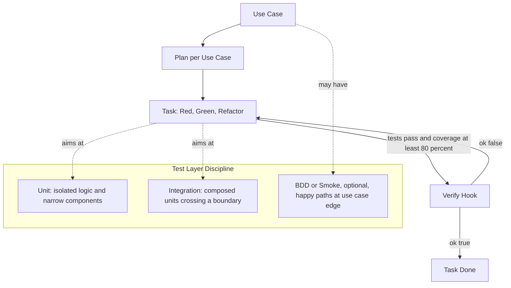

# Testing Principles for Agentic Coding

## Introduction

Molcajete is technology-agnostic. It does not pick test runners, coverage providers, mocking libraries, or component frameworks — those are project-level decisions. What Molcajete picks is the *rhythm*: the order in which tests and implementation are written, the gate that decides whether a task is done, and the shape of the work an agent is asked to do on each cycle.

This document defines that rhythm. It replaces the current default of BDD-as-done-signal with a unit + integration testing strategy that fits how an AI coding agent actually behaves on each task. The principles below are what the `build` command must enforce; the library that implements them is whatever the project's stack already chose.

## The Big Picture



Three things change from the previous default:

1. **The done signal is a passing test suite at a coverage threshold**, not a passing Gherkin scenario.
2. **Each use case gets its own plan**, and each task inside that plan is a single Red-Green-Refactor cycle.
3. **BDD becomes an outer-edge contract**, optional per project, used to describe acceptance criteria for stakeholders — not to drive every implementation task.

## Glossary

| Term | Definition |
|------|-----------|
| **Unit test** | Exercises one cohesive piece of code in isolation; no real I/O, no real network |
| **Integration test** | Exercises two or more units collaborating across a meaningful boundary; mocks only the outermost edge |
| **Red-Green-Refactor** | TDD cycle — write a failing test, write the minimum code to pass, then refactor without changing behavior |
| **The Three Laws of TDD** | Robert C. Martin's rules: no production code without a failing test; no more test than is sufficient to fail; no more production code than is sufficient to pass |
| **Coverage threshold** | A minimum percentage of executed lines/branches that the verify hook requires before a task can be marked done |
| **Verify hook** | Molcajete's mandatory hook that runs after each task to return `{ ok: boolean }` — the only objective signal the build loop trusts |
| **Plan** | A per-use-case decomposition: ordered tasks with explicit Red, Green, Refactor sub-steps |
| **Agentic coding** | Implementation work performed by an AI coding agent (Claude Code) inside the build loop — the agent writes both the tests and the production code |
| **BDD** | Behavior-Driven Development — a stakeholder-facing collaboration practice; not a test automation strategy |

## Concepts

### Principle 1 — Mostly Integration, Some Unit

The most useful tests are the ones that exercise more than one unit talking to another through its real interface. They catch the bugs that matter (wiring, contracts, data flow) at a fraction of the cost and flakiness of end-to-end tests, and they survive refactors that would shatter an over-mocked unit suite.

Unit tests still earn their place for two specific cases:

- **Non-trivial pure logic** — algorithms, parsers, calculators, state machines. Anywhere the input/output relationship is the interesting thing.
- **Leaf-level components or modules** with no collaborators worth integrating with. These exist; they should be tested in isolation.

Everything in between — composed components, services that orchestrate other services, modules with one external dependency — is an integration test target. Test through the public interface, mock only the outermost edge (network, filesystem, time, randomness), let the rest run for real.

The same principle applies on the backend: handlers that call services that call repositories should be tested as a composed unit. Mocking the repository inside a handler test gives you a test that passes when the wiring is wrong.

### Principle 2 — Atomic Layers Are Natural Test Boundaries

Where a project uses atomic design (or any equivalent layering — primitives, composites, features), the layer dictates the test type:

- **Atom-level** (primitives, leaf functions): unit test. No mocks needed because there is nothing to mock.
- **Molecule-level** (small compositions of atoms): unit test that renders or invokes real children. Still no external boundaries.
- **Organism-level** (composed sections that cross a boundary — fetch data, mutate state, call services): integration test. Mock only the boundary.
- **Template / Page / Use-Case level**: optional smoke test, possibly BDD, only for the happy path.

For non-UI code, read this as: leaf utility → unit; small composed module → unit; service that talks to another service → integration; entry-point command → optional smoke.

The decision rule: **if more than one unit must collaborate for the behavior to be meaningful, it is an integration test.**

### Principle 3 — Red-Green-Refactor Is the Two-Pass Rhythm

The cycle has three phases and each phase has a single allowed move:

1. **Red.** Write one failing test that names a behavior. The test must fail when run. Compilation failure counts.
2. **Green.** Write the smallest amount of production code that makes the test pass. Hardcoded returns are acceptable. No optimization. No extras.
3. **Refactor.** With tests green, improve the code: remove duplication, rename, restructure. Tests stay green throughout. No new behavior is added in this phase.

This maps exactly to the "write code to pass it as fast as possible, then write the code in its final form" rhythm. Pass-it-fast is the Green move. Final-form is the Refactor move. The two are separated because conflating them is how production-grade code gets shipped without a real safety net behind it.

### Principle 4 — Robert Martin's Three Laws of TDD

These are the rules every task in a plan obeys. They are absolute:

1. **You may not write production code unless it is to make a failing unit test pass.**
2. **You may not write more of a unit test than is sufficient to fail.** Compilation failures count.
3. **You may not write more production code than is sufficient to pass the one currently failing test.**

These laws give the cycle its tempo — minutes, not hours, per cycle. They also give the build loop something objective to verify: every commit (or every recorded step inside a task) must move the test suite from Red to Green or refactor it while it stays Green. Any step that adds production code without a matching failing test is a rule violation.

### Principle 5 — 80% Coverage Is a Guardrail, Not a Goal

Coverage is a *negative* signal — it tells you what is definitely not tested. It does not tell you that what is tested is tested well. Treat the 80% threshold as the floor that prevents the rhythm from quietly breaking down, not as a quality measurement.

Why 80% and not 100%:

- 100% targets reliably produce padding tests that exercise code without asserting anything meaningful. Teams that hit 100% by mandate consistently delete tests under pressure later.
- 80% across lines, branches, functions, and statements catches the realistic failure modes: dead branches, untested error paths, abandoned modules. It leaves room for the parts that are genuinely hard to test (startup code, glue, type-only files).
- The threshold should ratchet upward when coverage improves naturally. It should never ratchet downward.

The threshold lives in the project — the project chooses the tool. Molcajete's role is to require it and to check it.

### Principle 6 — BDD Is a Communication Tool, Not a Test Driver

BDD is most valuable when three different audiences — product, QA, and engineering — sit down together and describe a scenario in language they all share. That conversation produces a feature file. The feature file is a contract about what the use case must do.

It is *not* a substitute for tests written close to the code. Even the official Cucumber project says this explicitly.

The default in Molcajete should be:

- **BDD is optional, per project, per use case.** A project opts in when its stakeholders genuinely write or review Gherkin. Otherwise it adds maintenance with no buyer.
- **BDD covers the happy path of the use case** — the smoke test, the acceptance criterion. Not every branch, not every error.
- **BDD does not drive task-level work.** Tasks are driven by Red-Green-Refactor on unit and integration tests. The BDD scenario passes incidentally when the underlying tasks are done — not because the BDD scenario itself is the done signal.

This is what is meant by "BDD on the outside, TDD on the inside."

### Principle 7 — Agentic Adaptation: Why the Rhythm Needs Structure

When a human writes code, the Red-Green-Refactor cycle is largely self-enforced — they feel the failing test, they feel the refactor pressure, they can hold the discipline in their head.

An AI coding agent cannot be trusted to hold that discipline implicitly. Without structural enforcement, an agent will:

- Write production code first and the test second (test passes trivially)
- Skip the Red phase entirely (no proof the test was ever invalid)
- Write a test that asserts whatever the implementation happens to produce ("change detector" tests)
- Skip the Refactor phase because the Green code already "works"
- Over-mock to make tests pass without exercising real collaboration
- Inflate coverage by exercising lines without asserting on behavior

The build loop must therefore make each phase **observable and verifiable**. The agent must produce evidence that the test was Red before it became Green. The verify hook must check coverage *and* check that the suite actually exercises behavior. The plan must decompose each task into the three phases explicitly so the agent's only legal next move is the next phase.

The principles below define how.

## Options and Approaches

There is only one approach Molcajete will adopt by default. The table below names what the existing pipeline does today and what the new default replaces it with.

| Concern | Current Default | New Default | Why |
|---|---|---|---|
| Done signal for a task | Gherkin scenario passes via verify hook | Test suite passes + coverage ≥ 80% via verify hook | Easier to bootstrap; objective; project-agnostic |
| Test type distribution | Implicit (all BDD) | Mostly integration, some unit; BDD optional at use-case edge | Higher confidence per test; lower setup cost |
| Cycle granularity | Full scenario implementation per cycle | One Red-Green-Refactor cycle per task | Smaller, verifiable agent steps |
| Plan unit | One plan covers many use cases | One plan per use case | Tighter focus; clearer agent context |
| Stakeholder collaboration | Forced through Gherkin for every task | Optional Gherkin at use-case edge only | BDD is opt-in where it adds value |

## How To Do It — Adapting the Build Command

These are the mechanical changes the `build` command needs to make so the principles above become how the agent actually behaves.

### A. One Plan Per Use Case

A plan describes the work needed to deliver one use case end-to-end. Other use cases can be planned in parallel or referenced for context, but each one gets its own plan document and its own worktree.

The plan format encodes the testing rhythm in the task decomposition:

```
Plan: <use-case-id>
  Task 1: <behavior to implement>
    1.1 Red    — write the failing test for <behavior>
    1.2 Green  — write the minimum code to pass 1.1
    1.3 Refactor — improve to final form; tests stay green
  Task 2: <next behavior>
    2.1 Red
    2.2 Green
    2.3 Refactor
  ...
  Task N: (optional) BDD smoke test for use case happy path
```

Sub-tasks are not optional. The agent works one sub-task at a time. The verify hook runs after each sub-task, not just after each task.

### B. Per-Sub-Task Verification

The verify hook returns `{ ok: boolean }` based on the sub-task type:

- **After Red:** the verify hook must observe that *at least one new test fails*. If the test suite is fully green, the sub-task is incomplete — the agent claims a Red state that doesn't exist. The hook returns `ok: false`.
- **After Green:** the verify hook runs the full suite. All tests must pass. Coverage need not be at threshold yet (Refactor may still touch covered code paths).
- **After Refactor:** the verify hook runs the full suite *and* checks coverage ≥ 80%. Both must pass for the sub-task to be marked done. The agent is also expected not to have added new behavior in this phase — only restructured existing code.

### C. The Three Laws Enforced as Hook Checks

The verify hook is the only place in the loop where the laws can be objectively checked:

- **Law 1 (no production code without a failing test):** between Red and Green, no production source files may change outside the file or files referenced by the new test. The hook can diff the working tree against the Red snapshot and flag unrelated changes.
- **Law 2 (no more test than sufficient to fail):** the new test added in Red should produce exactly one failure when the suite runs. If the same change adds multiple failing tests, the agent jumped ahead; the hook should warn (not necessarily fail) and the agent should split.
- **Law 3 (no more production code than sufficient to pass):** between Green and Refactor, the new production code should only touch the symbols referenced by the test added in Red. The hook can flag wider changes for the agent to revisit in a later cycle.

These checks are heuristics, not theorems. They are valuable because they catch the most common agent failure mode (jumping phases) without requiring a perfect oracle.

### D. Coverage As The Floor, Not The Goal

The verify hook treats coverage as a binary gate at the Refactor step:

- If coverage ≥ 80% → `ok: true`
- If coverage < 80% → `ok: false`, the agent's next move is to add tests for the uncovered branches discovered in the gap report

The threshold ratchets upward when actual coverage improves. It never ratchets down. The project chooses the exact mechanism; Molcajete only requires that the mechanism exists.

### E. BDD As A Separate, Optional Phase

When a project opts into BDD for a use case, the BDD work is its own task at the end of the plan, not threaded through every implementation task:

```
Plan: <use-case-id>
  Task 1..N: Red-Green-Refactor cycles for the use case's behaviors
  Task N+1 (optional, only if BDD enabled for this use case):
    N+1.1 Author the .feature file for the happy path
    N+1.2 Wire step definitions
    N+1.3 Confirm the BDD scenario passes against the existing implementation
```

This isolates BDD as the outer contract. If a project never opts in, the plan simply has no Task N+1. The BDD scenario is a *check* that the implementation already satisfies the use case at the user-visible level — it is not what drove any of Tasks 1..N to be written.

### F. The Agent's Loop Per Sub-Task

Every sub-task the agent picks up follows the same shape:

1. **Read** the sub-task description and the relevant slice of the plan
2. **Make** the change required by the sub-task type:
   - Red: add one failing test
   - Green: add the minimum production code to pass
   - Refactor: restructure without changing behavior
3. **Run** the verify hook
4. **Report** the hook result; if `ok: false`, attempt the sub-task again (up to a retry limit) with the hook's stderr as guidance
5. **Mark** the sub-task done in the plan only when the hook returns `ok: true`

The agent never advances to the next sub-task on its own judgment. The hook is the only authority.

## Gotchas and Edge Cases

| Problem | Cause | Mitigation |
|---------|-------|------------|
| Agent writes implementation before test | Skipping the Red phase to "save time" | Verify hook after Red must observe a new failing test; reject the sub-task if the suite is green |
| Agent writes a test that asserts whatever the code returns | Test was written after the implementation; no real intent | Require Red to fail; check diff between Red and Green to ensure production code changed second |
| Agent over-mocks to make tests pass | Mocking the very thing the test is supposed to exercise | Plan task descriptions should name the boundary to mock explicitly ("mock only the network"); review prompts call out over-mocking |
| Refactor phase silently adds new behavior | Agent treats Refactor as "and also improve a few things" | Hook diff between Green and Refactor should not touch new symbols; flag for split if it does |
| Coverage at 80% but tests assert nothing | Lines executed without behavior assertions | Coverage is necessary, not sufficient. Pair with a review pass that scans for tests lacking `expect`/assert calls |
| BDD scenarios drift from implementation | Feature files maintained separately, change rarely | Keep BDD scope tight (happy path only); run BDD scenarios in the same hook that runs unit/integration tests so drift is caught |
| 80% threshold causes immediate CI failure on first task | Project starts at 0% coverage | Bootstrap exception: when no test files exist, the hook permits a first cycle that creates them. Threshold applies from cycle two onward |
| Plan has many tasks but agent rushes through Refactor | Refactor feels optional when Green code "works" | Refactor is a mandatory sub-task; verify hook only marks the task done after Refactor passes, not after Green |
| Tests pass locally, fail in worktree | Hidden dependency on local state (filesystem, env vars) | Integration tests should set up their own state; verify hook runs in the worktree so the loop catches this immediately |

## Key Takeaways

1. **Molcajete picks the rhythm, not the tools.** The principles here apply to any language and any test framework. Each project wires the rhythm to its own runner and coverage tool.

2. **Mostly integration, some unit, optional BDD at the edge.** Integration tests at the natural collaboration boundary catch the bugs that matter. Unit tests stay around leaf logic. BDD is for stakeholder-facing contracts, opted into per project.

3. **One plan per use case. One Red-Green-Refactor cycle per task.** The plan format encodes the rhythm directly. Sub-tasks are the unit the agent operates on, not whole features.

4. **The Three Laws of TDD are enforced by the verify hook, not by trust.** The hook checks that Red produces a failure, that Green changes the right files, and that Refactor preserves behavior. The agent cannot skip phases without the hook noticing.

5. **80% coverage is the floor.** It catches the suite quietly collapsing. It is not a quality score and should not be confused with one. Ratchet up, never down.

6. **BDD is not test automation.** Use Gherkin for the conversation with stakeholders and for the use-case-edge smoke test. Do not let it drive task-level work.

7. **Agentic coding needs structural enforcement of the rhythm.** What is implicit for a human (the discipline of Red before Green, the discipline of Refactor) must be explicit for an agent — in the plan format, in the sub-task granularity, and in the verify hook's checks.

## Sources

### Tier 1 (Official)

- [Pyramid or Crab? Testing Strategies — web.dev](https://web.dev/articles/ta-strategies) — Google's framework of testing models; reinforces "mostly integration"
- [BDD is not test automation — Cucumber](https://cucumber.io/blog/bdd/bdd-is-not-test-automation/) — Cucumber's own team distinguishing collaboration from automation
- [State of JavaScript 2024: Testing](https://2024.stateofjs.com/en-US/libraries/testing/) — Industry-scale data on testing tool sentiment and the broader move away from BDD-as-default

### Tier 2 (Authoritative)

- [The Testing Trophy and Testing Classifications — Kent C. Dodds](https://kentcdodds.com/blog/the-testing-trophy-and-testing-classifications) — Canonical definition of the model that places integration as the dominant layer
- [Write Tests. Not Too Many. Mostly Integration. — Kent C. Dodds](https://kentcdodds.com/blog/write-tests) — The principle underpinning the entire strategy
- [The Three Laws of TDD — Robert C. Martin](https://blog.cleancoder.com/uncle-bob/2014/12/17/TheCyclesOfTDD.html) — Source of the laws applied here
- [Red/Green TDD — Agentic Engineering Patterns — Simon Willison](https://simonwillison.net/guides/agentic-engineering-patterns/red-green-tdd/) — Adapting the cycle specifically for AI-assisted development
- [Node.js Testing Best Practices — Yoni Goldberg](https://github.com/goldbergyoni/nodejs-testing-best-practices) — Practical patterns for integration-first testing
- [Testing Strategies in the Atomic Stack — Atomic Object](https://spin.atomicobject.com/testing-strategies-typescript/) — Hexagonal architecture meets atomic layering for test boundaries
- [To BDD or Not to BDD? — OnTestAutomation](https://www.ontestautomation.com/to-bdd-or-not-to-bdd/) — When BDD adds value versus pure overhead

### Tier 3 (Community)

- [TDD vs BDD vs DDD in 2025 — Praveen Sharma](https://medium.com/@sharmapraveen91/tdd-vs-bdd-vs-ddd-in-2025-choosing-the-right-approach-for-modern-software-development-6b0d3286601e) — The "BDD outside, TDD inside" formulation
- [Make It Run, Make It Right — Relentless Development](https://relentlessdevelopment.wordpress.com/2014/06/18/make-it-run-make-it-right-the-three-implementation-strategies-of-tdd/) — The Green-phase strategies (Fake It / Triangulate / Obvious)
- [Atoms, Molecules — TDD?? — Arshdeep Singh Makkar](https://medium.com/@arshdeepsinghmakker/atoms-molecules-tdd-eda4dc3f7238) — Atomic design layers mapped to test types
- [Why Cucumber and SpecFlow Died? — testRigor](https://testrigor.com/blog/why-cucumber-and-specflow-died/) — Industry events behind the move away from BDD-as-default
- ["Cucumber is Dying" — Zhimin Zhan](https://zhiminzhan.medium.com/cucumber-is-dying-what-did-we-learn-725d0f18d95f) — Maintenance failure modes of BDD-as-test-driver
- [Test Pyramid vs Test Trophy — Ankur M](https://ankurm.com/test-pyramid-vs-test-trophy/) — Data on which model fits which architecture
- [Enforcing Code Coverage Thresholds in CI — Adekola Olawale](https://medium.com/@Adekola_Olawale/enforcing-code-coverage-thresholds-for-javascript-projects-in-ci-1877113832c4) — 80% as the realistic, sustainable target
