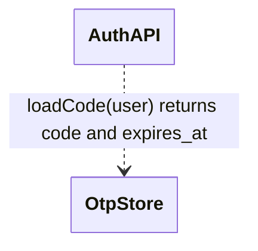
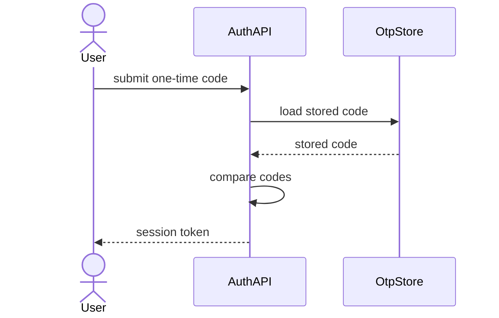
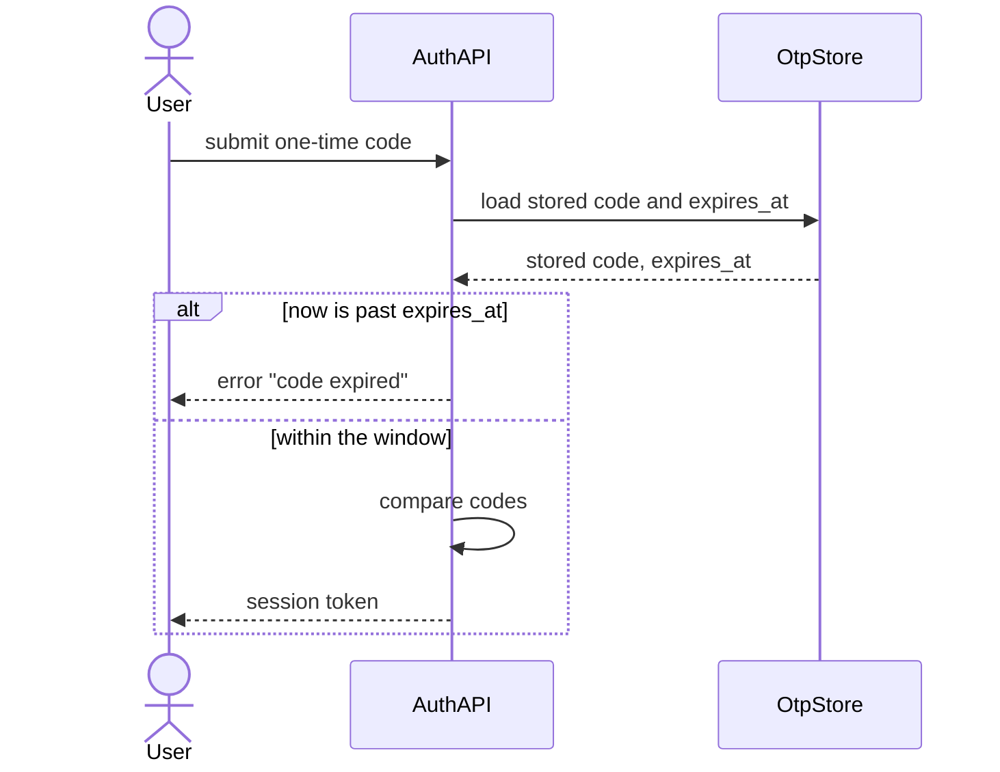
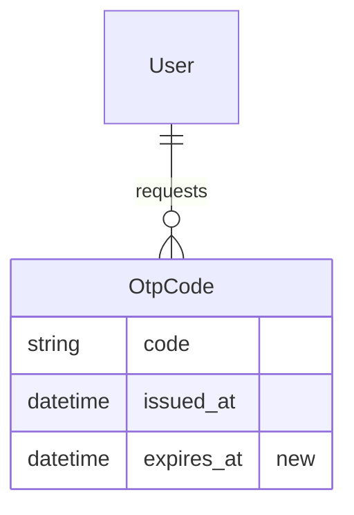

# A Universal Change-Description Template

## 1. The problem and the goal

Six surfaces in the m plugin describe a change set to a human, and each has its own shape: the `/m:build` change report, the `/m:review` document, the `/m:walkthrough` narration, the `/m:preflight` familiarize walk and decision file, the `/m:fix`/`/m:change` report, and the `/m:execute` build report. They overlap heavily and disagree on details: the reason column is `Objective` in one table and `Why` in another, the diagram policy differs per command, and the reason for a change lives in a different place in each format.

The goal of the universal template is fixed: **a human understands the big picture almost by scanning.** The scan order is the reader's natural question order — a little prose for the reason, then the spec changes, then the surface changes each spec change caused (interface, data layer), then the flows. Reader attention is a budget: the v4 research (`research/molcajete-v4-design.md`, "Keep it short") cites a 11,429-review study in which reviewer scrutiny of agent-authored changes measurably decayed — so every line the template prints must earn its place, and everything else must be omitted, not summarized.

### Layout rules

These rules bind the template on every surface. They exist because the output renders in two places — a Markdown reader and the TUI — and both must stay readable.

1. **A table never exceeds 3 columns.** A wide fact-set does not become a wide row. It rotates 90 degrees: one variable per row, its value beside it. This retires the change-report skill's wide tables (its data-layer table carries 5 columns, its events table 6 — both wrap into noise in the TUI).
2. **Before and after stack vertically.** A `Before` row above an `After` row, never side-by-side columns. Stacked cells give each state the full line width, so a spec sentence or a signature survives without wrapping.
3. **A list of variables and values is a table**, not labeled prose lines. A table aligns the labels into one scannable column.
4. **A bold label stands alone on its line** and introduces the block below it. Never `**Label** — long description` on one line (the same rule the `change-review` skill's Issue Block Format already states).
5. **An empty section is omitted entirely**, label included. Never write "none".
6. **Name before ID.** "the calibration scenario (SC-3Z2P)", never a bare `SC-3Z2P` on first use.

### Diagram rules

1. **Mermaid only** — the plugin-wide convention holds; the ASCII UI sketch stays the single carve-out.
2. **Two diagram types carry a change description: `sequenceDiagram` and `erDiagram`** (plus `classDiagram` when object relationships changed). A flowchart is banned here: it restates the code path and clarifies nothing. The C4 and state diagrams stay the architecture document's business, not the change description's.
3. **A flow is a Before/After pair of sequence diagrams**, headed `— Before` and `— After`, drawn only when the change altered the flow, each kept to roughly 10 messages.
4. **A data change gets an `erDiagram` only when an entity or a relationship changed shape** — a new entity, a new relationship, a new element. Draw the after-state and mark the new element. A `classDiagram` follows the same restraint: only when the relationships between objects changed, never for a signature tweak.
5. **A changed connection between components gets a labeled-arrow `classDiagram`.** Every arrow carries its mechanism — the method, the message, the property, or the protocol — because an unlabeled arrow says two components touch, which teaches nothing. Never put a colon inside a relation label; the parse ends there.
6. Hygiene: quote a label that carries spaces where the diagram type allows it, no `style`/`classDef` directives, participants named as the architecture document names them. The single permitted config line is the `hideEmptyMembersBox` init directive on a relationship `classDiagram`, which removes the empty member stripes.

## 2. The shared atoms

Both candidate shapes are built from the same atoms. The variants differ only in how they group them.

One rule spans every atom: **each bold-label block opens with one short sentence** that says the most relevant thing about the change in that block's context — what changed here, and what it means for this surface. The tables carry the facts; this sentence carries the point. It replaces the global behavior table other templates lead with: instead of one table far from the changes, each block explains its own slice where the reader already is.

### Atom 1 — Lead

One to three sentences in product language: the reason and the outcome. No file paths, no class names.

### Atom 2 — Change map

The scan surface. One table, one row per spec-change unit:

```markdown
| Change | Kind | Touches |
|---|---|---|
| Calibrated scores keep their value above 100 (UC-3Z2L) | changed | spec, interface |
| One-time codes expire after 10 minutes (UC-2Kp4) | added | spec, data, config, flow |
```

`Kind` takes one of `added`, `changed`, `fixed`, `retired`. `Touches` names the moved surfaces in a few words. The map is the table of contents: a reader who stops after the Lead and the map still holds the big picture.

### Atom 3 — Spec delta

Under a bare `**Specs**` label: the element name and ID on its own line, then a stacked 2-column table.

```markdown
**Specs**

Calibrate a raw score (SC-3Z2P) — changed

|  |  |
|---|---|
| Before | "a raw score of 140 calibrates to 100" |
| After | "a raw score of 140 calibrates to 128" |
| Why | the old ceiling misread the calibration requirement (FR-3Z2Z); order must survive above 100 |
```

An added element omits the `Before` row. A retired element omits the `After` row, and its `Why` row says what replaced it. One table per changed element; a unit that changes three scenarios carries three small tables.

### Atom 4 — Surface item

Under one of four bare labels — `**Interface changes**`, `**Data layer changes**`, `**Events**`, `**Configuration**` — one small key-value table per changed item. The first row names the item with the architecture skill's vocabulary; then `Before`, `After`, `Why`:

```markdown
**Interface changes**

The clamp is gone from calibration; callers now receive values above 100.

|  |  |
|---|---|
| Method | `ScoreService.calibrate(raw)` |
| Before | returns at most 100 |
| After | returns up to the calibrated ceiling of 128 |
| Why | the calibration scenario (SC-3Z2P) asserts 128 |
| Depends on it | the leaderboard page and the season report |
```

The rotation is the same for every surface. A data item's first rows are `Entity` and `Element`; an event item's are `Event`, `Publisher`, `Payload`, `Condition`, `Consumers`; a configuration item's are `Setting` and `Location`. Several changed items are several small tables, never one wide one. A data item adds an `erDiagram` under its tables when rule 4 of the diagram rules fires.

**An interface item names its dependents.** The `Depends on it` row lists who reads the changed member — a caller that must change is the most useful fact an interface item can carry. Omit the row only when nothing outside the change depends on the member.

**Connections.** When the change adds, removes, or redirects a connection between components, the interface block closes with one labeled-arrow `classDiagram` per diagram rule 5, followed by one key-value table per changed arrow. An unchanged arrow may appear in the diagram for context, but only a changed arrow gets a table.

````markdown


|  |  |
|---|---|
| Connection | `AuthAPI` → `OtpStore` |
| Mechanism | `loadCode(user)` |
| Kind | direct call |
| Change | changed |
| Why | the verify step now needs the stored deadline |
````

`Kind` takes one of: direct call, cross-process call, asynchronous message, database read, database write, HTTP request, event, file. `Change` takes `new`, `changed`, or `removed`.

### Atom 5 — Flow pair

Under a bare `**Flow**` label: the Before/After `sequenceDiagram` pair per the diagram rules. Present only when the change altered a flow.

### Atom 6 — Unmapped tail

Under the heading `## Not in the spec`: the cleanups and refactors that serve no spec change, one line each — the file, the edit, the reason.

### Atom 7 — Architecture verdict

The closing judgment on the design, under the heading `## Architecture`. One or two sentences that answer: does the change fit the existing layering, does it add coupling, are the new dependencies justified, is anything replaced but left half-wired. When the design is questionable, name the simpler or cleaner alternative in one sentence. Close with one of three bold words and one sentence of justification: **Sound**, **Sound with concerns**, or **Questionable**. On a review surface (`/m:review`, `/m:preflight`) the command's own severity-based verdict replaces this atom — one document never carries two verdicts.

## 3. Variant 1 — the walk (spec-anchored)

One `##` section per spec-change unit, in user-visible-impact order, biggest first. A unit is normally a use case; scenario deltas nest inside their use case's unit, and a feature-level requirement change is its own unit. The reader gets reason, spec, surface, and flow in one place per change — context travels with the change, and nothing forces a jump to another section.

```markdown
# {Title}

{Lead}

## Change map

{the map table}

## 1. {Change title, in product language}

{One or two sentences: why this change exists.}

**Specs**

{one sentence — the point of the spec change}

{spec-delta table(s)}

**Flow**

{one sentence — what the flow does differently now}

{the Before/After pair — only when this unit changed a flow}

**Interface changes**

{one sentence — what callers get now}

{item table(s) with their Depends on it rows — only the items this unit owns}

{a labeled-arrow classDiagram plus one table per changed arrow — only when a
connection between components changed}

**Data layer changes**

{one sentence — what the data holds now}

{item table(s), plus an erDiagram when an entity changed shape}

## 2. {Next change title}

...

## Cross-cutting

{Only when one surface change serves several units — a shared migration, a shared
interface. Its item table lives here once, and each unit that needs it says so in
one clause: "uses the shared retry setting (see Cross-cutting)."}

## Not in the spec

{the unmapped tail}

## Architecture

{one or two sentences on the design, then **Sound** / **Sound with concerns** / **Questionable**}
```

Two rules keep the walk honest. A label appears only when its block has content — a unit that moved no data has no `**Data layer changes**` label. And a flow shared by two units is drawn under the first and referenced by the second in one clause.

## 4. Variant 2 — global sections (not chosen)

Kept for the record. The refined status quo: the shape the change-report skill and most PR templates use today, rebuilt from the same atoms under the same layout rules. Every atom is identical; only the grouping changes — all spec deltas together, all interface items together, all flows together.

```markdown
# {Title}

{Lead}

## Behavior

{one stacked table per behavior change: Behavior / Before / After / Why rows}

## Spec changes

### {Feature name} (FEAT-XXXX)

{spec-delta table(s)}

## Interface changes

{item table(s), each with one extra row — For: the spec ID it serves}

## Data layer changes

{item table(s) + erDiagram, each with the For row}

## Configuration

{item table(s) with the For row}

## Flows

### {Use case name} (UC-XXXX)

{the Before/After pair}

## Not in the spec

{the unmapped tail}
```

The `For` row is this variant's tax: because a surface item sits far from its spec change, every item must carry a pointer back, and the reader follows it.

## 5. The worked example, rendered twice

One change set, rendered fully in both variants. Two spec changes — a changed calibration scenario and an added OTP expiry scenario — plus one unmapped cleanup. Every atom appears once in the walk rendering. The variant 2 rendering is the record of the comparison: it predates the extensions the walk gained after it was chosen (block leads, dependents, connections, verdict), and it was not updated.

### 5.1 Rendered as variant 1 — the walk

````markdown
# Calibration ceiling and OTP expiry

Elite players tied at 100 because calibration capped every score, and a stolen one-time code stayed valid forever. This change lets calibrated scores keep their order above 100 and gives every one-time code a 10-minute life.

## Change map

| Change | Kind | Touches |
|---|---|---|
| Calibrated scores keep their value above 100 (UC-3Z2L) | changed | spec, interface |
| One-time codes expire after 10 minutes (UC-2Kp4) | added | spec, data, config, flow |

## 1. Calibrated scores keep their value above 100

The leaderboard showed ties at 100 for every elite raw score, because calibration clamped the result. Order must survive above the old ceiling.

**Specs**

The calibration scenario now asserts the true calibrated value instead of the old cap.

Calibrate a raw score (SC-3Z2P) — changed

|  |  |
|---|---|
| Before | "a raw score of 140 calibrates to 100" |
| After | "a raw score of 140 calibrates to 128" |
| Why | the old ceiling misread the calibration requirement (FR-3Z2Z); order must survive above 100 |

**Interface changes**

The clamp is gone from calibration; every reader of the score now receives values above 100.

|  |  |
|---|---|
| Method | `ScoreService.calibrate(raw)` |
| Before | returns at most 100 |
| After | returns up to the calibrated ceiling of 128 |
| Why | the calibration scenario (SC-3Z2P) asserts 128 |
| Depends on it | the leaderboard page and the season report |

## 2. One-time codes expire after 10 minutes

A one-time code had no expiry, so a stolen code stayed valid until used. Every code now carries a deadline, and a late submission is rejected.

**Specs**

A new scenario bounds the life of every one-time code.

Reject an expired one-time code (SC-2Kp7) — added

|  |  |
|---|---|
| After | "a one-time code submitted more than 10 minutes after issue is rejected with `code expired`" |
| Why | a stolen code must have a bounded life |

**Flow**

Verification now checks the deadline before comparing codes, and a late submission takes the rejection branch.

— Before



— After



**Interface changes**

The store hands the verify step the deadline together with the code.


|  |  |
|---|---|
| Connection | `AuthAPI` → `OtpStore` |
| Mechanism | `loadCode(user)` |
| Kind | direct call |
| Change | changed |
| Why | the verify step now needs the stored deadline |

**Data layer changes**

Every stored code now carries its own deadline.

|  |  |
|---|---|
| Entity | `OtpCode` |
| Element | `expires_at` (timestamp, not null) |
| Before | — |
| After | set to the issue time plus 10 minutes |
| Why | the verify step needs a stored deadline |



**Configuration**

The expiry window is a setting, not a constant.

|  |  |
|---|---|
| Setting | `OTP_TTL_MINUTES` |
| Location | `config/auth.ts` |
| Before | — |
| After | 10 |
| Why | the expiry window is operator-tunable |

## Not in the spec

- Removed the dead helper `formatStamp()` at `src/calibration/report.ts:88` — nothing calls it since the date helper moved to `src/shared/date.ts`.

## Architecture

The expiry check sits in the auth service beside the code comparison, and the deadline travels with the code it bounds — no new coupling, no new dependency. **Sound** — both changes stay inside the layers that already owned the behavior.
````

### 5.2 Rendered as variant 2 — global sections

````markdown
# Calibration ceiling and OTP expiry

Elite players tied at 100 because calibration capped every score, and a stolen one-time code stayed valid forever. This change lets calibrated scores keep their order above 100 and gives every one-time code a 10-minute life.

## Behavior

|  |  |
|---|---|
| Behavior | calibrated scores above the old ceiling |
| Before | every elite raw score showed as 100 |
| After | scores calibrate up to 128 and keep their order |
| Why | the old ceiling misread the calibration requirement (FR-3Z2Z) |

|  |  |
|---|---|
| Behavior | late one-time code submission |
| Before | a code stayed valid until used |
| After | a code submitted after 10 minutes is rejected with `code expired` |
| Why | a stolen code must have a bounded life |

## Spec changes

### Scoring calibration (FEAT-3Z2J)

Calibrate a raw score (SC-3Z2P) — changed

|  |  |
|---|---|
| Before | "a raw score of 140 calibrates to 100" |
| After | "a raw score of 140 calibrates to 128" |
| Why | the old ceiling misread the calibration requirement (FR-3Z2Z); order must survive above 100 |

### Authentication (FEAT-2Kp1)

Reject an expired one-time code (SC-2Kp7) — added

|  |  |
|---|---|
| After | "a one-time code submitted more than 10 minutes after issue is rejected with `code expired`" |
| Why | a stolen code must have a bounded life |

## Interface changes

|  |  |
|---|---|
| Method | `ScoreService.calibrate(raw)` |
| Before | returns at most 100 |
| After | returns up to the calibrated ceiling of 128 |
| Why | the calibration scenario (SC-3Z2P) asserts 128 |
| For | SC-3Z2P |

## Data layer changes

|  |  |
|---|---|
| Entity | `OtpCode` |
| Element | `expires_at` (timestamp, not null) |
| Before | — |
| After | set to the issue time plus 10 minutes |
| Why | the verify step needs a stored deadline |
| For | SC-2Kp7 |


## Configuration

|  |  |
|---|---|
| Setting | `OTP_TTL_MINUTES` |
| Location | `config/auth.ts` |
| Before | — |
| After | 10 |
| Why | the expiry window is operator-tunable |
| For | SC-2Kp7 |

## Flows

### Verify a one-time code (UC-2Kp4)

— Before


— After


## Not in the spec

- Removed the dead helper `formatStamp()` at `src/calibration/report.ts:88` — nothing calls it since the date helper moved to `src/shared/date.ts`.
````

Neither rendering exercises `## Cross-cutting`, because the two changes share nothing. The rule for when it fires: a retry setting that three units read moves into `## Cross-cutting` as one item table, and each unit says "uses the shared retry setting (see Cross-cutting)" in one clause.

## 6. Comparison and decision

**Decided 2026-09-08: variant 1, the walk, is the universal template.** It was then extended with three pieces from the user's `pr` plugin template: the labeled-arrow connection diagram with its per-arrow tables, the `Depends on it` row, and the closing architecture verdict — plus the block-lead sentence that replaces a global behavior table. The comparison below is the record of why the walk won.

The decisive argument is the user's own: you need context to understand a change. In the walk, the reader gets reason, spec delta, surface items, and flow in one contiguous block per change — the "why" sits two lines above the "what", and nothing forces a jump. In the global layout, the reader who wants to understand the OTP change reads the Behavior section, then scrolls to Spec changes, then to Data layer, then to Configuration, then to Flows, reassembling the change in their head from five places — that is exactly the reading work the template exists to remove. The `For` row is the visible symptom: variant 2 needs a pointer on every item because it separated the item from its reason.

Two structural arguments support the same choice. The walk's unit is the tree the `change-review` skill already produces for every review command — feature to use case to scenario to files — so the mapping step's output pours directly into the template. And the walk is the shape `/m:walkthrough` already narrates, so the interactive and written descriptions become the same document at two speeds.

Variant 2 keeps two honest wins. A change set of many tiny edits across many specs — a rename that brushes eight use cases — groups better globally, because the walk would print eight near-empty units. And an audience that only consumes one surface, such as an API client team, reads one global section and stops. The walk absorbs the first win partially through the Change map (the global scan) and the Cross-cutting section (the dedupe); the second stays a real trade-off, accepted.

**A note on scan cost, measured on the example.** To answer "what does the OTP change touch?", variant 1 is one section (section 2, ~40 lines, everything inside). Variant 2 is five sections joined by `For: SC-2Kp7` pointers. To answer "did the data layer change at all?", variant 2 is one glance at a heading; variant 1 is one glance at the Change map's `Touches` column. The map is what lets the walk keep both answers cheap.

## 7. Adoption map (future work, not this proposal)

| Surface | What it takes |
|---|---|
| New shared skill `molcajete/shared/skills/change-description/SKILL.md` | Owns the atoms and the walk assembly, at three depths: full report (every atom, verdict included), orientation (lead + map + flows), walk (lead + map) |
| `change-report` skill (`/m:build` Step 9) | Rebuilds on variant 1; retires its wide tables; keeps its report-only tail (Decisions, New IDs, Done / Not done / Next step) |
| `/m:review` | "What this change does" and "Orientation" become lead + map + flow pairs; the issue sections stay as they are |
| `/m:walkthrough` | Narrates variant-1 units as its nodes; the navigation loop stays |
| `/m:preflight` Step 4 | Prints the walk depth: lead + map |
| `spec-revision` report (`/m:fix`, `/m:change`) | Adopts the spec-delta table |

**Compatibility note on the `pr` plugin.** The user's external `pr` plugin (`pr:create`, `pr:tldr`) already describes changes with one primitive everywhere (`Item | What it does | Change | Why`) and paired sequence diagrams — the closest existing relative of this template, and three of its pieces were adopted directly: the labeled-arrow connection diagram with its arrow facts (rotated into per-arrow tables), the who-depends-on-it rule (now the `Depends on it` row), and the closing architecture verdict. What the walk does not take from it: the title rules (a `pr:create` concern), the global behavior table (replaced by the block leads), and the per-participant explanation table after every diagram (its facts live in the item tables). It lives outside this repository and changes separately.
